# Sesión 01 — Modelado del Canal Inalámbrico

## Objetivos de Aprendizaje

Al finalizar esta sesión, el estudiante será capaz de:

1. Calcular la potencia recibida usando el modelo de pérdida de propagación en espacio libre y el modelo log-distancia
2. Modelar el shadowing mediante una variable aleatoria log-normal y estimar su impacto en el link budget
3. Describir el fenómeno de multipath propagation y sus consecuencias en el dominio temporal y frecuencial
4. Derivar las distribuciones de Rayleigh y Rician para la envolvente de la señal en canales con fading
5. Calcular el coherence bandwidth y el coherence time a partir de parámetros del canal

---

## Introducción

El canal inalámbrico es el elemento más impredecible y limitante de cualquier sistema de comunicaciones. A diferencia de los canales guiados (fibra óptica, cable coaxial), el canal inalámbrico somete a la señal a una combinación de efectos que degradan su calidad de forma simultánea:

- **Path loss**: la potencia de la señal disminuye con la distancia
- **Shadowing**: obstáculos como edificios y colinas atenúan la señal de forma aleatoria
- **Multipath fading**: múltiples reflexiones, difracciones y dispersiones crean versiones retardadas de la señal que interfieren entre sí

Comprender y modelar estos efectos es indispensable para todo lo que viene después en este curso: desde el diseño de modulaciones robustas hasta el dimensionamiento de sistemas MIMO y la gestión del espectro en redes 5G. **El canal inalámbrico es la razón por la que existen la mayoría de los problemas que estudiaremos.**

---

## Teoría

### 1. Pérdida de Propagación en Espacio Libre

La **ecuación de Friis** describe la potencia recibida en ausencia de obstáculos:

$$P_r = P_t G_t G_r \left(\frac{\lambda}{4\pi d}\right)^2$$

donde:

- $P_t$: potencia transmitida
- $G_t, G_r$: ganancias de antena transmisora y receptora
- $\lambda = c/f$: longitud de onda
- $d$: distancia entre transmisor y receptor

El factor $(\lambda/4\pi d)^2$ tiene una interpretación física directa: una antena isotrópica irradia su potencia uniformemente sobre la superficie de una esfera de área $4\pi d^2$; la densidad de potencia en el receptor cae como $1/d^2$. La antena receptora captura de esa esfera un área efectiva proporcional a $\lambda^2$ — a mayor longitud de onda (menor frecuencia), la antena "ve" más grande el frente de onda y capta más potencia. La combinación de ambos efectos produce el factor $(\lambda/4\pi d)^2$. Esto explica por qué, a la misma distancia, un enlace a 900 MHz tiene menos path loss que uno a 2,4 GHz: la frecuencia más baja tiene mayor longitud de onda y mayor área efectiva de captación.

En decibelios, la **pérdida de propagación en espacio libre** es:

$$\text{PL}_{\text{FS}}(d)\ [\text{dB}] = 20\log_{10}(4\pi d / \lambda) = 20\log_{10}(d) + 20\log_{10}(f) - 147{,}55$$

!!! example "Ejemplo"
    Para $f = 2{,}4\ \text{GHz}$ y $d = 100\ \text{m}$:
    $\text{PL}_{\text{FS}} = 20\log_{10}(100) + 20\log_{10}(2{,}4\times10^9) - 147{,}55 \approx 80\ \text{dB}$

El modelo de Friis es exacto en condiciones de espacio libre, pero las medidas en entornos urbanos muestran sistemáticamente pérdidas que superan esta predicción en 10, 20 o incluso 30 dB — y la discrepancia no es aleatoria: crece de forma ordenada con la distancia y depende del tipo de entorno.

---

### 2. Modelo Log-Distancia

En entornos reales, la pérdida de propagación sigue un modelo empírico más general:

$$\text{PL}(d)\ [\text{dB}] = \text{PL}(d_0) + 10n\log_{10}\!\left(\frac{d}{d_0}\right)$$

donde:

- $d_0$: distancia de referencia (típicamente 1 m en interiores, 100 m en exteriores)
- $n$: **exponente de pérdida de propagación** (path loss exponent)

| Entorno | $n$ típico |
|---------|-----------|
| Espacio libre | 2 |
| Urbano (macrocelda) | 2,7 – 3,5 |
| Suburbano | 3 – 5 |
| Interior (sin obstáculos) | 1,6 – 1,8 |
| Interior (con obstáculos) | 4 – 6 |

El valor $n < 2$ en interiores sin obstáculos puede parecer paradójico — ¿cómo puede haber *menos* pérdida que en espacio libre? La explicación es el **efecto guía de onda**: en un pasillo largo con paredes paralelas, el techo y el suelo actúan como reflectores que "canalizan" la señal a lo largo del eje del pasillo, de forma similar a como una guía de onda metálica confina la energía electromagnética. La energía que en espacio libre se dispersaría hacia los lados queda atrapada y se propaga con menos pérdida que $1/d^2$.

Con el exponente $n$ correcto, el modelo predice bien la potencia media recibida a cada distancia. El problema es que dos terminales situados exactamente a la misma distancia de la misma estación base pueden diferir en más de 15 dB — y esa variación cambia lentamente mientras el usuario se desplaza, no con la frecuencia portadora.

---

### 3. Shadowing

Imagina que mides la potencia recibida en 60 puntos distintos del mismo vecindario, todos a exactamente 1 km de la misma antena. El modelo log-distancia predice un único valor de PL para esa distancia. Las medidas reales, sin embargo, se dispersan alrededor de esa predicción en un rango de ±15–20 dB. La causa no es ruido de medida: es la disposición particular de edificios, muros y obstáculos entre la antena y cada punto — diferente en cada ubicación, impredecible de antemano.

Modelar cada obstáculo individualmente es inviable. La alternativa es separar la pérdida total en dos partes con roles distintos:

- **Lo que se puede predecir**: la pérdida media a esa distancia, que el modelo log-distancia ya calcula. Todas las ubicaciones a distancia $d$ comparten este valor en promedio — es la componente sistemática, determinista.
- **Lo que no se puede predecir**: la desviación concreta de esta ubicación respecto a ese promedio. Depende de qué edificios, muros y árboles se interponen exactamente entre la antena y este punto — diferente en cada caso, imposible de conocer de antemano. Esta es la componente aleatoria.

En dB, las pérdidas se suman — y por eso la fórmula es aditiva:

$$\text{PL}(d)\ [\text{dB}] = \overline{\text{PL}}(d) + X_\sigma$$

- $\overline{\text{PL}}(d)$ — la barra indica **valor medio**: la pérdida esperada promediada sobre todas las posibles ubicaciones a distancia $d$. Es determinista: dado $d$, este valor está fijo.
- $X_\sigma \sim \mathcal{N}(0, \sigma^2)$ — la desviación aleatoria de esta ubicación concreta respecto a ese promedio. Tiene media cero porque $\overline{\text{PL}}(d)$ ya es, por definición, el promedio — las desviaciones individuales se cancelan entre sí al promediar. Su desviación típica $\sigma$ vale entre 4 y 12 dB según el entorno.

La elección de una distribución gaussiana en dB tiene dos justificaciones. La primera es empírica: las medidas de campo en entornos urbanos muestran consistentemente que los residuos $\text{PL}_{\text{medido}} - \overline{\text{PL}}(d)$ siguen una campana gaussiana. La segunda es teórica, y parte de una observación física: el frente de onda atraviesa $N$ obstáculos en serie — una pared, un árbol, otro edificio — y cada obstáculo $i$ multiplica la potencia recibida por un factor $\alpha_i < 1$ (atenuación parcial, aleatoria, independiente del resto). La atenuación total es un **producto**:

$$\text{atenuación total} = \alpha_1 \times \alpha_2 \times \cdots \times \alpha_N$$

El TCL no aplica directamente a productos, pero sí a sumas. El truco es tomar el logaritmo — que convierte productos en sumas:

$$\log(\alpha_1 \times \alpha_2 \times \cdots \times \alpha_N) = \log\alpha_1 + \log\alpha_2 + \cdots + \log\alpha_N$$

Ahora sí: es una suma de $N$ variables aleatorias independientes. Cuando $N$ es grande, el TCL garantiza que esa suma converge a una distribución gaussiana. Resultado: el **logaritmo** de la atenuación total es gaussiano.

¿Para qué sirve? La pérdida adicional por shadowing en dB es, por definición:

$$X_\sigma\ [\text{dB}] = 10\log_{10}\!\left(\frac{1}{\alpha_1 \cdot \alpha_2 \cdots \alpha_N}\right) = -10\log_{10}(\alpha_1 \cdot \alpha_2 \cdots \alpha_N)$$

Pero acabamos de demostrar que $\log(\alpha_1 \cdots \alpha_N)$ es gaussiano. Los dB son exactamente eso — un logaritmo escalado por $10/\ln 10 \approx 4{,}34$. Escalar una gaussiana por una constante da otra gaussiana. Por tanto, $X_\sigma$ en dB es gaussiana: $X_\sigma \sim \mathcal{N}(0, \sigma^2)$. No hay transformación adicional — "el logaritmo de la atenuación es gaussiano" y "$X_\sigma$ en dB es gaussiano" son la misma afirmación escrita de dos maneras distintas. A la distribución de la potencia en escala lineal (que es el exponencial de una gaussiana) se la llama **log-normal** — de ahí el nombre de *log-normal shadowing*.

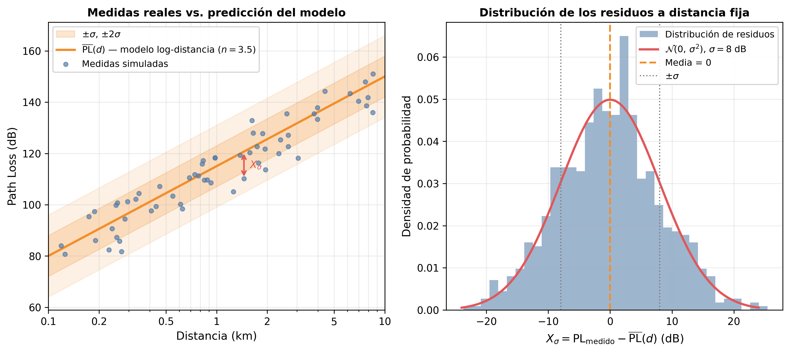

La imagen izquierda muestra medidas simuladas dispersas alrededor de la curva $\overline{\text{PL}}(d)$: cada punto es una ubicación real con su disposición única de obstáculos. La flecha roja marca $X_\sigma$ — la desviación de esa ubicación concreta respecto a la predicción media. Las bandas $\pm\sigma$ y $\pm 2\sigma$ encierran aproximadamente el 68% y el 95% de las ubicaciones posibles. La imagen derecha muestra el histograma de los residuos a distancia fija: la campana gaussiana confirma por qué $\mathcal{N}(0, \sigma^2)$ es el modelo correcto.

La figura siguiente resume las tres contribuciones estudiadas hasta aquí, representadas sobre los mismos ejes de distancia y path loss:

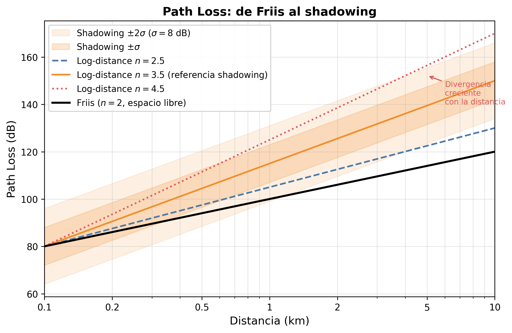

La curva de **Friis** ($n=2$) establece el límite inferior de pérdida en espacio libre: es determinista, sin dispersión. Las curvas de **log-distancia** ($n=2.5$, $3.5$, $4.5$) muestran cómo el entorno físico modifica el slope — la divergencia respecto a Friis crece logarítmicamente con la distancia. Las **bandas de shadowing** ($\pm\sigma$ y $\pm 2\sigma$ alrededor de $n=3.5$) representan la dispersión estadística que introduce el log-normal shadowing: para cualquier distancia dada, la potencia recibida no es un valor único sino una distribución gaussiana en dB, centrada en la curva del modelo log-distancia.

Las tres capas comparten el mismo espacio: distancia vs. path loss. Esto cambia a partir de la siguiente sección. El multipath fading no opera a escala de metros sino de centímetros — a la escala de la longitud de onda — y su descripción requiere un framework matemático completamente distinto.

El shadowing explica la variabilidad lenta. Pero incluso un terminal completamente estacionario, en un entorno sin objetos en movimiento, muestra fluctuaciones de señal de varios decibelios al desplazarse unos pocos centímetros. A esa escala, los edificios no se mueven — algo más está ocurriendo.

---

### 4. Multipath Propagation

Los modelos de las secciones anteriores asumían implícitamente que la señal viaja por **una sola trayectoria** del transmisor al receptor. El shadowing reconocía que esa trayectoria atraviesa obstáculos aleatorios, pero los trataba como un único factor de atenuación acumulado — no distinguía entre caminos. Ese modelo explica bien la variabilidad de potencia a escala de metros, pero deja sin respuesta un fenómeno diferente: ¿por qué un terminal completamente estacionario muestra fluctuaciones de señal de varios decibelios al desplazarse apenas unos centímetros? La causa no es la atenuación por obstáculos — es que la señal llega por múltiples caminos simultáneos que se suman con fases distintas.

En un entorno urbano, la señal transmitida no viaja únicamente en línea recta hacia el receptor. Se refleja en fachadas de edificios, se difracta en esquinas, se dispersa en vehículos y objetos. El receptor recibe simultáneamente varias copias de la misma señal, cada una llegando por un camino distinto.

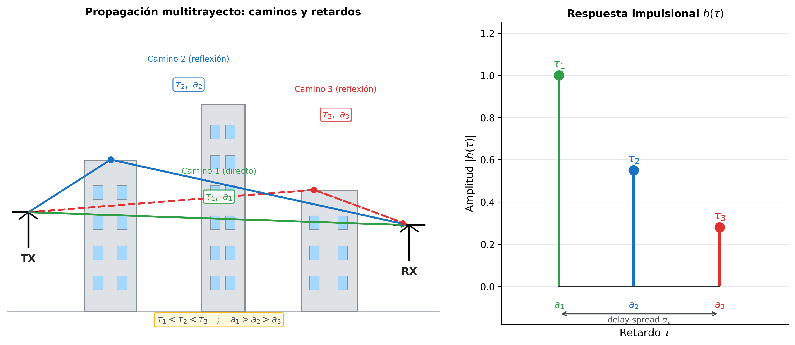

La imagen izquierda muestra tres caminos de ejemplo. El **camino directo** (verde) recorre la distancia mínima y llega primero, con el menor retardo $\tau_1$ y la mayor amplitud $a_1$. Los caminos reflejados (azul, rojo) recorren distancias mayores: llegan más tarde ($\tau_2 > \tau_1$, $\tau_3 > \tau_2$) y con menor amplitud ($a_2 < a_1$, $a_3 < a_2$) porque cada reflexión introduce pérdidas adicionales.

**El experimento mental del impulso**: supón que el transmisor emite un pulso perfectamente corto — un impulso de Dirac $\delta(t)$. El receptor no recibe un único pulso sino una secuencia de ecos, uno por cada camino, llegando en tiempos distintos. La imagen derecha de la figura muestra exactamente eso: la **respuesta impulsional del canal** $h(\tau)$, con tres impulsos en $\tau_1$, $\tau_2$ y $\tau_3$ de amplitudes $a_1$, $a_2$ y $a_3$. El canal queda completamente caracterizado por esa "huella".

Formalizando: si el camino $i$ llega con retardo $\tau_i$, atenuación $a_i$ y desfase $\phi_i$, su contribución a la señal recibida es una copia de la señal transmitida desplazada $\tau_i$ segundos, escalada por $a_i$ y rotada en fase $e^{j\phi_i}$. La suma de todas las contribuciones es la respuesta impulsional del canal en banda base equivalente:

$$h(\tau, t) = \sum_{i} a_i(t)\, e^{j\phi_i(t)}\, \delta(\tau - \tau_i(t))$$

Cada término de la suma es un eco: la **delta de Dirac** $\delta(\tau - \tau_i)$ actúa como selector — extrae del eje de retardos exactamente el instante $\tau_i$ en que llega el camino $i$. La amplitud $a_i$ y la fase $e^{j\phi_i}$ describen cuánto atenúa y cuánto desfasa ese camino específico.

La dependencia en $t$ — la segunda variable — aparece porque el canal no es estático: cuando el terminal o los objetos del entorno se mueven, las longitudes de los caminos cambian. Un camino que antes llegaba en $\tau_i$ ahora llega en $\tau_i(t)$, con una amplitud $a_i(t)$ y una fase $\phi_i(t)$ distintas. El canal es, por tanto, una función de **dos variables independientes**: $\tau$ describe la estructura del canal en el dominio de los retardos; $t$ describe cómo evoluciona esa estructura en el tiempo.

Con la respuesta impulsional definida, tenemos una descripción completa del canal — pero demasiado detallada para ser útil en diseño. Conocer cada $\tau_i$, $a_i$ y $\phi_i$ individualmente no responde la pregunta práctica que importa: **¿los ecos llegan tan dispersos en el tiempo que un símbolo interfiere con el siguiente?** Esa pregunta solo depende de cuán extendida está la "nube" de ecos en el eje $\tau$, no de la posición exacta de cada uno. Lo que se necesita es un número escalar que resuma esa extensión — y de ese número se podrá deducir directamente si el canal distorsiona la señal o no, y con qué margen se debe diseñar el sistema.

Tres parámetros lo describen, en este orden porque existe una dependencia estricta: $\sigma_\tau$ no puede calcularse sin $\bar{\tau}$, y $B_c$ no puede obtenerse sin $\sigma_\tau$:

**Mean excess delay** $\bar{\tau}$ — el "centro de masa" de la energía multitrayecto en el eje de retardos, ponderado por la potencia de cada camino:

$$\bar{\tau} = \frac{\sum_i |a_i|^2 \tau_i}{\sum_i |a_i|^2}$$

No tiene consecuencias directas de diseño por sí solo, pero es el punto de referencia para calcular el parámetro que sí importa.

**RMS delay spread** $\sigma_\tau$ — la desviación estándar de los retardos respecto a $\bar{\tau}$, ponderada por potencia:

$$\sigma_\tau = \sqrt{\overline{\tau^2} - \bar{\tau}^2}$$

donde $\overline{\tau^2}$ es el mismo promedio ponderado por potencia aplicado a $\tau_i^2$:

$$\overline{\tau^2} = \frac{\sum_i |a_i|^2 \tau_i^2}{\sum_i |a_i|^2}$$

$\sigma_\tau$ mide cuánto tiempo tardan en llegar todos los ecos significativos después del primero — es decir, la "duración de la memoria" del canal. Un canal con $\sigma_\tau$ grande tiene ecos que llegan muy dispersos en el tiempo; uno con $\sigma_\tau$ pequeño tiene ecos casi simultáneos. Valores típicos: interiores de oficina ~30 ns, urbano ~300 ns, suburbano ~1 µs.

Conocer $\sigma_\tau$ plantea inmediatamente la pregunta de diseño: ¿qué ancho de banda de señal puede usarse sin que esa memoria cause problemas? Si se transmite con ancho de banda $B_s$, los símbolos tienen una duración aproximada de $T_s \approx 1/B_s$. Cuando $T_s < \sigma_\tau$, el símbolo termina antes de que hayan llegado todos sus ecos — los ecos del símbolo $n$ se solapan con el símbolo $n+1$ y producen ISI. Para evitarlo, se necesita $T_s \gg \sigma_\tau$, es decir, $B_s \ll 1/\sigma_\tau$. El umbral de ancho de banda por debajo del cual el canal no distorsiona la señal es el **coherence bandwidth** $B_c \approx 1/\sigma_\tau$ — la consecuencia directa de $\sigma_\tau$ en el dominio de la frecuencia.

**Coherence bandwidth** $B_c$ — el rango de frecuencias sobre el que el canal se comporta de forma aproximadamente uniforme:

$$B_c \approx \frac{1}{5\,\sigma_\tau}$$

La relación se deduce directamente de la dualidad de Fourier. Por definición:

$$H(f) = \int_{-\infty}^{\infty} h(\tau)\, e^{-j2\pi f \tau}\, d\tau$$

El factor $e^{-j2\pi f \tau}$ es el que vincula las dos variables: para que $H(f)$ cambie apreciablemente al variar $f$, basta con que $f\tau$ cambie en $\sim 1$ radián. Si $h(\tau)$ tiene ecos significativos hasta un retardo máximo del orden de $\sigma_\tau$, entonces $H(f)$ completa una variación apreciable cuando $\Delta f \cdot \sigma_\tau \sim 1$, es decir:

$$\Delta f \sim \frac{1}{\sigma_\tau}$$

Esta es la relación inversa fundamental: **mayor dispersión en $\tau$ implica menor ancho de banda coherente en $f$**. Un canal con ecos muy retardados (grande $\sigma_\tau$) tiene una respuesta frecuencial $H(f)$ que fluctúa rápidamente — los picos y valles de $|H(f)|$ están muy juntos. Un canal con ecos casi simultáneos (pequeño $\sigma_\tau$) tiene $H(f)$ casi plana — un rango amplio de frecuencias ve el mismo canal. El factor 5 en $B_c \approx 1/(5\sigma_\tau)$ es una convención práctica (criterio del 50% de correlación). $B_c$ define, por tanto, el "ancho de banda de correlación" del canal: dos componentes espectrales separadas por menos de $B_c$ ven esencialmente el mismo canal; separadas por más de $B_c$, ven canales independientes.

La relación entre $B_c$ y el ancho de banda de la señal $B_s$ determina el régimen de operación:

- **Flat fading** ($B_s \ll B_c$): $B_c$ es la zona del espectro sobre la que el canal aplica una degradación uniforme. Si $B_s$ es mucho menor que $B_c$, toda la señal cabe dentro de esa zona uniforme — el canal aplica **una única ganancia** a toda la señal, como multiplicar por un solo número complejo. Todas las frecuencias de la señal sufren la misma atenuación y el mismo desfase. No hay distorsión espectral: la señal sale del canal con la misma forma que entró, solo escalada y rotada en fase.

- **Frequency-selective fading** ($B_s \gg B_c$): cuando $B_s$ supera ampliamente $B_c$, la señal ocupa varias zonas del espectro, cada una con su propia ganancia. El canal ya no aplica una degradación única — aplica **ganancias diferentes a diferentes partes de la señal**. Algunas frecuencias son muy atenuadas (los valles de $|H(f)|$), otras lo son menos (los picos). En el dominio temporal, esto tiene una consecuencia directa: los ecos de un símbolo llegan dispersos durante $\sigma_\tau$ segundos. Si la duración de un símbolo $T_s < \sigma_\tau$, los ecos del símbolo $n$ todavía están llegando cuando el símbolo $n+1$ ya ha comenzado — los dos símbolos se mezclan en el receptor. Este solapamiento se denomina **ISI** (*inter-symbol interference*, interferencia entre símbolos) y es el principal obstáculo para la transmisión de alta velocidad en canales dispersivos.

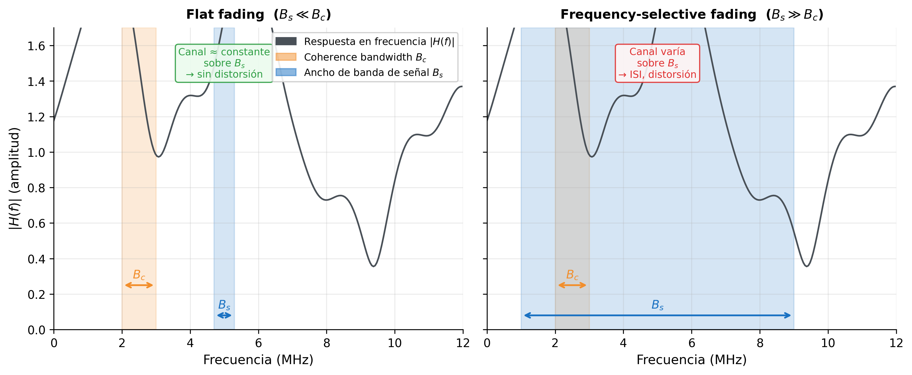

La curva negra en ambas imágenes es la misma: la respuesta en frecuencia $|H(f)|$ del canal, con sus picos y valles. Lo que cambia es el tamaño de $B_s$ respecto a $B_c$.

En la imagen izquierda (flat fading), $B_s$ es estrecho y cae en un tramo aproximadamente plano de $|H(f)|$: todas las frecuencias de la señal ven la misma ganancia, el canal se comporta como un multiplicador. En la imagen derecha (frequency-selective fading), $B_s$ es ancho y abarca múltiples picos y valles de $|H(f)|$: cada segmento de la señal recibe una atenuación distinta, la forma espectral queda distorsionada y aparece ISI en el dominio temporal.

Este es uno de los problemas centrales que motiva el diseño de OFDM (sesión 03): dividir el ancho de banda total en cientos de subportadoras estrechas, cada una con $B_s \ll B_c$, de modo que cada subportadora opera en flat fading aunque el canal global sea frequency-selective.

Todo lo visto en esta sección — $h(\tau)$, $\sigma_\tau$, $B_c$, flat fading, FSF — describe el canal **en un instante congelado**. Es una fotografía. Lo que no dice es con qué rapidez cambia esa fotografía cuando el terminal o los objetos del entorno se mueven.

Vale la pena notar que el multipath tiene dos consecuencias distintas sobre la señal recibida, y esta sección solo ha cubierto una de ellas. Los efectos temporales y frecuenciales — ISI, $\sigma_\tau$, $B_c$ — son la primera consecuencia, y son los que determinan si el canal distorsiona la forma espectral de la señal. La segunda consecuencia es energética: cuando los ecos se suman con fases aleatorias, la potencia recibida fluctúa de forma aleatoria a escala de centímetros, produciendo caídas bruscas (*deep fades*) que el modelo log-distance no captura. Estas fluctuaciones de potencia a pequeña escala no se abordan aquí porque requieren un tratamiento estadístico diferente — la distribución de la envolvente de la señal — que se desarrolla en la sección 6.

---

### 5. Doppler Effect y Coherence Time

Imagina un coche circulando a 120 km/h con una conexión 4G activa. A 2 GHz, la longitud de onda es $\lambda = 15$ cm. En 1 ms, el coche recorre 3,3 cm — aproximadamente $\lambda/4$. En ese intervalo, la diferencia de camino hacia cada reflexor ha cambiado en una fracción de $\lambda$, lo que equivale a una rotación de fase de varios grados en cada eco multitrayecto. La respuesta en frecuencia $|H(f)|$ — los picos y valles que vimos en la figura anterior — es ahora diferente. El canal que el receptor midió hace 1 ms ya no es válido. ¿Cuánto tiempo sigue siendo válida una estimación del canal? Esa es la pregunta que responde esta sección.

**Mecanismo físico**: cuando el terminal se mueve con velocidad $v$, cada camino multitrayecto tiene una componente de velocidad distinta a lo largo de su dirección de llegada. Esa componente acorta o alarga el camino en cada ciclo de la portadora, produciendo un **desplazamiento en frecuencia** — el efecto Doppler:

$$f_D = \frac{v}{\lambda}\cos\theta$$

donde $\theta$ es el ángulo entre la dirección de movimiento y la dirección de llegada del camino. Un camino que llega de frente ($\theta=0°$) sufre el máximo desplazamiento positivo $f_{D,\text{max}} = v/\lambda$; uno que llega por detrás ($\theta=180°$) sufre el máximo negativo $-f_{D,\text{max}}$; los que llegan en perpendicular ($\theta=90°$) no tienen desplazamiento.

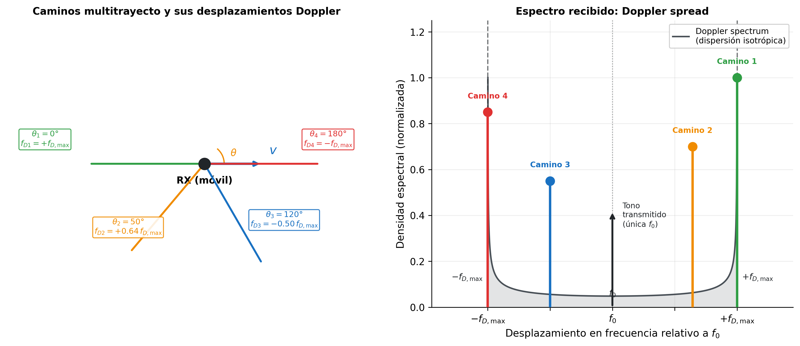

La imagen izquierda muestra cuatro caminos multitrayecto llegando al receptor móvil desde ángulos distintos. Cada uno produce un desplazamiento Doppler diferente según $f_D = (v/\lambda)\cos\theta$: el camino frontal (verde, $\theta=0°$) se desplaza al máximo positivo; el camino trasero (rojo, $\theta=180°$) al máximo negativo; los intermedios quedan entre ambos extremos.

La imagen derecha muestra lo que ocurre en el dominio de la frecuencia. El transmisor emite una **única frecuencia** $f_0$ — el tono negro vertical. El receptor, sin embargo, recibe **múltiples copias** de esa frecuencia, cada una desplazada por el Doppler de su camino: los cuatro círculos de colores corresponden exactamente a los cuatro caminos dla imagen izquierda. El conjunto de todos estos desplazamientos forma el **Doppler spread**, que se extiende entre $-f_{D,\text{max}}$ y $+f_{D,\text{max}}$. La curva gris es el perfil espectral resultante para dispersión isotrópica (caminos igualmente distribuidos en todos los ángulos) — la forma en "U" característica del modelo de Jakes.

Para entender de dónde viene esa curva y cómo conduce al coherence time, necesitamos responder dos preguntas: ¿qué supuesto físico produce la forma en "U"? ¿y qué herramienta matemática traduce esa forma al tiempo de coherencia?

**Supuesto de dispersión isotrópica — el modelo de Jakes**: en un entorno urbano denso, hay tantos reflexores distribuidos en todas las direcciones que los ecos llegan con igual probabilidad desde cualquier ángulo $\theta \in [0°, 360°]$. Este es el supuesto de **isotropía**, y es la hipótesis central del modelo de Jakes. Bajo isotropía, el desplazamiento en frecuencia Doppler $f_D = f_{D,\text{max}}\cos\theta$ no se distribuye uniformemente, aunque los ángulos sí lo sean. La razón es que $\cos\theta$ no es lineal en $\theta$ — su velocidad de cambio depende del ángulo:

- **Cerca de $\theta = 0°$ y $180°$**: $\cos\theta$ varía muy lentamente (su derivada es cero en esos puntos). Un rango amplio de ángulos distintos produce casi el mismo $f_D$ — toda esa energía angular se acumula en una banda estrecha de frecuencias. El resultado es una densidad espectral alta en los extremos $\pm f_{D,\text{max}}$ — los picos de la "U".
- **Cerca de $\theta = 90°$**: $\cos\theta$ cambia con la mayor rapidez posible. Un pequeño rango de ángulos produce un rango amplio de valores de $f_D$, dispersando la energía en lugar de acumularla. El resultado es una densidad espectral baja en torno a $f_D = 0$ — el valle de la "U".

El resultado conjunto es la forma en "U" visible en la figura: energía concentrada en los extremos $\pm f_{D,\text{max}}$ y reducida en el centro.

**De la forma en "U" al coherence time — Wiener-Khinchin**: para medir cuánto cambia el canal con el tiempo se usa la **función de autocorrelación temporal**:

$$R(\Delta t) = \mathbb{E}\!\left[h^*(t)\, h(t + \Delta t)\right]$$

$R(0) = 1$ significa canal idéntico; $R(\Delta t) \to 0$ significa canal independiente. Por el **teorema de Wiener-Khinchin**, $R(\Delta t)$ es la transformada de Fourier inversa del espectro Doppler. La transformada inversa de la densidad espectral en "U" del modelo de Jakes resulta ser exactamente la función de Bessel de primera especie y orden cero:

$$R(\Delta t) = J_0\!\left(2\pi f_{D,\text{max}}\, \Delta t\right)$$

Esta es la contribución central del modelo de Jakes: proporciona una expresión analítica cerrada para la autocorrelación temporal del canal bajo el supuesto de isotropía.

**Coherence time** $T_c$ — $R(\Delta t)$ responde exactamente la pregunta que necesitamos: dado que el canal en el instante $t$ tiene cierta respuesta, ¿cuánto tiempo después sigue siendo suficientemente similar para no necesitar reestimarlo? Cuando $\Delta t$ es pequeño, $J_0(2\pi f_{D,\text{max}}\,\Delta t) \approx 1$ — el canal casi no ha cambiado. A medida que $\Delta t$ crece, $J_0$ decrece — el canal se decorrelaciona. Se necesita un criterio práctico que defina el umbral a partir del cual el canal se considera "suficientemente diferente": la convención habitual es $R(T_c) = 0{,}5$, es decir, el instante en que la correlación ha caído al 50% de su valor inicial. Aplicando esa condición:

$$J_0\!\left(2\pi f_{D,\text{max}}\, T_c\right) = 0{,}5$$

Resolviendo numéricamente se obtiene $2\pi f_{D,\text{max}}\, T_c \approx 2{,}657$, de donde:

$$T_c \approx \frac{0{,}423}{f_{D,\text{max}}}$$

El coeficiente 0,423 no es un número arbitrario — es la consecuencia directa de resolver $J_0(x) = 0{,}5$. La constante exacta depende del criterio de correlación elegido; lo que sí es universal es la relación inversa con $f_{D,\text{max}}$:

- Mayor velocidad del terminal → mayor $f_{D,\text{max}}$
- Mayor $f_{D,\text{max}}$ → menor $T_c$
- Menor $T_c$ → el canal cambia más rápido → hay que reestimarlo con mayor frecuencia

Nótese la dualidad con $B_c \approx 1/(5\sigma_\tau)$: el delay spread $\sigma_\tau$ comprime $B_c$ en frecuencia; el Doppler spread $f_{D,\text{max}}$ comprime $T_c$ en tiempo. Velocidades altas → $f_{D,\text{max}}$ grande → $T_c$ pequeño → el canal cambia rápidamente.

La relación entre $T_s$ (duración de un símbolo) y $T_c$ determina el régimen temporal:

- **Slow fading** ($T_s \ll T_c$): el canal apenas cambia durante la transmisión de un símbolo. Una estimación del canal obtenida con un piloto sigue siendo válida varios símbolos después. Es el régimen habitual en la mayoría de los sistemas prácticos.

- **Fast fading** ($T_s \gg T_c$): el canal cambia múltiples veces dentro de un solo símbolo. El receptor no puede seguir el canal con suficiente rapidez. Es el caso de terminales muy rápidos o portadoras muy altas (mmWave con vehículos).

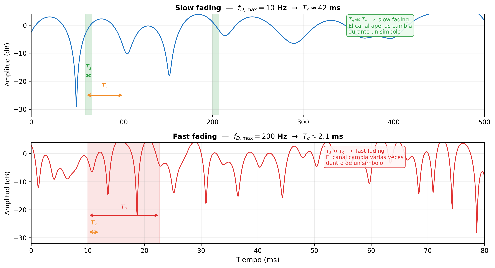

Ambas imágenes muestran la amplitud recibida en dB en una sola frecuencia, variando en el tiempo. En slow fading (arriba), $T_c$ es grande — el canal cambia lentamente y un símbolo de duración $T_s \ll T_c$ ve un canal prácticamente constante. En fast fading (abajo), $T_c$ es pequeño — el canal completa varias fluctuaciones dentro de un símbolo de duración $T_s \gg T_c$, lo que hace imposible asumir que el canal es estático durante la recepción.

**Los cuatro parámetros que caracterizan $h(\tau, t)$**: la función de dos variables queda completamente descrita por dos pares duales:

| Dimensión | Parámetro de dispersión | Parámetro de coherencia | Régimen |
|-----------|------------------------|------------------------|---------|
| Retardo ($\tau$) | Delay spread $\sigma_\tau$ | Coherence bandwidth $B_c \approx 1/5\sigma_\tau$ | Flat / Frequency-selective |
| Tiempo ($t$) | Doppler spread $f_{D,\text{max}}$ | Coherence time $T_c \approx 0.423/f_{D,\text{max}}$ | Slow / Fast fading |

Estos cuatro parámetros son los datos de entrada del diseñador de sistemas: determinan la longitud del cyclic prefix en OFDM, la densidad de pilotos en la cuadrícula tiempo-frecuencia, la frecuencia de actualización del estimador de canal y el máximo orden de modulación que puede sostenerse de forma fiable.

Los cuatro parámetros de la tabla caracterizan la **estructura** del canal — cómo se dispersa en frecuencia y cómo varía en el tiempo. Pero hay una pregunta que aún no hemos respondido: ¿qué **valor** toma la amplitud de la señal recibida en un instante concreto? Para responderla necesitamos tres conceptos que se construyen en este orden: primero la **SNR** ($\gamma$), que relaciona la potencia de la señal con la potencia del ruido; luego la **BER**, que traduce $\gamma$ en probabilidad de error de bit; y finalmente el **efecto del fading**, que muestra por qué en presencia de multipath $\gamma$ no es un valor fijo sino una variable aleatoria — y por qué su distribución estadística es la clave para estimar la calidad real del enlace.

---

### 6. SNR, BER y el Efecto del Fading

Las secciones anteriores describieron cómo el canal dispersa la señal en retardo y en frecuencia, y cómo varía en el tiempo. Lo que aún no hemos respondido es la pregunta más directa desde el punto de vista del usuario: **¿llegan los bits correctos?** Responderla requiere dos ingredientes. El primero es la **SNR** — cuánta potencia de señal hay respecto al ruido en el receptor, el margen que separa la señal del error. El segundo es la **BER** — cómo se traduce ese margen en probabilidad concreta de error de bit, la métrica que el usuario sí puede observar. Con esos dos conceptos en mano aparece el problema real del fading: en un canal con multipath, la SNR no es un valor fijo sino una variable aleatoria que toma un valor distinto en cada configuración concreta del canal — cada posición del terminal, cada conjunto de obstáculos, produce un valor específico de $\gamma$. A cada una de esas configuraciones concretas se le llama una **realización** del proceso aleatorio. Y eso cambia completamente cómo se evalúa el rendimiento del sistema.

**SNR instantánea** — la relación entre la potencia de la señal $P_r$ y la potencia del ruido $P_n$ en el receptor:

$$\gamma = \frac{P_r}{P_n}$$

La potencia de ruido térmico en un receptor de ancho de banda $B$ es:

$$P_n = N_0 \cdot B$$

donde $N_0$ es la densidad espectral unilateral de ruido (W/Hz), determinada por la temperatura del sistema:

$$N_0 = k_B T$$

con $k_B = 1{,}38 \times 10^{-23}$ J/K la constante de Boltzmann y $T$ la temperatura de ruido equivalente del receptor (típicamente 290 K en condiciones estándar, lo que da $N_0 \approx -174$ dBm/Hz). Combinando ambas expresiones:

$$\gamma = \frac{P_r}{N_0 B}$$

La SNR sube cuando aumenta la potencia recibida o se reduce el ancho de banda de ruido. Reducir $B$ baja $P_n$ y sube $\gamma$, pero tiene un coste directo: un receptor de ancho de banda $B$ solo puede procesar señales de hasta $B$ Hz — reducirlo limita la tasa de datos máxima. En la práctica, $B$ se elige igual al ancho de banda mínimo necesario para la señal; no se reduce arbitrariamente.

Con $\gamma$ definido, la pregunta natural es: ¿cómo se traduce ese valor en probabilidad de error de bit? Esa relación — la curva BER vs. SNR — es el índice de calidad fundamental de cualquier sistema de comunicaciones digitales.

El objetivo de esta sub-sección es obtener un **número fijo** que caracterice el rendimiento del enlace: la BER media $\overline{\text{BER}}$. Para llegar a ella hay que recorrer tres pasos. Primero, derivar BER $= Q(\sqrt{\gamma})$ para el caso donde $\gamma$ es constante. Segundo, reconocer que en presencia de fading $\gamma$ es una variable aleatoria — y por tanto la BER también lo es. Tercero, calcular el promedio: $\overline{\text{BER}} = \int Q(\sqrt{\gamma})\,f(\gamma)\,d\gamma$. Esa integral requiere conocer $f(\gamma)$, la distribución de la SNR instantánea — y son precisamente los modelos de Rayleigh (§7) y Rician (§8) los que la proporcionan.

**BER con SNR fija — el caso base**: antes de ver cómo el fading complica el análisis, hay que derivar la BER en el escenario más simple: $\gamma$ es un valor fijo y conocido. Este es el caso de un canal donde la única fuente de aleatoriedad es el ruido térmico — lo que se denomina canal AWGN. El objetivo no es estudiar AWGN por sí mismo, sino obtener la expresión BER $= Q(\sqrt{\gamma})$, que será la pieza central de la integral de fading $\int Q(\sqrt{\gamma})\,f(\gamma)\,d\gamma$ que aparece en §7 y §8. Partimos de la figura.

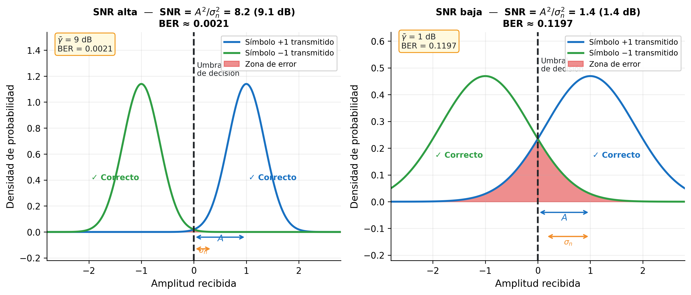

Una **función de densidad de probabilidad (PDF)** describe cómo se reparte la probabilidad de una variable aleatoria continua. Su altura en un punto $x$ indica qué tan probable es observar valores cercanos a $x$; el **área bajo la curva** entre dos límites es la probabilidad de que la variable caiga en ese intervalo. El área total es siempre 1 — la variable toma algún valor con certeza.

La figura muestra BPSK — el caso más simple, con dos símbolos: $+A$ (bit 1) y $-A$ (bit 0). El eje horizontal es la **amplitud recibida** $r$. Cada campana es la **PDF** de la amplitud recibida para ese símbolo: indica con qué probabilidad el receptor medirá cada valor de amplitud si ese símbolo fue transmitido.

Las campanas no son puntos fijos sino distribuciones porque el ruido térmico $n$ desplaza aleatoriamente la amplitud recibida respecto al símbolo transmitido. El ruido sigue una distribución normal con media cero y varianza $\sigma_n^2$:

$$n \sim \mathcal{N}(0,\, \sigma_n^2)$$

Media cero significa que el ruido no desplaza la señal en promedio — solo la dispersa. Geométricamente, $\sigma_n$ (la desviación estándar) es la distancia horizontal desde el centro de la campana hasta sus **puntos de inflexión** — donde la curva cambia de cóncava a convexa. Es una longitud en el eje de amplitud (voltios). La varianza $\sigma_n^2$ es simplemente $\sigma_n$ al cuadrado. Su interpretación física es la **potencia del ruido** $P_n$, y el razonamiento es el siguiente: la potencia eléctrica de una señal $x$ en una resistencia de 1 Ω es $x^2$ (W); para una señal aleatoria, la potencia promedio es $\mathbb{E}[x^2]$, el valor cuadrático medio. Existe una identidad estadística general: $\mathbb{E}[x^2] = \text{Var}(x) + (\mathbb{E}[x])^2$. Aplicada al ruido, cuya media es cero, el término $(\mathbb{E}[n])^2 = 0$ desaparece y queda $\mathbb{E}[n^2] = \text{Var}(n) = \sigma_n^2$. Por tanto, $P_n = \mathbb{E}[n^2] = \sigma_n^2$ — la varianza y la potencia son la misma cantidad, no por definición sino porque el ruido tiene media cero. Mayor $\sigma_n$ significa campanas más anchas — el ruido desplaza la amplitud recibida en un rango mayor alrededor del símbolo.

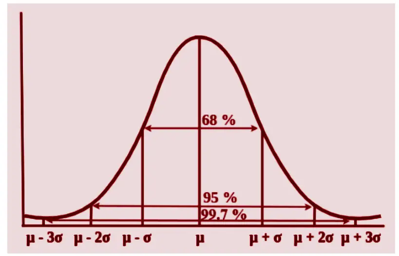

La figura muestra la regla práctica que relaciona $\sigma_n$ con el área bajo la campana: el intervalo $[\mu - \sigma_n,\ \mu + \sigma_n]$ encierra el 68% de las realizaciones; $\pm 2\sigma_n$ el 95%; $\pm 3\sigma_n$ el 99,7%. En el contexto de BPSK, $\mu = A$ (el símbolo transmitido) y la zona de error es todo lo que cae por debajo del umbral en 0 — es decir, la cola izquierda de la campana. Esa cola crece rápidamente cuando $\sigma_n$ se acerca a $A$: si $\sigma_n \ll A$ la cola es despreciable; si $\sigma_n \approx A$ el solapamiento con el umbral es significativo.

La amplitud recibida cuando se transmite $+A$ es:

$$r = A + n$$

cuya PDF es una gaussiana centrada en $+A$ con anchura $\sigma_n$ — la campana derecha de la figura izquierda.

El detector coloca el umbral en 0: decide bit 1 si $r > 0$, bit 0 si $r < 0$. La **zona de error** (rojo) es la cola de la campana que cruza ese umbral — la probabilidad de que el ruido haya empujado la amplitud al lado equivocado. La imagen izquierda (SNR alta) muestra campanas bien separadas y zona de error pequeña; la imagen derecha (SNR baja) muestra campanas solapadas y zona de error grande.

Algebraicamente, dado que $+A$ fue enviado, el error ocurre cuando $r < 0$, es decir cuando $n < -A$. El objetivo es calcular el área de esa cola, pero $n \sim \mathcal{N}(0, \sigma_n^2)$ es una gaussiana de varianza arbitraria — no existe una tabla o función directa para calcular su área de cola. La solución es **normalizar**: dividir ambos lados de la desigualdad entre $\sigma_n > 0$ no cambia el sentido de la desigualdad ni el evento, solo reescribe la condición en términos de una nueva variable $Z = n/\sigma_n$:

$$n < -A \;\Longleftrightarrow\; \frac{n}{\sigma_n} < -\frac{A}{\sigma_n}$$

La variable $Z = n/\sigma_n$ sigue una gaussiana estándar $\mathcal{N}(0,1)$ — media cero, varianza uno — para la cual sí existe una función estándar que calcula áreas de cola: la función $Q$. Por la simetría de $\mathcal{N}(0,1)$ alrededor de cero, $P(Z < -x) = P(Z > x) = Q(x)$. Aplicando con $x = A/\sigma_n$:

$$P(\text{error} \mid +A) = P(n < -A) = P\!\left(\frac{n}{\sigma_n} < -\frac{A}{\sigma_n}\right) = Q\!\left(\frac{A}{\sigma_n}\right)$$

donde $Q(x) = \frac{1}{\sqrt{2\pi}}\int_x^{\infty} e^{-u^2/2}\,du$ es el **área de la cola derecha** de la gaussiana estándar más allá del umbral $x$ — exactamente el área roja de la figura. Por simetría, la misma probabilidad aplica cuando se envía $-A$.

El área $Q(A/\sigma_n)$ es la **BER**: la probabilidad de que un bit sea recibido incorrectamente, expresada en función de los parámetros físicos $A$ y $\sigma_n$. El siguiente paso es reescribirla en términos de $\gamma = P_r/P_n$ — el parámetro de diseño que el ingeniero controla.

Para ello se identifican los dos ingredientes de $\gamma$ en el contexto BPSK:

- **Potencia de la señal**: $P_r = A^2$, porque los símbolos $\pm A$ tienen valor cuadrático medio $\mathbb{E}[s^2] = A^2$.
- **Potencia del ruido**: $P_n = \sigma_n^2$, porque la potencia de una señal aleatoria es su valor cuadrático medio $\mathbb{E}[n^2]$, y para ruido de media cero $\mathbb{E}[n^2] = \sigma_n^2$ (varianza = potencia). Normalizado a $1\ \Omega$, $\sigma_n^2\ \text{V}^2$ equivale directamente a $\sigma_n^2\ \text{W}$, convertible a dBm.

Por tanto:

$$\gamma = \frac{P_r}{P_n} = \frac{A^2}{\sigma_n^2} \quad \Longrightarrow \quad \frac{A}{\sigma_n} = \sqrt{\gamma}$$

Sustituyendo en $Q(A/\sigma_n)$:

$$\boxed{\text{BER} = Q\!\left(\sqrt{\gamma}\right)}$$

En la imagen izquierda (SNR alta), las distribuciones están bien separadas y la zona de error es pequeña. En la imagen derecha (SNR baja), se solapan y la zona de error crece. La fórmula cuantifica exactamente esa relación: a mayor $\gamma$, mayor argumento de $Q$, menor cola, menor BER.

**SNR media vs. SNR instantánea** — la fórmula BER $= Q(\sqrt{\gamma})$ asume implícitamente que $\gamma$ es un valor fijo y conocido. Esa suposición es válida en un canal puramente AWGN, donde el único efecto es el ruido térmico y la potencia recibida no varía. Pero en un canal real con multipath esa suposición se rompe — la potencia recibida fluctúa, y con ella $\gamma$. Para ver por qué, es necesario distinguir entre la SNR media y la SNR instantánea.

El link budget de las secciones 1–3 calculó la potencia media recibida $\bar{P}_r$ en función de la distancia, el entorno y el shadowing. La **SNR media** es:

$$\bar{\gamma} = \frac{\bar{P}_r}{P_n}$$

Si el canal fuera puramente AWGN, $\gamma = \bar{\gamma}$ sería constante y la BER quedaría completamente determinada por $Q(\sqrt{\bar{\gamma}})$.

**El problema del multipath fading**: las múltiples réplicas de la señal llegan con fases aleatorias y se suman de forma constructiva o destructiva dependiendo de la posición exacta del receptor. La potencia recibida $P_r$ — y por tanto $\gamma$ — fluctúa aleatoriamente en torno a $\bar{P}_r$. En los instantes de suma destructiva, $\gamma$ desciende muy por debajo de $\bar{\gamma}$: aunque el promedio sea confortable (digamos $\bar{\gamma} = 20$ dB), hay momentos en que $\gamma$ cae a 0 dB o menos. Esos instantes — los **deep fades** — producen ráfagas de errores de bit aunque el nivel medio de señal sea perfectamente adecuado.

En presencia de fading, $\gamma$ es una **variable aleatoria**. Conviene detenerse en lo que eso implica desde el punto de vista estadístico: decir que $\gamma$ es una variable aleatoria no es solo decir que "cambia" — es afirmar que sus valores siguen una **ley de reparto** bien definida. Esa ley es la función de densidad de probabilidad $f(\gamma)$, y no es algo adicional que haya que buscar por separado: es inherente a la noción misma de variable aleatoria. Toda variable aleatoria continua tiene asociada una PDF que describe con qué densidad de probabilidad toma cada valor posible. Preguntar "¿cuál es la $f(\gamma)$ del fading?" equivale a preguntar "¿cuál es la distribución estadística de la SNR instantánea?" — y responderla es exactamente el objetivo de §7 y §8.

Como BER $= Q(\sqrt{\gamma})$ y $\gamma$ es aleatoria, la BER también es aleatoria — en un instante puede ser $10^{-6}$, en otro $10^{-1}$. Un valor único y representativo ya no existe, y usar $Q(\sqrt{\bar{\gamma}})$ como si el canal fuera AWGN sería **incorrecto**: $Q$ es una función no lineal, y para funciones no lineales el promedio de la función no es igual a la función del promedio — siempre se cumple que:

$$\overline{\text{BER}} = \mathbb{E}\!\left[Q\!\left(\sqrt{\gamma}\right)\right] > Q\!\left(\sqrt{\bar{\gamma}}\right)$$

Es decir, el fading **siempre degrada la BER** respecto a lo que predice el AWGN con la misma SNR media — incluso cuando $\bar{\gamma}$ es idéntico. La única métrica correcta es el promedio de $Q(\sqrt{\gamma})$ ponderado por la probabilidad de cada valor de $\gamma$, es decir, integrado contra su PDF:

$$\overline{\text{BER}} = \int_0^{\infty} Q\!\left(\sqrt{\gamma}\right) f(\gamma)\, d\gamma$$

La forma de esta integral deja ver su significado: para cada valor posible de $\gamma$, se calcula la BER que produciría ($Q(\sqrt{\gamma})$) y se pondera por la probabilidad de que $\gamma$ tome ese valor ($f(\gamma)\,d\gamma$). El resultado es la BER promedio sobre todos los valores posibles de $\gamma$. Para evaluar esta integral hay que conocer $f(\gamma)$ — y esa distribución depende de cómo se distribuye la amplitud recibida, que es lo que los modelos de Rayleigh y Rician proporcionan.

Vale la pena detenerse en por qué se usa la BER como criterio de calidad y no directamente la potencia recibida. La razón es que la potencia recibida sola no determina si la comunicación es exitosa — lo que importa es si los bits llegan correctos. Un sistema puede tener potencia recibida suficiente pero alta BER si la modulación es demasiado agresiva para el $\gamma$ disponible; o puede tener baja potencia pero BER aceptable si la modulación es conservadora. La BER es el criterio de calidad *observable y relevante para el usuario*: cuántos bits se reciben mal. En diseño de sistemas, se fija una BER objetivo (típicamente $10^{-3}$ a $10^{-6}$ según la aplicación) y se despeja el $\gamma$ mínimo necesario — lo que determina la potencia mínima de transmisión, la máxima distancia, y el orden de modulación sostenible. El fading degrada el sistema precisamente porque hace que $\gamma$ caiga por debajo de ese umbral mínimo en los instantes de deep fade, disparando la BER aunque el nivel medio de señal sea adecuado.

---

### 7. Rayleigh Fading

Hasta aquí, $\gamma$ era un número fijo: la SNR de un canal AWGN determinista. Con el multipath fading eso cambia fundamentalmente — la amplitud recibida $r$ ya no es un valor constante sino una **variable aleatoria** que fluctúa en cada instante dependiendo de cómo se suman los ecos. Como consecuencia, la SNR instantánea $\gamma = r^2/P_n$ también es una variable aleatoria con su propia distribución $f(\gamma)$. Y dado que $\gamma$ es aleatoria, la BER ya no es un número fijo sino que también fluctúa — lo que tiene sentido como métrica de rendimiento es su **valor esperado** (promedio estadístico) sobre todos los valores posibles de $\gamma$:

$$\overline{\text{BER}} = \mathbb{E}_\gamma\!\left[Q\!\left(\sqrt{\gamma}\right)\right] = \int_0^\infty Q\!\left(\sqrt{\gamma}\right) f(\gamma)\, d\gamma$$

La barra sobre BER y sobre $\bar{\gamma}$ indica exactamente eso: un promedio sobre la distribución de la variable aleatoria. Para evaluar esta integral necesitamos conocer $f(\gamma)$, la distribución de la SNR instantánea. Esa distribución depende directamente de cómo se distribuye la amplitud $r$ — que es lo que el modelo de Rayleigh describe.

La cadena lógica es: derivar $f(r)$ → obtener $f(\gamma)$ → calcular $\overline{\text{BER}}$ en función de $\bar{\gamma}$. Para derivar $f(r)$ hay que entender cómo se forma $r$ a partir de la suma de los caminos multitrayecto — y ahí es donde entran las componentes $I$ y $Q$.

**Por qué modelamos $a_i$ y $\phi_i$ como variables aleatorias**: ya hemos aplicado este razonamiento en §3. Ante la imposibilidad de modelar cada obstáculo individualmente, tratamos su efecto acumulado como una variable aleatoria $X_\sigma \sim \mathcal{N}(0,\sigma^2)$. Aquí ocurre exactamente lo mismo, un nivel más abajo: en cualquier posición concreta del terminal, cada amplitud $a_i$ y cada fase $\phi_i$ tiene un valor exacto y determinista, completamente determinado por la geometría del entorno — posición de cada reflexor, material de cada superficie, longitud exacta de cada camino. Pero esos valores no los conocemos, y cambian cuando el terminal se desplaza unos pocos centímetros. La solución es la misma que en shadowing: modelarlos como variables aleatorias con distribuciones plausibles y derivar la distribución de la amplitud resultante $r$. Esa distribución captura el comportamiento estadístico del canal sobre todas las posibles posiciones del terminal — y es la que permite calcular la $\overline{\text{BER}}$ como métrica de diseño.

La distribución de $\phi_i$ se justifica físicamente. La fase acumulada por el camino $i$ es $\phi_i = 2\pi d_i / \lambda$, donde $d_i$ es la longitud del camino. A 2 GHz, $\lambda \approx 15$ cm; un camino de 10 m acumula $\phi_i = 2\pi \times 10/0{,}15 \approx 2\pi \times 67$ — es decir, 67 vueltas completas. No conocemos $d_i$ con precisión de centímetros, y la fracción de vuelta sobrante después de descartar los múltiplos enteros de $2\pi$ es efectivamente aleatoria: **$\phi_i$ se modela como una variable aleatoria uniforme en $[0, 2\pi)$**. Esta suposición no es un truco matemático — es la consecuencia directa de que las longitudes de camino son órdenes de magnitud mayores que $\lambda$.

Con $a_i$ y $\phi_i$ modelados como variables aleatorias, el objetivo inmediato es derivar $f(r)$, la distribución de la amplitud recibida $r = \left|\sum_i a_i e^{j\phi_i}\right|$. El obstáculo es que la suma directa $\sum a_i \cos(2\pi f_c t + \phi_i)$ sigue siendo una función del tiempo — no es un número escalar, y el TCL no se puede aplicar directamente a una función temporal. Lo que se necesita es separar la **parte aleatoria** (que depende de $a_i$ y $\phi_i$) de la **parte temporal** (que depende de $t$ y $f_c$). Esa separación es exactamente lo que hace la descomposición en componentes I y Q: al descomponer cada eco en su proyección sobre $\cos(2\pi f_c t)$ y sobre $\sin(2\pi f_c t)$, se obtienen dos sumas de escalares aleatorios — $I = \sum a_i \cos\phi_i$ y $Q = \sum a_i \sin\phi_i$ — completamente separadas de la variación temporal. La ortogonalidad de cos y sin (su producto integrado en un período es cero) garantiza que lo que ocurre en $I$ no afecta a $Q$ ni viceversa, lo que permite tratar ambas como variables aleatorias independientes. A esas dos sumas escalares sí se puede aplicar el TCL → $I \sim \mathcal{N}(0, \sigma^2)$, $Q \sim \mathcal{N}(0, \sigma^2)$ → y de ahí se deriva $f(r)$ analíticamente.

**De dónde vienen las componentes I y Q**: hay que rastrearlas desde sus orígenes físicos.

El punto de partida es que cualquier señal sinusoidal de frecuencia $f_c$ puede escribirse como combinación lineal de $\cos(2\pi f_c t)$ y $\sin(2\pi f_c t)$ — la **base ortogonal** del espacio de señales a esa frecuencia. Son ortogonales en el sentido de que su producto integrado en un período es cero: lo que ocurre en la componente coseno no afecta a la componente seno. Los factores de escala que acompañan a cada portadora se llaman $I$ (*in-phase*) y $Q$ (*quadrature*). La razón de usar esta descomposición es estratégica: la suma directa de los ecos $\sum a_i \cos(2\pi f_c t + \phi_i)$ no tiene una distribución estadística manejable, pero al descomponerla en componentes I y Q se obtienen dos sumas escalares — $I = \sum I_i$ y $Q = \sum Q_i$ — a las que sí se puede aplicar el TCL para obtener gaussianas. Es el artificio que hace derivable $f(r)$.

Considera un transmisor que emite una portadora $\cos(2\pi f_c t)$. Cada uno de los $N$ caminos multitrayecto llega al receptor con una amplitud $a_i$ y un desfase de fase acumulado $\phi_i$ (debido a la diferencia de longitud de camino). La contribución del camino $i$ es:

$$s_i(t) = a_i \cos(2\pi f_c t + \phi_i)$$

Aplicando la identidad trigonométrica $\cos(\alpha + \beta) = \cos\alpha\cos\beta - \sin\alpha\sin\beta$:

$$s_i(t) = \underbrace{a_i \cos\phi_i}_{I_i} \cdot \cos(2\pi f_c t) \;-\; \underbrace{a_i \sin\phi_i}_{Q_i} \cdot \sin(2\pi f_c t)$$

Cada camino aporta dos proyecciones: una sobre la portadora coseno ($I_i$) y otra sobre la portadora seno desplazada 90° ($Q_i$). Sumando los $N$ caminos, la señal total es:

$$s(t) = \underbrace{\left(\sum_{i=1}^N a_i \cos\phi_i\right)}_{I} \cos(2\pi f_c t) \;-\; \underbrace{\left(\sum_{i=1}^N a_i \sin\phi_i\right)}_{Q} \sin(2\pi f_c t)$$

$I$ y $Q$ son, por tanto, **sumas de muchas variables aleatorias independientes** — cada $a_i$ y $\phi_i$ es aleatoria e independiente de los demás caminos, porque cada camino refleja en un objeto físicamente distinto. El **teorema central del límite** (TCL) garantiza que $I$ y $Q$ convergen a gaussianas cuando se cumplen tres condiciones — y las tres se satisfacen aquí en NLOS:

1. **Muchos sumandos**: en entornos urbanos hay decenas o centenares de caminos activos.
2. **Independencia**: cada $I_i = a_i\cos\phi_i$ depende solo del camino $i$; los demás caminos no afectan su valor.
3. **Ninguno domina**: en ausencia de LOS, todos los caminos tienen amplitudes $a_i$ comparables; ningún término individual concentra la mayor parte de la energía. Esta es la condición que se violará en Rician, donde el camino directo sí domina.

Cuando las tres se cumplen, el resultado son gaussianas de media cero e igual varianza $\sigma^2$. La media cero se sigue de que $\phi_i \sim \text{Uniforme}[0, 2\pi)$: los términos $\cos\phi_i$ toman valores positivos y negativos con igual frecuencia, de modo que $\mathbb{E}[\cos\phi_i] = 0$, y lo mismo para $\sin\phi_i$. Esto no significa que la señal sea cero en cada instante — en cada realización concreta, $I$ y $Q$ toman valores distintos de cero. Lo que es cero es el **promedio estadístico** sobre todas las posibles posiciones del terminal. Esa es exactamente la condición que distingue a Rayleigh (sin LOS: $\mathbb{E}[I] = \mathbb{E}[Q] = 0$, cúmulo centrado en el origen) de Rician (con LOS: la componente directa introduce una media no nula y desplaza el cúmulo).

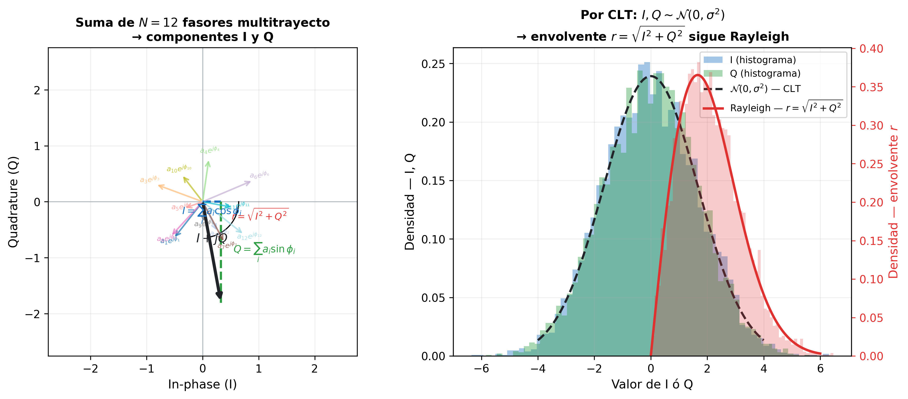

La imagen izquierda muestra el diagrama fasorial: cada flecha de color representa un camino multitrayecto ($I_i + jQ_i$), con amplitud $a_i$ y fase $\phi_i$ aleatorias. La flecha negra gruesa es la **suma vectorial** $I + jQ$ — el fasor resultante que ve el receptor. En cada nuevo instante, las amplitudes y fases de los caminos cambian porque el terminal se mueve o los objetos del entorno varían (el efecto temporal estudiado en §5), y el extremo de la flecha negra recorre la región sombreada de forma aleatoria. La imagen derecha muestra los histogramas de $I$ y $Q$ obtenidos de miles de realizaciones independientes: ambas componentes siguen distribuciones gaussianas centradas en cero, tal como predice el TCL. Con $I$ y $Q$ gaussianas e independientes, el siguiente paso es calcular la distribución de su magnitud — la envolvente $r = \sqrt{I^2 + Q^2}$. Este era el objetivo desde el principio: necesitábamos $f(r)$ para obtener $f(\gamma)$ y poder calcular $\overline{\text{BER}}$. La descomposición en I y Q fue el camino para llegar a ella — sin ella, la suma aleatoria de ecos no tendría una distribución analítica tratable.

La **envolvente** de la señal — la amplitud del fasor resultante — es:

$$r = \sqrt{I^2 + Q^2}$$

Geométricamente, $r$ es la distancia desde el origen hasta el extremo del fasor negro. Como $I$ y $Q$ son gaussianas independientes de igual varianza, $r$ sigue una distribución de **Rayleigh**:

$$f_R(r) = \frac{r}{\sigma^2}\exp\!\left(-\frac{r^2}{2\sigma^2}\right), \quad r \geq 0$$

!!! note "Por qué I y Q gaussianas con igual varianza implican una Rayleigh"
    La conexión no es evidente — requiere un cambio de coordenadas. Partiendo de la PDF conjunta de $I$ y $Q$:

    $$f_{I,Q}(i,q) = \frac{1}{2\pi\sigma^2}\,e^{-(i^2+q^2)/2\sigma^2}$$

    Esta es una "diana": anillos concéntricos de igual densidad, porque la fórmula solo depende de $i^2+q^2$. Esa simetría circular es consecuencia de que $I$ y $Q$ tienen **igual varianza** — si fueran distintas, los anillos serían elipses.

    **Cambio a coordenadas polares** ($r$, $\theta$): el Jacobiano de la transformación $(i,q)\to(r,\theta)$ es $r$, y $i^2+q^2 = r^2$:

    $$f_{r,\theta}(r,\theta) = \frac{r}{2\pi\sigma^2}\,e^{-r^2/2\sigma^2}$$

    **Marginalizar sobre $\theta$**: la simetría circular hace que $\theta$ sea uniforme en $[0,2\pi)$ e independiente de $r$. Integrar sobre $\theta$ acumula el factor $2\pi$:

    $$f_r(r) = \int_0^{2\pi} \frac{r}{2\pi\sigma^2}\,e^{-r^2/2\sigma^2}\,d\theta = \frac{r}{\sigma^2}\,e^{-r^2/2\sigma^2}$$

    Ese es exactamente $f_R(r)$. La $r$ en el numerador no viene de la gaussiana — viene del **área del anillo** $2\pi r\,dr$: cuanto mayor es $r$, mayor es el anillo y mayor la probabilidad de que el punto $(I,Q)$ caiga en él, aunque la densidad gaussiana decrezca.

Los parámetros de esta expresión tienen interpretación directa:

- $\sigma^2$ es la varianza de cada componente gaussiana — tanto de $I$ como de $Q$. Representa la potencia media de los caminos dispersos: mayor $\sigma^2$ implica más energía multitrayecto y mayor amplitud media recibida.
- El factor $r$ en el numerador no es arbitrario: proviene del cambio de coordenadas cartesianas $(I, Q)$ a polares $(r, \theta)$. Al integrar la PDF gaussiana 2D sobre todos los puntos a distancia $r$ del origen (un anillo de radio $r$ y anchura $dr$), el área del anillo es proporcional a $r$ — de ahí el factor.
- El dominio $r \geq 0$ refleja que la envolvente es una magnitud (distancia al origen), siempre no negativa.

A diferencia de una señal AWGN donde la amplitud recibida es prácticamente constante, la distribución de Rayleigh asigna probabilidad no nula a valores de $r$ muy cercanos a cero: en esos instantes la suma de los ecos es casi completamente destructiva — los **deep fades** — y la SNR instantánea cae drásticamente.

**De la envolvente $r$ a la SNR instantánea $\gamma$**: la SNR en cada instante es el ratio entre la potencia recibida instantánea y la potencia del ruido:

$$\gamma = \frac{P_r}{P_n} = \frac{r^2}{P_n}$$

Para expresar $\gamma$ en términos de la SNR media $\bar{\gamma}$, se usa el hecho de que la potencia media recibida en un canal Rayleigh es $\mathbb{E}[r^2] = 2\sigma^2$, de donde $P_n = 2\sigma^2/\bar{\gamma}$. Sustituyendo:

$$\gamma = \frac{r^2}{2\sigma^2}\,\bar{\gamma}$$

Esta expresión muestra que $\gamma$ es proporcional a $r^2$: cuando la envolvente $r$ es grande (suma constructiva de ecos), la SNR instantánea es alta; cuando $r$ es pequeña (deep fade), $\gamma$ cae.

**De $f(r)$ a $f(\gamma)$**: como $\gamma \propto r^2$, la distribución de $\gamma$ se obtiene por cambio de variable a partir de la distribución de Rayleigh. El resultado es una distribución **exponencial** de media $\bar{\gamma}$:

$$f_\gamma(\gamma) = \frac{1}{\bar{\gamma}}\exp\!\left(-\frac{\gamma}{\bar{\gamma}}\right)$$

La característica más importante de esta distribución es que su valor más probable es $\gamma = 0$ — la moda está en el origen. Esto significa que, aunque la SNR media sea $\bar{\gamma}$, el valor instantáneo más frecuente estadísticamente es el más bajo. Hay una fracción significativa del tiempo en que $\gamma \ll \bar{\gamma}$ — esos instantes de SNR muy baja son los deep fades que disparan la BER.

**De la BER en AWGN a la BER en fading**: en un canal AWGN con SNR fija $\gamma$, la BER para BPSK es determinista: $\text{BER}_{\text{AWGN}}(\gamma) = Q(\sqrt{\gamma})$. En un canal Rayleigh, $\gamma$ es aleatoria — la BER efectiva es el **promedio** de $\text{BER}_{\text{AWGN}}(\gamma)$ sobre todos los valores posibles de $\gamma$:

$$\text{BER}_{\text{Rayleigh}} = \int_0^\infty Q\!\left(\sqrt{\gamma}\right) f_\gamma(\gamma)\, d\gamma = \frac{1}{2}\left(1 - \sqrt{\frac{\bar{\gamma}}{2 + \bar{\gamma}}}\right) \approx \frac{1}{2\bar{\gamma}} \quad (\bar{\gamma} \gg 1)$$

El resultado es una BER que decae como $1/\bar{\gamma}$ — **linealmente** con la SNR media — en lugar de la caída exponencial del canal AWGN. La diferencia es enorme en la práctica.

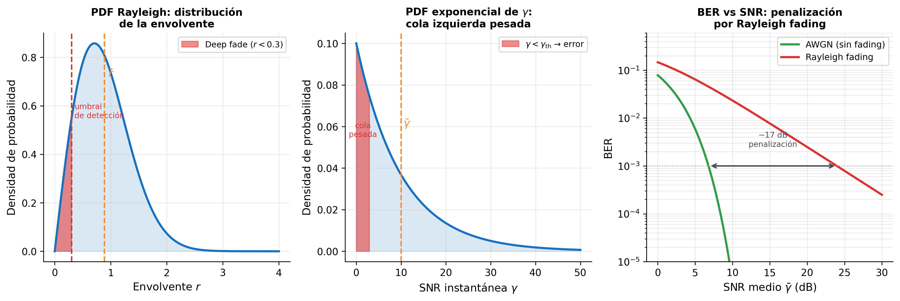

La imagen izquierda muestra la PDF de la envolvente Rayleigh: la distribución tiene su máximo cerca del origen, lo que refleja que los valores bajos de $r$ (deep fades) son estadísticamente frecuentes. La zona roja marca la región de amplitud insuficiente para una detección correcta — cuando $r$ cae ahí, la SNR instantánea es demasiado baja y se producen errores. La imagen central muestra la distribución exponencial de la SNR instantánea $\gamma$: su moda está en $\gamma = 0$, confirmando que los instantes de SNR muy baja son los más probables individualmente. La imagen derecha compara directamente la BER en AWGN y en Rayleigh fading: para alcanzar una BER de $10^{-3}$, el canal Rayleigh requiere aproximadamente **17 dB más de SNR** que el canal AWGN — esa es la penalización por fading sin ninguna técnica de mitigación.

La diferencia entre Rayleigh y Rician, vista desde el modelo estadístico, es exactamente una: en Rayleigh **todos** los N caminos tienen fase aleatoria; en Rician **uno** de ellos — el directo — tiene amplitud y fase deterministas. Ese único cambio en las suposiciones produce una distribución diferente:

| | Rayleigh (NLOS) | Rician (LOS) |
|---|---|---|
| Caminos scatter | $a_i$ aleatorio, $\phi_i \sim \text{Unif}[0,2\pi)$ | ídem |
| Camino LOS | no existe | $A$ determinista, $\phi_\text{LOS}$ determinista |
| $\mathbb{E}[I]$, $\mathbb{E}[Q]$ | 0, 0 | $\mu_I \neq 0$, $\mu_Q \neq 0$ |
| Centro del cúmulo fasorial | origen | punto $(\mu_I, \mu_Q)$ |
| PDF de la envolvente $r$ | Rayleigh | Rician |
| Deep fades | frecuentes ($r$ puede caer a 0) | poco probables ($r \approx A$ la mayor parte del tiempo) |

El modelo Rayleigh asume que no existe ninguna componente directa entre transmisor y receptor. En muchos escenarios reales — interiores con visión directa, enlaces punto a punto, picoceldas — esa suposición es demasiado pesimista.

---

### 8. Rician Fading

La tabla al final de §7 resume el cambio: en Rician, uno de los $N$ caminos deja de ser aleatorio. En Rayleigh todos los caminos tenían amplitudes y fases aleatorias, y eso hacía que $\mathbb{E}[I] = \mathbb{E}[Q] = 0$. Ahora existe un **camino LOS** con amplitud fija $A$ y fase $\phi_\text{LOS}$ prácticamente constante — el camino directo recorre una distancia casi invariante porque el obstáculo eres tú mismo y el transmisor, no un reflexor en movimiento. Al ser determinista, ese término no fluctúa, no promedía a cero y desplaza la media de $I$ y $Q$ fuera del origen. Ese desplazamiento es el mecanismo completo de Rician.

**Impacto del LOS en el diagrama fasorial**: por la misma identidad trigonométrica de §7, el camino LOS aporta:

$$s_\text{LOS}(t) = A\cos(2\pi f_c t + \phi_\text{LOS}) = \underbrace{A\cos\phi_\text{LOS}}_{\mu_I} \cos(2\pi f_c t) - \underbrace{A\sin\phi_\text{LOS}}_{\mu_Q} \sin(2\pi f_c t)$$

Este término es **determinista** — no aleatorio. Los $N-1$ caminos dispersos restantes siguen siendo aleatorios con media cero, igual que en Rayleigh. La suma total da:

$$I = \underbrace{A\cos\phi_\text{LOS}}_{\mu_I \neq 0} + \tilde{I}_\text{scatter}, \qquad Q = \underbrace{A\sin\phi_\text{LOS}}_{\mu_Q \neq 0} + \tilde{Q}_\text{scatter}$$

donde $\tilde{I}_\text{scatter}$ y $\tilde{Q}_\text{scatter}$ son gaussianas de media cero y varianza $\sigma^2$ — exactamente las mismas componentes aleatorias del modelo Rayleigh. El modelo Rician añade encima de ellas una componente fija: el fasor LOS.

Con esa suma, $I$ y $Q$ siguen siendo gaussianas de varianza $\sigma^2$, pero ahora con **media no nula**: $I \sim \mathcal{N}(\mu_I, \sigma^2)$, $Q \sim \mathcal{N}(\mu_Q, \sigma^2)$. En el diagrama fasorial, el cúmulo de puntos ya no está centrado en el origen — está desplazado al punto $(\mu_I, \mu_Q)$, que es la posición del fasor LOS.

Vale la pena detenerse en qué representa cada cantidad:

- $r = \sqrt{I^2 + Q^2}$ — la **magnitud del fasor resultante**: variable aleatoria, fluctúa en cada instante según la realización de los caminos scatter. Es la envolvente de la señal recibida.
- $A = \sqrt{\mu_I^2 + \mu_Q^2}$ — la **amplitud del fasor LOS**: valor **determinista**, constante. Representa la distancia del origen al centro del cúmulo en el diagrama fasorial.
- $\sigma^2$ — la **varianza de cada componente scatter** ($\tilde{I}$ y $\tilde{Q}$): mide cuán disperso está el cúmulo alrededor de su centro LOS. No es la varianza de $r$ — es la varianza de los ecos aleatorios que rodean la componente directa.

La distribución de Rician queda completamente determinada por estos dos parámetros independientes: $A$ controla dónde está el centro del cúmulo; $\sigma^2$ controla cuán disperso es ese cúmulo.

**De dónde sale la PDF de Rician**: con el cúmulo desplazado al punto $(A\cos\phi_\text{LOS},\ A\sin\phi_\text{LOS})$, la envolvente $r$ — la distancia desde el origen hasta ese cúmulo — ya no tiende a cero frecuentemente. La componente LOS actúa como un "ancla" que mantiene el fasor resultante alejado del origen, reduciendo la probabilidad de deep fades.

La distribución resultante — la **distribución de Rician** — incorpora dos términos que reflejan esa geometría:

$$f_R(r) = \frac{r}{\sigma^2}\exp\!\left(-\frac{r^2 + A^2}{2\sigma^2}\right) I_0\!\left(\frac{rA}{\sigma^2}\right), \quad r \geq 0$$

- El factor $\exp(-(r^2 + A^2)/2\sigma^2)$ penaliza tanto la distancia de $r$ al origen como la distancia del LOS al origen — cuanto más separados estén $r$ y $A$, menor es la probabilidad.
- $I_0(rA/\sigma^2)$ es la **función de Bessel modificada de orden cero** — un factor de acoplamiento entre la envolvente $r$ y la amplitud LOS $A$ que aumenta cuando ambas son similares. No es necesario conocer su forma analítica; basta con saber que $I_0(0) = 1$ y que crece cuando su argumento crece.

La conexión con Rayleigh es directa: cuando $A = 0$ (sin LOS), $I_0(0) = 1$ y la expresión se reduce exactamente a la PDF de Rayleigh — Rayleigh es el caso límite de Rician sin componente directa.

**El factor K de Rician**: la PDF de Rician depende de dos parámetros, $A$ y $\sigma^2$, pero por separado no dicen mucho — un $A$ grande puede ser irrelevante si $\sigma^2$ también es grande, y viceversa. Lo que determina la severidad del fading es la *proporción* entre la potencia LOS y la potencia dispersa: cuanto mayor sea esa proporción, más dominante es la componente directa y menos probable el deep fading. Esa proporción es el **factor K de Rician**.

La potencia de la componente LOS es $A^2/2$ — el valor cuadrático medio de $A\cos(2\pi f_c t + \phi_\text{LOS})$, que promediado en un período da $A^2 \cdot \langle\cos^2\rangle = A^2/2$. La potencia total de las componentes dispersas es $\sigma_I^2 + \sigma_Q^2 = 2\sigma^2$. El cociente define el **factor K**:

$$K = \frac{A^2/2}{\sigma^2 + \sigma^2} = \frac{A^2}{2\sigma^2}$$

K es adimensional y captura la severidad del fading en un solo número, independientemente de la potencia total recibida. Los dos extremos quedan así perfectamente caracterizados:

- $K = 0$ ($A = 0$): sin LOS → Rayleigh fading — severidad máxima, la envolvente puede caer hasta cero.
- $K \to \infty$ ($\sigma \to 0$): sin dispersión → el canal es determinista, la envolvente es constante igual a $A$ y el fading desaparece completamente. La BER converge a la de AWGN — el mejor resultado posible para un SNR dado.
- $K = 1$–$10$ (0–10 dB): LOS parcial, típico en interiores, picoceldas y enlaces punto a punto.

**Por qué K entra en la BER final**: el objetivo de esta sección, igual que en Rayleigh, es evaluar la BER media:

$$\overline{\text{BER}} = \int_0^\infty Q(\sqrt{\gamma})\, f_\gamma(\gamma)\, d\gamma$$

Para ello necesitamos $f_\gamma(\gamma)$ — la distribución del SNR instantáneo $\gamma = r^2/(2\sigma_n^2)$. Esa distribución queda determinada por dos cantidades independientes: el SNR medio $\bar\gamma$ (cuánta potencia total recibe el receptor frente al ruido) y la *estructura interna* del canal (cuánto de esa potencia es LOS frente a dispersa). K captura exactamente esa estructura interna. Dos canales con el mismo $\bar\gamma$ y el mismo $K$ producen la misma $f_\gamma(\gamma)$ y por tanto la misma $\overline{\text{BER}}$, aunque $A$ y $\sigma^2$ sean distintos en valor absoluto. Así, $K$ y $\bar\gamma$ juntos son los dos únicos parámetros que determinan completamente el rendimiento del sistema en fading Rician.

**Efecto sobre la BER**: con LOS, el cúmulo de puntos en el diagrama fasorial está desplazado hacia $A$ — lejos del origen. El deep fading requiere que el ruido aleatorio sea suficientemente grande como para arrastrar el fasor resultante hasta cerca de cero, lo que ocurre con mucha menor frecuencia que en Rayleigh. A medida que $K$ crece, la PDF de la envolvente se estrecha y su pico se aleja del origen, reduciendo la probabilidad de deep fades y mejorando la BER:

| $K$ | Situación física | Efecto en $\overline{\text{BER}}$ |
|-----|-----------------|----------------------------------|
| 0 | Sin LOS — Rayleigh | Peor caso: $\overline{\text{BER}} \approx 1/(2\bar\gamma)$, caída lineal |
| 1–10 (0–10 dB) | LOS parcial, interiores | BER intermedia, caída más rápida que lineal |
| $\to\infty$ | Canal determinista | Mejor caso: $\overline{\text{BER}} \to Q(\sqrt{\bar\gamma})$, igual que AWGN |

$K$ funciona así como un indicador directo de la calidad del enlace: cuantifica en un solo número cuánto se aleja el canal del peor caso (Rayleigh, $K=0$) hacia el mejor caso posible (AWGN, $K\to\infty$).

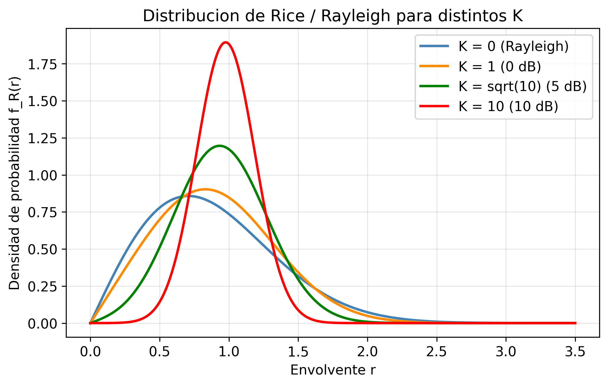

La figura muestra la PDF de la envolvente para K = 0 (Rayleigh), 1, $\sqrt{10}$ y 10. Con K = 0, la PDF tiene su máximo cerca del origen — los valores bajos de envolvente son frecuentes y los deep fades son probables. Al aumentar K, el pico se desplaza hacia la derecha y la distribución se estrecha: la envolvente es más predecible y concentrada alrededor de su valor medio. Para K = 10 (10 dB), la PDF se asemeja a una gaussiana estrecha — el canal se comporta casi como AWGN.

!!! example "Ejemplo numérico"
    Un enlace en interiores (corredor de oficinas, $f = 5{,}8\ \text{GHz}$) con potencia total recibida $\Omega = -60\ \text{dBm}$ y $K = 4$ (6 dB). El factor K relaciona las potencias LOS y difusa: $K/(K+1) = 4/5 = 80\,\%$ de la potencia total está concentrada en la componente LOS; las componentes dispersas aportan sólo el 20 % restante. El fasor resultante rara vez se aleja del valor LOS dominante, por lo que la probabilidad de deep fading es mucho menor que en Rayleigh fading puro con la misma potencia media.

Los modelos de Rayleigh y Rician son tractables analíticamente, pero sus parámetros — $\sigma$, $K$, $\sigma_\tau$, $f_D$, el exponente $n$ — deben venir de algún sitio. En diseño de sistemas reales, esos valores no se eligen arbitrariamente.

---

### 9. Modelos de Canal Estandarizados (3GPP TR 38.901)

Los parámetros de las secciones anteriores — $n$, $\sigma_\text{sh}$, $\sigma_\tau$, $f_{D,\text{max}}$, $K$ — no se inventan ni se eligen por conveniencia. Provienen de **campañas de medición de canal**: cientos de miles de medidas realizadas en distintas ciudades, bandas de frecuencia y condiciones de despliegue. El proceso es sistemático — se transmite una señal de prueba de banda ancha, se registra la respuesta al impulso del canal $h(\tau, t)$ en múltiples posiciones y se ajustan los parámetros estadísticos a los datos medidos. 3GPP recoge esos resultados en el estándar **TR 38.901** para que fabricantes, operadores e investigadores evalúen sus sistemas sobre el mismo canal de referencia, haciendo los resultados de simulación comparables y representativos de despliegues reales.

**Estructura del modelo TR 38.901**: el estándar define, para cada escenario de despliegue y condición LOS/NLOS, exactamente los parámetros que hemos desarrollado en esta sesión:

| Parámetro | Concepto (sección) | Rol en el diseño |
|-----------|-------------------|-----------------|
| Exponente $n$, offset $A$ | Path loss log-distancia (§2) | Dimensiona el link budget y el radio de celda |
| $\sigma_\text{sh}$ | Shadowing log-normal (§3) | Determina el shadowing margin en el link budget |
| $\sigma_\tau$ | Delay spread (§4) | Fija la longitud mínima del cyclic prefix en OFDM |
| $B_c \approx 1/(5\sigma_\tau)$ | Coherence bandwidth (§4) | Decide si el canal es flat o frequency-selective |
| $f_{D,\text{max}}$, $T_c$ | Doppler / coherence time (§5) | Determina la frecuencia de actualización del estimador de canal |
| $K$ (LOS) / Rayleigh (NLOS) | Distribución de la envolvente (§6–7) | Fija la penalización por fading y el margen de fade |

**Escenarios principales y parámetros típicos**:

| Escenario | Entorno | Cond. | $n$ | $\sigma_\text{sh}$ (dB) | $\sigma_\tau$ típico |
|-----------|---------|:-----:|:---:|:-----------------------:|:--------------------:|
| **UMa** (Urban Macro) | Macrocelda urbana, BS sobre azotea | LOS | 2,2 | 4 | 300 – 1 000 ns |
| | | NLOS | 3,7 | 6 | 300 – 1 000 ns |
| **UMi** (Urban Micro) | Picocelda en calle, BS bajo azotea | LOS | 2,1 | 4 | 100 – 300 ns |
| | | NLOS | 3,2 | 7 | 100 – 300 ns |
| **InH** (Indoor Hotspot) | Oficina / corredor interior | LOS | 1,7 | 3 | 20 – 70 ns |
| | | NLOS | 3,5 | 8,5 | 20 – 70 ns |
| **RMa** (Rural Macro) | Macrocelda rural | LOS | 2,1 | 4 | 10 – 40 ns |
| | | NLOS | 3,8 | 8 | 10 – 40 ns |

**Por qué los valores difieren entre escenarios**: los números no son arbitrarios — cada uno refleja la física del entorno:

- **InH tiene $n$ bajo (~1,7 en LOS)**: en interiores con visión directa, los pasillos actúan como guías de onda parciales — la señal se propaga más eficientemente que en espacio libre. Además, las distancias son cortas (10–50 m), por lo que la absorción acumulada es pequeña.
- **InH tiene $\sigma_\tau$ pequeño (20–70 ns)**: las dimensiones del entorno interior son reducidas (~10–50 m). Los caminos más largos (rebotes en paredes distantes) solo añaden unos pocos metros de recorrido extra → diferencias de retardo de decenas de nanosegundos, no cientos.
- **UMa tiene $n$ alto (3,7 NLOS) y $\sigma_\tau$ grande (hasta 1 µs)**: en macroceldas urbanas, la señal debe rodear edificios altos y encuentra reflexiones en fachadas lejanas a 200–1 000 m. El camino libre no existe en NLOS; los caminos dispersos pueden diferir en longitud hasta 300 m → 1 µs de delay spread.
- **$\sigma_\text{sh}$ mayor en NLOS que en LOS para todos los escenarios**: sin camino directo, el shadowing depende de qué obstáculos concretos se interponen entre BS y UE — variabilidad mucho mayor que cuando el LOS domina.

!!! example "Ejemplo integrador: enlace UMi NLOS a 3,5 GHz"
    **Datos**: BS a $h = 10$ m, UE a $d = 200$ m, $f = 3{,}5$ GHz, $P_t = 23$ dBm, $G_t = G_r = 0$ dBi.

    **1. Path loss (TR 38.901 UMi NLOS)**:

    $$PL = 36{,}7\log_{10}(d) + 22{,}7 + 26\log_{10}(f_\text{GHz}) \approx 36{,}7 \cdot 2{,}30 + 22{,}7 + 26 \cdot 0{,}544 \approx 122\ \text{dB}$$

    **2. Shadowing margin**: con $\sigma_\text{sh} = 7$ dB y fiabilidad del 90 %, el margen es $1{,}28 \times 7 \approx 9$ dB.

    **3. Potencia recibida media**: $P_r = 23 - 122 - 9 = -108$ dBm (sin margen de fade adicional).

    **4. Coherence bandwidth**: con $\sigma_\tau = 200$ ns → $B_c \approx 1/(5 \times 200\ \text{ns}) = 1$ MHz. Un sistema con $B_s = 100$ MHz es altamente frequency-selective: necesita OFDM con cyclic prefix $\geq \sigma_\tau = 200$ ns.

    **5. Coherence time**: a $v = 30$ km/h → $f_{D,\text{max}} = (v/\lambda) = (8{,}3\ \text{m/s})/(0{,}086\ \text{m}) \approx 97$ Hz → $T_c \approx 0{,}423/97 \approx 4{,}4$ ms. Con subportadoras de 30 kHz (NR $\mu=1$), la duración de ranura es 0,5 ms $\ll T_c$: slow fading — el canal es estable durante varias ranuras, lo que permite pilotos espaciados.

    **6. Modelo de fading**: condición NLOS → Rayleigh fading ($K = 0$). La BER de BPSK en este canal decae como $1/(4\bar{\gamma})$ — se necesitarán técnicas de mitigación (OFDM + codificación, MIMO) para operar fiablemente.

!!! note "Uso en sesiones posteriores"
    En las sesiones 06 (MIMO), 07 (Massive MIMO) y 09 (5G NR) utilizaremos los parámetros de TR 38.901 para calibrar las simulaciones. El escenario UMa NLOS con $\sigma_\tau = 300$ ns y $n = 3{,}7$ es el canal de referencia más habitual en la literatura de 5G.

---

## Síntesis

El canal inalámbrico introduce **cinco dimensiones de degradación** que operan a escalas distintas y exigen soluciones distintas:

1. **Path loss** (escala: kilómetros) — determina el radio de cobertura y el link budget. Se controla con potencia de transmisión, ganancia de antena y frecuencia de portadora.
2. **Shadowing** (escala: decenas de metros) — introduce variabilidad estadística lenta debida a obstáculos en el entorno. Se gestiona con shadowing margins o diversidad de sitio.
3. **Dispersión temporal y selectividad en frecuencia** — el delay spread $\sigma_\tau$ fragmenta el canal en el dominio de la frecuencia. Cuando $B_s \gg B_c$, cada subportadora ve un canal distinto (frequency-selective fading); cuando $B_s \ll B_c$, el canal es flat. El parámetro de diseño clave es la longitud del cyclic prefix en OFDM (sesión 03).
4. **Variación temporal y coherence time** — el Doppler spread $f_{D,\text{max}}$, causado por el movimiento del terminal, comprime el coherence time $T_c$. Cuando $T_s \ll T_c$ (slow fading), el canal se puede estimar con pilotos dispersos; cuando $T_s \gg T_c$ (fast fading), el estimador de canal debe actualizarse símbolo a símbolo (sesión 08).
5. **Distribución estadística de la envolvente** — en entornos NLOS, la suma de muchos caminos produce una envolvente Rayleigh con deep fades frecuentes y una BER que decae solo como $1/\bar{\gamma}$. La presencia de LOS añade un término determinista que desplaza el fasor resultante y reduce los deep fades — el canal pasa de Rayleigh ($K=0$) a Rician ($K>0$). Conocer la distribución de la envolvente es el punto de partida para dimensionar técnicas de mitigación: codificación de canal (sesión 04), MIMO (sesión 06) o diversidad de recepción.

Los parámetros que caracterizan estas cinco dimensiones — $n$, $\sigma_\text{sh}$, $\sigma_\tau$, $f_{D,\text{max}}$, $K$ — no se eligen arbitrariamente: los proporciona el estándar 3GPP TR 38.901, calibrado con campañas de medición reales para los escenarios de despliegue más comunes. El resto del curso puede verse como un catálogo de soluciones a los problemas que esta sesión ha identificado.

---

## Ejercicios

### Ejercicio 1

Un sistema celular opera a $f = 900\ \text{MHz}$. La estación base transmite con $P_t = 2\ \text{W}$ y antenas isotrópicas ($G_t = G_r = 0\ \text{dBi}$). El exponente de pérdida de propagación es $n = 3{,}5$ y la distancia de referencia es $d_0 = 100\ \text{m}$.

**(a)** Calcula la pérdida de propagación en espacio libre $\text{PL}(d_0)$ a la distancia de referencia.

**(b)** Calcula la potencia recibida en dBm a $d = 1\ \text{km}$.

**(c)** Si el shadowing tiene $\sigma = 8\ \text{dB}$, ¿qué shadowing margin adicional se necesita para garantizar cobertura al 90% de las ubicaciones? (Usa $Q^{-1}(0{,}1) \approx 1{,}28$.)

??? example "Solución"

    **(a)** Pérdida en espacio libre a $d_0 = 100\ \text{m}$, $f = 900\ \text{MHz}$:

    $$\lambda = c/f = 3\times10^8 / 9\times10^8 = 0{,}333\ \text{m}$$

    $$\text{PL}(d_0) = 20\log_{10}\!\left(\frac{4\pi \cdot 100}{0{,}333}\right) = 20\log_{10}(3770) \approx 71{,}5\ \text{dB}$$

    **(b)** Con el modelo log-distancia ($d = 1000\ \text{m}$, $d_0 = 100\ \text{m}$, $n = 3{,}5$):

    $$\text{PL}(1000) = 71{,}5 + 10 \times 3{,}5 \times \log_{10}(10) = 71{,}5 + 35 = 106{,}5\ \text{dB}$$

    $$P_r\ [\text{dBm}] = P_t\ [\text{dBm}] - \text{PL} = 33\ \text{dBm} - 106{,}5\ \text{dB} = -73{,}5\ \text{dBm}$$

    **(c)** Para cobertura al 90% de las ubicaciones con shadowing $X_\sigma \sim \mathcal{N}(0, 8^2)$:

    El shadowing margin necesario es:

    $$M_\sigma = Q^{-1}(0{,}1) \times \sigma = 1{,}28 \times 8 \approx 10{,}2\ \text{dB}$$

---

### Ejercicio 2

Un canal de comunicaciones móviles presenta una dispersión de retardo RMS $\sigma_\tau = 5\ \mu\text{s}$.

**(a)** Calcula el ancho de banda de coherencia $B_c$.

**(b)** Un sistema OFDM usa $N = 256$ subportadoras con un ancho de banda total de $B = 10\ \text{MHz}$. ¿El canal es plano o selectivo en frecuencia para cada subportadora?

**(c)** El móvil se desplaza a $v = 120\ \text{km/h}$ y la portadora es $f_c = 2\ \text{GHz}$. Calcula el tiempo de coherencia $T_c$ y determina si el canal es lento o rápido para una duración de símbolo OFDM de $T_s = 100\ \mu\text{s}$.

??? example "Solución"

    **(a)** Ancho de banda de coherencia:

    $$B_c \approx \frac{1}{5\sigma_\tau} = \frac{1}{5 \times 5\times10^{-6}} = 40\ \text{kHz}$$

    **(b)** Espaciado entre subportadoras: $\Delta f = B/N = 10\ \text{MHz}/256 \approx 39\ \text{kHz}$.

    Como $\Delta f \approx B_c$, el canal es **ligeramente frequency-selective** por subportadora. En la práctica se añade un cyclic prefix mayor que $\sigma_\tau$.

    **(c)** Velocidad: $v = 120/3{,}6 \approx 33{,}3\ \text{m/s}$. Longitud de onda: $\lambda = c/f_c = 0{,}15\ \text{m}$.

    $$f_{D,\text{max}} = v/\lambda = 33{,}3/0{,}15 \approx 222\ \text{Hz}$$

    $$T_c \approx \frac{0{,}423}{222} \approx 1{,}9\ \text{ms}$$

    Como $T_s = 100\ \mu\text{s} \ll T_c = 1{,}9\ \text{ms}$, el canal es **slow fading** — el canal no cambia significativamente durante un símbolo OFDM.

---

### Ejercicio 3

En un canal Rayleigh con SNR medio $\bar{\gamma} = 20\ \text{dB}$:

**(a)** Calcula la BER para modulación BPSK. Compara con la BER en canal AWGN con la misma SNR.

**(b)** ¿Cuántos dB adicionales de SNR se necesitan en el canal Rayleigh para alcanzar la misma BER que en AWGN a $\bar{\gamma} = 10\ \text{dB}$?

**(c)** Un canal Rician con $K = 5\ \text{dB}$ y la misma potencia total. ¿Esperarías una BER mayor o menor que en Rayleigh? Justifica cualitativamente.

??? example "Solución"

    **(a)** $\bar{\gamma} = 20\ \text{dB} = 100$.

    Canal Rayleigh:
    $$\text{BER}_{\text{Rayleigh}} \approx \frac{1}{4\bar{\gamma}} = \frac{1}{400} = 2{,}5\times10^{-3}$$

    Canal AWGN ($Q(x) \approx \frac{1}{2}e^{-x^2/2}$ para $x$ grande):
    $$\text{BER}_{\text{AWGN}} = Q(\sqrt{2\bar{\gamma}}) = Q(\sqrt{200}) = Q(14{,}1) \approx 10^{-44}$$

    La diferencia es de **más de 40 órdenes de magnitud** — el Rayleigh fading degrada dramáticamente la BER.

    **(b)** En AWGN con $\bar{\gamma} = 10\ \text{dB} = 10$:
    $$\text{BER}_{\text{AWGN}} = Q(\sqrt{20}) = Q(4{,}47) \approx 3{,}9\times10^{-6}$$

    En Rayleigh, para obtener $\text{BER} \approx 3{,}9\times10^{-6}$:
    $$\frac{1}{4\bar{\gamma}} = 3{,}9\times10^{-6} \Rightarrow \bar{\gamma} \approx 64{,}000 \approx 48\ \text{dB}$$

    Se necesitan aproximadamente **38 dB adicionales** — esta es la "penalización por desvanecimiento" sin técnicas de diversidad.

    **(c)** Con $K > 0$, el camino LOS añade un término determinista $(\mu_I, \mu_Q) \neq (0,0)$ al diagrama fasorial — el cúmulo de puntos se desplaza lejos del origen. Para que se produzca un deep fade, el ruido aleatorio de los caminos dispersos tendría que arrastrar el fasor resultante hasta cerca del origen, lo que ocurre con mucha menor probabilidad que en Rayleigh ($K=0$, donde el cúmulo está centrado en el origen y el deep fade es frecuente). Por tanto, el canal Rician tiene **menor variabilidad** de envolvente y **menor BER** para el mismo $\bar{\gamma}$. A medida que $K \to \infty$, la dispersión del cúmulo desaparece y la BER converge a la del canal AWGN.

---

### Ejercicio 4

Sea la envolvente $R$ de un canal Rayleigh con parámetro $\sigma = 1/\sqrt{2}$ (potencia media unitaria).

**(a)** Escribe la función de distribución acumulada (CDF) de $R$ y simplifica para $\sigma^2 = 1/2$.

**(b)** Calcula la **probabilidad de interrupción** (*outage probability*) $P_{\text{out}}$ para un umbral de potencia recibida $\gamma_{\text{th}} = -10\ \text{dB}$ respecto a la potencia media (es decir, $r_{\text{th}}^2 / \mathbb{E}[R^2] = 0{,}1$).

**(c)** ¿Cuál es el umbral $r_{\text{th}}$ (en dB respecto a la potencia media) para que la probabilidad de interrupción sea del 1%?

??? example "Solución"

    **(a)** La CDF de la distribución Rayleigh es:

    $$F_R(r) = 1 - \exp\!\left(-\frac{r^2}{2\sigma^2}\right)$$

    Con $\sigma^2 = 1/2$ y potencia media $\mathbb{E}[R^2] = 2\sigma^2 = 1$:

    $$F_R(r) = 1 - e^{-r^2}$$

    **(b)** El umbral de potencia $\gamma_{\text{th}} = 0{,}1$ corresponde a $r_{\text{th}} = \sqrt{0{,}1} \approx 0{,}316$.

    $$P_{\text{out}} = F_R(r_{\text{th}}) = 1 - e^{-0{,}1} \approx 0{,}095 \approx 9{,}5\,\%$$

    Un 9,5% de las posiciones aleatorias del móvil están en interrupción con este umbral.

    **(c)** Para $P_{\text{out}} = 0{,}01$:

    $$1 - e^{-r_{\text{th}}^2} = 0{,}01 \Rightarrow r_{\text{th}}^2 = -\ln(0{,}99) \approx 0{,}01005$$

    En dB respecto a la potencia media ($\mathbb{E}[R^2]=1$):

    $$10\log_{10}(r_{\text{th}}^2) = 10\log_{10}(0{,}01005) \approx -20\ \text{dB}$$

    Para garantizar sólo el 1% de outage, la señal recibida puede caer hasta **−20 dB** respecto a su valor medio — lo que ilustra por qué el fading margin en el link budget es tan elevado.

---

### Ejercicio 5 — Presupuesto de Enlace Completo

Un sistema LTE opera a $f_c = 1{,}8\ \text{GHz}$ con los siguientes parámetros:

| Parámetro | Valor |
|-----------|-------|
| Potencia de TX | $P_t = 46\ \text{dBm}$ (estación base) |
| Ganancia de antena TX | $G_t = 17\ \text{dBi}$ |
| Ganancia de antena RX | $G_r = 0\ \text{dBi}$ (terminal móvil) |
| Pérdidas de cable/cuerpo | $L_{\text{misc}} = 3\ \text{dB}$ |
| Figura de ruido del receptor | $F = 9\ \text{dB}$ |
| Ancho de banda de señal | $B = 10\ \text{MHz}$ |
| SNR mínima requerida | $\text{SNR}_{\text{min}} = 0\ \text{dB}$ |
| Exponente de pérdida (UMa NLOS) | $n = 3{,}8$, $d_0 = 100\ \text{m}$ |
| Pérdida de referencia en $d_0$ | $\text{PL}(d_0) = 78\ \text{dB}$ |
| Desviación de shadowing | $\sigma = 10\ \text{dB}$, cobertura 90% |

**(a)** Calcula la sensibilidad del receptor $S_{\min}$ en dBm.

**(b)** Calcula la **máxima pérdida de trayecto admisible** (MAPL, *Maximum Allowable Path Loss*).

**(c)** Calcula el radio máximo de celda $d_{\max}$ en metros, incluyendo el margen de sombreado para 90% de cobertura ($Q^{-1}(0{,}1) \approx 1{,}28$).

??? example "Solución"

    **(a)** Sensibilidad del receptor:

    La potencia de ruido térmico en $B = 10\ \text{MHz}$:

    $$N_0 = kTB = -174\ \text{dBm/Hz} + 10\log_{10}(10^7) = -174 + 70 = -104\ \text{dBm}$$

    Con figura de ruido $F = 9\ \text{dB}$:

    $$S_{\min} = N_0 + F + \text{SNR}_{\min} = -104 + 9 + 0 = -95\ \text{dBm}$$

    **(b)** MAPL (Maximum Allowable Path Loss):

    $$\text{MAPL} = P_t + G_t + G_r - L_{\text{misc}} - S_{\min} - M_\sigma$$

    donde el shadowing margin es $M_\sigma = 1{,}28 \times 10 = 12{,}8\ \text{dB}$:

    $$\text{MAPL} = 46 + 17 + 0 - 3 - (-95) - 12{,}8 = 142{,}2\ \text{dB}$$

    **(c)** Radio de celda:

    $$\text{MAPL} = \text{PL}(d_0) + 10n\log_{10}\!\left(\frac{d_{\max}}{d_0}\right)$$

    $$142{,}2 = 78 + 38\log_{10}\!\left(\frac{d_{\max}}{100}\right)$$

    $$\log_{10}\!\left(\frac{d_{\max}}{100}\right) = \frac{64{,}2}{38} = 1{,}689 \Rightarrow d_{\max} = 100 \times 10^{1{,}689} \approx 4{,}9\ \text{km}$$

    Este es el radio de celda máximo para garantizar una SNR de 0 dB en el 90% de las ubicaciones en un entorno UMa NLOS.

---

### Ejercicio 6 — Parámetros TR 38.901 y Caracterización Completa del Canal

Un sistema 5G NR opera en el escenario **UMa LOS** a $f_c = 2{,}6\ \text{GHz}$. El terminal se desplaza a $v = 50\ \text{km/h}$. Según TR 38.901 UMa LOS, los parámetros de canal son: exponente $n = 2{,}2$, $\sigma_\text{sh} = 4\ \text{dB}$, delay spread $\sigma_\tau = 100\ \text{ns}$, factor Rician $K = 9\ \text{dB}$.

**(a)** Calcula el coherence bandwidth $B_c$. Un sistema NR con numerología $\mu = 1$ usa subportadoras de 30 kHz y un ancho de banda de 40 MHz. ¿El canal es flat o frequency-selective para cada subportadora? ¿Y para el sistema completo?

**(b)** Calcula el Doppler spread máximo $f_{D,\text{max}}$ y el coherence time $T_c$. La duración de una ranura NR con $\mu = 1$ es $T_\text{slot} = 0{,}5\ \text{ms}$. ¿El canal es slow o fast fading a escala de ranura?

**(c)** Con $K = 9\ \text{dB}$, calcula la fracción de potencia concentrada en la componente LOS ($K/(K+1)$) y la fracción en los caminos dispersos. ¿Qué modelo de fading aplica — Rayleigh o Rician? ¿Esperarías una BER mayor o menor que en el escenario UMa NLOS (Rayleigh)?

**(d)** ¿Qué implicación práctica tiene el hecho de que $T_c \gg T_\text{slot}$ para el diseño del estimador de canal en 5G NR? (Respuesta cualitativa, 3–4 líneas.)

??? example "Solución"

    **(a)** Coherence bandwidth:

    $$B_c \approx \frac{1}{5\sigma_\tau} = \frac{1}{5 \times 100\ \text{ns}} = 2\ \text{MHz}$$

    Ancho de banda por subportadora: $\Delta f = 30\ \text{kHz} \ll B_c = 2\ \text{MHz}$ → el canal es **flat por subportadora** — cada subportadora individual ve un canal prácticamente constante en frecuencia. Sin embargo, el sistema completo ocupa 40 MHz $\gg B_c$ → el canal es **frequency-selective a escala de sistema**: distintas subportadoras ven ganancias de canal distintas. Esta es precisamente la razón de usar OFDM — convierte un canal frequency-selective en muchos canales flat independientes.

    **(b)** Velocidad: $v = 50/3{,}6 \approx 13{,}9\ \text{m/s}$. Longitud de onda: $\lambda = c/f_c = 3\times10^8/2{,}6\times10^9 \approx 0{,}115\ \text{m}$.

    $$f_{D,\text{max}} = \frac{v}{\lambda} = \frac{13{,}9}{0{,}115} \approx 121\ \text{Hz}$$

    $$T_c \approx \frac{0{,}423}{121} \approx 3{,}5\ \text{ms}$$

    Como $T_\text{slot} = 0{,}5\ \text{ms} \ll T_c = 3{,}5\ \text{ms}$, el canal es **slow fading** a escala de ranura — el canal varía poco durante una ranura completa.

    **(c)** $K = 9\ \text{dB} \Rightarrow K_\text{lineal} = 10^{9/10} \approx 7{,}9$.

    $$\frac{K}{K+1} = \frac{7{,}9}{8{,}9} \approx 89\,\%\ \text{(componente LOS)} \qquad \frac{1}{K+1} \approx 11\,\%\ \text{(dispersos)}$$

    Con $K > 0$, aplica el modelo **Rician**. La componente LOS concentra casi el 90 % de la potencia — el fasor resultante está fuertemente anclado al término determinista LOS y rara vez cae cerca del origen. En consecuencia, la BER será **notablemente menor** que en UMa NLOS (Rayleigh, $K=0$), donde el cúmulo fasorial está centrado en el origen y los deep fades son frecuentes.

    **(d)** Con $T_c = 3{,}5\ \text{ms}$ y $T_\text{slot} = 0{,}5\ \text{ms}$, el canal tarda aproximadamente $3{,}5/0{,}5 = 7$ ranuras en cambiar de forma apreciable. Esto significa que una estimación de canal obtenida con pilotos en una ranura sigue siendo válida durante las siguientes 5–6 ranuras — no es necesario re-estimar el canal en cada ranura. En 5G NR, esta propiedad permite espaciar los símbolos de referencia (DMRS) sin degradar la estimación, reduciendo el overhead de pilotos y aumentando la eficiencia espectral efectiva del sistema.

---

## Laboratorio Python

En este laboratorio (~90 minutos) implementarás los modelos de canal estudiados en la sesión:

1. **Simulación Rayleigh**: genera la envolvente y verifica la distribución teórica (Ej. 1 — ~15 min)
2. **Rician y factor K**: compara distribuciones para K = 0, 1, 5, 10 dB (Ej. 2 — ~15 min)
3. **BER vs SNR**: curvas de BPSK sobre AWGN y Rayleigh, penalización por desvanecimiento (Ej. 3 — ~20 min)
4. **CDF empírica y probabilidad de interrupción**: calcula outage para distintos umbrales (Ej. 4 — ~15 min)
5. **Link budget calculator**: función completa con Friis + log-distancia + shadowing (Ej. 5 — ~25 min)

---

## Lecturas Recomendadas

1. **Goldsmith, A.** — *Wireless Communications*, Cambridge University Press, 2005. Capítulos 2 y 3.
2. **Tse, D. & Viswanath, P.** — *Fundamentals of Wireless Communication*, Cambridge University Press, 2005. Capítulo 2. (Disponible en abierto en el sitio web de los autores.)
3. **Rappaport, T. S.** — *Wireless Communications: Principles and Practice*, 2ª ed., Prentice Hall, 2002. Capítulos 3 y 4.
4. **3GPP TR 38.901** — *Study on channel model for frequencies from 0.5 to 100 GHz*, Release 17.
