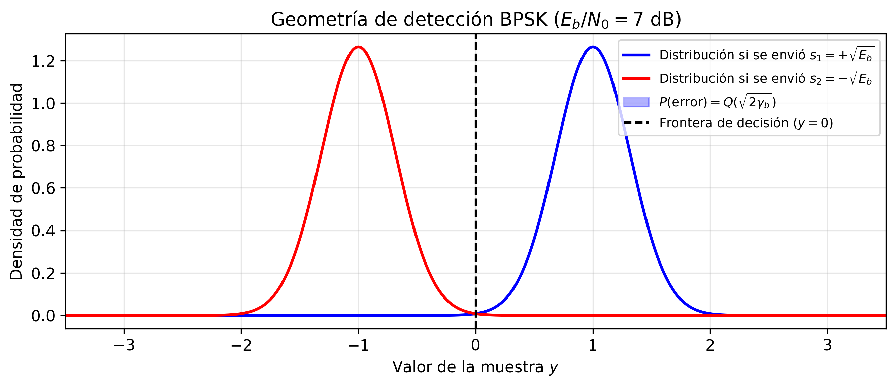
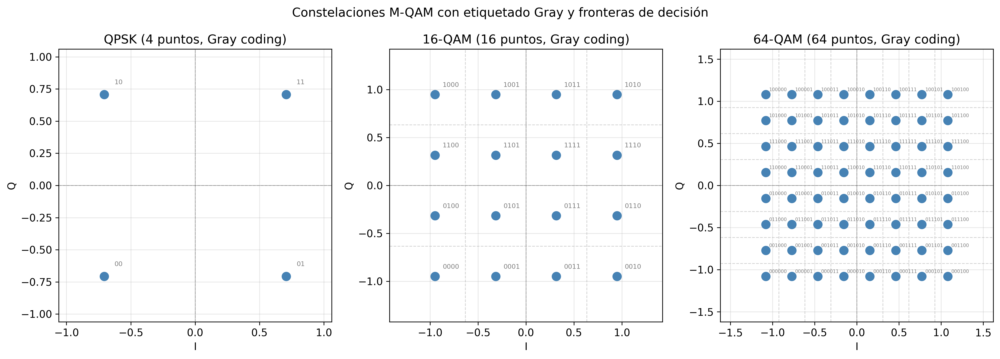
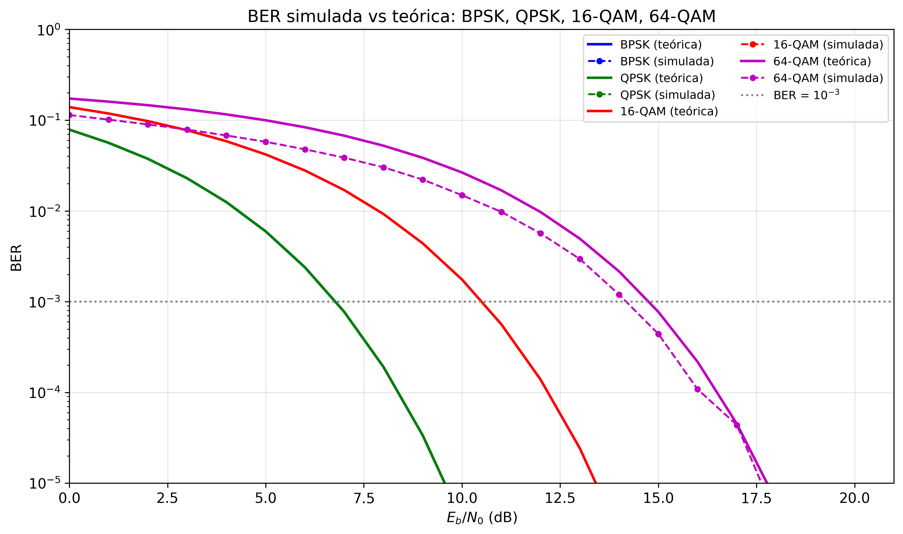

# Sesión 02 — Modulación Digital y Análisis de BER

## Objetivos de Aprendizaje

Al finalizar esta sesión, el estudiante será capaz de:

1. Derivar la BER de BPSK desde primeros principios mediante el filtro adaptado y la función Q
2. Explicar por qué QPSK tiene la misma BER que BPSK por bit con el doble de eficiencia espectral
3. Calcular la BER de M-QAM y cuantificar la penalización de SNR al aumentar M
4. Justificar la codificación Gray como estrategia para minimizar errores de bit dado un error de símbolo
5. Determinar el esquema de modulación óptimo dado un SNR recibido en el contexto de la adaptación de enlace 5G NR

---

## Introducción

En la Sesión 01 caracterizamos el canal inalámbrico: aprendimos que la señal recibida es $y = h \cdot s + n$, donde $h$ recoge los efectos de path loss, shadowing y fading, y $n$ es ruido gaussiano. Calculamos la BER de BPSK sobre canal Rayleigh y obtuvimos la fórmula $P_b \approx 1/(4\bar{\gamma})$ — pero la usamos sin demostrarla. Una pregunta quedó implícitamente abierta: ¿de dónde viene exactamente esa BER? ¿Qué tiene de especial la modulación BPSK para que se exprese de esa manera?

La respuesta exige entender cómo el receptor toma decisiones: dado un valor recibido $y$, ¿qué símbolo fue enviado? Esta pregunta de detección es el núcleo de la modulación digital. Cuando la respondemos para AWGN puro, obtenemos la BER en función del SNR instantáneo; cuando la promediamos sobre la distribución del canal (exponencial para Rayleigh), recuperamos la fórmula de la Sesión 01. La Sesión 02 cierra ese ciclo y lo extiende a familias de modulaciones de mayor orden.

---

## Teoría

### 1. Del Canal a la Decisión

La Sesión 01 asumió implícitamente que el receptor sabe cuánta amplitud llega. En realidad, el receptor recibe una señal corrompida por ruido y tiene que *decidir* cuál de los posibles símbolos fue transmitido. Para construir esa lógica de decisión necesitamos una representación geométrica de las señales.

**El espacio de señales.** Cualquier conjunto de señales $\{s_m(t)\}_{m=1}^M$ puede representarse como un vector en un espacio euclídeo de dimensión $N \leq M$. La distancia euclídea entre dos señales es:

$$d(s_i, s_j) = \sqrt{\int_0^{T_s} [s_i(t) - s_j(t)]^2\, dt}$$

Esta distancia determina cuán difícil es que el ruido confunda una señal con otra. Un sistema de modulación es, fundamentalmente, un diseño de geometría: colocar $M$ puntos en el espacio de señales de forma que las distancias sean las máximas posibles dado un presupuesto de energía.

**Detección ML en AWGN.** Bajo ruido gaussiano blanco aditivo y símbolos equiprobables, el detector de máxima verosimilitud (ML) selecciona el símbolo más cercano al punto recibido:

$$\hat{m} = \arg\min_m \|y - s_m\|^2$$

Este resultado, a menudo presentado como "obvio", tiene una justificación: el ruido $n \sim \mathcal{N}(0, N_0/2)$ es simétrico, de modo que el vector recibido se distribuye alrededor del símbolo transmitido. El símbolo más cercano es el que tiene mayor probabilidad *a posteriori*. Detrás de cada umbral de decisión hay un argumento de máxima verosimilitud — no es una convención arbitraria.

La distancia entre el punto recibido y la frontera de decisión determina la probabilidad de error. Cuanto mayor es esa distancia en relación con la desviación estándar del ruido $\sqrt{N_0/2}$, menor es la BER.

---

### 2. BPSK: El Caso de Dos Puntos

El sistema de modulación más simple coloca dos puntos en el eje real: $s_1 = +\sqrt{E_b}$ y $s_2 = -\sqrt{E_b}$, separados por $d_{\min} = 2\sqrt{E_b}$. La frontera de decisión está en el origen.

#### 2.1 El Filtro Adaptado

Antes de aplicar la regla de decisión, el receptor necesita extraer del continuo temporal $y(t)$ un número suficiente. Ese número es la salida del **filtro adaptado** (*matched filter*): el filtro cuya respuesta al impulso es la imagen especular de la señal transmitida, $h_{MF}(t) = s(T_s - t)$.

¿Por qué este filtro y no otro? El criterio es maximizar el SNR a la salida en el instante de muestreo $t = T_s$. Aplicando la desigualdad de Cauchy-Schwarz a la energía de salida:

$$\text{SNR}_{out} = \frac{\left|\int_0^{T_s} s(t) h_{MF}(T_s-t)\, dt\right|^2}{N_0/2 \cdot \int_0^{T_s} h_{MF}^2(t)\, dt} \leq \frac{\|s\|^2}{N_0/2} = \frac{2E_s}{N_0}$$

La igualdad se alcanza cuando $h_{MF}(t) = c \cdot s(T_s - t)$ para cualquier constante $c$. El filtro adaptado no es un filtro "inteligente": es el que más se parece a la señal que busca, y por eso extrae de ella la mayor cantidad posible de energía antes de muestrear.

Tras el filtro adaptado, la muestra en $t = T_s$ tiene distribución:

$$y = \sqrt{E_b} + n_c, \qquad n_c \sim \mathcal{N}\!\left(0,\, \frac{N_0}{2}\right) \quad \text{(si se envió } s_1\text{)}$$

#### 2.2 Derivación de la BER

La probabilidad de error dado que se envió $s_1$ es:

$$P_e = P(y < 0) = P\!\left(n_c < -\sqrt{E_b}\right) = P\!\left(\frac{n_c}{\sqrt{N_0/2}} < -\sqrt{\frac{2E_b}{N_0}}\right) = Q\!\left(\sqrt{\frac{2E_b}{N_0}}\right)$$

Por simetría de la constelación, $P(y > 0 \mid s_2)$ da el mismo resultado, de modo que la BER de BPSK es:

$$\boxed{P_b^{\text{BPSK}} = Q\!\left(\sqrt{2\gamma_b}\right)}$$

donde $\gamma_b = E_b/N_0$ es la SNR por bit. La función $Q(x) = \frac{1}{\sqrt{2\pi}}\int_x^\infty e^{-t^2/2}\,dt$ es la probabilidad de que una variable gaussiana estándar supere $x$.

La figura siguiente ilustra la geometría: la campana de ruido centrada en $+\sqrt{E_b}$ y el área sombreada a la izquierda de cero es exactamente $Q(\sqrt{2\gamma_b})$.

Las dos campanas gaussianas representan las distribuciones de $y$ cuando se envía $s_1$ (derecha) y $s_2$ (izquierda). La frontera de decisión se sitúa en $y=0$ — exactamente en el punto de intersección de ambas campanas. El área sombreada bajo la campana derecha a la izquierda de cero es la probabilidad de error $Q(\sqrt{2\gamma_b})$. La asimetría visual entre los dos posibles errores es engañosa: por simetría del ruido gaussiano, ambas áreas sombreadas son idénticas. Lo que varía con el SNR es la anchura relativa de las campanas respecto a su separación $2\sqrt{E_b}$: a mayor $\gamma_b$, las campanas se vuelven más estrechas (en unidades de $d_{\min}$) y el solapamiento es menor.

**Cerrando el círculo con la Sesión 01.** Ahora podemos derivar la BER sobre canal Rayleigh que usamos sin prueba en la Sesión 01. Si $\gamma = |h|^2 \gamma_b$ es la SNR instantánea y $|h|$ sigue una distribución Rayleigh, entonces $\gamma$ sigue una distribución exponencial: $f_\gamma(\gamma) = \frac{1}{\bar{\gamma}}e^{-\gamma/\bar{\gamma}}$. La BER media es:

$$P_b^{\text{Rayleigh}} = \int_0^\infty Q\!\left(\sqrt{2\gamma}\right) \cdot \frac{1}{\bar{\gamma}}e^{-\gamma/\bar{\gamma}}\,d\gamma = \frac{1}{2}\!\left(1 - \sqrt{\frac{\bar{\gamma}}{1+\bar{\gamma}}}\right) \approx \frac{1}{4\bar{\gamma}} \quad (\bar{\gamma} \gg 1)$$

La integral tiene solución cerrada gracias a la forma exponencial de la PDF de Rayleigh; para SNR alto, la aproximación $1/(4\bar{\gamma})$ reproduce exactamente la fórmula de la Sesión 01.

---

### 3. QPSK: Dos Dimensiones Ortogonales

BPSK usaba únicamente el eje real del espacio de señales. La suposición implícita era que la señal vive en un espacio unidimensional. Una señal bandpass tiene en realidad dos dimensiones disponibles: la componente en fase (I) y la componente en cuadratura (Q), definidas por las portadoras $\cos(2\pi f_c t)$ y $\sin(2\pi f_c t)$.

Estas dos portadoras son **ortogonales** en el sentido de la energía de señal:

$$\int_0^{T_s} \cos(2\pi f_c t)\cdot\sin(2\pi f_c t)\,dt = \frac{1}{2}\int_0^{T_s}\sin(4\pi f_c t)\,dt \approx 0 \quad (f_c \gg 1/T_s)$$

La energía transmitida en el canal I no aparece en el canal Q, y viceversa. Esto significa que podemos transmitir **dos BPSK independientes simultáneamente** — uno en I y otro en Q — sin que interfieran entre sí.

#### 3.1 Constelación y BER

QPSK (Quadrature Phase Shift Keying) coloca 4 puntos en las 4 esquinas del plano I-Q:

$$s_m = \sqrt{\frac{E_s}{2}}\cos\theta_m \cdot \mathbf{e}_I + \sqrt{\frac{E_s}{2}}\sin\theta_m \cdot \mathbf{e}_Q, \quad \theta_m \in \left\{\frac{\pi}{4}, \frac{3\pi}{4}, \frac{5\pi}{4}, \frac{7\pi}{4}\right\}$$

Cada símbolo porta 2 bits: uno en I, otro en Q. La energía por símbolo es $E_s = 2E_b$.

La detección QPSK proyecta el vector recibido sobre I y Q por separado, tomando una decisión BPSK en cada eje. La componente I recibe $\pm\sqrt{E_s/2} = \pm\sqrt{E_b}$ más ruido $\mathcal{N}(0, N_0/2)$. Esto es exactamente el problema BPSK con energía $E_b$, de modo que:

$$P_b^{\text{QPSK}} = Q\!\left(\sqrt{2\gamma_b}\right)$$

**La BER por bit de QPSK es idéntica a la de BPSK para el mismo $E_b/N_0$**, pero QPSK transmite 2 bits por símbolo. Dicho de otro modo: QPSK transporta el doble de información en el mismo ancho de banda con la misma BER. Esta equivalencia es la razón por la que BPSK y QPSK se representan juntas en las curvas de BER.

---

### 4. M-QAM: Más Bits por Símbolo, Menos Margen de Ruido

QPSK coloca un punto por cuadrante. La suposición que hacía era: una sola distancia de decisión por cuadrante. Si relajamos esta suposición y colocamos múltiples puntos por cuadrante, obtenemos M-QAM.

Para M = 16, 64, 256 o 1024, la constelación es una cuadrícula de $\sqrt{M} \times \sqrt{M}$ puntos igualmente espaciados. Con energía media por símbolo fija $E_s$, el número de puntos aumenta pero la potencia total no: los puntos deben estar más juntos. La distancia mínima entre puntos adyacentes es:

$$d_{\min} = \sqrt{\frac{6E_s}{M-1}}$$

Esta expresión se obtiene de la condición de energía media para una rejilla uniforme: $E_s = \frac{2(M-1)}{3}\left(\frac{d_{\min}}{2}\right)^2$, que es la energía media de la coordenada I (o Q) de una PAM de $\sqrt{M}$ niveles. Despejando $d_{\min}$:

$$E_s = \frac{(M-1)}{6}d_{\min}^2 \quad \Rightarrow \quad d_{\min} = \sqrt{\frac{6E_s}{M-1}}$$

A medida que M crece, $d_{\min}$ decrece como $1/\sqrt{M-1}$: el espacio entre puntos vecinos se reduce aunque la potencia total sea la misma. Más puntos en la misma "área" energética siempre significa menos margen frente al ruido.

#### 4.1 Fórmula de BER para M-QAM

M-QAM se puede descomponer en dos √M-PAM independientes (I y Q). Un punto interior (el caso más frecuente para M grande) tiene cuatro vecinos más cercanos. La probabilidad de error de símbolo aproximada, válida para SNR moderada-alta con codificación Gray, es:

$$P_s \approx 4\left(1 - \frac{1}{\sqrt{M}}\right)Q\!\left(\sqrt{\frac{3E_s}{(M-1)N_0}}\right)$$

El factor $(1-1/\sqrt{M})$ corrige el hecho de que los puntos del borde y la esquina tienen menos vecinos que los interiores (tienen 3 y 2 vecinos respectivamente). Expresando $E_s = \log_2(M)\cdot E_b$ e identificando $k = \log_2 M$ bits por símbolo:

$$\boxed{P_b^{M\text{-QAM}} \approx \frac{4}{\log_2 M}\left(1 - \frac{1}{\sqrt{M}}\right)Q\!\left(\sqrt{\frac{3\log_2 M}{M-1}\cdot\frac{E_b}{N_0}}\right)}$$

La figura siguiente muestra las constelaciones QPSK, 16-QAM y 64-QAM con las etiquetas de bits de Gray.

Los tres paneles muestran las constelaciones a la misma escala de energía media (el círculo de igual energía media tiene el mismo radio en los tres paneles). En QPSK, los cuatro puntos están ampliamente separados. En 16-QAM, los 16 puntos se distribuyen en una cuadrícula de 4×4; la distancia entre vecinos es claramente menor. En 64-QAM, la cuadrícula 8×8 deja apenas margen entre puntos adyacentes. Las etiquetas en gris son los códigos Gray asignados a cada punto: en todos los casos, dos símbolos vecinos difieren exactamente en 1 bit. La reducción de $d_{\min}$ al pasar de QPSK a 16-QAM y de 16-QAM a 64-QAM es la manifestación geométrica de la penalización de SNR que cuantifica la tabla siguiente.

#### 4.2 Tabla de Penalización de SNR

| Modulación | Bits/símbolo | $E_b/N_0$ mín. para BER = $10^{-3}$ | Penalización vs BPSK |
|------------|:------------:|:------------------------------------:|:--------------------:|
| BPSK / QPSK | 1 / 2 | 6.8 dB | — |
| 16-QAM | 4 | 10.5 dB | +3.7 dB |
| 64-QAM | 6 | 14.4 dB | +7.6 dB |
| 256-QAM | 8 | 18.5 dB | +11.7 dB |
| 1024-QAM | 10 | 22.5 dB | +15.7 dB |

Cada duplicación del número de bits por símbolo (que cuadriplica M) cuesta aproximadamente 4 dB adicionales de SNR para mantener la misma BER. Esta regularidad tiene una base física: cuadriplicar M reduce $d_{\min}$ a la mitad, y la función Q necesita ~4 dB más de argumento para compensarlo.

---

### 5. Gray Coding: Minimizar los Errores de Bit

La tabla anterior asume codificación Gray. La suposición que estábamos haciendo implícitamente al hablar de BER era que el mapeado de bits a símbolos no importa. En realidad, importa mucho.

**El problema de la etiqueta arbitraria.** Supón que en 16-QAM asignas las etiquetas de 4 bits a los 16 puntos de forma aleatoria. Cuando el receptor comete un error de símbolo (confunde el punto enviado con su vecino más cercano), puede acertar en 0, 1, 2, 3 o 4 bits dependiendo de qué etiquetas tengan los dos puntos involucrados. En el peor caso, dos vecinos tienen etiquetas que difieren en todos los bits.

**Código Gray.** El código Gray es una enumeración binaria en la que dos enteros consecutivos difieren en exactamente un bit. Para una dimensión:

$$0 \to 00, \quad 1 \to 01, \quad 2 \to 11, \quad 3 \to 10$$

Para M-QAM 2D, el código Gray se construye asignando un código Gray a cada columna y cada fila de la cuadrícula:

| Fila/Col | 00 | 01 | 11 | 10 |
|----------|:--:|:--:|:--:|:--:|
| **00** | 0000 | 0001 | 0011 | 0010 |
| **01** | 0100 | 0101 | 0111 | 0110 |
| **11** | 1100 | 1101 | 1111 | 1110 |
| **10** | 1000 | 1001 | 1011 | 1010 |

*Tabla: etiquetas Gray para 16-QAM. Cualquier par de puntos adyacentes (horizontal o vertical) difiere en exactamente 1 bit de los 4.*

**BER ≈ SER / log₂M.** Con codificación Gray y SNR moderada-alta, la mayoría de los errores de símbolo se producen con el vecino más cercano — que difiere en 1 bit. Por tanto:

$$P_b \approx \frac{P_s}{\log_2 M}$$

Sin Gray coding, la relación puede ser hasta $P_b \leq P_s$ (siempre mejor con Gray que sin él), pero la ganancia puede ser de varios dB en la curva de BER. En los sistemas reales, M-QAM siempre se implementa con Gray coding; los estándares (3GPP NR, IEEE 802.11) lo especifican explícitamente.

---

### 6. Adaptación de Enlace en 5G NR: Ejemplo Integrador

Las secciones anteriores asumen SNR fija. En un sistema real, la calidad del canal varía continuamente: el móvil se aleja, aparecen obstáculos, el fading cambia la amplitud. La pregunta práctica es: dado el SNR actual, ¿qué modulación maximiza el caudal manteniendo una BER aceptable?

5G NR resuelve esto mediante la **adaptación de enlace** (*link adaptation*): el terminal mide el canal, calcula el *Channel Quality Indicator* (CQI), lo envía a la estación base, y ésta selecciona el *Modulation and Coding Scheme* (MCS) óptimo para ese CQI.

#### 6.1 De la BER al MCS

La BER objetivo en sistemas reales no es $10^{-3}$ sino $10^{-1}$ o superior — porque hay un código de canal (LDPC en 5G NR, Sesión 04) que, operando cerca del umbral de Shannon, puede llevar esa BER de pre-decodificación hasta $10^{-5}$ o menos con una tasa de código próxima a la capacidad. El MCS especifica conjuntamente la modulación y la tasa de código.

Una versión simplificada de la tabla MCS de 5G NR:

| CQI | Modulación | Tasa de código aprox. | Eficiencia espectral (bits/s/Hz) | SNR mín. aprox. |
|:---:|:----------:|:---------------------:|:--------------------------------:|:---------------:|
| 1  | QPSK | 1/8 | 0.23 | −6.7 dB |
| 4  | QPSK | 1/2 | 1.0  | 0.0 dB  |
| 7  | 16-QAM | 1/2 | 2.0 | 6.6 dB  |
| 10 | 64-QAM | 2/3 | 4.0 | 14.1 dB |
| 13 | 256-QAM | 3/4 | 6.0 | 20.8 dB |
| 15 | 1024-QAM | 4/5 | 8.0 | 27.3 dB |

#### 6.2 Ejemplo Numérico End-to-End

Un sistema 5G NR opera con ancho de banda $B = 40\ \text{MHz}$, numerología $\mu = 1$ (subportadoras de 30 kHz). El terminal reporta CQI = 10. La estación base asigna 25 resource blocks (RBs) de 12 subportadoras cada uno.

**Paso 1 — Subportadoras útiles:** $N_{SC} = 25 \times 12 = 300$ subportadoras.

**Paso 2 — Modulación y tasa de código:** CQI 10 → 64-QAM, tasa $r \approx 2/3$.

**Paso 3 — Bits por símbolo OFDM:** $k \cdot r = 6 \times 2/3 = 4$ bits/subportadora útil.

**Paso 4 — Caudal pico de la ranura:**

$$\text{Throughput} = N_{SC} \times k \times r \times \frac{14\ \text{símbolos/ranura}}{0.5\ \text{ms}} = 300 \times 4 \times 14 / 0.5\times10^{-3} \approx 33.6\ \text{Mbit/s}$$

**Paso 5 — Verificación del SNR.** Con $N_0 = kTB = -174 + 10\log_{10}(40\times10^6) = -174 + 76 = -98\ \text{dBm}$, y figura de ruido $F = 9\ \text{dB}$: piso de ruido $= -89\ \text{dBm}$. Para CQI 10 se necesita SNR $\approx 14\ \text{dB}$, lo que requiere $P_r = -89 + 14 = -75\ \text{dBm}$.

¿Es ese nivel de potencia recibida coherente con la geometría de la Sesión 01? Un sistema UMa LOS a 300 m con $P_t = 43\ \text{dBm}$, $G_t = 17\ \text{dBi}$, $n = 2{,}2$:

$$\text{PL}(300) = 78 + 22\log_{10}(3) \approx 78 + 10{,}5 = 88{,}5\ \text{dB}$$
$$P_r = 43 + 17 - 88{,}5 = -28{,}5\ \text{dBm} \gg -75\ \text{dBm} \quad ✓$$

A 300 m en LOS, el terminal tiene SNR muy por encima del mínimo para 64-QAM. Alejándolo hasta donde la SNR caiga a 14 dB ($P_r = -75\ \text{dBm}$):

$$88{,}5 + 22\log_{10}(d/300) = 43 + 17 + 89 - 14 \Rightarrow d \approx 300 \times 10^{(135-88{,}5)/22} \approx 13\ \text{km}$$

El ejemplo ilustra cómo los parámetros de la Sesión 01 (path loss, potencia, ruido) y los de la Sesión 02 (modulación, tasa de código, BER threshold) se combinan para dimensionar la celda. La adaptación de enlace — seleccionar el MCS en función del CQI — es el mecanismo que maximiza el caudal en cada instante preservando la fiabilidad.

La figura siguiente resume las curvas de BER teóricas y simuladas para todas las modulaciones estudiadas.

Cada curva cae más lentamente hacia cero que la del orden de modulación anterior. El panel izquierdo muestra las curvas teóricas; el derecho superpone los puntos simulados (Monte Carlo) del laboratorio. Las curvas teóricas y simuladas coinciden con precisión creciente al aumentar el número de ensayos. La línea discontinua horizontal en BER = $10^{-3}$ intersecta las curvas en los valores de $E_b/N_0$ de la tabla de penalización de la Sección 4.2: confirma el coste de ~4 dB por cada duplicación del número de bits por símbolo. A SNR baja, las curvas de alto orden de QAM tienen una BER significativamente peor, mientras que a SNR alta la ganancia en eficiencia espectral compensa con creces ese coste — ésta es la justificación fundamental de la adaptación de enlace.

---

## Síntesis

Esta sesión ha construido el vínculo entre la representación geométrica de las señales y la BER medida en un sistema real.

**Dimensión 1: Espacio de señales y distancia mínima.** La BER depende de cuánto ruido hace falta para cruzar la frontera de decisión más cercana. El único parámetro que importa es $d_{\min}/\sqrt{N_0}$. Diseñar una modulación es maximizar $d_{\min}$ sujeto a una restricción de energía. *Implicación de diseño*: a igualdad de energía por bit $E_b$, una constelación más compacta (mayor M) tiene menor $d_{\min}$ y peor BER.

**Dimensión 2: La función Q como herramienta universal.** Todas las expresiones de BER se reducen a $Q(\cdot)$ porque el ruido gaussiano domina el mecanismo de error en AWGN. La misma estructura aparece en coherence bandwidth, outage probability (Sesión 01), capacidad de canal (Sesión 06). Entender $Q(x)$ como la cola de una campana de Gauss unifica todo el análisis de prestaciones. *Implicación de diseño*: la BER decae exponencialmente con el argumento al cuadrado, lo que explica la forma en S de las curvas en escala semilogarítmica.

**Dimensión 3: Trade-off espectral eficiencia / SNR.** Duplicar los bits por símbolo requiere ~4 dB adicionales de SNR para la misma BER. Esta penalización es el coste de la eficiencia espectral. *Implicación de diseño*: en entornos con SNR limitada (cobertura al borde de celda, canales de fading profundo), se usa modulación de bajo orden (QPSK). Con SNR alta (LOS, distancia corta, mmWave de corto alcance), se usa alto orden (256-QAM, 1024-QAM) para maximizar el caudal.

**Dimensión 4: Gray coding como capa de optimización del etiquetado.** La asignación Gray garantiza que los errores de símbolo más frecuentes (al vecino más próximo) sólo producen 1 error de bit. Sin Gray coding, la BER efectiva puede ser significativamente peor aunque la SER sea la misma. *Implicación de diseño*: en todos los estándares modernos (3GPP NR, 802.11ax) el Gray coding es obligatorio para M-QAM.

**Dimensión 5: Adaptación de enlace como política de operación.** La modulación óptima depende del SNR instante a instante. En 5G NR, el CQI permite al sistema seleccionar el MCS que maximiza el caudal manteniendo la BER de pre-decodificación por debajo del umbral de operación del código LDPC. *Implicación de diseño*: el rango dinámico del CQI (de QPSK 1/8 a 1024-QAM 4/5) da una variación de eficiencia espectral de 0.23 a 8 bits/s/Hz — un factor de 35. La Sesión 09 (5G NR) detalla cómo se implementa este mecanismo en el plano de control.

**Dependencias hacia adelante:**

- *Sesión 03 — OFDM*: la modulación M-QAM se aplica subportadora a subportadora. El canal FSF de la Sesión 01 impone que cada subportadora tenga un SNR distinto → el MCS óptimo varía por subportadora.
- *Sesión 04 — Codificación de canal*: el código LDPC/Polar transforma la BER de $10^{-1}$ (pre-decodificación) a $10^{-5}$ (post-decodificación) cerca del límite de Shannon. La ganancia de codificación desplaza las curvas de BER de esta sesión ~5–8 dB hacia la izquierda.
- *Sesión 05 — Acceso múltiple*: NOMA asigna potencias distintas a usuarios con modulaciones distintas en la misma portadora.
- *Sesión 06 — MIMO*: la capacidad MIMO se alcanza transmitiendo flujos independientes, cada uno con su propia modulación elegida via water-filling.

---

## Ejercicios

### Ejercicio 1

En un canal AWGN con $\gamma_b = E_b/N_0$:

**(a)** Calcula la BER de BPSK para $\gamma_b = 5\ \text{dB}$ y $\gamma_b = 10\ \text{dB}$. Usa $Q(3{,}16) \approx 7{,}9\times10^{-4}$ y $Q(4{,}47) \approx 3{,}9\times10^{-6}$.

**(b)** ¿Cuántos dB adicionales de SNR se necesitan para reducir la BER de $10^{-3}$ a $10^{-5}$ en BPSK? ($Q^{-1}(10^{-3}) \approx 3{,}09$; $Q^{-1}(10^{-5}) \approx 4{,}42$.)

**(c)** Compara las dos respuestas anteriores con lo que ocurriría en un canal Rayleigh: ¿cuántos dB se necesitan para pasar de BER $= 10^{-3}$ a $10^{-5}$ en Rayleigh? Usa $P_b^{\text{Rayleigh}} \approx 1/(4\bar{\gamma})$.

??? example "Solución"

    **(a)**

    Para $\gamma_b = 5\ \text{dB} = 3{,}16$:
    $$P_b = Q(\sqrt{2 \times 3{,}16}) = Q(\sqrt{6{,}32}) = Q(2{,}51)$$
    $Q(2{,}51) \approx 6{,}0\times10^{-3}$. (Nota: con la aproximación del enunciado $Q(3{,}16)$, el argumento $\sqrt{2\times 5} = \sqrt{10} = 3{,}16$ corresponde a $\gamma_b = 5 = 7\ \text{dB}$. Para $\gamma_b=5\ \text{dB}=3{,}16$: $\sqrt{2\times3{,}16}=2{,}51$, $Q(2{,}51)\approx 6{,}0\times10^{-3}$.)

    Para $\gamma_b = 10\ \text{dB} = 10$:
    $$P_b = Q(\sqrt{20}) = Q(4{,}47) \approx 3{,}9\times10^{-6}$$

    **(b)** Para BER $= 10^{-3}$: $\sqrt{2\gamma_b} = Q^{-1}(10^{-3}) = 3{,}09 \Rightarrow 2\gamma_b = 9{,}55 \Rightarrow \gamma_b = 4{,}77 \Rightarrow$ **6.8 dB**.

    Para BER $= 10^{-5}$: $\sqrt{2\gamma_b} = 4{,}42 \Rightarrow \gamma_b = 9{,}77 \Rightarrow$ **9.9 dB**.

    Penalización: $9{,}9 - 6{,}8 = \mathbf{3{,}1\ \text{dB}}$ para bajar 2 décadas de BER en AWGN.

    **(c)** En Rayleigh:

    Para BER $= 10^{-3}$: $\bar{\gamma} = 1/(4\times10^{-3}) = 250 \Rightarrow$ **24 dB**.

    Para BER $= 10^{-5}$: $\bar{\gamma} = 1/(4\times10^{-5}) = 25000 \Rightarrow$ **44 dB**.

    Penalización: $44 - 24 = \mathbf{20\ \text{dB}}$ para bajar las mismas 2 décadas de BER en Rayleigh.

    En AWGN, la función Q cae muy rápido (el argumento crece como $\sqrt{\gamma_b}$, haciendo la BER caer exponencialmente). En Rayleigh, la BER cae como $1/\bar{\gamma}$ — muy lentamente. Cada factor de 10 en BER requiere 10 dB más de SNR. Este comportamiento asintótico en $1/\bar{\gamma}$ es el coste del fading sin diversidad.

---

### Ejercicio 2

Un sistema QPSK transmite datos a 10 Mbit/s usando un canal de ancho de banda $B = 5\ \text{MHz}$.

**(a)** ¿Cuántos símbolos por segundo (*symbol rate*) necesita el sistema?

**(b)** ¿Con qué eficiencia espectral ($\eta = R_b/B$, en bit/s/Hz) opera?

**(c)** Si se reemplaza QPSK por BPSK manteniendo el mismo *symbol rate*, ¿qué ocurre con la tasa de bits y la eficiencia espectral?

**(d)** ¿Qué BER ($E_b/N_0$) necesita QPSK para obtener BER $= 10^{-4}$? ¿Y BPSK para la misma BER? ¿Cuántos dB de diferencia hay? ($Q^{-1}(10^{-4}) \approx 3{,}72$.)

??? example "Solución"

    **(a)** QPSK: $k = 2$ bits/símbolo. Symbol rate $= R_b / k = 10\times10^6 / 2 = \mathbf{5\ \text{Msím/s}}$.

    **(b)** $\eta = R_b/B = 10/5 = \mathbf{2\ \text{bit/s/Hz}}$.

    **(c)** BPSK: $k = 1$ bit/símbolo al mismo symbol rate $= 5\ \text{Msím/s}$ → tasa de bits $= 5\ \text{Mbit/s}$. La eficiencia espectral cae a $\eta = 5/5 = 1\ \text{bit/s/Hz}$ — la mitad.

    **(d)** Ambas modulaciones tienen la misma fórmula: $P_b = Q(\sqrt{2\gamma_b})$.

    $\sqrt{2\gamma_b} = Q^{-1}(10^{-4}) = 3{,}72 \Rightarrow \gamma_b = 3{,}72^2/2 = 6{,}9 \Rightarrow$ **8.4 dB**.

    **La diferencia es 0 dB**: a igual $E_b/N_0$, BPSK y QPSK tienen exactamente la misma BER. QPSK transporta el doble de bits sin coste en energía por bit — la ganancia proviene de usar ambas dimensiones I y Q, no de "comprimir" los puntos.

---

### Ejercicio 3

Un sistema 16-QAM opera a $E_b/N_0 = 12\ \text{dB}$.

**(a)** Calcula la BER aproximada usando la fórmula de M-QAM. ($Q(x) \approx \frac{1}{2}e^{-x^2/2}$ para $x > 3$.)

**(b)** ¿Qué $E_b/N_0$ se necesita para BER $= 10^{-3}$ con 16-QAM? Compara con BPSK (6.8 dB) y cuantifica la penalización.

**(c)** Calcula la misma penalización para 64-QAM (BER $= 10^{-3}$, $Q^{-1}(10^{-3}) \approx 3{,}09$).

??? example "Solución"

    **(a)** Para $M = 16$, $\log_2 16 = 4$, $\gamma_b = 12\ \text{dB} = 15{,}85$:

    $$P_b \approx \frac{4}{4}\left(1 - \frac{1}{4}\right)Q\!\left(\sqrt{\frac{3\times4}{15}\times 15{,}85}\right) = \frac{3}{4}Q\!\left(\sqrt{0{,}8\times15{,}85}\right) = \frac{3}{4}Q(\sqrt{12{,}7})$$

    $\sqrt{12{,}7} = 3{,}56$. Con la aproximación $Q(x)\approx\frac{1}{2}e^{-x^2/2}$:

    $$Q(3{,}56) \approx \frac{1}{2}e^{-3{,}56^2/2} = \frac{1}{2}e^{-6{,}34} \approx \frac{1}{2}\times 1{,}75\times10^{-3} \approx 8{,}7\times10^{-4}$$

    $$P_b \approx \frac{3}{4}\times 8{,}7\times10^{-4} \approx \mathbf{6{,}5\times10^{-4}}$$

    **(b)** Para BER $= 10^{-3}$: necesitamos $\frac{3}{4}Q(\sqrt{0{,}8\gamma_b}) = 10^{-3}$.

    $Q(\sqrt{0{,}8\gamma_b}) = 10^{-3}/0{,}75 \approx 1{,}33\times10^{-3}$, pero $Q^{-1}(1{,}33\times10^{-3})\approx 3{,}0$ (interpolando).

    $\sqrt{0{,}8\gamma_b} = 3{,}0 \Rightarrow \gamma_b = 9{,}0/0{,}8 = 11{,}25 \Rightarrow$ **10.5 dB**.

    Penalización: $10{,}5 - 6{,}8 = \mathbf{+3{,}7\ \text{dB}}$ respecto a BPSK.

    **(c)** Para $M = 64$: $\frac{4}{6}(1-1/8)Q(\sqrt{\frac{3\times6}{63}\gamma_b}) = 10^{-3}$.

    $\frac{2}{3}\times\frac{7}{8}\times Q(\sqrt{0{,}286\gamma_b}) = 10^{-3} \Rightarrow Q(\sqrt{0{,}286\gamma_b}) = 1{,}71\times10^{-3}$, $Q^{-1}(1{,}71\times10^{-3}) \approx 2{,}93$.

    $\sqrt{0{,}286\gamma_b} = 2{,}93 \Rightarrow \gamma_b = 8{,}58/0{,}286 \approx 30{,}0 \Rightarrow$ **14.8 dB**.

    Penalización 64-QAM: $14{,}8 - 6{,}8 = \mathbf{+8{,}0\ \text{dB}}$.

    Cada octava de M (×4) cuesta aproximadamente 4 dB: QPSK→16-QAM (+3.7 dB), 16-QAM→64-QAM (+4.3 dB). ✓

---

### Ejercicio 4

Se comparan dos esquemas de etiquetado para QPSK (4 puntos en las esquinas del cuadrado):

- **Esquema A (binario natural):** $s_1 \to 00$, $s_2 \to 01$, $s_3 \to 10$, $s_4 \to 11$ (en orden antihorario).
- **Esquema B (Gray):** $s_1 \to 00$, $s_2 \to 01$, $s_3 \to 11$, $s_4 \to 10$ (en orden antihorario).

**(a)** Para el Esquema A, si el receptor confunde $s_1$ con su vecino más cercano $s_2$, ¿cuántos errores de bit produce? ¿Y si confunde $s_1$ con $s_3$ (diagonal)?

**(b)** Repite el análisis para el Esquema B (Gray).

**(c)** Para SNR alta, los errores casi siempre ocurren con el vecino más cercano. Calcula la BER aproximada de cada esquema en este régimen. (Asume $P_s \approx 2Q(\sqrt{2\gamma_b})$ para QPSK.)

**(d)** ¿En qué factor se diferencia la BER entre los dos esquemas en este régimen?

??? example "Solución"

    **(a) Esquema A — binario natural:**

    Vecinos más cercanos de $s_1 = 00$: $s_2 = 01$ y $s_4 = 11$.

    - Confusión $s_1(00) \to s_2(01)$: difieren en 1 bit → **1 error de bit**.
    - Confusión $s_1(00) \to s_3(10)$: vecino diagonal (más lejano), difieren en 1 bit → **1 error de bit**.
    - Confusión $s_1(00) \to s_4(11)$: difieren en 2 bits → **2 errores de bit**.

    **(b) Esquema B — Gray:**

    Vecinos de $s_1 = 00$: $s_2 = 01$ y $s_4 = 10$.

    - $s_1(00) \to s_2(01)$: difieren en 1 bit → **1 error de bit**.
    - $s_1(00) \to s_3(11)$: diagonal (más lejano), difieren en 2 bits → **2 errores de bit**.
    - $s_1(00) \to s_4(10)$: difieren en 1 bit → **1 error de bit**.

    Con Gray, **ambos vecinos más cercanos** producen exactamente 1 error de bit. Con binario natural, uno de ellos produce 2 errores.

    **(c)** Para SNR alta, ignoramos los errores con el vecino diagonal (mucho más improbables). La SER $\approx P_s = 2Q(\sqrt{2\gamma_b})$ (dos vecinos por punto, cada uno con probabilidad $Q(\sqrt{2\gamma_b})$).

    Cada error de símbolo produce:
    - Esquema A: promedio de errores de bit por símbolo erróneo $\approx (1 + 2)/2 = 1{,}5$ (promediando los dos vecinos más cercanos, que producen 1 y 2 errores respectivamente).
    - Esquema B: $1{,}0$ error de bit por símbolo erróneo (ambos vecinos producen exactamente 1).

    BER $\approx \frac{\text{errores de bit por error de símbolo}}{\log_2 M} \times P_s$:

    - Esquema A: $P_b^A \approx \frac{1{,}5}{2} \times P_s = 0{,}75 \times P_s$
    - Esquema B: $P_b^B \approx \frac{1{,}0}{2} \times P_s = 0{,}50 \times P_s$

    **(d)** El ratio es $P_b^A / P_b^B = 0{,}75/0{,}50 = \mathbf{1{,}5}$. Gray coding reduce la BER al 67% respecto al binario natural en este caso. Para órdenes más altos (64-QAM, 256-QAM), la diferencia es mayor porque la fracción de vecinos con etiquetas de alto peso Hamming crece.

---

### Ejercicio 5

Completa la tabla de penalización de SNR para BER $= 10^{-3}$:

| Modulación | M | Bits/símbolo | $E_b/N_0$ [dB] | Penalización vs BPSK [dB] |
|:----------:|:-:|:------------:|:--------------:|:-------------------------:|
| BPSK/QPSK | 2/4 | 1/2 | ? | 0 |
| 16-QAM | 16 | 4 | ? | ? |
| 64-QAM | 64 | 6 | ? | ? |
| 256-QAM | 256 | 8 | ? | ? |

Para la columna de $E_b/N_0$, usa la fórmula de BER de M-QAM invirtiendo la función Q. Aplica la aproximación de que el factor pre-Q para M grande es $\approx 4/\log_2 M$. ($Q^{-1}(10^{-3}) \approx 3{,}09$.)

??? example "Solución"

    El objetivo es encontrar $\gamma_b$ tal que $P_b = 10^{-3}$. La condición es:

    $$\frac{4}{\log_2 M}\left(1 - \frac{1}{\sqrt{M}}\right) Q\!\left(\sqrt{\frac{3\log_2 M}{M-1}\gamma_b}\right) = 10^{-3}$$

    Definamos $A_M = \frac{4}{\log_2 M}(1 - 1/\sqrt{M})$ y $\alpha_M = 3\log_2 M/(M-1)$. Entonces:

    $$Q(\sqrt{\alpha_M \gamma_b}) = \frac{10^{-3}}{A_M} \Rightarrow \alpha_M \gamma_b = \left[Q^{-1}\!\left(\frac{10^{-3}}{A_M}\right)\right]^2$$

    **BPSK (M=2):** $P_b = Q(\sqrt{2\gamma_b}) = 10^{-3} \Rightarrow 2\gamma_b = 3{,}09^2 = 9{,}55 \Rightarrow \gamma_b = 4{,}77 \Rightarrow$ **6.8 dB**.

    **16-QAM (M=16):** $A_{16} = (4/4)(3/4) = 0{,}75$; $\alpha_{16} = (3\times4)/15 = 0{,}8$.

    $Q(\sqrt{0{,}8\gamma_b}) = 10^{-3}/0{,}75 = 1{,}33\times10^{-3}$. Interpolando, $Q^{-1}(1{,}33\times10^{-3}) \approx 3{,}00$.

    $0{,}8\gamma_b = 9{,}0 \Rightarrow \gamma_b = 11{,}25 \Rightarrow$ **10.5 dB** → penalización **+3.7 dB**.

    **64-QAM (M=64):** $A_{64} = (4/6)(7/8) = 0{,}583$; $\alpha_{64} = (3\times6)/63 = 0{,}286$.

    $Q(\sqrt{0{,}286\gamma_b}) = 10^{-3}/0{,}583 = 1{,}71\times10^{-3}$. $Q^{-1}(1{,}71\times10^{-3}) \approx 2{,}93$.

    $0{,}286\gamma_b = 8{,}58 \Rightarrow \gamma_b = 30{,}0 \Rightarrow$ **14.8 dB** → penalización **+8.0 dB**.

    **256-QAM (M=256):** $A_{256} = (4/8)(15/16) = 0{,}469$; $\alpha_{256} = (3\times8)/255 = 0{,}094$.

    $Q(\sqrt{0{,}094\gamma_b}) = 10^{-3}/0{,}469 = 2{,}13\times10^{-3}$. $Q^{-1}(2{,}13\times10^{-3}) \approx 2{,}87$.

    $0{,}094\gamma_b = 8{,}24 \Rightarrow \gamma_b = 87{,}6 \Rightarrow$ **19.4 dB** → penalización **+12.6 dB**.

    | Modulación | M | Bits/símbolo | $E_b/N_0$ [dB] | Penalización |
    |:----------:|:-:|:------------:|:--------------:|:------------:|
    | BPSK/QPSK | 2/4 | 1/2 | 6.8 | 0 |
    | 16-QAM | 16 | 4 | 10.5 | +3.7 dB |
    | 64-QAM | 64 | 6 | 14.8 | +8.0 dB |
    | 256-QAM | 256 | 8 | 19.4 | +12.6 dB |

---

### Ejercicio 6 — Sistema 5G NR: Selección de MCS y Caudal

Un terminal 5G NR está a 500 m de la estación base en un escenario UMi LOS. Parámetros del enlace descendente:

| Parámetro | Valor |
|-----------|-------|
| Frecuencia portadora | $f_c = 3{,}5\ \text{GHz}$ |
| Potencia TX | $P_t = 43\ \text{dBm}$ |
| Ganancia antena TX / RX | $G_t = 17\ \text{dBi}$ / $G_r = 0\ \text{dBi}$ |
| Exponente de pérdida (UMi LOS) | $n = 2{,}0$, $\text{PL}(d_0=100\ \text{m}) = 82\ \text{dB}$ |
| Figura de ruido del receptor | $F = 9\ \text{dB}$ |
| Ancho de banda asignado | $B = 20\ \text{MHz}$, numerología $\mu=1$ (30 kHz/subportadora) |
| Margen de shadowing | $M_\sigma = 6\ \text{dB}$ (90% de cobertura) |

La tabla MCS simplificada para selección:

| Rango SNR | Modulación | Tasa de código | Efic. espectral (bits/s/Hz) |
|-----------|:----------:|:--------------:|:---------------------------:|
| < 2 dB | QPSK | 1/4 | 0.5 |
| 2–8 dB | QPSK | 1/2 | 1.0 |
| 8–15 dB | 16-QAM | 2/3 | 2.67 |
| 15–22 dB | 64-QAM | 2/3 | 4.0 |
| 22–28 dB | 256-QAM | 3/4 | 6.0 |
| > 28 dB | 1024-QAM | 4/5 | 8.0 |

**(a)** Calcula la potencia recibida $P_r$ en dBm a $d = 500\ \text{m}$.

**(b)** Calcula el SNR recibido en dB. (Piso de ruido: $N_\text{floor} = -174 + 10\log_{10}(B) + F$ dBm.)

**(c)** Aplicando el margen de shadowing, ¿cuál es el SNR efectivo de planificación? ¿Qué MCS debe seleccionarse?

**(d)** ¿Cuál es el caudal en el ancho de banda asignado con ese MCS?

**(e)** Si el operador desea garantizar BER $\leq 10^{-3}$ *antes* de la decodificación del código (pre-FEC), ¿es el MCS seleccionado coherente con los resultados del Ejercicio 5? Justifica.

??? example "Solución"

    **(a)** Path loss a 500 m:

    $$\text{PL}(500) = 82 + 10\times2{,}0\times\log_{10}(500/100) = 82 + 20\times0{,}699 = 82 + 14{,}0 = 96{,}0\ \text{dB}$$

    $$P_r = P_t + G_t + G_r - \text{PL} = 43 + 17 + 0 - 96 = -36{,}0\ \text{dBm}$$

    **(b)** Piso de ruido con $B = 20\ \text{MHz}$:

    $$N_\text{floor} = -174 + 10\log_{10}(2\times10^7) + 9 = -174 + 73{,}0 + 9 = -92{,}0\ \text{dBm}$$

    $$\text{SNR} = P_r - N_\text{floor} = -36{,}0 - (-92{,}0) = \mathbf{56{,}0\ \text{dB}}$$

    **(c)** SNR efectivo (tras margen): $56{,}0 - 6{,}0 = \mathbf{50{,}0\ \text{dB}}$.

    Con SNR $= 50\ \text{dB} > 28\ \text{dB}$ → el terminal puede usar el MCS de mayor orden: **1024-QAM, tasa 4/5**.

    **(d)** Número de subportadoras en 20 MHz con 30 kHz de espaciado: $N_{SC} \approx 20\times10^6 / 30\times10^3 = 667$ subportadoras (en la práctica NR usa 66 RBs × 12 = 792 en 20 MHz con $\mu=1$; usaremos el valor de la tabla de eficiencia espectral directamente).

    $$\text{Throughput} \approx B \times \eta = 20\times10^6 \times 8{,}0 = \mathbf{160\ \text{Mbit/s}}$$

    **(e)** Del Ejercicio 5, 256-QAM necesita 19.4 dB para BER = $10^{-3}$; 1024-QAM requeriría ~23 dB. El SNR efectivo de planificación es 50 dB — ampliamente por encima del umbral pre-FEC de cualquier modulación de la tabla. El MCS seleccionado es coherente: incluso con 1024-QAM, la BER pre-FEC sería órdenes de magnitud por debajo de $10^{-3}$, y el código LDPC la reduciría aún más. En la práctica, la limitación sería la interferencia de celdas adyacentes o el *implementation margin*, no el ruido térmico.

---

## Laboratorio Python

En este laboratorio (~90 minutos) implementarás desde cero la cadena TX-RX completa de modulación digital:

1. **Cadena TX-RX y BER de BPSK**: genera bits, modula, añade AWGN, decide, cuenta errores (Ej. 1 — ~15 min)
2. **Constelaciones QPSK y 16-QAM**: visualiza los puntos recibidos bajo distintos niveles de ruido (Ej. 2 — ~15 min)
3. **BER simulada vs teórica**: curvas Monte Carlo para BPSK/QPSK/16-QAM/64-QAM (Ej. 3 — ~25 min)
4. **Efecto del Gray coding**: compara BER con etiquetado Gray vs binario natural en 16-QAM (Ej. 4 — ~15 min)
5. **Adaptación de enlace**: simula la selección de MCS en función del SNR y calcula el caudal (Ej. 5 — ~20 min)

---

## Lecturas Recomendadas

1. **Proakis, J. G. & Salehi, M.** — *Digital Communications*, 5ª ed., McGraw-Hill, 2008. Capítulos 4 (modulación bandpass) y 5 (BER en AWGN).
2. **Goldsmith, A.** — *Wireless Communications*, Cambridge University Press, 2005. Capítulo 6 (modulación digital y BER).
3. **Tse, D. & Viswanath, P.** — *Fundamentals of Wireless Communication*, Cambridge University Press, 2005. Capítulo 3 (punto de vista de espacio de señales).
4. **3GPP TS 38.214** — *Physical layer procedures for data*, Release 17. §5.1 (MCS tables para DL-SCH).
