# Sesión 03 — Sistemas OFDM e Implementación

## Objetivos de Aprendizaje

Al finalizar esta sesión, el estudiante será capaz de:

1. Explicar por qué la modulación multiportadora resuelve el problema de ISI en canales frequency-selective
2. Demostrar que la IFFT genera una señal OFDM con subportadoras ortogonales
3. Derivar por qué el prefijo cíclico convierte la convolución lineal del canal en convolución circular
4. Implementar la cadena OFDM completa (IFFT, CP, canal, FFT, ecualización de un tap) en Python
5. Calcular la eficiencia espectral de un sistema OFDM en función de los parámetros del estándar (5G NR)

---

## Introducción

Las Sesiones 01 y 02 construyeron los dos pilares del problema de transmisión digital: el canal inalámbrico y la modulación. La Sesión 01 mostró que los canales de banda ancha son frequency-selective — distintas frecuencias experimentan ganancias distintas, y los ecos producen ISI cuando el período de símbolo es menor que el delay spread. La Sesión 02 mostró que para transmitir $k$ bits por símbolo con M-QAM se necesita un SNR proporcional a $(M-1)$. Pero hay un problema que no resolvimos: ¿qué ocurre cuando aplicamos una única portadora M-QAM de alta tasa sobre un canal frequency-selective?

El símbolo recibido es la convolución del símbolo transmitido con el canal:

$$y[n] = \sum_{l=0}^{L-1} h[l]\, x[n-l] + w[n]$$

donde $h[l]$ son los coeficientes de los $L$ taps del canal (ecos con distintos retardos y ganancias), $x[n]$ es el símbolo transmitido, y $w[n]$ es ruido AWGN.

Cada muestra $y[n]$ mezcla $L$ símbolos pasados. En LTE con $B = 20\ \text{MHz}$ y delay spread $\sigma_\tau = 1\ \mu\text{s}$, el canal tiene una longitud de $L \approx 20$ muestras. El detector ML de la Sesión 02 asume $y = hs + n$ — un escalar multiplicado por el símbolo; aquí ya no es así porque $y[n]$ depende de $L$ símbolos pasados simultáneamente. El equalizer en tiempo necesario tiene complejidad $\mathcal{O}(L^2)$ por símbolo.

/// caption
**Figura 1.** *Arriba izquierda:* respuesta impulsional del canal $h[l]$ con cuatro taps (ecos a distintos retardos). *Arriba derecha:* respuesta en frecuencia $|H(f)|$ — el canal es frequency-selective: distintas frecuencias tienen ganancias distintas. La coherence bandwidth $B_c$ es mucho menor que el ancho de banda de señal $B$. *Abajo:* representación temporal de la ISI: cada símbolo recibido es la suma de $L$ réplicas retardadas de los símbolos transmitidos; el eco del símbolo $s_0$ contamina la recepción de $s_1$, $s_2$, …
///

La solución es elegante: en lugar de un símbolo ancho que sufre ISI, transmitir $N$ símbolos simultáneamente, cada uno en una subportadora tan estrecha que el canal parezca plano. Si el canal es plano, la ecualización se reduce a una división por un escalar — exactamente un tap por subportadora. La eficiencia computacional de este esquema depende de poder generar y separar las $N$ subportadoras sin N moduladores independientes. La Transformada de Fourier Discreta (DFT) hace exactamente eso.

---

## Teoría

### 1. De la Portadora Única al Multiportadora

La Sesión 01 introdujo la coherence bandwidth $B_c \approx 1/(5\sigma_\tau)$: el rango de frecuencias sobre el que el canal varía poco. La sesión anterior asumió implícitamente que el canal es plano — la señal transmitida ocupa un ancho de banda $B_s \ll B_c$. Al aumentar la tasa de datos, $B_s$ crece y eventualmente supera $B_c$: distintas partes del espectro de la señal experimentan ganancias distintas, y aparece la ISI.

La idea del multiportadora es dividir el canal ancho en $N$ canales estrechos, cada uno con ancho de banda $\Delta f = B/N$. Si elegimos $N$ suficientemente grande:

$$\Delta f = \frac{B}{N} \ll B_c \approx \frac{1}{5\sigma_\tau}$$

cada subportadora ve un canal aproximadamente plano, y la ecualización por subportadora es trivial. El período de símbolo de cada subportadora es $T_s = 1/\Delta f \gg \sigma_\tau$, de modo que la ISI dentro de una subportadora es despreciable.

**¿Cuántas subportadoras hacen falta?** Despejando $N$ de la condición $\Delta f \ll B_c$:

$$N \gg \frac{B}{B_c} = \frac{B \cdot 5\sigma_\tau}{1} = 5 \cdot \sigma_\tau \cdot B$$

Para un canal UMi con $\sigma_\tau = 100\ \text{ns}$ y $B = 20\ \text{MHz}$: $N \gg 5 \times 100 \times 10^{-9} \times 20 \times 10^6 = 10$. En la práctica se usa $N = 2048$ para tener amplio margen y poder añadir subportadoras de guarda en los bordes de banda.

Existe sin embargo una restricción opuesta. Si el canal varía rápidamente en el tiempo (alto Doppler), las subportadoras vecinas se mezclan — **inter-carrier interference** (ICI). La condición para evitar ICI es que $\Delta f \gg f_{D,\text{max}}$:

$$\frac{B}{N} \gg f_{D,\text{max}} \Rightarrow N \ll \frac{B}{f_{D,\text{max}}}$$

Estas dos desigualdades encuadran el rango de N válido:

$$\boxed{5\sigma_\tau B \ll N \ll \frac{B}{f_{D,\text{max}}}}$$

Para el canal UMi del ejemplo, con $v = 120\ \text{km/h}$, $f_c = 2\ \text{GHz}$, $f_{D,\text{max}} \approx 222\ \text{Hz}$: $N \ll 20\times10^6/222 \approx 90{,}000$. Con $N = 2048$ se satisfacen holgadamente ambas condiciones.

---

### 2. Ortogonalidad y la DFT

Una señal OFDM de $N$ subportadoras se construye sumando $N$ exponenciales complejas:

$$x[n] = \frac{1}{\sqrt{N}} \sum_{k=0}^{N-1} X[k]\, e^{j2\pi kn/N}, \quad n = 0, 1, \ldots, N-1$$

donde $X[k]$ es el símbolo M-QAM asignado a la subportadora $k$. Esta expresión es exactamente la **IFFT** del vector $\mathbf{X} = [X[0], X[1], \ldots, X[N-1]]^T$.

**¿Por qué son ortogonales las subportadoras?** Las bases de la DFT satisfacen:

$$\frac{1}{N}\sum_{n=0}^{N-1} e^{j2\pi kn/N} e^{-j2\pi ln/N} = \begin{cases} 1 & k = l \\ 0 & k \neq l \end{cases}$$

Esta propiedad garantiza que el receptor puede recuperar cada $X[k]$ sin interferencia de las demás subportadoras: basta aplicar la FFT a la señal recibida. Dos subportadoras adyacentes tienen exactamente un ciclo de diferencia de fase en el intervalo $[0, N-1]$ — sus productos se cancelan en la suma.

**Por qué funciona sobre el canal.** Las exponenciales complejas $e^{j2\pi kn/N}$ son **autofunciones** de cualquier sistema LTI: si la entrada es $e^{j2\pi kn/N}$, la salida es $H[k]\, e^{j2\pi kn/N}$, donde $H[k]$ es la DFT del canal. Esta propiedad explica el corazón de OFDM: el canal convierte la entrada $X[k]$ en $H[k]X[k]$ subportadora a subportadora, sin mezclar las subportadoras entre sí. La ecualización queda reducida a una división escalar por subportadora.

La figura siguiente muestra el espectro de potencia de las $N$ subportadoras individuales y su superposición.

Cada subportadora tiene forma de sinc (en frecuencia continua), con nulos en los centros del resto de subportadoras. El panel izquierdo muestra las envolventes espectrales de cuatro subportadoras adyacentes: cada una alcanza su máximo exactamente donde las demás tienen un nulo. El panel derecho muestra la suma de todas las subportadoras — la suma forma un espectro de banda casi plana, con pendiente suave en los bordes. Este solapamiento es lo que hace eficiente en frecuencia a OFDM respecto a los sistemas FDM con guarda: no desperdicia espectro entre subportadoras. La clave es que la ortogonalidad, no la separación física, previene la interferencia.

---

### 3. El Prefijo Cíclico

Las subportadoras son ortogonales en el vacío. El problema aparece cuando la señal OFDM pasa por el canal multipath.

**La ISI en OFDM sin CP.** El canal de longitud $L$ convierte los primeros $L-1$ muestras del símbolo OFDM $n$ en una mezcla que incluye las últimas muestras del símbolo $n-1$. Esto rompe la ortogonalidad: la FFT del receptor mezcla datos del símbolo anterior — ISI inter-símbolo. Además, el canal rota las subportadoras entre sí — ICI intra-símbolo.

**La solución: convolución circular.** La FFT convierte la convolución lineal en multiplicación en frecuencia únicamente si la convolución es *circular*. Para convertir la convolución lineal del canal en circular, basta añadir al principio del símbolo una copia de sus últimas $N_{CP}$ muestras — el **prefijo cíclico** (CP).

**¿Por qué funciona?** Con el CP añadido, el símbolo transmitido tiene longitud $N + N_{CP}$. El canal (de longitud $L$) provoca que las primeras $L-1$ muestras del símbolo recibido estén contaminadas con el símbolo anterior. Pero el receptor descarta exactamente esas primeras $N_{CP} \geq L-1$ muestras. Las $N$ muestras restantes corresponden a la convolución del canal con el símbolo como si fuera periódico: es decir, convolución circular.

Formalmente, tras eliminar el CP, la muestra $n$-ésima del símbolo recibido es:

$$y[n] = \sum_{l=0}^{L-1} h[l]\, x[(n-l) \bmod N] + w[n]$$

Esto es convolución circular. Aplicando la FFT:

$$Y[k] = H[k] \cdot X[k] + W[k]$$

donde $H[k] = \sum_{l=0}^{L-1} h[l]\, e^{-j2\pi kl/N}$ es la DFT del canal. El canal simplemente multiplica cada subportadora por un número complejo $H[k]$.

La figura siguiente ilustra la estructura temporal del símbolo OFDM con y sin CP.

El panel superior muestra el símbolo OFDM original de $N$ muestras (parte real). El panel inferior muestra el símbolo transmitido con CP: las últimas $N_{CP}$ muestras del símbolo (recuadro naranja) se copian al frente. La longitud total transmitida es $N + N_{CP}$. Al llegar al receptor, el canal convierte las primeras $L-1$ muestras en residuo del símbolo anterior (ISI); el receptor las descarta exactamente porque $N_{CP} \geq L-1$. Las $N$ muestras restantes son la convolución circular limpia — la FFT las transforma en $Y[k] = H[k] X[k]$.

**Condición de diseño:** $N_{CP} \geq L - 1 = \lceil\tau_{\max}/T_{\text{samp}}\rceil$, donde $\tau_{\max}$ es el retardo máximo del canal y $T_{\text{samp}} = 1/B$ es el período de muestreo. En la práctica se elige $\tau_{\max} \approx 3\sigma_\tau$ para cubrir el 99% de la energía del canal.

---

### 4. Cadena OFDM Completa y Ecualización

Con el CP en su lugar, la cadena OFDM completa es:

```mermaid
graph LR
    A[Bits] --> B["QAM<br/>mapper"]
    B --> C["S/P<br/>(N símbolos)"]
    C --> D["IFFT<br/>N puntos"]
    D --> E["Añadir CP<br/>(N_CP muestras)"]
    E --> F["P/S + DAC<br/>Canal h(t)"]
    F --> G["ADC + P/S<br/>(N+N_CP muestras)"]
    G --> H["Eliminar CP<br/>(N muestras)"]
    H --> I["FFT<br/>N puntos"]
    I --> J["Ecualizador<br/>1 tap por subportadora"]
    J --> K["QAM<br/>demapper"]
    K --> L[Bits]
```

**Ecualizador de un tap.** Dado $Y[k] = H[k] X[k] + W[k]$, la estimación del símbolo transmitido mediante el ecualizador *Zero Forcing* (ZF) es:

$$\hat{X}[k] = \frac{Y[k]}{H[k]} = X[k] + \frac{W[k]}{H[k]}$$

El ruido se amplifica por $1/H[k]$ — en subportadoras donde el canal tiene ganancia baja (deep fade), el ZF amplifica el ruido. El ecualizador MMSE (*Minimum Mean Square Error*) mitiga esto:

$$\hat{X}[k] = \frac{H^*[k]}{|H[k]|^2 + N_0/\sigma_s^2} Y[k]$$

que degrada graciosamente en fades profundos (no amplifica ruido descontroladamente). El ecualizador MMSE se reduce al ZF cuando $|H[k]|^2 \gg N_0/\sigma_s^2$.

**Estimación del canal.** Para conocer $H[k]$, el transmisor inserta **subportadoras piloto** — subportadoras con símbolos conocidos. El receptor estima $H[k]$ en los pilotos e interpola entre ellos. Este tema se desarrolla en detalle en la Sesión 08.

#### Tabla de Dualidades OFDM

| Dominio temporal | | Dominio frecuencial |
|:--:|:--:|:--:|
| Período de símbolo $T_s = N/B$ | $\leftrightarrow$ | Espaciado de subportadora $\Delta f = B/N$ |
| Longitud del CP $T_{CP} = N_{CP}/B$ | $\leftrightarrow$ | Delay máximo soportado $\tau_{\max} = T_{CP}$ |
| Número de muestras $N$ | $\leftrightarrow$ | Número de subportadoras $N$ |
| Delay spread $\sigma_\tau$ | $\leftrightarrow$ | Coherence bandwidth $B_c \approx 1/(5\sigma_\tau)$ |
| Condición CP: $T_{CP} > \tau_{\max}$ | $\leftrightarrow$ | Condición flat: $\Delta f \ll B_c$ |
| Coherence time $T_c$ | $\leftrightarrow$ | Doppler spread $f_{D,\text{max}} = 1/(2\pi T_c)$|
| Condición slow fading: $T_s \ll T_c$ | $\leftrightarrow$ | Condición sin ICI: $\Delta f \gg f_{D,\text{max}}$ |

---

### 5. Parámetros OFDM en 5G NR: Ejemplo Integrador

5G NR no usa un único conjunto de parámetros OFDM — usa **numerologías** ($\mu = 0, 1, 2, 3$) que escalan el espaciado de subportadora por potencias de 2:

$$\Delta f = 2^\mu \times 15\ \text{kHz}$$

El período de símbolo y la longitud del CP se reducen proporcionalmente, permitiendo adaptar el sistema a distintas condiciones de propagación y frecuencias.

| $\mu$ | SCS $\Delta f$ | $T_s$ | CP normal $T_{CP}$ | $\tau_{\max}$ soportado | Ranuras/ms |
|:-----:|:--------------:|:------:|:-------------------:|:-----------------------:|:---------:|
| 0 | 15 kHz | 66.7 μs | 4.69 μs | ~940 ns | 1 |
| 1 | 30 kHz | 33.3 μs | 2.34 μs | ~470 ns | 2 |
| 2 | 60 kHz | 16.7 μs | 1.17 μs | ~234 ns | 4 |
| 3 | 120 kHz | 8.33 μs | 0.59 μs | ~117 ns | 8 |

**Criterio de selección de numerología.** El $\tau_{\max}$ soportado debe superar el delay spread del entorno:

- **UMa (macro, $\sigma_\tau \approx 300\ \text{ns}$):** $\tau_{\max} > 3\times300 = 900\ \text{ns}$ → $\mu = 0$ (15 kHz)
- **UMi (micro, $\sigma_\tau \approx 100\ \text{ns}$):** $\tau_{\max} > 300\ \text{ns}$ → $\mu \leq 1$ (30 kHz)
- **mmWave ($\sigma_\tau \approx 30\ \text{ns}$):** $\tau_{\max} > 90\ \text{ns}$ → $\mu \leq 3$ (120 kHz)

La alta SCS en mmWave también proporciona mayor robustez frente al Doppler, ya que $\Delta f / f_{D,\text{max}}$ aumenta.

#### Eficiencia Espectral y Overhead

No todas las subportadoras transportan datos. En NR, cada resource block (RB) tiene 12 subportadoras; los RBs de guarda en los bordes y las subportadoras piloto (DMRS) reducen la eficiencia:

$$\eta_{\text{neta}} = \underbrace{\frac{N_{CP}}{N + N_{CP}}}_{\text{overhead CP}} \times \underbrace{\frac{N - N_{\text{guard}} - N_{\text{pilot}}}{N}}_{\text{overhead frecuencial}} \times \log_2 M \times r_c$$

Para el ejemplo de $\mu = 1$, $N = 2048$, $N_{CP} = 144$ muestras (en la FFT de 2048):

$$\text{Overhead CP} = \frac{144}{2048 + 144} = \frac{144}{2192} \approx 6{,}6\%$$

Considerando pilotos DMRS y subportadoras nulas: eficiencia neta típica de 64-QAM con tasa $2/3$:

$$\eta_{\text{neta}} = (1 - 0{,}066) \times (1 - 0{,}07) \times 6 \times \frac{2}{3} \approx 3{,}5\ \text{bit/s/Hz}$$

en línea con los valores de los tablas MCS de la Sesión 02.

#### Ejemplo Numérico End-to-End

Un sistema 5G NR con $\mu = 1$, $B = 40\ \text{MHz}$, 106 RBs (valor estándar en 40 MHz con $\mu=1$), 64-QAM con tasa $2/3$, en un entorno UMi LOS con $\sigma_\tau = 100\ \text{ns}$.

**Paso 1 — Verificar CP:** $T_{CP} = 2{,}34\ \mu\text{s} > 3\sigma_\tau = 300\ \text{ns}$ ✓

**Paso 2 — Verificar subportadoras flat:** $\Delta f = 30\ \text{kHz} \ll B_c = 1/(5\times100\ \text{ns}) = 2\ \text{MHz}$ ✓

**Paso 3 — Subportadoras de datos:** $106 \times 12 = 1272$ subportadoras por símbolo. Descontando pilotos DMRS ($\approx 7\%$): $\approx 1182$ subportadoras de datos.

**Paso 4 — Caudal:**

$$R = 1182 \times \log_2(64) \times \frac{2}{3} \times \frac{14\ \text{símbolos}}{0{,}5\ \text{ms}} \approx 1182 \times 6 \times 0{,}667 \times 28000 \approx \mathbf{133\ \text{Mbit/s}}$$

Este valor es representativo del throughput pico de 5G NR en banda sub-6 GHz con 40 MHz y un flujo MIMO.

---

### 6. PAPR: La Penalización de la Amplificación

Un símbolo OFDM es la suma de $N$ exponenciales complejas con amplitudes y fases aleatorias (según los datos). Por el teorema central del límite, la parte real (e imaginaria) de $x[n]$ sigue aproximadamente una distribución gaussiana para $N$ grande. La relación entre el pico y la potencia media (*Peak-to-Average Power Ratio*, PAPR) puede ser muy elevada:

$$\text{PAPR} = \frac{\max_n |x[n]|^2}{\mathbb{E}[|x[n]|^2]}$$

Para $N = 1024$ subportadoras con 64-QAM aleatoria, el PAPR en el percentil 99.9% es de aproximadamente 10–12 dB. Esto implica que el amplificador de potencia (PA) debe tener un margen de backoff de 8–12 dB para no saturar y distorsionar la señal — una penalización severa en eficiencia energética.

Las técnicas de reducción de PAPR (clipping, tone reservation, SLM) se aplican en los terminales móviles, donde la eficiencia energética es crítica. Las estaciones base tienen mayor flexibilidad de potencia.

---

## Síntesis

**Dimensión 1: Conversión de canal FSF en N canales flat.** OFDM descompone el problema de ecualización de canal frequency-selective (complejidad $\mathcal{O}(L^2)$) en N problemas triviales de ganancia escalar (complejidad $\mathcal{O}(N \log N)$ incluyendo la FFT). La condición es $\Delta f \ll B_c$. *Implicación de diseño*: N debe ser suficientemente grande para que $\Delta f \ll B_c$, pero no tan grande que el Doppler cause ICI.

**Dimensión 2: El prefijo cíclico como precio de la circularidad.** El CP gasta $N_{CP}/(N+N_{CP})$ de la capacidad temporal. Es el precio de convertir la convolución lineal del canal en circular. *Implicación de diseño*: CP más largo protege frente a mayor delay spread pero reduce la eficiencia espectral. 5G NR balancea esto con numerologías.

**Dimensión 3: La FFT como implementación eficiente.** La IFFT/FFT tiene complejidad $\mathcal{O}(N\log N)$ frente a $\mathcal{O}(N^2)$ de la DFT directa. Para $N = 2048$: FFT es $2048/\log_2(2048) \approx 186\times$ más eficiente. *Implicación de diseño*: N se elige potencia de 2 para maximizar la eficiencia de la FFT radix-2.

**Dimensión 4: Ecualización de un tap y estimación de canal.** La elegancia matemática de OFDM (un tap por subportadora) requiere conocer $H[k]$ — estimación de canal mediante pilotos. La calidad de la estimación determina la BER en la práctica. *Implicación de diseño*: la densidad de pilotos es el trade-off entre exactitud de estimación y eficiencia espectral. Sesión 08 desarrolla los estimadores LS y MMSE.

**Dimensión 5: PAPR como coste energético.** El PAPR alto obliga a un backoff del PA y reduce la eficiencia energética. *Implicación de diseño*: PAPR es especialmente crítico en el uplink (terminal móvil con batería limitada). 5G NR usa DFT-spread OFDM (SC-FDMA) en el uplink para reducir el PAPR, a costa de perder la ecualización de un tap pura.

**Dependencias hacia adelante:**

- *Sesión 04 — Codificación de canal*: los bits por subportadora que OFDM transmite son protegidos por un código LDPC/Polar que opera a nivel del bloque de transporte (todos los RBs juntos).
- *Sesión 05 — Acceso múltiple*: OFDMA asigna distintos subconjuntos de subportadoras a distintos usuarios — la base del acceso múltiple en LTE/NR.
- *Sesión 07 — MIMO masivo*: MIMO transmite flujos OFDM paralelos desde múltiples antenas. El precodificador actúa en cada subportadora de forma independiente.
- *Sesión 08 — Estimación de canal*: los estimadores LS y MMSE se aplican por subportadora usando las ganancias del canal $H[k]$ que aquí asumimos conocidas.
- *Sesión 09 — 5G NR*: la capa física de NR es OFDM con la numerología variable descrita en la Sección 5 de esta sesión.

---

## Ejercicios

### Ejercicio 1

Un sistema OFDM opera en un canal con delay spread $\sigma_\tau = 5\ \mu\text{s}$ (entorno UMa típico) y ancho de banda total $B = 10\ \text{MHz}$.

**(a)** ¿Cuántas subportadoras $N$ se necesitan como mínimo para que el canal sea plano en cada subportadora? Usa la condición $\Delta f \leq B_c/10$.

**(b)** ¿Cuántas muestras de CP $N_{CP}$ se necesitan para cubrir $\tau_{\max} = 5\sigma_\tau$? ¿Cuál es el overhead de CP en porcentaje?

**(c)** Si la velocidad del terminal es $v = 100\ \text{km/h}$ y $f_c = 900\ \text{MHz}$, calcula $f_{D,\text{max}}$ y verifica que $N$ cumple la condición anti-ICI $\Delta f \gg f_{D,\text{max}}$.

??? example "Solución"

    **(a)** $B_c \approx 1/(5\sigma_\tau) = 1/(5\times5\times10^{-6}) = 40\ \text{kHz}$.

    Condición: $\Delta f \leq B_c/10 = 4\ \text{kHz}$.

    $\Delta f = B/N \leq 4\ \text{kHz} \Rightarrow N \geq B/4\ \text{kHz} = 10\times10^6/4000 = \mathbf{2500}$.

    En la práctica se elegiría la potencia de 2 superior: $N = 4096$.

    **(b)** $\tau_{\max} = 5\sigma_\tau = 25\ \mu\text{s}$. Período de muestreo: $T_{\text{samp}} = 1/B = 100\ \text{ns}$.

    $N_{CP} = \lceil\tau_{\max}/T_{\text{samp}}\rceil = \lceil 25\times10^{-6} / 100\times10^{-9}\rceil = \lceil 250\rceil = \mathbf{250\ \text{muestras}}$.

    Con $N = 4096$: overhead CP $= N_{CP}/(N + N_{CP}) = 250/(4096+250) = 250/4346 \approx \mathbf{5{,}7\%}$.

    **(c)** $v = 100/3{,}6 \approx 27{,}8\ \text{m/s}$, $\lambda = c/f_c = 3\times10^8/9\times10^8 = 1/3\ \text{m}$.

    $f_{D,\text{max}} = v/\lambda = 27{,}8/(1/3) \approx 83{,}3\ \text{Hz}$.

    $\Delta f = B/N = 10\times10^6/4096 \approx 2{,}44\ \text{kHz}$.

    Ratio: $\Delta f/f_{D,\text{max}} = 2440/83{,}3 \approx 29 \gg 1$ ✓

    La condición anti-ICI se cumple con amplio margen: el Doppler desplaza las subportadoras menos del 3.4% del espaciado entre ellas.

---

### Ejercicio 2

Un sistema OFDM usa $N = 1024$ subportadoras, $N_{CP} = 72$ muestras de CP, de las cuales $N_{\text{guard}} = 100$ subportadoras son de guarda (bordes de banda) y $N_{\text{pilot}} = 64$ son pilotos.

**(a)** Calcula el número de subportadoras de datos $N_{\text{data}}$.

**(b)** Calcula la eficiencia espectral neta $\eta$ en bits/s/Hz para 16-QAM con tasa de código $r = 3/4$.

**(c)** Compara con la eficiencia espectral bruta (sin overhead) de 16-QAM con $r = 3/4$. ¿Qué fracción se pierde en overhead?

??? example "Solución"

    **(a)** $N_{\text{data}} = N - N_{\text{guard}} - N_{\text{pilot}} = 1024 - 100 - 64 = \mathbf{860}$ subportadoras de datos.

    **(b)** La eficiencia espectral tiene dos factores de overhead:

    - Overhead temporal (CP): $\eta_t = N/(N + N_{CP}) = 1024/1096 = 0{,}934$.
    - Overhead frecuencial (guard + pilots): $\eta_f = N_{\text{data}}/N = 860/1024 = 0{,}840$.

    $\eta_{\text{neta}} = \eta_t \times \eta_f \times \log_2(M) \times r = 0{,}934 \times 0{,}840 \times 4 \times 0{,}75 = \mathbf{2{,}36\ \text{bit/s/Hz}}$

    **(c)** Eficiencia bruta: $\log_2(16) \times 3/4 = 4 \times 0{,}75 = 3{,}0\ \text{bit/s/Hz}$.

    Fracción perdida: $(3{,}0 - 2{,}36)/3{,}0 = 0{,}64/3{,}0 \approx \mathbf{21{,}3\%}$.

    El overhead combinado de CP, pilotos y subportadoras de guarda cuesta aproximadamente 1/5 de la capacidad teórica. Este overhead es el precio de la implementación práctica: ecualización (pilotos), separación de canales adyacentes (guard), y protección contra ISI (CP).

---

### Ejercicio 3

Deriva la distribución del PAPR para una señal OFDM de $N$ subportadoras con símbolos QAM independientes y equiprobables.

**(a)** ¿Qué distribución sigue $|x[n]|^2$ para $N$ grande? (Pista: aplica el TCL a la suma de $N$ variables complejas independientes.)

**(b)** La CCDF del PAPR (probabilidad de que el PAPR supere un umbral $\gamma_0$) para señal OFDM con $N$ muestras se aproxima por:

$$P(\text{PAPR} > \gamma_0) \approx 1 - \left(1 - e^{-\gamma_0}\right)^N$$

Calcula el umbral $\gamma_0^{(1\%)}$ tal que el PAPR supera dicho umbral con probabilidad 1%. Usa $N = 1024$.

**(c)** Si el amplificador de potencia tiene un *output backoff* (OBO) igual al $\gamma_0^{(1\%)}$ calculado en dB, ¿cuánta potencia media se desperdicia en el backoff?

??? example "Solución"

    **(a)** Cada muestra $x[n] = \frac{1}{\sqrt{N}}\sum_{k=0}^{N-1}X[k]e^{j2\pi kn/N}$ es la suma de $N$ variables complejas independientes de media cero. Por el TCL, para $N$ grande, $x[n]$ tiende a una variable gaussiana compleja: $x[n] \sim \mathcal{CN}(0, \sigma_x^2)$. Por tanto $|x[n]|^2/\sigma_x^2 \sim \text{Exp}(1)$ — distribución exponencial.

    **(b)** De $P(\text{PAPR} > \gamma_0) = 0{,}01$:

    $1 - (1-e^{-\gamma_0})^{1024} = 0{,}01 \Rightarrow (1-e^{-\gamma_0})^{1024} = 0{,}99$

    $(1-e^{-\gamma_0}) = 0{,}99^{1/1024} = e^{\ln(0{,}99)/1024} \approx e^{-9{,}77\times10^{-6}} \approx 1 - 9{,}77\times10^{-6}$

    $e^{-\gamma_0} \approx 9{,}77\times10^{-6} \Rightarrow \gamma_0 \approx \ln(1/(9{,}77\times10^{-6})) \approx 11{,}53$

    En dB: $10\log_{10}(11{,}53) \approx \mathbf{10{,}6\ \text{dB}}$.

    **(c)** Un OBO de 10.6 dB significa que el PA opera a una potencia media $10{,}6\ \text{dB}$ por debajo de su potencia de saturación. La eficiencia del PA (PAE, *Power Added Efficiency*) cae aproximadamente de forma lineal con el backoff: si la PAE en saturación es 40%, con 10.6 dB de OBO la PAE efectiva cae a $\approx 40\%/\sqrt{10{,}6} \approx 12\%$ — es decir, el 88% de la potencia DC consumida se disipa como calor en lugar de radiarse como señal RF. El PAPR es la principal razón por la que los terminales 5G se calientan y consumen batería rápidamente.

---

### Ejercicio 4

Un operador despliega 5G NR en tres escenarios:

| Escenario | $f_c$ | $\sigma_\tau$ | $v_{\max}$ | Banda |
|-----------|-------|---------------|------------|-------|
| Macro urbano | 700 MHz | 500 ns | 120 km/h | FR1 |
| Micro urbano | 3.5 GHz | 100 ns | 60 km/h | FR1 |
| mmWave indoor | 28 GHz | 20 ns | 5 km/h | FR2 |

**(a)** Para cada escenario, calcula $B_c$ y la numerología mínima $\mu$ tal que $T_{CP}^{(\mu)} > 3\sigma_\tau$.

**(b)** Calcula $f_{D,\text{max}}$ y la condición $\Delta f/f_{D,\text{max}}$ para el $\mu$ seleccionado. ¿El Doppler es un problema en alguno de los escenarios?

**(c)** El escenario mmWave usa $B = 400\ \text{MHz}$ con $\mu = 3$ y 64-QAM con $r = 3/4$. Calcula el throughput pico (ignora overhead).

??? example "Solución"

    **(a)**

    | Escenario | $B_c = 1/(5\sigma_\tau)$ | $\mu=0$: $T_{CP}=4.69\ \mu$s | $\mu=1$: $T_{CP}=2.34\ \mu$s | $\mu$ elegido |
    |-----------|--------------------------|:---:|:---:|:---:|
    | Macro ($\sigma_\tau=500\ \text{ns}$) | 400 kHz | $4.69 > 1.5\ \mu$s ✓ | $2.34 > 1.5\ \mu$s ✓ | **$\mu=0$** (más margen CP) |
    | Micro ($\sigma_\tau=100\ \text{ns}$) | 2 MHz | $4.69 > 0.3\ \mu$s ✓ | $2.34 > 0.3\ \mu$s ✓ | **$\mu=1$** (más ranuras/ms) |
    | mmWave ($\sigma_\tau=20\ \text{ns}$) | 10 MHz | ✓ | ✓ | **$\mu=3$** (mayor SCS) |

    **(b)** $\lambda_i = c/f_{c,i}$; $f_D = v/\lambda$.

    | Escenario | $\lambda$ | $f_{D,\text{max}}$ | $\Delta f$ ($\mu$ elegido) | $\Delta f/f_{D,\text{max}}$ |
    |-----------|----------|-------------------|--------------------------|--------------------------|
    | Macro, $\mu=0$ | 0.429 m | 77.9 Hz | 15 kHz | **193** |
    | Micro, $\mu=1$ | 0.086 m | 194 Hz | 30 kHz | **155** |
    | mmWave, $\mu=3$ | 0.0107 m | 130 Hz | 120 kHz | **923** |

    En todos los escenarios el ratio es $\gg 1$: el Doppler no representa un problema serio. El escenario más exigente sería un macro con alta velocidad y frecuencia elevada, pero incluso ahí los valores son cómodos.

    **(c)** $B = 400\ \text{MHz}$, 64-QAM ($k=6$), $r=3/4$:

    $$\text{Throughput} = B \times k \times r = 400\times10^6 \times 6 \times 0{,}75 = \mathbf{1{,}8\ \text{Gbit/s}}$$

    (valor bruto sin overhead de CP ni pilotos; en la práctica ~1.4 Gbit/s por ranura efectiva).

---

### Ejercicio 5

Considera un sistema OFDM con $N = 64$ subportadoras, $N_{CP} = 16$ muestras de CP, y un canal de dos caminos:

$$h[l] = \begin{cases} 0{,}8 & l = 0 \\ 0{,}6 & l = 8 \end{cases}$$

**(a)** Verifica que el CP es suficiente para eliminar la ISI. ¿Cuántos caminos tiene el canal? ¿Qué longitud máxima de canal $L$ soporta este CP?

**(b)** Calcula $H[k]$ para $k = 0$ (subportadora DC) y $k = 8$.

**(c)** Si se usa un ecualizador ZF, calcula el SNR efectivo en la subportadora $k = 8$ cuando el SNR sin ecualizar es 20 dB. ¿Por qué puede ser perjudicial el ZF en subportadoras con ganancia baja?

??? example "Solución"

    **(a)** El canal tiene $L = 2$ caminos, con el camino más largo en $l = 8$. La longitud máxima que puede soportar el CP es $N_{CP} = 16 \geq L - 1 = 8 - 0 = 8$ ✓. El CP es más que suficiente.

    **(b)** $H[k] = \sum_{l} h[l] e^{-j2\pi kl/N}$:

    $$H[k] = 0{,}8 + 0{,}6\, e^{-j2\pi k\cdot 8/64} = 0{,}8 + 0{,}6\, e^{-j\pi k/4}$$

    Para $k = 0$: $H[0] = 0{,}8 + 0{,}6 = \mathbf{1{,}4}$ (suma constructiva).

    Para $k = 8$: $H[8] = 0{,}8 + 0{,}6\, e^{-j\pi 8/4} = 0{,}8 + 0{,}6\, e^{-j2\pi} = 0{,}8 + 0{,}6 = \mathbf{1{,}4}$.

    Para $k = 4$: $H[4] = 0{,}8 + 0{,}6\, e^{-j\pi} = 0{,}8 - 0{,}6 = \mathbf{0{,}2}$ (interferencia destructiva).

    **(c)** El SNR en la subportadora $k$ tras ecualización ZF es:

    $$\text{SNR}_{ZF}[k] = \frac{|H[k]|^2 \sigma_s^2}{|H[k]|^2\, N_0/|H[k]|^2} = \frac{|H[k]|^2}{N_0/\sigma_s^2} = |H[k]|^2 \times \text{SNR}_{\text{canal}}$$

    Pero esta fórmula muestra que la división por $H[k]$ restaura la señal a expensas de amplificar el ruido. El SNR tras ecualización ZF en $k=8$ es:

    $$\text{SNR}_{ZF}[8] = \frac{|H[8]|^2 \cdot \text{SNR}_0}{|H[8]|^2} \cdot \frac{1}{1} = \text{SNR}_0 \div |H[k]|^2 \cdot |H[k]|^2 $$

    Más directamente: $\text{SNR}_{ZF}[k] = |H[k]|^2 \cdot \text{SNR}_0 / 1$ — No; la derivación correcta es: tras ZF, $\hat{X}[k] = X[k] + W[k]/H[k]$. La varianza del ruido residual es $\mathbb{E}[|W[k]/H[k]|^2] = N_0/|H[k]|^2$. Luego:

    $$\text{SNR}_{ZF}[k] = \frac{\sigma_s^2}{N_0/|H[k]|^2} = |H[k]|^2 \cdot \frac{\sigma_s^2}{N_0} = |H[k]|^2 \cdot \text{SNR}_0$$

    Para $k=8$, $|H[8]|^2 = 1{,}4^2 = 1{,}96$ y $\text{SNR}_0 = 20\ \text{dB} = 100$:

    $$\text{SNR}_{ZF}[8] = 1{,}96 \times 100 = 196 \Rightarrow \mathbf{22{,}9\ \text{dB}}$$

    El ZF amplifica favorablemente en $k=8$ porque $|H[8]| > 1$. Pero en $k=4$, $|H[4]| = 0{,}2$: $\text{SNR}_{ZF}[4] = 0{,}04 \times 100 = 4 = 6\ \text{dB}$ — una degradación de 14 dB frente al caso sin canal. El ecualizador MMSE limitaría esta amplificación, aceptando algo de interferencia residual a cambio de no amplificar el ruido descontroladamente.

---

### Ejercicio 6 — Diseño Completo del Sistema OFDM

Un operador quiere desplegar un enlace OFDM punto a punto en un enlace backhaul en entorno UMa. Los parámetros del canal (Sesión 01) son: $\sigma_\tau = 2\ \mu\text{s}$, $B_c = 100\ \text{kHz}$, $v = 0\ \text{km/h}$ (fijo). Los parámetros del sistema: $B = 20\ \text{MHz}$, $P_t = 30\ \text{dBm}$, $G_t = G_r = 20\ \text{dBi}$, $d = 5\ \text{km}$, $n = 3{,}5$ (NLOS), $\text{PL}(d_0=100\ \text{m}) = 95\ \text{dB}$, $F = 7\ \text{dB}$, $\sigma_{\text{sh}} = 8\ \text{dB}$, margen de cobertura 99% ($Q^{-1}(0{,}01) \approx 2{,}33$).

**(a)** Elige $N$ y $N_{CP}$ para cumplir $\Delta f \leq B_c/5$ y $T_{CP} > 5\sigma_\tau$.

**(b)** Calcula el SNR recibido (incluyendo margen de shadowing al 99%).

**(c)** Selecciona la modulación máxima tal que BER $\leq 10^{-3}$ (usa la tabla de la Sesión 02). Calcula el caudal neto incluyendo overhead de CP y un 8% de pilotos.

**(d)** Compara el caudal obtenido con el límite de Shannon para el SNR calculado. ¿Qué fracción de la capacidad de Shannon alcanza este sistema?

??? example "Solución"

    **(a)** Condición flat: $\Delta f \leq B_c/5 = 100/5 = 20\ \text{kHz} \Rightarrow N \geq B/20\ \text{kHz} = 20\times10^6/20\times10^3 = 1000$.

    Potencia de 2 más cercana: $N = 1024$.

    CP mínimo: $\tau_{\max} = 5\sigma_\tau = 10\ \mu\text{s}$. $T_{\text{samp}} = 1/B = 50\ \text{ns}$.

    $N_{CP} = 10\times10^{-6}/50\times10^{-9} = 200$ muestras. Overhead CP $= 200/(1024+200) \approx 16{,}3\%$.

    **(b)** Path loss a 5 km:

    $$\text{PL}(5000) = 95 + 35\log_{10}(50) = 95 + 35\times1{,}699 = 95 + 59{,}5 = 154{,}5\ \text{dB}$$

    Margen shadowing al 99%: $M_\sigma = 2{,}33 \times 8 = 18{,}6\ \text{dB}$.

    Piso de ruido: $N_{\text{floor}} = -174 + 10\log_{10}(20\times10^6) + 7 = -174 + 73 + 7 = -94\ \text{dBm}$.

    Potencia recibida: $P_r = 30 + 20 + 20 - 154{,}5 - 18{,}6 = -103{,}1\ \text{dBm}$.

    $\text{SNR} = P_r - N_{\text{floor}} = -103{,}1 - (-94) = \mathbf{-9{,}1\ \text{dB}}$.

    El SNR es negativo — el enlace con esos parámetros no puede soportar ni QPSK a este alcance con 99% de cobertura. Revisando: con 90% de cobertura ($M_\sigma = 1{,}28\times8 = 10{,}2\ \text{dB}$):

    $P_r = 30 + 20 + 20 - 154{,}5 - 10{,}2 = -94{,}7\ \text{dBm}$. $\text{SNR} = -94{,}7 + 94 = \mathbf{-0{,}7\ \text{dB}}$.

    Todavía marginal. Este resultado muestra que los parámetros del ejercicio plantean un enlace en el límite del sistema — ilustración de que diseñar backhaul a 5 km en NLOS con esas potencias es desafiante. Con $n=3{,}5$ a 5 km la pérdida de trayecto es enorme.

    Para completar el análisis, consideremos la misma geometría con 90% y calculemos el caudal teórico.

    **(c)** SNR efectivo $\approx -0{,}7\ \text{dB}$: con este SNR solo QPSK con código de baja tasa es viable. Del Ejercicio 6 de la Sesión 02, CQI 2 a ~0 dB da QPSK con $r=1/2$, $\eta = 1{,}0$ bit/s/Hz.

    Caudal neto: $\eta_{\text{net}} = (1 - 0{,}163)\times(1 - 0{,}08)\times1{,}0 = 0{,}837\times0{,}92 \approx 0{,}77\ \text{bit/s/Hz}$.

    $R = B \times \eta_{\text{net}} = 20\times10^6\times0{,}77 \approx \mathbf{15{,}4\ \text{Mbit/s}}$.

    **(d)** Capacidad de Shannon con SNR $= -0{,}7\ \text{dB} \approx 0{,}851$ (lineal):

    $C = B\log_2(1 + \text{SNR}) = 20\times10^6\times\log_2(1{,}851) = 20\times10^6\times0{,}888 \approx 17{,}8\ \text{Mbit/s}$.

    Fracción: $15{,}4/17{,}8 \approx \mathbf{86\%}$ de la capacidad de Shannon — este sistema opera cerca del límite teórico, consecuencia de que el código LDPC con $r=1/2$ es eficiente a SNR bajas (cerca del límite de Shannon).

---

## Laboratorio Python

En este laboratorio (~90 minutos) construirás un transceptor OFDM completo desde cero:

1. **Señal OFDM en tiempo y frecuencia**: visualiza el símbolo OFDM y el espectro de subportadoras (Ej. 1 — ~15 min)
2. **Cadena IFFT/FFT sin canal**: verifica la recuperación perfecta de símbolos (Ej. 2 — ~10 min)
3. **ISI sin CP vs con CP**: observa la distorsión por multipath y cómo el CP la elimina (Ej. 3 — ~20 min)
4. **Ecualización de un tap**: implementa ZF y MMSE, compara BER (Ej. 4 — ~20 min)
5. **BER de OFDM en canal frequency-selective**: curvas Monte Carlo vs AWGN de referencia (Ej. 5 — ~25 min)

---

## Lecturas Recomendadas

1. **Proakis, J. G. & Salehi, M.** — *Digital Communications*, 5ª ed., McGraw-Hill, 2008. Capítulo 9 (OFDM y técnicas multiportadora).
2. **Tse, D. & Viswanath, P.** — *Fundamentals of Wireless Communication*, Cambridge University Press, 2005. Capítulo 3.5 (OFDM).
3. **Goldsmith, A.** — *Wireless Communications*, Cambridge University Press, 2005. Capítulo 12 (OFDM).
4. **3GPP TS 38.211** — *Physical channels and modulation*, Release 17. §4 (numerología NR y estructura de ranura).
5. **Dahlman, E., Parkvall, S. & Sköld, J.** — *5G NR: The Next Generation Wireless Access Technology*, Academic Press, 2018. Capítulo 7 (transmisión en capa física NR).
