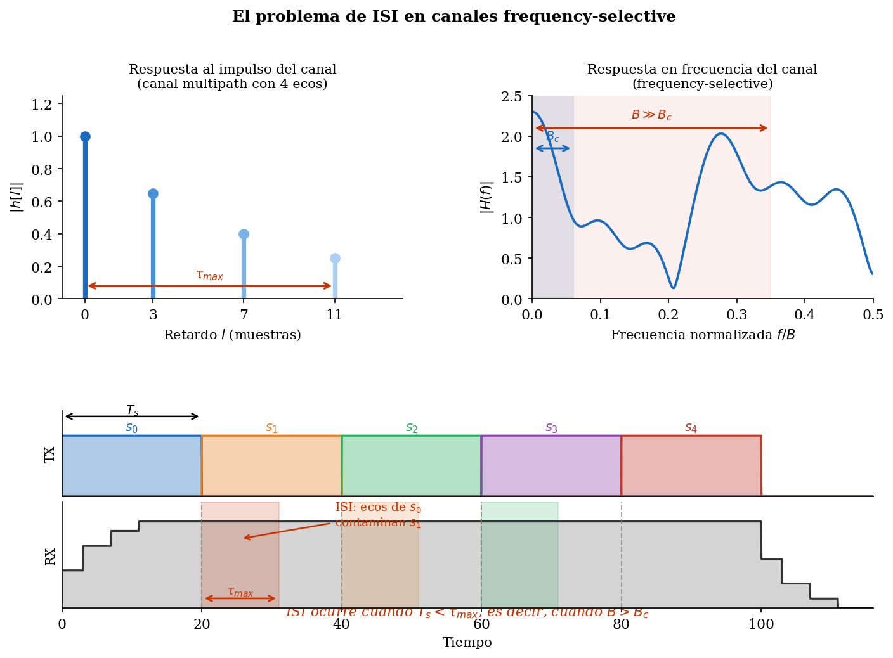
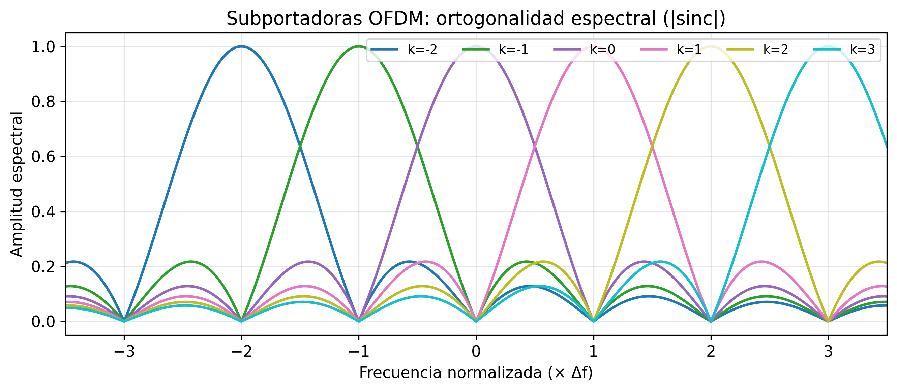
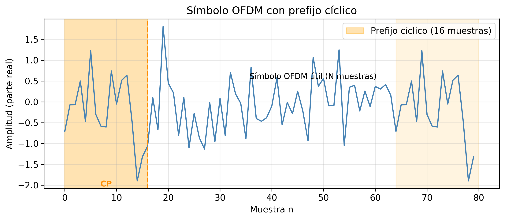

# Sesión 03 — Sistemas OFDM e Implementación

## Objetivos de Aprendizaje

Al finalizar esta sesión, el estudiante será capaz de:

1. Explicar por qué la modulación multiportadora resuelve el problema de ISI en canales frequency-selective
2. Demostrar que la IFFT genera una señal OFDM con subportadoras ortogonales
3. Derivar por qué el prefijo cíclico convierte la convolución lineal del canal en convolución circular
4. Implementar la cadena OFDM completa (IFFT, CP, canal, FFT, ecualización de un tap) en Python
5. Calcular la eficiencia espectral de un sistema OFDM en función de los parámetros del estándar (5G NR)

---

## Introducción

Las Sesiones 01 y 02 construyeron los dos pilares del problema de transmisión digital: el canal inalámbrico y la modulación. La Sesión 01 mostró que los canales de banda ancha son frequency-selective — distintas frecuencias experimentan ganancias distintas, y los ecos producen ISI cuando el período de símbolo es menor que el delay spread. La Sesión 02 mostró que para transmitir $k$ bits por símbolo con M-QAM se necesita un SNR proporcional a $(M-1)$. Pero hay un problema que no resolvimos: ¿qué ocurre cuando aplicamos una única portadora M-QAM de alta tasa sobre un canal frequency-selective?

El símbolo recibido es la convolución del símbolo transmitido con el canal:

$$y[n] = \sum_{l=0}^{L-1} h[l]\, x[n-l] + w[n]$$

donde $h[l]$ son los coeficientes de los $L$ taps del canal (ecos con distintos retardos y ganancias), $x[n]$ es el símbolo transmitido, y $w[n]$ es ruido AWGN.

??? note "¿Qué es un tap del canal?"
    Al digitalizar la señal a frecuencia de muestreo $f_s = B$, el canal continuo $h(\tau)$ se convierte en una secuencia discreta $h[0], h[1], \ldots, h[L-1]$. Cada posición $l$ representa un retardo de $l/B$ segundos; si hay energía en esa posición, existe un eco con ese retardo.

    Por ejemplo, si el canal tiene tres caminos físicos:

    | Camino | Retardo | Tap |
    |--------|---------|-----|
    | Rayo directo | 0 ns | $h[0] = 0.9$ |
    | Reflexión en edificio | 200 ns | $h[4] = 0.5$ |
    | Reflexión lejana | 700 ns | $h[14] = 0.2$ |

    entonces $L = 15$ — no porque haya 15 ecos, sino porque el eco más tardío ocupa el tap 14. Los taps intermedios sin eco valen cero.

    La longitud $L$ la determina el delay spread: $L = \lceil \tau_{\max} \cdot B \rceil$. Con $\tau_{\max} = 1\ \mu\text{s}$ y $B = 20\ \text{MHz}$, $L = 20$ taps. El panel superior izquierdo de la Figura 1 ilustra exactamente esta estructura.

Cada muestra $y[n]$ mezcla $L$ símbolos pasados. En LTE con $B = 20\ \text{MHz}$ y delay spread $\sigma_\tau = 1\ \mu\text{s}$, el canal tiene una longitud de $L \approx 20$ muestras. El detector ML de la Sesión 02 asume $y = hs + n$ — un escalar multiplicado por el símbolo; aquí ya no es así porque $y[n]$ depende de $L$ símbolos pasados simultáneamente. El equalizer en tiempo necesario tiene complejidad $\mathcal{O}(L^2)$ por símbolo. La Figura 1 resume el problema en sus tres dimensiones:

<figure markdown="span">
  
  <figcaption markdown="1">**Figura 1.** Los ecos del canal $h[l]$ con distintos retardos *(panel superior izquierda)* producen una respuesta en frecuencia $|H(f)|$ no uniforme *(panel superior derecha)*: la coherence bandwidth $B_c \ll B$ implica que distintas frecuencias reciben ganancias distintas. En el dominio temporal *(panel inferior)*, esto se manifiesta como ISI: el eco de $s_0$ llega durante la recepción de $s_1$, $s_2$, … — el símbolo observado $y[n]$ mezcla $L$ transmisiones pasadas.</figcaption>
</figure>

La solución es elegante: en lugar de un símbolo ancho que sufre ISI, transmitir $N$ símbolos simultáneamente en $N$ subportadoras tan estrechas que cada una vea un canal plano. Sobre un canal plano la ecualización se reduce a una división escalar — exactamente un tap por subportadora. Este esquema se denomina **OFDM** (Orthogonal Frequency-Division Multiplexing), y su viabilidad práctica depende de un hecho algebraico: la Transformada Discreta de Fourier (DFT) genera y separa las $N$ subportadoras en tiempo $\mathcal{O}(N \log N)$, sin $N$ moduladores independientes.

Queda, sin embargo, un problema pendiente: la convolución del canal es *lineal*, pero la DFT asume una convolución *circular*. El puente entre ambas es el **cyclic prefix** (CP) — un bloque de muestras de guarda que transforma la convolución lineal en circular antes de aplicar la FFT. Esta sesión construye esa cadena completa: símbolos QAM → IFFT → CP → canal → FFT → ecualización de un tap.

---

## Teoría

### 1. De la Portadora Única al Multiportadora

La Sesión 01 introdujo la coherence bandwidth $B_c \approx 1/(5\sigma_\tau)$: el rango de frecuencias sobre el que el canal varía poco. La sesión anterior asumió implícitamente que el canal es plano — la señal transmitida ocupa un ancho de banda $B_s \ll B_c$. Al aumentar la tasa de datos, $B_s$ crece y eventualmente supera $B_c$: distintas partes del espectro de la señal experimentan ganancias distintas, y aparece la ISI.

La idea del multiportadora es dividir el canal ancho en $N$ canales estrechos, cada uno con ancho de banda $\Delta f = B/N$. Si elegimos $N$ suficientemente grande:

$$\Delta f = \frac{B}{N} \ll B_c \approx \frac{1}{5\sigma_\tau}$$

cada subportadora ve un canal aproximadamente plano, y la ecualización por subportadora es trivial. El período de símbolo de cada subportadora es $T_s = 1/\Delta f \gg \sigma_\tau$, de modo que la ISI dentro de una subportadora es despreciable.

**¿Cuántas subportadoras hacen falta?** Despejando $N$ de la condición $\Delta f \ll B_c$:

$$N \gg \frac{B}{B_c} = 5 \cdot \sigma_\tau \cdot B$$

Para un canal Urban Macro con $\sigma_\tau = 1\ \mu\text{s}$ y $B = 20\ \text{MHz}$: $N \gg 5 \times 10^{-6} \times 20 \times 10^6 = 100$. Este es el piso mínimo para evitar ISI — cualquier $N$ por encima de 100 satisface la condición de ISI.

Existe sin embargo una restricción opuesta. Si el canal varía rápidamente en el tiempo (alto Doppler), las subportadoras vecinas se mezclan — **inter-carrier interference** (ICI). La condición para evitar ICI es que $\Delta f \gg f_{D,\text{max}}$:

$$\frac{B}{N} \gg f_{D,\text{max}} \Rightarrow N \ll \frac{B}{f_{D,\text{max}}}$$

Estas dos desigualdades encuadran el rango de $N$ válido:

$$\boxed{5\sigma_\tau B \ll N \ll \frac{B}{f_{D,\text{max}}}}$$

Con $v = 120\ \text{km/h}$, $f_c = 2\ \text{GHz}$, $f_{D,\text{max}} \approx 222\ \text{Hz}$: $N \ll 20\times10^6/222 \approx 90{,}000$. El rango válido es $100 \ll N \ll 90{,}000$.

**¿Por qué 5G NR usa exactamente $N = 2048$?** El espaciado entre subportadoras $\Delta f$ no se elige al límite — se fija en $\Delta f = 15\ \text{kHz}$ (numerología $\mu = 0$ de 5G NR), un valor que deja margen cómodo frente al Doppler. De ahí se deriva $N$ directamente:

$$N = \frac{B}{\Delta f} = \frac{20\ \text{MHz}}{15\ \text{kHz}} \approx 1333$$

Para que la implementación hardware de la FFT sea eficiente, $N$ se elige como potencia de 2; el valor mínimo que supera las 1333 subportadoras necesarias es $N = 2048$. Las 715 posiciones sobrantes se usan como subportadoras de guarda en los bordes de banda para evitar interferencia con canales adyacentes.

El principio multiportadora queda así establecido: dividir el canal en $N$ subportadoras estrechas convierte un problema de ecualización de complejidad $\mathcal{O}(L^2)$ en $N$ divisiones escalares independientes. Queda, sin embargo, la pregunta de implementación: ¿cómo se generan y separan $N$ subportadoras simultáneas sin $N$ moduladores físicos? La respuesta exige que las subportadoras sean *mutuamente ortogonales* — y que exista una operación única capaz de generarlas todas a la vez en el transmisor y separarlas todas a la vez en el receptor. Esa operación es la DFT.

#### Ejercicio 1

Un sistema OFDM opera en un canal con delay spread $\sigma_\tau = 5\ \mu\text{s}$ (entorno UMa típico) y ancho de banda total $B = 10\ \text{MHz}$.

**(a)** ¿Cuántas subportadoras $N$ se necesitan como mínimo para que el canal sea plano en cada subportadora? Usa la condición $\Delta f \leq B_c/10$.

??? example "Solución (a)"

    $B_c \approx 1/(5\sigma_\tau) = 1/(5\times5\times10^{-6}) = 40\ \text{kHz}$.

    Condición: $\Delta f \leq B_c/10 = 4\ \text{kHz}$.

    $\Delta f = B/N \leq 4\ \text{kHz} \Rightarrow N \geq B/4\ \text{kHz} = 10\times10^6/4000 = \mathbf{2500}$.

    En la práctica se elegiría la potencia de 2 superior: $N = 4096$.

**(b)** ¿Cuántas muestras de CP $N_{CP}$ se necesitan para cubrir $\tau_{\max} = 5\sigma_\tau$? ¿Cuál es el overhead de CP en porcentaje? *(Anticipo de §3 — puede dejarse pendiente hasta completar el Prefijo Cíclico.)*

??? example "Solución (b)"

    $\tau_{\max} = 5\sigma_\tau = 25\ \mu\text{s}$. Período de muestreo: $T_{\text{samp}} = 1/B = 100\ \text{ns}$.

    $N_{CP} = \lceil\tau_{\max}/T_{\text{samp}}\rceil = \lceil 25\times10^{-6} / 100\times10^{-9}\rceil = \lceil 250\rceil = \mathbf{250\ \text{muestras}}$.

    Con $N = 4096$: overhead CP $= N_{CP}/(N + N_{CP}) = 250/(4096+250) = 250/4346 \approx \mathbf{5{,}7\%}$.

**(c)** Si la velocidad del terminal es $v = 100\ \text{km/h}$ y $f_c = 900\ \text{MHz}$, calcula $f_{D,\text{max}}$ y verifica que $N$ cumple la condición anti-ICI $\Delta f \gg f_{D,\text{max}}$.

??? example "Solución (c)"

    $v = 100/3{,}6 \approx 27{,}8\ \text{m/s}$, $\lambda = c/f_c = 3\times10^8/9\times10^8 = 1/3\ \text{m}$.

    $f_{D,\text{max}} = v/\lambda = 27{,}8/(1/3) \approx 83{,}3\ \text{Hz}$.

    $\Delta f = B/N = 10\times10^6/4096 \approx 2{,}44\ \text{kHz}$.

    Ratio: $\Delta f/f_{D,\text{max}} = 2440/83{,}3 \approx 29 \gg 1$ ✓

    La condición anti-ICI se cumple con amplio margen: el Doppler desplaza las subportadoras menos del 3.4% del espaciado entre ellas.

---

### 2. Ortogonalidad y la DFT

La §1 estableció que necesitamos $N$ subportadoras simultáneas, cada una lo suficientemente estrecha para ver un canal plano. La subportadora $k$ ocupa la frecuencia $k \cdot \Delta f$ y, en tiempo continuo, es una exponencial compleja $e^{j2\pi k \Delta f \cdot t}$. Cada subportadora transporta un símbolo M-QAM $X[k]$.

Al muestrear a frecuencia $f_s = N \cdot \Delta f$ — es decir, $N$ muestras por símbolo OFDM de duración $T_s = 1/\Delta f$ — el instante $t = n/f_s$ convierte el exponente en:

$$e^{j2\pi k \Delta f \cdot \frac{n}{N \cdot \Delta f}} = e^{j2\pi kn/N}$$

El $\Delta f$ se cancela y el exponente queda en función únicamente de $k$ y $n$. La señal transmitida $x[n]$ es la suma de las $N$ subportadoras, cada una ponderada por su símbolo $X[k]$:

$$x[n] = \frac{1}{\sqrt{N}} \sum_{k=0}^{N-1} X[k]\, e^{j2\pi kn/N}, \quad n = 0, 1, \ldots, N-1$$

Es importante distinguir los dos dominios: $X[k]$ vive en **frecuencia** — es el símbolo M-QAM asignado a la subportadora $k$, su amplitud y fase. $x[n]$ vive en **tiempo** — es la muestra $n$ de la señal física que se transmite. La IFFT es precisamente la operación que convierte el vector de frecuencia $\mathbf{X} = [X[0], \ldots, X[N-1]]^T$ en el bloque de tiempo $\mathbf{x} = [x[0], \ldots, x[N-1]]^T$: el transmisor OFDM es una IFFT.

??? note "La granularidad temporal $1/f_s$ como unidad fundamental"
    Al muestrear a $f_s$, se divide el tiempo en intervalos de $1/f_s$ segundos. Todo lo demás queda encadenado a esa granularidad:

    - El símbolo OFDM tiene $N$ muestras porque hay $N$ subportadoras: la IFFT toma $N$ entradas en frecuencia $X[k]$ y produce $N$ salidas en tiempo $x[n]$. No es la resolución del ADC la que fija $N$ — es el número de subportadoras.
    - El símbolo dura $T_s = N/f_s$ segundos — el tiempo de transmitir esas $N$ muestras a ritmo $f_s$.
    - El espaciado entre subportadoras resulta $\Delta f = 1/T_s = f_s/N$, de modo que cada subportadora completa exactamente un número entero de ciclos en $T_s$.
    - La subportadora $k$ completa exactamente $k$ ciclos completos en los $N$ intervalos del símbolo.

    Esto explica por qué el exponente colapsa a $e^{j2\pi kn/N}$ sin parámetros sueltos: $f_s$ y $\Delta f$ se cancelan porque están relacionados por $N$. Si $\Delta f$ no fuera exactamente $f_s/N$, la cancelación no ocurriría y la ortogonalidad se rompería.

    La imagen mental: *un estroboscopio que dispara cada $1/f_s$ segundos; un símbolo OFDM son $N$ destellos; la subportadora $k$ completa exactamente $k$ vueltas entre el destello 0 y el destello $N-1$.*

**¿Por qué son ortogonales las subportadoras?** Para extraer el símbolo $X[k]$ de la señal recibida, el receptor multiplica muestra a muestra (x[n]) por la conjugada de la subportadora $k$ — es decir, por $e^{-j2\pi kn/N}$ — y suma los $N$ resultados. Sustituyendo la expresión de $x[n]$, ese cálculo produce un término por cada subportadora $l$:

$$\frac{1}{N}\sum_{n=0}^{N-1} x[n]\, e^{-j2\pi kn/N} = \frac{1}{\sqrt{N}}\sum_{l=0}^{N-1} X[l] \underbrace{\left(\frac{1}{N}\sum_{n=0}^{N-1} e^{j2\pi (l-k)n/N}\right)}_{\text{término de interferencia de }l\text{ sobre }k}$$

??? note "¿Cómo se pasa de $x[n]$ a la suma sobre $X[l]$?"
    La definición de $x[n]$ de la sección anterior es:

    $$x[n] = \frac{1}{\sqrt{N}} \sum_{l=0}^{N-1} X[l]\, e^{j2\pi ln/N}$$

    Se sustituye directamente dentro de la operación del receptor:

    $$\frac{1}{N}\sum_{n=0}^{N-1} x[n]\, e^{-j2\pi kn/N} = \frac{1}{N}\sum_{n=0}^{N-1} \left(\frac{1}{\sqrt{N}} \sum_{l=0}^{N-1} X[l]\, e^{j2\pi ln/N}\right) e^{-j2\pi kn/N}$$

    El factor $1/\sqrt{N}$ y $X[l]$ no dependen de $n$, así que salen de la suma sobre $n$:

    $$= \frac{1}{\sqrt{N}} \sum_{l=0}^{N-1} X[l] \left(\frac{1}{N}\sum_{n=0}^{N-1} e^{j2\pi ln/N}\, e^{-j2\pi kn/N}\right)$$

    Los dos exponentes con el mismo índice $n$ se combinan:

    $$= \frac{1}{\sqrt{N}} \sum_{l=0}^{N-1} X[l] \left(\frac{1}{N}\sum_{n=0}^{N-1} e^{j2\pi (l-k)n/N}\right)$$

    Ese término interior es el que determina si la subportadora $l$ interfiere con $k$ o no.

El término de interferencia vale 1 cuando $l = k$ y 0 en cualquier otro caso:

$$\frac{1}{N}\sum_{n=0}^{N-1} e^{j2\pi (l-k)n/N} = \begin{cases} 1 & l = k \\ 0 & l \neq k \end{cases}$$

Por eso de la suma sobre $l$ solo sobrevive el término propio: el receptor recupera $X[k]$ sin contaminación de ninguna otra subportadora. Esta operación completa es la FFT.

¿Por qué es cero cuando $l \neq k$? El producto $e^{j2\pi ln/N} \cdot e^{-j2\pi kn/N} = e^{j2\pi(l-k)n/N}$ es una exponencial compleja que, al recorrer $n = 0, 1, \ldots, N-1$, da exactamente $|l-k|$ vueltas completas en el plano complejo. La suma de cualquier número entero de vueltas completas es cero. El intervalo $[0, N-1]$ es exactamente la ventana de un símbolo OFDM — fuera de ella la cancelación no está garantizada.

??? note "¿Por qué la suma de vueltas completas es cero?"
    Lo que es cero es la **suma vectorial** de todos los términos — no cada exponencial individual. Cada término tiene módulo 1 (está sobre el círculo unitario), pero al sumarlos como vectores el resultado neto es cero.

    Ejemplo concreto con $N = 4$ y $l - k = 1$:

    | $n$ | $e^{j2\pi n/4}$ | Dirección |
    |-----|-----------------|-----------|
    | 0 | $1$ | derecha |
    | 1 | $j$ | arriba |
    | 2 | $-1$ | izquierda |
    | 3 | $-j$ | abajo |

    Suma: $(1) + (j) + (-1) + (-j) = 0$. Los cuatro vectores están simétricamente repartidos — se cancelan por pares.

    La prueba algebraica general: la suma es una serie geométrica con razón $r = e^{j2\pi(l-k)/N}$:

    $$\sum_{n=0}^{N-1} r^n = \frac{1 - r^N}{1 - r} = \frac{1 - e^{j2\pi(l-k)}}{1 - e^{j2\pi(l-k)/N}}$$

    El numerador es $1 - e^{j2\pi(l-k)}$. Como $l - k$ es un entero, $e^{j2\pi(l-k)} = 1$, y el numerador vale exactamente cero. El denominador no es cero porque $l \neq k$. Resultado: $0$.

**Por qué funciona sobre el canal.** Las exponenciales complejas $e^{j2\pi kn/N}$ son **autofunciones** de cualquier sistema LTI: si la entrada es $e^{j2\pi kn/N}$, la salida es $H[k]\, e^{j2\pi kn/N}$, donde $H[k]$ es la DFT del canal. Esta propiedad explica el corazón de OFDM: el canal convierte la entrada $X[k]$ en $H[k]X[k]$ subportadora a subportadora, sin mezclar las subportadoras entre sí. La ecualización queda reducida a una división escalar por subportadora.

??? note "¿Qué significa autofunción y qué es $H[k]$?"
    Una **autofunción** de un sistema es una señal que, al pasar por él, sale con la misma forma — solo multiplicada por una constante. En el caso de una subportadora $k$ a través del canal:

    $$\text{entra: } e^{j2\pi kn/N} \quad\longrightarrow\quad \text{sale: } H[k]\cdot e^{j2\pi kn/N}$$

    La exponencial sale intacta — misma frecuencia, misma forma — solo con la amplitud y fase modificadas por el escalar complejo $H[k]$. Cualquier otra señal (un pulso, por ejemplo) saldría deformada; las exponenciales complejas son las únicas que el canal no distorsiona en forma.

    **¿De dónde sale $H[k]$?** Al calcular la salida del canal para la entrada $e^{j2\pi kn/N}$:

    $$y[n] = \sum_{l=0}^{L-1} h[l]\, e^{j2\pi k(n-l)/N} = e^{j2\pi kn/N} \underbrace{\sum_{l=0}^{L-1} h[l]\, e^{-j2\pi kl/N}}_{H[k]}$$

    El factor que aparece es exactamente la DFT de los taps del canal $h[l]$ evaluada en la frecuencia $k$. $H[k]$ es un número complejo distinto para cada subportadora — cuánto atenúa y cuánto rota en fase el canal a esa frecuencia concreta.

    La consecuencia práctica: en tiempo, el canal es una convolución que mezcla $L$ símbolos. En frecuencia, es $N$ multiplicaciones escalares independientes — una por subportadora. La DFT *diagonaliza* el canal.

La figura siguiente muestra el espectro de potencia de las $N$ subportadoras individuales y su superposición.



Cada subportadora tiene forma de sinc en frecuencia, con nulos exactamente en los centros del resto de subportadoras. Cada una alcanza su máximo ($= 1$) en su propia frecuencia $k \cdot \Delta f$, donde todas las demás valen cero. Las subportadoras se solapan espectralmente — en ningún punto del eje de frecuencias hay separación vacía entre ellas — y sin embargo no interfieren entre sí porque la ortogonalidad garantiza la cancelación en la suma, no la separación física. Esto es lo que hace a OFDM más eficiente en espectro que los sistemas FDM con bandas de guarda.

#### Ejercicio 2

Considera un sistema OFDM con $N = 4$ subportadoras. El transmisor asigna los símbolos: $X[0] = 1$, $X[1] = 1$, $X[2] = 0$, $X[3] = 0$.

**(a)** Calcula las 4 muestras en tiempo $x[0], x[1], x[2], x[3]$ usando la fórmula IFFT:
$$x[n] = \frac{1}{\sqrt{N}} \sum_{k=0}^{N-1} X[k]\, e^{j2\pi kn/N}$$

??? example "Solución (a)"

    Sustituimos $N = 4$ y los valores $X[0]=1$, $X[1]=1$, $X[2]=0$, $X[3]=0$ en la fórmula IFFT:

    $$x[n] = \frac{1}{\sqrt{4}}\sum_{k=0}^{3} X[k]\, e^{j2\pi kn/4}$$

    Los términos $k=2$ y $k=3$ no contribuyen porque $X[2]=X[3]=0$:

    $$x[n] = \frac{1}{2}\left[X[0]\,e^{j2\pi \cdot 0 \cdot n/4} + X[1]\,e^{j2\pi \cdot 1 \cdot n/4} + 0 + 0\right]
           = \frac{1}{2}\left(1\cdot 1 + 1\cdot e^{j\pi n/2}\right)
           = \frac{1}{2}\left(1 + e^{j\pi n/2}\right)$$

    Evaluamos cada muestra usando $e^{j\theta} = \cos\theta + j\sin\theta$:

    | $n$ | $\pi n/2$ | $e^{j\pi n/2}$ | $x[n] = \tfrac{1}{2}(1 + e^{j\pi n/2})$ |
    |-----|-----------|----------------|------------------------------------------|
    | 0 | $0$ | $1$ | $\tfrac{1}{2}(1+1) = 1$ |
    | 1 | $\pi/2$ | $j$ | $\tfrac{1}{2}(1+j)$ |
    | 2 | $\pi$ | $-1$ | $\tfrac{1}{2}(1-1) = 0$ |
    | 3 | $3\pi/2$ | $-j$ | $\tfrac{1}{2}(1-j)$ |

    Que $x[2]=0$ aunque $X[0]$ y $X[1]$ son no nulos es resultado de la interferencia destructiva de las dos subportadoras en ese instante temporal.

**(b)** Verifica la ortogonalidad entre las subportadoras $k = 0$ y $k = 1$: calcula la suma

$$\frac{1}{N}\sum_{n=0}^{N-1} e^{j2\pi \cdot 0 \cdot n/N}\, e^{-j2\pi \cdot 1 \cdot n/N}$$

y comprueba que vale 0.

??? example "Solución (b)"

    Dos señales $\varphi_k[n]$ y $\varphi_l[n]$ son **ortogonales** cuando su producto interno es cero:

    $$\langle \varphi_k,\, \varphi_l \rangle \;=\; \frac{1}{N}\sum_{n=0}^{N-1} \varphi_k[n]\,\varphi_l^*[n] \;=\; 0$$

    El producto interno de dos señales discretas de longitud $N$ es su correlación normalizada: muestra a muestra, se multiplica una señal por la conjugada de la otra y se promedia. Si el resultado es cero, las dos señales no comparten ninguna componente en común — el receptor puede proyectar la señal recibida sobre cualquier subportadora y extraer solo su coeficiente, sin contaminación de las demás.

    Para las subportadoras OFDM $\varphi_k[n] = e^{j2\pi kn/N}$, el producto interno entre $k=0$ y $k=1$ es:

    $$\langle \varphi_0,\, \varphi_1 \rangle = \frac{1}{N}\sum_{n=0}^{N-1} \underbrace{e^{j2\pi \cdot 0 \cdot n/N}}_{=\,1}\cdot \underbrace{\left(e^{j2\pi \cdot 1 \cdot n/N}\right)^*}_{=\,e^{-j2\pi n/N}} = \frac{1}{N}\sum_{n=0}^{N-1} e^{-j2\pi n/N}$$

    que es exactamente la suma del enunciado. Sustituyendo $N=4$:

    $$\frac{1}{4}\sum_{n=0}^{3} e^{-j\pi n/2} = \frac{1}{4}\left(1 + e^{-j\pi/2} + e^{-j\pi} + e^{-j3\pi/2}\right) = \frac{1}{4}(1 - j - 1 + j) = 0\ \checkmark$$

    Los cuatro vectores están equirepartidos en el círculo unitario y se cancelan por pares: $(1,-1)$ en la parte real y $(j,-j)$ en la imaginaria. La FFT del receptor no es más que $N$ de estos productos internos en paralelo, uno por subportadora.

**(c)** El canal tiene respuesta impulsional $h[0] = 1$, $h[1] = 0{,}5$ (dos caminos). Calcula $H[k]$ para $k = 0$ y $k = 1$ usando $H[k] = \sum_l h[l]\, e^{-j2\pi kl/N}$. ¿Qué símbolo llega al receptor en la subportadora $k = 1$? *(Supón que el cyclic prefix ha sido añadido y eliminado correctamente — se derivará en §3.)*

??? example "Solución (c)"

    $H[k] = h[0] + h[1]\, e^{-j2\pi k/4} = 1 + 0{,}5\, e^{-j\pi k/2}$

    - $H[0] = 1 + 0{,}5 \cdot 1 = \mathbf{1{,}5}$ (suma constructiva: ambos caminos en fase)
    - $H[1] = 1 + 0{,}5\, e^{-j\pi/2} = 1 - 0{,}5j$

    El símbolo recibido en $k = 1$ (sin ruido):
    
    $$Y[1] = H[1] \cdot X[1] = (1 - 0{,}5j) \cdot 1 = \mathbf{1 - 0{,}5j}$$

    El canal no mezcla subportadoras — simplemente rota y escala $X[1]$. Para recuperar $X[1]$, el receptor divide: $\hat{X}[1] = Y[1]/H[1] = 1$.

---

### 3. El Prefijo Cíclico

Las subportadoras son ortogonales en el vacío. El problema aparece cuando la señal OFDM pasa por el canal multipath.

**La ISI en OFDM sin CP.** El canal de longitud $L$ convierte los primeros $L-1$ muestras del símbolo OFDM $n$ en una mezcla que incluye las últimas muestras del símbolo $n-1$. Esto rompe la ortogonalidad: la FFT del receptor mezcla datos del símbolo anterior — ISI inter-símbolo. Además, el canal rota las subportadoras entre sí — ICI intra-símbolo.

**La solución: convolución circular.** La FFT convierte la convolución lineal en multiplicación en frecuencia únicamente si la convolución es *circular*. Para convertir la convolución lineal del canal en circular, basta añadir al principio del símbolo una copia de sus últimas $N_{CP}$ muestras — el **prefijo cíclico** (CP).

**¿Por qué funciona?** Con el CP añadido, el símbolo transmitido tiene longitud $N + N_{CP}$. El canal (de longitud $L$) provoca que las primeras $L-1$ muestras del símbolo recibido estén contaminadas con el símbolo anterior. Pero el receptor descarta exactamente esas primeras $N_{CP} \geq L-1$ muestras. Las $N$ muestras restantes corresponden a la convolución del canal con el símbolo como si fuera periódico: es decir, convolución circular.

Formalmente, tras eliminar el CP, la muestra $n$-ésima del símbolo recibido es:

$$y[n] = \sum_{l=0}^{L-1} h[l]\, x[(n-l) \bmod N] + w[n]$$

Esto es convolución circular. Aplicando la FFT:

$$Y[k] = H[k] \cdot X[k] + W[k]$$

donde $H[k] = \sum_{l=0}^{L-1} h[l]\, e^{-j2\pi kl/N}$ es la DFT del canal. El canal simplemente multiplica cada subportadora por un número complejo $H[k]$.

La figura siguiente ilustra la estructura temporal del símbolo OFDM con y sin CP.



El panel superior muestra el símbolo OFDM original de $N$ muestras (parte real). El panel inferior muestra el símbolo transmitido con CP: las últimas $N_{CP}$ muestras del símbolo (recuadro naranja) se copian al frente. La longitud total transmitida es $N + N_{CP}$. Al llegar al receptor, el canal convierte las primeras $L-1$ muestras en residuo del símbolo anterior (ISI); el receptor las descarta exactamente porque $N_{CP} \geq L-1$. Las $N$ muestras restantes son la convolución circular limpia — la FFT las transforma en $Y[k] = H[k] X[k]$.

**Condición de diseño:** $N_{CP} \geq L - 1 = \lceil\tau_{\max}/T_{\text{samp}}\rceil$, donde $\tau_{\max}$ es el retardo máximo del canal y $T_{\text{samp}} = 1/B$ es el período de muestreo. En la práctica se elige $\tau_{\max} \approx 3\sigma_\tau$ para cubrir el 99% de la energía del canal.

#### Ejercicio 3

Considera un sistema OFDM con $N = 6$ muestras por símbolo y $N_{CP} = 2$ muestras de CP. Dos símbolos consecutivos tienen las siguientes muestras en tiempo (valores reales, sin normalización):

$$x_1 = [3,\; 1,\; 4,\; 1,\; 5,\; 9] \qquad x_2 = [2,\; 6,\; 5,\; 3,\; 5,\; 8]$$

**(a)** Construye la secuencia transmitida $\tilde{x}_1[m]$ de longitud $N + N_{CP} = 8$. ¿Qué muestras forman el CP y en qué posición se sitúan? Verifica que el CP aparece dos veces dentro de la trama transmitida.

??? example "Solución (a)"

    El CP son las **últimas** $N_{CP} = 2$ muestras del símbolo: $x_1[4] = 5$ y $x_1[5] = 9$.

    Se anteponen al símbolo original:

    $$\tilde{x}_1 = [\underbrace{5,\; 9}_{\text{CP}},\; 3,\; 1,\; 4,\; 1,\; \underbrace{5,\; 9}_{\text{cola}}]$$

    Las posiciones 0–1 (CP) son idénticas a las posiciones 6–7 (cola del símbolo). Esa identidad — el CP es literalmente la misma secuencia que aparece al final — es la propiedad que el receptor explotará para detectar el inicio del símbolo.

**(b)** Construye también $\tilde{x}_2$ y escribe la secuencia total recibida $y[n]$ para $n = 0, 1, \ldots, 15$ (canal ideal sin ruido ni distorsión).

??? example "Solución (b)"

    El CP de $x_2$ son sus últimas dos muestras: $x_2[4]=5$, $x_2[5]=8$.

    $$\tilde{x}_2 = [\underbrace{5,\; 8}_{\text{CP}},\; 2,\; 6,\; 5,\; 3,\; \underbrace{5,\; 8}_{\text{cola}}]$$

    La señal recibida es la concatenación de ambas tramas:

    | $n$ | 0 | 1 | 2 | 3 | 4 | 5 | 6 | 7 | 8 | 9 | 10 | 11 | 12 | 13 | 14 | 15 |
    |-----|---|---|---|---|---|---|---|---|---|---|----|----|----|----|----|----|
    | $y[n]$ | 5 | 9 | 3 | 1 | 4 | 1 | 5 | 9 | 5 | 8 | 2 | 6 | 5 | 3 | 5 | 8 |

    El símbolo 1 ocupa $n = 0\text{–}7$ (CP en 0–1, datos en 2–7); el símbolo 2 ocupa $n = 8\text{–}15$ (CP en 8–9, datos en 10–15).

**(c)** El receptor no sabe dónde empieza cada símbolo. Para detectar los instantes de inicio, evalúa el **correlador de CP**:

$$P[d] = \sum_{m=0}^{N_{CP}-1} y[d+m]\cdot y[d+m+N]$$

para $d = 0, 1, \ldots, 8$. Construye una tabla con todos los valores de $P[d]$. ¿En qué $d$ ocurren los máximos? ¿Qué mide $P[d]$ y por qué alcanza el máximo exactamente en el inicio del CP?

??? example "Solución (c)"

    Con $N_{CP}=2$ la suma tiene dos términos: $P[d] = y[d]\cdot y[d+6] + y[d+1]\cdot y[d+7]$.

    | $d$ | $y[d]$ | $y[d+1]$ | $y[d+6]$ | $y[d+7]$ | $P[d]$ |
    |-----|--------|----------|----------|----------|--------|
    | 0 | 5 | 9 | 5 | 9 | $5\cdot5+9\cdot9=\mathbf{106}$ |
    | 1 | 9 | 3 | 9 | 5 | $9\cdot9+3\cdot5=96$ |
    | 2 | 3 | 1 | 5 | 8 | $3\cdot5+1\cdot8=23$ |
    | 3 | 1 | 4 | 8 | 2 | $1\cdot8+4\cdot2=16$ |
    | 4 | 4 | 1 | 2 | 6 | $4\cdot2+1\cdot6=14$ |
    | 5 | 1 | 5 | 6 | 5 | $1\cdot6+5\cdot5=31$ |
    | 6 | 5 | 9 | 5 | 3 | $5\cdot5+9\cdot3=52$ |
    | 7 | 9 | 5 | 3 | 5 | $9\cdot3+5\cdot5=52$ |
    | 8 | 5 | 8 | 5 | 8 | $5\cdot5+8\cdot8=\mathbf{89}$ |

    Los máximos están en $d=0$ y $d=8$ — exactamente en el inicio del CP de cada símbolo. La separación entre picos es $N + N_{CP} = 8$, la duración total de cada trama.

    **¿Por qué el máximo ocurre en el inicio del CP?** Cuando $d = d_0$ apunta al primer sample del CP, se tiene $y[d_0+m] = y[d_0+m+N]$ para todo $m = 0, \ldots, N_{CP}-1$ — porque esos dos grupos de muestras son copias idénticas (CP y cola del símbolo). El correlador se convierte en la suma de cuadrados:

    $$P[d_0] = \sum_{m=0}^{N_{CP}-1} y[d_0+m]^2 = \text{energía del CP}$$

    Para $d \neq d_0$, las muestras separadas por $N$ ya no son idénticas — provienen de distintas partes del símbolo — y el producto promedio cae. El receptor declara inicio de símbolo en el $d$ que maximiza $P[d]$.

---

### 4. Cadena OFDM Completa y Ecualización

Con el CP en su lugar, la cadena OFDM completa es:

```
                         Transmisor (TX)
┌───────────────────────────────────────────────────────────────────────┐
│  Bits TX ──► QAM mapper ──► IFFT (N pts) ──► Añadir CP (N_CP) ──► DAC │
└──────────────────────────────────────────────────────────────────┬────┘
                                                                   │
                                                        Canal h(t) + AWGN
                                                                   │
┌──────────────────────────────────────────────────────────────────┴────┐
│  Bits RX ◄── QAM demapper ◄── Ecualizador ◄── FFT (N pts) ◄── ADC     │
└───────────────────────────────────────────────────────────────────────┘
                         Receptor (RX)
```

**Ecualizador de un tap.** Dado $Y[k] = H[k] X[k] + W[k]$, la estimación del símbolo transmitido mediante el ecualizador *Zero Forcing* (ZF) es:

$$\hat{X}[k] = \frac{Y[k]}{H[k]} = X[k] + \frac{W[k]}{H[k]}$$

El ruido se amplifica por $1/H[k]$ — en subportadoras donde el canal tiene ganancia baja (deep fade), el ZF amplifica el ruido. El ecualizador MMSE (*Minimum Mean Square Error*) mitiga esto:

$$\hat{X}[k] = \frac{H^*[k]}{|H[k]|^2 + N_0/\sigma_s^2} Y[k]$$

que degrada graciosamente en fades profundos (no amplifica ruido descontroladamente). El ecualizador MMSE se reduce al ZF cuando $|H[k]|^2 \gg N_0/\sigma_s^2$.

**Estimación del canal.** Para conocer $H[k]$, el transmisor inserta **subportadoras piloto** — subportadoras con símbolos conocidos. El receptor estima $H[k]$ en los pilotos e interpola entre ellos. Este tema se desarrolla en detalle en la Sesión 08.

#### Tabla de Dualidades OFDM

| Dominio temporal | | Dominio frecuencial |
|:--:|:--:|:--:|
| Período de símbolo $T_s = N/B$ | $\leftrightarrow$ | Espaciado de subportadora $\Delta f = B/N$ |
| Longitud del CP $T_{CP} = N_{CP}/B$ | $\leftrightarrow$ | Delay máximo soportado $\tau_{\max} = T_{CP}$ |
| Número de muestras $N$ | $\leftrightarrow$ | Número de subportadoras $N$ |
| Delay spread $\sigma_\tau$ | $\leftrightarrow$ | Coherence bandwidth $B_c \approx 1/(5\sigma_\tau)$ |
| Condición CP: $T_{CP} > \tau_{\max}$ | $\leftrightarrow$ | Condición flat: $\Delta f \ll B_c$ |
| Coherence time $T_c$ | $\leftrightarrow$ | Doppler spread $f_{D,\text{max}} = 1/(2\pi T_c)$|
| Condición slow fading: $T_s \ll T_c$ | $\leftrightarrow$ | Condición sin ICI: $\Delta f \gg f_{D,\text{max}}$ |

---

### 5. Parámetros OFDM en 5G NR: Ejemplo Integrador

5G NR no usa un único conjunto de parámetros OFDM — usa **numerologías** ($\mu = 0, 1, 2, 3$) que escalan el espaciado de subportadora por potencias de 2:

$$\Delta f = 2^\mu \times 15\ \text{kHz}$$

El período de símbolo y la longitud del CP se reducen proporcionalmente, permitiendo adaptar el sistema a distintas condiciones de propagación y frecuencias.

| $\mu$ | SCS $\Delta f$ | $T_s$ | CP normal $T_{CP}$ | $\tau_{\max}$ soportado | Ranuras/ms |
|:-----:|:--------------:|:------:|:-------------------:|:-----------------------:|:---------:|
| 0 | 15 kHz | 66.7 μs | 4.69 μs | ~940 ns | 1 |
| 1 | 30 kHz | 33.3 μs | 2.34 μs | ~470 ns | 2 |
| 2 | 60 kHz | 16.7 μs | 1.17 μs | ~234 ns | 4 |
| 3 | 120 kHz | 8.33 μs | 0.59 μs | ~117 ns | 8 |

**Criterio de selección de numerología.** El $\tau_{\max}$ soportado debe superar el delay spread del entorno:

- **UMa (macro, $\sigma_\tau \approx 300\ \text{ns}$):** $\tau_{\max} > 3\times300 = 900\ \text{ns}$ → $\mu = 0$ (15 kHz)
- **UMi (micro, $\sigma_\tau \approx 100\ \text{ns}$):** $\tau_{\max} > 300\ \text{ns}$ → $\mu \leq 1$ (30 kHz)
- **mmWave ($\sigma_\tau \approx 30\ \text{ns}$):** $\tau_{\max} > 90\ \text{ns}$ → $\mu \leq 3$ (120 kHz)

La alta SCS en mmWave también proporciona mayor robustez frente al Doppler, ya que $\Delta f / f_{D,\text{max}}$ aumenta.

#### Eficiencia Espectral y Overhead

No todas las subportadoras transportan datos. En NR, cada resource block (RB) tiene 12 subportadoras; los RBs de guarda en los bordes y las subportadoras piloto (DMRS) reducen la eficiencia:

$$\eta_{\text{neta}} = \underbrace{\frac{N_{CP}}{N + N_{CP}}}_{\text{overhead CP}} \times \underbrace{\frac{N - N_{\text{guard}} - N_{\text{pilot}}}{N}}_{\text{overhead frecuencial}} \times \log_2 M \times r_c$$

Para el ejemplo de $\mu = 1$, $N = 2048$, $N_{CP} = 144$ muestras (en la FFT de 2048):

$$\text{Overhead CP} = \frac{144}{2048 + 144} = \frac{144}{2192} \approx 6{,}6\%$$

Considerando pilotos DMRS y subportadoras nulas: eficiencia neta típica de 64-QAM con tasa $2/3$:

$$\eta_{\text{neta}} = (1 - 0{,}066) \times (1 - 0{,}07) \times 6 \times \frac{2}{3} \approx 3{,}5\ \text{bit/s/Hz}$$

en línea con los valores de los tablas MCS de la Sesión 02.

#### Ejemplo Numérico End-to-End

Un sistema 5G NR con $\mu = 1$, $B = 40\ \text{MHz}$, 106 RBs (valor estándar en 40 MHz con $\mu=1$), 64-QAM con tasa $2/3$, en un entorno UMi LOS con $\sigma_\tau = 100\ \text{ns}$.

**Paso 1 — Verificar CP:** $T_{CP} = 2{,}34\ \mu\text{s} > 3\sigma_\tau = 300\ \text{ns}$ ✓

**Paso 2 — Verificar subportadoras flat:** $\Delta f = 30\ \text{kHz} \ll B_c = 1/(5\times100\ \text{ns}) = 2\ \text{MHz}$ ✓

**Paso 3 — Subportadoras de datos:** $106 \times 12 = 1272$ subportadoras por símbolo. Descontando pilotos DMRS ($\approx 7\%$): $\approx 1182$ subportadoras de datos.

**Paso 4 — Caudal:**

$$R = 1182 \times \log_2(64) \times \frac{2}{3} \times \frac{14\ \text{símbolos}}{0{,}5\ \text{ms}} \approx 1182 \times 6 \times 0{,}667 \times 28000 \approx \mathbf{133\ \text{Mbit/s}}$$

Este valor es representativo del throughput pico de 5G NR en banda sub-6 GHz con 40 MHz y un flujo MIMO.

---

### 6. PAPR: La Penalización de la Amplificación

Un símbolo OFDM es la suma de $N$ exponenciales complejas con amplitudes y fases aleatorias (según los datos). Por el teorema central del límite, la parte real (e imaginaria) de $x[n]$ sigue aproximadamente una distribución gaussiana para $N$ grande. La relación entre el pico y la potencia media (*Peak-to-Average Power Ratio*, PAPR) puede ser muy elevada:

$$\text{PAPR} = \frac{\max_n |x[n]|^2}{\mathbb{E}[|x[n]|^2]}$$

Para $N = 1024$ subportadoras con 64-QAM aleatoria, el PAPR en el percentil 99.9% es de aproximadamente 10–12 dB. Esto implica que el amplificador de potencia (PA) debe tener un margen de backoff de 8–12 dB para no saturar y distorsionar la señal — una penalización severa en eficiencia energética.

Las técnicas de reducción de PAPR (clipping, tone reservation, SLM) se aplican en los terminales móviles, donde la eficiencia energética es crítica. Las estaciones base tienen mayor flexibilidad de potencia.

---

## Síntesis

**Dimensión 1: Conversión de canal FSF en N canales flat.** OFDM descompone el problema de ecualización de canal frequency-selective (complejidad $\mathcal{O}(L^2)$) en N problemas triviales de ganancia escalar (complejidad $\mathcal{O}(N \log N)$ incluyendo la FFT). La condición es $\Delta f \ll B_c$. *Implicación de diseño*: N debe ser suficientemente grande para que $\Delta f \ll B_c$, pero no tan grande que el Doppler cause ICI.

**Dimensión 2: El prefijo cíclico como precio de la circularidad.** El CP gasta $N_{CP}/(N+N_{CP})$ de la capacidad temporal. Es el precio de convertir la convolución lineal del canal en circular. *Implicación de diseño*: CP más largo protege frente a mayor delay spread pero reduce la eficiencia espectral. 5G NR balancea esto con numerologías.

**Dimensión 3: La FFT como implementación eficiente.** La IFFT/FFT tiene complejidad $\mathcal{O}(N\log N)$ frente a $\mathcal{O}(N^2)$ de la DFT directa. Para $N = 2048$: FFT es $2048/\log_2(2048) \approx 186\times$ más eficiente. *Implicación de diseño*: N se elige potencia de 2 para maximizar la eficiencia de la FFT radix-2.

**Dimensión 4: Ecualización de un tap y estimación de canal.** La elegancia matemática de OFDM (un tap por subportadora) requiere conocer $H[k]$ — estimación de canal mediante pilotos. La calidad de la estimación determina la BER en la práctica. *Implicación de diseño*: la densidad de pilotos es el trade-off entre exactitud de estimación y eficiencia espectral. Sesión 08 desarrolla los estimadores LS y MMSE.

**Dimensión 5: PAPR como coste energético.** El PAPR alto obliga a un backoff del PA y reduce la eficiencia energética. *Implicación de diseño*: PAPR es especialmente crítico en el uplink (terminal móvil con batería limitada). 5G NR usa DFT-spread OFDM (SC-FDMA) en el uplink para reducir el PAPR, a costa de perder la ecualización de un tap pura.

**Dependencias hacia adelante:**

- *Sesión 04 — Codificación de canal*: los bits por subportadora que OFDM transmite son protegidos por un código LDPC/Polar que opera a nivel del bloque de transporte (todos los RBs juntos).
- *Sesión 05 — Acceso múltiple*: OFDMA asigna distintos subconjuntos de subportadoras a distintos usuarios — la base del acceso múltiple en LTE/NR.
- *Sesión 07 — MIMO masivo*: MIMO transmite flujos OFDM paralelos desde múltiples antenas. El precodificador actúa en cada subportadora de forma independiente.
- *Sesión 08 — Estimación de canal*: los estimadores LS y MMSE se aplican por subportadora usando las ganancias del canal $H[k]$ que aquí asumimos conocidas.
- *Sesión 09 — 5G NR*: la capa física de NR es OFDM con la numerología variable descrita en la Sección 5 de esta sesión.

---

## Ejercicios

### Ejercicio 1

Un sistema OFDM usa $N = 1024$ subportadoras, $N_{CP} = 72$ muestras de CP, de las cuales $N_{\text{guard}} = 100$ subportadoras son de guarda (bordes de banda) y $N_{\text{pilot}} = 64$ son pilotos.

**(a)** Calcula el número de subportadoras de datos $N_{\text{data}}$.

??? example "Solución (a)"

    $N_{\text{data}} = N - N_{\text{guard}} - N_{\text{pilot}} = 1024 - 100 - 64 = \mathbf{860}$ subportadoras de datos.

**(b)** Calcula la eficiencia espectral neta $\eta$ en bits/s/Hz para 16-QAM con tasa de código $r = 3/4$.

??? example "Solución (b)"

    - Overhead temporal (CP): $\eta_t = N/(N + N_{CP}) = 1024/1096 = 0{,}934$.
    - Overhead frecuencial (guard + pilots): $\eta_f = N_{\text{data}}/N = 860/1024 = 0{,}840$.

    $\eta_{\text{neta}} = \eta_t \times \eta_f \times \log_2(M) \times r = 0{,}934 \times 0{,}840 \times 4 \times 0{,}75 = \mathbf{2{,}36\ \text{bit/s/Hz}}$

**(c)** Compara con la eficiencia espectral bruta (sin overhead) de 16-QAM con $r = 3/4$. ¿Qué fracción se pierde en overhead?

??? example "Solución (c)"

    Eficiencia bruta: $\log_2(16) \times 3/4 = 4 \times 0{,}75 = 3{,}0\ \text{bit/s/Hz}$.

    Fracción perdida: $(3{,}0 - 2{,}36)/3{,}0 = 0{,}64/3{,}0 \approx \mathbf{21{,}3\%}$.

    El overhead combinado de CP, pilotos y subportadoras de guarda cuesta aproximadamente 1/5 de la capacidad teórica. Este overhead es el precio de la implementación práctica: ecualización (pilotos), separación de canales adyacentes (guard), y protección contra ISI (CP).

---

### Ejercicio 2

Deriva la distribución del PAPR para una señal OFDM de $N$ subportadoras con símbolos QAM independientes y equiprobables.

**(a)** ¿Qué distribución sigue $|x[n]|^2$ para $N$ grande? (Pista: aplica el TCL a la suma de $N$ variables complejas independientes.)

??? example "Solución (a)"

    Cada muestra $x[n] = \frac{1}{\sqrt{N}}\sum_{k=0}^{N-1}X[k]e^{j2\pi kn/N}$ es la suma de $N$ variables complejas independientes de media cero. Por el TCL, para $N$ grande, $x[n]$ tiende a una variable gaussiana compleja: $x[n] \sim \mathcal{CN}(0, \sigma_x^2)$. Por tanto $|x[n]|^2/\sigma_x^2 \sim \text{Exp}(1)$ — distribución exponencial.

**(b)** La CCDF del PAPR (probabilidad de que el PAPR supere un umbral $\gamma_0$) para señal OFDM con $N$ muestras se aproxima por:

$$P(\text{PAPR} > \gamma_0) \approx 1 - \left(1 - e^{-\gamma_0}\right)^N$$

Calcula el umbral $\gamma_0^{(1\%)}$ tal que el PAPR supera dicho umbral con probabilidad 1%. Usa $N = 1024$.

??? example "Solución (b)"

    De $P(\text{PAPR} > \gamma_0) = 0{,}01$:

    $1 - (1-e^{-\gamma_0})^{1024} = 0{,}01 \Rightarrow (1-e^{-\gamma_0})^{1024} = 0{,}99$

    $(1-e^{-\gamma_0}) = 0{,}99^{1/1024} \approx 1 - 9{,}77\times10^{-6}$

    $e^{-\gamma_0} \approx 9{,}77\times10^{-6} \Rightarrow \gamma_0 \approx \ln(1/(9{,}77\times10^{-6})) \approx 11{,}53$

    En dB: $10\log_{10}(11{,}53) \approx \mathbf{10{,}6\ \text{dB}}$.

**(c)** Si el amplificador de potencia tiene un *output backoff* (OBO) igual al $\gamma_0^{(1\%)}$ calculado en dB, ¿cuánta potencia media se desperdicia en el backoff?

??? example "Solución (c)"

    Un OBO de 10.6 dB significa que el PA opera a una potencia media $10{,}6\ \text{dB}$ por debajo de su potencia de saturación. La eficiencia del PA (PAE, *Power Added Efficiency*) cae aproximadamente de forma lineal con el backoff: si la PAE en saturación es 40%, con 10.6 dB de OBO la PAE efectiva cae a $\approx 40\%/\sqrt{10{,}6} \approx 12\%$ — es decir, el 88% de la potencia DC consumida se disipa como calor en lugar de radiarse como señal RF. El PAPR es la principal razón por la que los terminales 5G se calientan y consumen batería rápidamente.

---

### Ejercicio 3

Un operador despliega 5G NR en tres escenarios:

| Escenario | $f_c$ | $\sigma_\tau$ | $v_{\max}$ | Banda |
|-----------|-------|---------------|------------|-------|
| Macro urbano | 700 MHz | 500 ns | 120 km/h | FR1 |
| Micro urbano | 3.5 GHz | 100 ns | 60 km/h | FR1 |
| mmWave indoor | 28 GHz | 20 ns | 5 km/h | FR2 |

**(a)** Para cada escenario, calcula $B_c$ y la numerología mínima $\mu$ tal que $T_{CP}^{(\mu)} > 3\sigma_\tau$.

??? example "Solución (a)"

    | Escenario | $B_c = 1/(5\sigma_\tau)$ | $\mu=0$: $T_{CP}=4.69\ \mu$s | $\mu=1$: $T_{CP}=2.34\ \mu$s | $\mu$ elegido |
    |-----------|--------------------------|:---:|:---:|:---:|
    | Macro ($\sigma_\tau=500\ \text{ns}$) | 400 kHz | $4.69 > 1.5\ \mu$s ✓ | $2.34 > 1.5\ \mu$s ✓ | **$\mu=0$** (más margen CP) |
    | Micro ($\sigma_\tau=100\ \text{ns}$) | 2 MHz | $4.69 > 0.3\ \mu$s ✓ | $2.34 > 0.3\ \mu$s ✓ | **$\mu=1$** (más ranuras/ms) |
    | mmWave ($\sigma_\tau=20\ \text{ns}$) | 10 MHz | ✓ | ✓ | **$\mu=3$** (mayor SCS) |

**(b)** Calcula $f_{D,\text{max}}$ y la condición $\Delta f/f_{D,\text{max}}$ para el $\mu$ seleccionado. ¿El Doppler es un problema en alguno de los escenarios?

??? example "Solución (b)"

    $\lambda_i = c/f_{c,i}$; $f_D = v/\lambda$.

    | Escenario | $\lambda$ | $f_{D,\text{max}}$ | $\Delta f$ ($\mu$ elegido) | $\Delta f/f_{D,\text{max}}$ |
    |-----------|----------|-------------------|--------------------------|--------------------------|
    | Macro, $\mu=0$ | 0.429 m | 77.9 Hz | 15 kHz | **193** |
    | Micro, $\mu=1$ | 0.086 m | 194 Hz | 30 kHz | **155** |
    | mmWave, $\mu=3$ | 0.0107 m | 130 Hz | 120 kHz | **923** |

    En todos los escenarios el ratio es $\gg 1$: el Doppler no representa un problema serio.

**(c)** El escenario mmWave usa $B = 400\ \text{MHz}$ con $\mu = 3$ y 64-QAM con $r = 3/4$. Calcula el throughput pico (ignora overhead).

??? example "Solución (c)"

    $B = 400\ \text{MHz}$, 64-QAM ($k=6$), $r=3/4$:

    $$\text{Throughput} = B \times k \times r = 400\times10^6 \times 6 \times 0{,}75 = \mathbf{1{,}8\ \text{Gbit/s}}$$

    (valor bruto sin overhead de CP ni pilotos; en la práctica ~1.4 Gbit/s por ranura efectiva).

---

### Ejercicio 4

Considera un sistema OFDM con $N = 64$ subportadoras, $N_{CP} = 16$ muestras de CP, y un canal de dos caminos:

$$h[l] = \begin{cases} 0{,}8 & l = 0 \\ 0{,}6 & l = 8 \end{cases}$$

**(a)** Verifica que el CP es suficiente para eliminar la ISI. ¿Cuántos caminos tiene el canal? ¿Qué longitud máxima de canal $L$ soporta este CP?

??? example "Solución (a)"

    El canal tiene **2 caminos** (taps $l=0$ y $l=8$), pero su longitud discreta es $L = 9$: la respuesta impulsional ocupa los índices $l = 0, 1, \ldots, 8$, aunque solo dos de ellos son no nulos. La condición CP exige $N_{CP} \geq L - 1 = 8$. Con $N_{CP} = 16 \geq 8$ ✓, el CP es más que suficiente — cubre hasta un tap de retardo $l = 16$.

**(b)** Calcula $H[k]$ para $k = 0$ (subportadora DC) y $k = 8$.

??? example "Solución (b)"

    $H[k] = \sum_{l} h[l] e^{-j2\pi kl/N}$:

    $$H[k] = 0{,}8 + 0{,}6\, e^{-j2\pi k\cdot 8/64} = 0{,}8 + 0{,}6\, e^{-j\pi k/4}$$

    Para $k = 0$: $H[0] = 0{,}8 + 0{,}6 = \mathbf{1{,}4}$ (suma constructiva).

    Para $k = 8$: $H[8] = 0{,}8 + 0{,}6\, e^{-j2\pi} = 0{,}8 + 0{,}6 = \mathbf{1{,}4}$.

    Para $k = 4$: $H[4] = 0{,}8 + 0{,}6\, e^{-j\pi} = 0{,}8 - 0{,}6 = \mathbf{0{,}2}$ (interferencia destructiva).

**(c)** Si se usa un ecualizador ZF, calcula el SNR efectivo en la subportadora $k = 8$ cuando el SNR sin ecualizar es 20 dB. ¿Por qué puede ser perjudicial el ZF en subportadoras con ganancia baja?

??? example "Solución (c)"

    Tras ZF, $\hat{X}[k] = X[k] + W[k]/H[k]$. La varianza del ruido residual es $N_0/|H[k]|^2$, luego:

    $$\text{SNR}_{ZF}[k] = \frac{\sigma_s^2}{N_0/|H[k]|^2} = |H[k]|^2 \cdot \text{SNR}_0$$

    Para $k=8$, $|H[8]|^2 = 1{,}96$ y $\text{SNR}_0 = 100$:

    $$\text{SNR}_{ZF}[8] = 1{,}96 \times 100 = 196 \Rightarrow \mathbf{22{,}9\ \text{dB}}$$

    El ZF amplifica favorablemente en $k=8$ porque $|H[8]| > 1$. Pero en $k=4$, $|H[4]| = 0{,}2$: $\text{SNR}_{ZF}[4] = 0{,}04 \times 100 = 4\ (6\ \text{dB})$ — degradación de 14 dB. El ecualizador MMSE limitaría esta amplificación aceptando algo de interferencia residual a cambio de no amplificar el ruido descontroladamente.

---

### Ejercicio 5 — Diseño Completo del Sistema OFDM

Un operador quiere desplegar un enlace OFDM punto a punto en un enlace backhaul en entorno UMa. Los parámetros del canal (Sesión 01) son: $\sigma_\tau = 2\ \mu\text{s}$, $B_c = 100\ \text{kHz}$, $v = 0\ \text{km/h}$ (fijo). Los parámetros del sistema: $B = 20\ \text{MHz}$, $P_t = 30\ \text{dBm}$, $G_t = G_r = 20\ \text{dBi}$, $d = 5\ \text{km}$, $n = 3{,}5$ (NLOS), $\text{PL}(d_0=100\ \text{m}) = 95\ \text{dB}$, $F = 7\ \text{dB}$, $\sigma_{\text{sh}} = 8\ \text{dB}$, margen de cobertura 99% ($Q^{-1}(0{,}01) \approx 2{,}33$).

**(a)** Elige $N$ y $N_{CP}$ para cumplir $\Delta f \leq B_c/5$ y $T_{CP} > 5\sigma_\tau$.

??? example "Solución (a)"

    Condición flat: $\Delta f \leq B_c/5 = 20\ \text{kHz} \Rightarrow N \geq B/20\ \text{kHz} = 1000$. Potencia de 2: $N = 1024$.

    CP mínimo: $\tau_{\max} = 5\sigma_\tau = 10\ \mu\text{s}$. $T_{\text{samp}} = 1/B = 50\ \text{ns}$.

    $N_{CP} = 10\times10^{-6}/50\times10^{-9} = 200$ muestras. Overhead CP $= 200/1224 \approx 16{,}3\%$.

**(b)** Calcula el SNR recibido (incluyendo margen de shadowing al 99%).

??? example "Solución (b)"

    Path loss a 5 km:

    $$\text{PL}(5000) = 95 + 35\log_{10}(50) = 95 + 35\times1{,}699 = 95 + 59{,}5 = 154{,}5\ \text{dB}$$

    Margen shadowing al 99%: $M_\sigma = 2{,}33 \times 8 = 18{,}6\ \text{dB}$.

    Piso de ruido: $N_{\text{floor}} = -174 + 10\log_{10}(20\times10^6) + 7 = -174 + 73 + 7 = -94\ \text{dBm}$.

    Potencia recibida: $P_r = 30 + 20 + 20 - 154{,}5 - 18{,}6 = -103{,}1\ \text{dBm}$.

    $\text{SNR} = P_r - N_{\text{floor}} = -103{,}1 - (-94) = \mathbf{-9{,}1\ \text{dB}}$.

    El SNR es negativo — el enlace con esos parámetros no puede soportar ni QPSK a este alcance con 99% de cobertura. Revisando: con 90% de cobertura ($M_\sigma = 1{,}28\times8 = 10{,}2\ \text{dB}$):

    $P_r = 30 + 20 + 20 - 154{,}5 - 10{,}2 = -94{,}7\ \text{dBm}$. $\text{SNR} = -94{,}7 + 94 = \mathbf{-0{,}7\ \text{dB}}$.

    Todavía marginal. Los parámetros plantean un enlace en el límite del sistema — diseñar backhaul a 5 km en NLOS con esas potencias es desafiante. Para completar el análisis se usa 90% de cobertura.

**(c)** Selecciona la modulación máxima tal que BER $\leq 10^{-3}$ (usa la tabla de la Sesión 02). Calcula el caudal neto incluyendo overhead de CP y un 8% de pilotos.

??? example "Solución (c)"

    SNR efectivo $\approx -0{,}7\ \text{dB}$: solo QPSK con $r=1/2$ es viable ($\eta = 1{,}0$ bit/s/Hz).

    Caudal neto: $\eta_{\text{net}} = (1 - 0{,}163)\times(1 - 0{,}08)\times1{,}0 \approx 0{,}77\ \text{bit/s/Hz}$.

    $R = 20\times10^6\times0{,}77 \approx \mathbf{15{,}4\ \text{Mbit/s}}$.

**(d)** Compara el caudal obtenido con el límite de Shannon para el SNR calculado. ¿Qué fracción de la capacidad de Shannon alcanza este sistema?

??? example "Solución (d)"

    $C = B\log_2(1 + \text{SNR}) = 20\times10^6\times\log_2(1{,}851) \approx 17{,}8\ \text{Mbit/s}$.

    Fracción: $15{,}4/17{,}8 \approx \mathbf{86\%}$ — el sistema opera cerca del límite teórico porque el código LDPC con $r=1/2$ es eficiente a SNR bajas.

---

## Laboratorio Python

[](https://colab.research.google.com/github/ollerenac/wireless-communication-systems/blob/main/docs/sessions/03-ofdm-systems/lab.ipynb)

En este laboratorio (~90 minutos) construirás un transceptor OFDM completo desde cero:

1. **Señal OFDM en tiempo y frecuencia**: visualiza el símbolo OFDM y el espectro de subportadoras (Ej. 1 — ~15 min)
2. **Cadena IFFT/FFT sin canal**: verifica la recuperación perfecta de símbolos (Ej. 2 — ~10 min)
3. **ISI sin CP vs con CP**: observa la distorsión por multipath y cómo el CP la elimina (Ej. 3 — ~20 min)
4. **Ecualización de un tap**: implementa ZF y MMSE, compara BER (Ej. 4 — ~20 min)
5. **BER de OFDM en canal frequency-selective**: curvas Monte Carlo vs AWGN de referencia (Ej. 5 — ~25 min)

---

## Lecturas Recomendadas

1. **Proakis, J. G. & Salehi, M.** — *Digital Communications*, 5ª ed., McGraw-Hill, 2008. Capítulo 9 (OFDM y técnicas multiportadora).
2. **Tse, D. & Viswanath, P.** — *Fundamentals of Wireless Communication*, Cambridge University Press, 2005. Capítulo 3.5 (OFDM).
3. **Goldsmith, A.** — *Wireless Communications*, Cambridge University Press, 2005. Capítulo 12 (OFDM).
4. **3GPP TS 38.211** — *Physical channels and modulation*, Release 17. §4 (numerología NR y estructura de ranura).
5. **Dahlman, E., Parkvall, S. & Sköld, J.** — *5G NR: The Next Generation Wireless Access Technology*, Academic Press, 2018. Capítulo 7 (transmisión en capa física NR).
