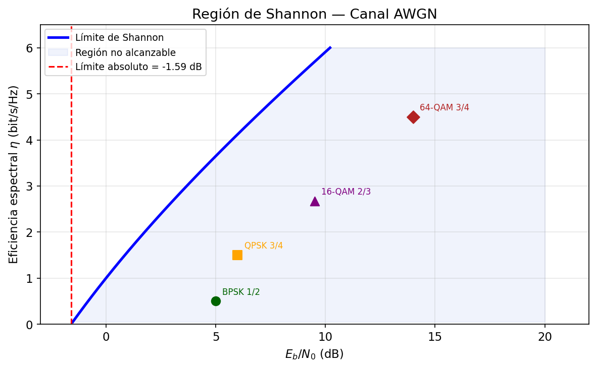
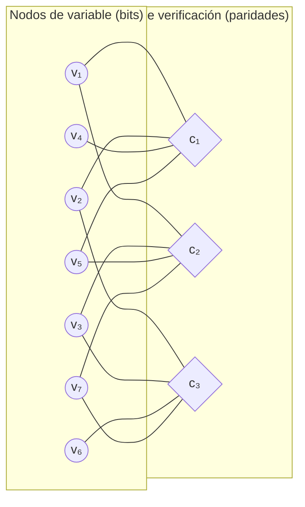
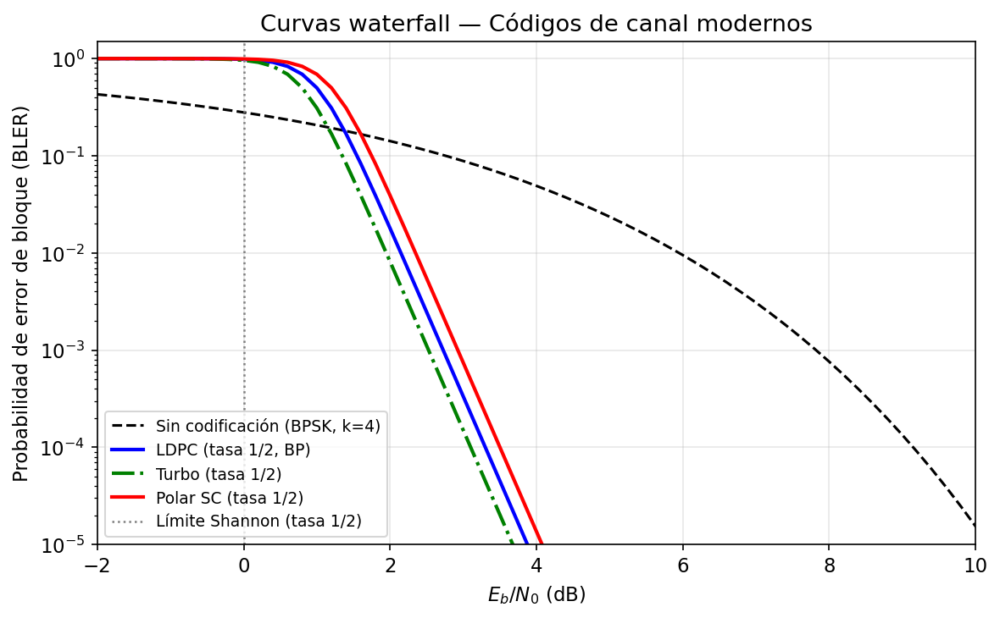

# Sesión 04 — Codificación de Canal: LDPC y Códigos Polar

## Objetivos de Aprendizaje

Al finalizar esta sesión, el estudiante será capaz de:

1. Calcular la capacidad de Shannon de un canal AWGN y determinar el Eb/N0 mínimo teórico para comunicación fiable
2. Explicar el concepto de ganancia de codificación y calcularla a partir de curvas de BER
3. Describir la estructura del grafo de Tanner de un código LDPC y el principio del algoritmo de belief propagation
4. Derivar las transformaciones de polarización del canal que dan lugar a los códigos Polar
5. Identificar qué código (LDPC o Polar) usa 5G NR en cada canal físico y por qué

---

## Introducción

En la Sesión 03, el Ejercicio 6 calculó que un sistema OFDM operaba al 86% de la capacidad de Shannon en condiciones realistas. En la Sesión 02, el selector de MCS usó un umbral de BER pre-FEC de $10^{-1.5}$ — una BER que un detector sin código nunca aceptaría — dando por sentado que el código LDPC de 5G NR la transformaba en $<10^{-5}$. Ambas sesiones usaron la codificación de canal como una "caja negra" con propiedades mágicas. Esta sesión abre esa caja.

La pregunta central es: si un canal introduce errores inevitablemente, ¿cómo es posible comunicar sin errores? La respuesta, contra toda intuición, es: añadiendo más bits. Específicamente, añadiendo bits de redundancia cuidadosamente diseñados para que el receptor pueda detectar y corregir los errores del canal. Shannon (1948) demostró que esto es posible para cualquier tasa $R < C$, donde $C$ es la capacidad del canal. Durante casi 50 años nadie supo construir códigos que se acercaran al límite; los turbo codes (1993) y los LDPC codes (redescubiertos 1996) rompieron esa barrera. Los códigos Polar (Arıkan 2009) son los primeros en ser teóricamente demostrables como capacity-achieving.

---

## Teoría

### 1. El Límite de Shannon

La Sesión 03 calculó throughput de OFDM comparándolo con la capacidad de Shannon $C = B\log_2(1+\text{SNR})$, pero no explicó de dónde viene esa fórmula. La intuición geométrica es más útil que la derivación formal.

**Capacidad como ratio de volúmenes.** En $n$ usos del canal, la señal transmitida ocupa un punto en $\mathbb{R}^n$ con energía $E_s = nP_s$. El ruido la desplaza aleatoriamente dentro de una esfera de radio $\sqrt{nN_0/2}$. El punto recibido cae dentro de una esfera de radio $\sqrt{n(P_s + N_0/2)}$. El número máximo de mensajes distinguibles es aproximadamente el ratio de volúmenes esféricas en $n$ dimensiones:

$$M \approx \left(\frac{\sqrt{n(P_s + N_0/2)}}{\sqrt{nN_0/2}}\right)^n = \left(1 + \frac{P_s}{N_0/2}\right)^{n/2} = (1+\text{SNR})^{n/2}$$

La tasa máxima de bits por uso de canal es:

$$C = \frac{\log_2 M}{n} = \frac{1}{2}\log_2(1+\text{SNR}) \quad \text{[bits/uso real]}$$

Para canales complejos (bandpass), hay dos dimensiones por uso, y $n$ usos del canal en tiempo $T$ proporcionan $2BT$ dimensiones ($B$ = bandwidth, Nyquist):

$$\boxed{C = B\log_2(1+\text{SNR})\quad \text{[bit/s]}}$$

Este resultado — el **Teorema de Shannon-Hartley** — establece dos hechos complementarios. El primero (la mitad positiva del teorema de codificación de canal): para cualquier tasa $R < C$ existe un código de longitud $n$ suficientemente grande tal que la probabilidad de error es arbitrariamente pequeña. El segundo (la mitad negativa o el "converso"): para cualquier $R > C$, la probabilidad de error se acerca a 1 sin importar qué código se use.

**El límite de Eb/N0.** ¿Cuál es el SNR mínimo absoluto para comunicar fiablemente? Si la tasa espectral es $\eta = R/B$ [bit/s/Hz], la condición $R < C$ exige:

$$\eta < \log_2(1 + \text{SNR}) \Rightarrow \text{SNR} > 2^\eta - 1$$

Expresando SNR en términos de Eb/N0: $\text{SNR} = (E_b/N_0)\cdot(R/B) = (E_b/N_0)\cdot\eta$. Sustituyendo:

$$(E_b/N_0)\cdot\eta > 2^\eta - 1 \Rightarrow E_b/N_0 > \frac{2^\eta - 1}{\eta}$$

A medida que $\eta \to 0$ (tasa de bits muy baja): $\lim_{\eta\to0}\frac{2^\eta-1}{\eta} = \ln 2 \approx 0{,}693$.

El **límite absoluto de Shannon** es $E_b/N_0 \geq \ln 2 = -1{,}59\ \text{dB}$. Por debajo de este valor no existe ningún código capaz de comunicar fiablemente, para ninguna tasa y ningún esquema de modulación.

La figura siguiente muestra la capacidad $C/B$ en función del SNR, con los puntos de operación de las modulaciones de la Sesión 02.

La curva negra es la frontera de Shannon: $C/B = \log_2(1+\text{SNR})$. Los puntos de colores muestran dónde opera cada modulación sin codificación a BER = $10^{-3}$ (valores del Ejercicio 5 de la Sesión 02). Los puntos se sitúan entre un 30% y un 60% por debajo de la curva — la diferencia es el espacio que la codificación de canal puede recuperar. Las flechas horizontales indican la ganancia de codificación: la reducción de Eb/N0 que permite un buen código operando a la misma tasa espectral.

---

### 2. Codificación de Canal: Redundancia Estructurada

La intuición es que la redundancia permite corrección de errores: si se envían 3 copias de cada bit y el receptor vota por mayoría, puede corregir hasta 1 error de 3. Pero esta repetición simple es ineficiente en espectro — la tasa cae a 1/3. Los códigos modernos logran la misma corrección con mucho menos overhead.

**Códigos de bloque lineales.** Un código $(n, k)$ mapea $k$ bits de información en $n$ bits de codeword. La tasa del código es $r_c = k/n$. El conjunto de codewords válidos forman un subespacio lineal de $\mathbb{F}_2^n$ — el espacio vectorial binario de dimensión $n$.

La estructura se define mediante la **matriz de verificación de paridad** $\mathbf{H}$ de dimensiones $(n-k)\times n$: un vector $\mathbf{c}$ es una codeword válida si y sólo si:

$$\mathbf{H}\,\mathbf{c} = \mathbf{0} \pmod{2}$$

La **distancia mínima** $d_{\min}$ del código es el número mínimo de bits en que difieren dos codewords distintas. Un código de distancia mínima $d_{\min}$ puede corregir hasta $t = \lfloor(d_{\min}-1)/2\rfloor$ errores.

**El trade-off de la codificación.** Con un código de tasa $r_c < 1$, para transmitir $k$ bits de información a través de un canal de ancho de banda $B$ se necesitan $n = k/r_c$ bits de canal, lo que efectivamente reduce la Eb/N0 disponible por bit de canal:

$$\text{SNR por bit de canal} = r_c \cdot \frac{E_b}{N_0}$$

El código introduce una **penalización por tasa** de $10\log_{10}(1/r_c)$ dB. Para que el código sea beneficioso, la ganancia en distancia mínima debe superar esta penalización — esta es la condición necesaria para que exista ganancia de codificación neta.

La **ganancia de codificación** es la reducción neta de Eb/N0 (en dB) necesaria para alcanzar una BER objetivo:

$$G_c = \left.\frac{E_b}{N_0}\right\vert_{\text{sin código}} - \left.\frac{E_b}{N_0}\right\vert_{\text{con código}} \quad \text{[dB, a misma BER]}$$

Para LDPC con $r_c = 1/2$ operando a BER $= 10^{-5}$ sobre AWGN: $G_c \approx 8\ \text{dB}$ — se necesita 8 dB menos de SNR que con BPSK sin código para la misma fiabilidad.

---

### 3. Códigos LDPC: Grafos Dispersos e Iteración

Los códigos LDPC (*Low-Density Parity-Check*) fueron propuestos por Gallager (1962) y redescubiertos por MacKay (1996). Su nombre describe la propiedad clave: la matriz de verificación de paridad $\mathbf{H}$ es **dispersa** — tiene muy pocos unos respecto al total de entradas.

#### 3.1 El Grafo de Tanner

La representación más intuitiva de un LDPC es su **grafo de Tanner**: un grafo bipartito con dos tipos de nodos:

- **Nodos de variable** ($n$ nodos, uno por cada bit del codeword): representan los $n$ bits transmitidos.
- **Nodos de verificación** ($n-k$ nodos, uno por cada ecuación de paridad): representan las $n-k$ ecuaciones $\mathbf{H}\,\mathbf{c} = \mathbf{0}$.

Hay una arista entre el nodo de variable $v_j$ y el nodo de verificación $c_i$ si y sólo si $H_{ij} = 1$.

*Grafo de Tanner para el código (7,4) de Hamming. Las 3 ecuaciones de paridad conectan 4 variables cada una. El grado de cada nodo de verificación es 4; el de cada nodo de variable es 2.*

La dispersidad del grafo es la razón por la que el decodificador iterativo converge eficientemente. En grafos dispersos, los ciclos son largos — esto minimiza las correlaciones entre mensajes en iteraciones sucesivas.

#### 3.2 Belief Propagation (Propagación de Creencias)

El algoritmo de decodificación de LDPC es **belief propagation** (BP), también llamado *sum-product algorithm* o *message passing*. La idea es que cada nodo transmite a sus vecinos un mensaje que representa su "creencia" sobre los bits desconocidos, basándose en toda la información que ha recibido de sus otros vecinos.

Los mensajes se representan como **log-likelihood ratios** (LLRs): $\lambda = \log(P(\text{bit}=0)/P(\text{bit}=1))$. Un LLR positivo indica que el bit es probablemente 0; negativo, que probablemente 1.

**Inicialización.** El canal proporciona el LLR de observación para cada bit: $\lambda_v^{(0)} = \log\frac{P(y|c_v=0)}{P(y|c_v=1)}$. Para AWGN con varianza $\sigma^2$: $\lambda_v^{(0)} = 2y/\sigma^2$.

**Iteración.** En cada iteración:

1. Cada nodo de variable $v$ envía a cada nodo de verificación $c$ la suma de todos los mensajes entrantes *excepto* el de $c$:
$$\mu_{v\to c} = \lambda_v^{(0)} + \sum_{c' \neq c} \mu_{c' \to v}$$

2. Cada nodo de verificación $c$ envía a cada nodo de variable $v$ la "verificación de consistencia" de todos los demás mensajes entrantes:
$$\mu_{c\to v} = 2\,\text{arctanh}\!\left(\prod_{v' \neq v} \tanh\!\left(\frac{\mu_{v'\to c}}{2}\right)\right)$$

Este mensaje puede interpretarse como: "dado todo lo que sé de mis otros vecinos, ¿qué debería ser el bit $v$ para que la paridad se cumpla?"

3. La creencia actualizada de cada nodo de variable es:
$$\lambda_v^{(\text{total})} = \lambda_v^{(0)} + \sum_c \mu_{c\to v}$$

La decisión es $\hat{c}_v = 0$ si $\lambda_v^{(\text{total})} > 0$, y $1$ en caso contrario.

El algoritmo itera hasta que $\mathbf{H}\,\hat{\mathbf{c}} = \mathbf{0}$ (codeword válida) o hasta un número máximo de iteraciones (típicamente 50–100). El comportamiento en la práctica muestra una **curva en cascada** (*waterfall*): por encima del umbral de SNR, el BP converge en pocas iteraciones; por debajo, no converge y la BER cae precipitosamente.

#### 3.3 LDPC en 5G NR

5G NR usa dos familias de grafos base LDPC (*base graphs*, BG):

- **BG1**: grafo base de 46×68, bloque máximo de información de $k = 8448$ bits. Optimizado para bloques de datos grandes ($k > 3840$ bits) y tasas altas ($r_c \geq 1/3$). Se usa en PDSCH y PUSCH para la mayoría de las transmisiones de datos.
- **BG2**: grafo base de 42×52, bloque máximo de $k = 3840$ bits. Optimizado para bloques pequeños y tasas bajas ($r_c \geq 1/5$). Para control de datos y retransmisiones HARQ.

El grafo base se expande mediante *lifting* con factor $Z$, resultando en matrices $H$ de dimensiones $(n_b - k_b)Z \times n_b Z$. Esto permite códigos de distintas longitudes con la misma arquitectura de decodificador.

---

### 4. Códigos Polar: Polarización del Canal

Los códigos Polar fueron propuestos por Arıkan (2009) y son los primeros códigos demostrablemente *capacity-achieving* para canales binarios simétricos — no se aproximan al límite, sino que lo alcanzan asintóticamente con decodificación de cancelación sucesiva.

#### 4.1 Polarización del Canal

La idea central es combinar dos copias independientes de un canal $W$ para crear dos canales sintéticos: uno "mejor" que $W$ y otro "peor". Repetir este proceso $\log_2 N$ veces con $N = 2^n$ copias produce $N$ canales sintéticos que se polarizan: una fracción tiende a ser perfecta (capacidad 1) y la complementaria tiende a ser inútil (capacidad 0).

**La transformación $W_2$.** Dadas dos copias del canal $W$ y dos bits de entrada $(u_1, u_2)$:

- Se transmiten $(x_1, x_2) = (u_1 \oplus u_2,\, u_2)$ — la transformación butterfly $G_2 = \begin{pmatrix}1&0\\1&1\end{pmatrix}$.
- El canal sintético $W_2^{(-)}$ ve $u_1$ con menos información (peor canal).
- El canal sintético $W_2^{(+)}$ ve $u_2$ con más información, dado $u_1$ ya decodificado (mejor canal).

El **parámetro de Bhattacharyya** $Z(W) \in [0,1]$ mide la dificultad del canal: $Z=0$ significa canal perfecto, $Z=1$ significa canal totalmente ruidoso. Las transformaciones satisfacen:

$$Z(W_2^{(-)}) = 2Z(W) - Z(W)^2 \geq Z(W)$$
$$Z(W_2^{(+)}) = Z(W)^2 \leq Z(W)$$

El canal malo empeora; el canal bueno mejora. Aplicando esta transformación $n$ veces en $N = 2^n$ canales:

$$\lim_{N\to\infty} \frac{|\{i : Z(W_N^{(i)}) < \delta\}|}{N} = C(W) \quad \text{para todo } \delta > 0$$

Es decir: una fracción $C(W)$ de los canales sintéticos se vuelve perfecta, y la fracción $1-C(W)$ se vuelve inútil. El código Polar pone bits de información en los canales buenos (bajo $Z$) y bits congelados — conocidos por el receptor, convencionalmente 0 — en los canales malos.

#### 4.2 Decodificación por Cancelación Sucesiva

El decodificador SC (*Successive Cancellation*) decodifica los bits en orden $u_1, u_2, \ldots, u_N$:

- Si $u_i$ es un **bit congelado**: $\hat{u}_i = 0$ (conocido *a priori*).
- Si $u_i$ es un **bit de información**: se calcula el LLR de $u_i$ condicionado en todos los bits previamente decodificados $\hat{u}_1, \ldots, \hat{u}_{i-1}$, y se decide $\hat{u}_i = \mathbb{1}[\text{LLR} < 0]$.

El cálculo de LLRs se realiza recursivamente sobre el grafo del factor polar. La complejidad es $\mathcal{O}(N\log N)$ — la misma que la FFT.

La limitación del SC básico es la propagación de errores: un error en $\hat{u}_i$ compromete todos los bits posteriores. El **decodificador de lista** (SCL, *Successive Cancellation List*) mantiene $L$ hipótesis paralelas en cada decisión y elimina las menos probables, mejorando significativamente la BER práctica. El SCL con $L=8$ y CRC exterior (*CA-Polar*, el esquema de 5G NR) da prestaciones cercanas a la decodificación ML.

#### 4.3 Polar en 5G NR

5G NR usa códigos Polar en los canales de control:

| Canal | Descripción | Bloques | Tasa |
|-------|-------------|---------|------|
| PBCH | Broadcast Channel | 32 bits | fija |
| PDCCH | Downlink Control | 12–140 bits | 1/4–1 |
| PUCCH | Uplink Control | 1–11 bits | 1/3–1 |

La longitud máxima del bloque de información es 1706 bits. En todos los casos se usa el esquema CA-Polar con CRC de 6 o 24 bits para detectar errores de decodificación y guiar el SCL. La ventaja de Polar sobre LDPC en bloques cortos es su estructura sistemática y su desempeño garantizado por teoría.

---

### 5. Comparación LDPC vs Polar y Selección en 5G NR

La figura siguiente muestra las curvas de BER (*waterfall*) de los dos códigos frente a BPSK sin código.

El panel muestra tres familias de curvas en AWGN con BPSK. La curva negra continua es la BER teórica de BPSK sin código — cae suavemente a medida que sube el SNR. Las curvas azules son LDPC con tasas $r_c = 1/2$, $2/3$ y $3/4$: presentan la característica "curva en cascada" — la BER permanece alta hasta un umbral de Eb/N0 y luego cae precipitosamente varias décadas en pocos dB. Las curvas naranjas son Polar con tasas similares. Ambas familias demuestran que la codificación desplaza la curva de BER hacia la izquierda por una ganancia neta de 4–8 dB respecto a la BPSK sin código en la región de BER $= 10^{-5}$. La zona a la izquierda del umbral (*error floor* o *waterfall cliff*) marca el punto donde el decoder ya no puede recuperar los errores del canal.

La elección entre LDPC y Polar en 5G NR sigue criterios de complejidad de implementación y longitud de bloque:

| Criterio | LDPC | Polar |
|----------|:----:|:-----:|
| Bloques grandes (>1000 bits) | ✓ mejor | — |
| Bloques pequeños (<1000 bits) | — | ✓ mejor |
| Tasa variable | ✓ puncturing/shortening | ✓ rate-matching |
| Complejidad decodificador | $O(N_{\text{iter}}\cdot N)$ | $O(L\cdot N\log N)$ |
| Capacidad-achieving | Asintóticamente | Demostrado |
| Uso en NR | PDSCH, PUSCH (datos) | PDCCH, PBCH (control) |

#### Ejemplo Numérico End-to-End

Un terminal 5G NR debe transmitir un bloque de transporte de $k = 4000$ bits en el enlace descendente PDSCH usando LDPC BG1, $r_c = 2/3$. El SNR recibido (Sesión 01) es 18 dB.

**Paso 1 — Longitud del bloque codificado:** $n = k/r_c = 4000\times3/2 = 6000$ bits.

**Paso 2 — Umbral LDPC BG1:** para $r_c = 2/3$ y longitud 6000, el umbral típico es Eb/N0 $\approx 5$ dB (a BER pre-FEC $\approx 10^{-1.5}$). El SNR de 18 dB da un Eb/N0 efectivo por bit de canal:

$$\frac{E_b}{N_0}\bigg\vert_{\text{canal}} = \text{SNR} - 10\log_{10}(k_{\text{bits/sym}}\cdot r_c) = 18 - 10\log_{10}(6 \times 2/3) = 18 - 6 = 12\ \text{dB}$$

**Paso 3 — Ganancia de codificación:** sin código, BPSK necesita Eb/N0 = 6.8 dB para BER $= 10^{-3}$. Con LDPC $r_c=2/3$ a Eb/N0 = 12 dB, el código opera muy por encima del umbral de 5 dB: BER post-FEC $\ll 10^{-10}$. Ganancia de codificación neta ≈ 12 − 6.8 − penalización de tasa = $(12 - 10\log_{10}(2/3)) − 6.8 \approx (12+1.8) − 6.8 \approx \mathbf{7\ \text{dB}}$.

**Paso 4 — Throughput:** con $r_c = 2/3$ y 64-QAM (6 bits/símbolo), la eficiencia espectral efectiva es $6\times2/3 = 4$ bit/s/Hz (ver Sesión 02 tabla MCS). Para $B = 40$ MHz: $R \approx 160$ Mbit/s — coherente con el resultado de la Sesión 03 Sección 5.

---

## Síntesis

**Dimensión 1: El límite de Shannon como frontera absoluta.** La capacidad $C = B\log_2(1+\text{SNR})$ define qué tasas son alcanzables. El límite de Eb/N0 = -1.59 dB es inalcanzable para ningún código. *Implicación de diseño*: la "brecha de Shannon" (*gap to capacity*) de un sistema mide cuánto más eficiente podría ser con mejor codificación.

**Dimensión 2: Ganancia de codificación y penalización de tasa.** Un código de tasa $r_c$ introduce una penalización de $10\log_{10}(1/r_c)$ dB pero ofrece una ganancia de distancia mínima mayor. La ganancia neta es positiva para buenos códigos, y crece logarítmicamente con la longitud del bloque $n$. *Implicación de diseño*: bloques más largos → mayor ganancia de codificación → mejor acercamiento al límite de Shannon.

**Dimensión 3: LDPC — esparsidad y propagación de creencias.** La clave del éxito de LDPC es el grafo disperso: permite BP con complejidad $\mathcal{O}(N)$ por iteración y convergencia garantizada para grafos sin ciclos cortos. *Implicación de diseño*: el diseño del grafo (grado de distribución de nodos) determina el umbral de SNR y el posible *error floor*.

**Dimensión 4: Polar — polarización estructurada.** La construcción Polar es determinista y sistemática: no requiere búsqueda aleatoria de buenos códigos. La polarización garantiza asintóticamente la capacidad. *Implicación de diseño*: para bloques cortos, el CA-Polar con SCL supera a LDPC; para bloques largos, LDPC es preferido por menor complejidad de decodificación a igual rendimiento.

**Dimensión 5: Curva waterfall como firma del código.** El umbral de decodificación define el punto de operación: por encima, la BER cae verticalmente; por debajo, es inútil. La pendiente de la cascada depende de la longitud del bloque: bloques más largos dan cascadas más abruptas. *Implicación de diseño*: en 5G NR, el HARQ (*Hybrid ARQ*) permite retransmitir si el bloque no se decodifica, convirtiendo el fallo ocasional bajo el umbral en latencia adicional en lugar de en error permanente.

**Dependencias hacia adelante:**

- *Sesión 05 — Acceso múltiple*: HARQ opera sobre bloques LDPC completos. La gestión de retransmisiones HARQ es parte del radio resource management.
- *Sesión 06 — MIMO*: los flujos MIMO independientes se codifican de forma independiente con LDPC/Polar antes de ser precodificados.
- *Sesión 09 — 5G NR*: el mapeo de bloques de transporte a resource blocks, la selección de BG y el rate-matching se definen en 3GPP TS 38.212.
- *Sesión 14 — IA/ML*: los decodificadores neuronales (neural BP, turbo decoders) son una aplicación directa de ML a los algoritmos de esta sesión.

---

## Ejercicios

### Ejercicio 1

Un canal de comunicaciones tiene SNR = 10 dB y ancho de banda $B = 1\ \text{MHz}$.

**(a)** Calcula la capacidad de Shannon $C$ en Mbit/s.

**(b)** Un sistema opera con QPSK y tasa de código $r_c = 1/2$. ¿Cuál es su eficiencia espectral efectiva? ¿Qué fracción de la capacidad de Shannon alcanza?

**(c)** ¿Cuál es el SNR mínimo teórico (límite de Eb/N0) para comunicar a $R = 500\ \text{kbit/s}$ sobre este canal? Verifica que el sistema del apartado (b) lo supera.

??? example "Solución"

    **(a)** $C = B\log_2(1+\text{SNR}) = 10^6\times\log_2(1+10) = 10^6\times\log_2(11) \approx 10^6\times3{,}459 = \mathbf{3{,}46\ \text{Mbit/s}}$.

    **(b)** Con QPSK y $r_c=1/2$: $\eta = \log_2(4)\times r_c = 2\times0{,}5 = 1{,}0$ bit/s/Hz. Tasa efectiva $R = 1{,}0\times10^6 = 1\ \text{Mbit/s}$.

    Fracción de Shannon: $R/C = 1{,}0/3{,}46 = \mathbf{28{,}9\%}$.

    **(c)** Para $R = 500\ \text{kbit/s}$ en $B = 1\ \text{MHz}$: $\eta = 0{,}5$ bit/s/Hz. La condición $\eta < \log_2(1+\text{SNR})$:

    $\text{SNR}_{\min} = 2^{0{,}5} - 1 = \sqrt{2} - 1 \approx 0{,}414 \Rightarrow -3{,}8\ \text{dB}$.

    El límite de Eb/N0 para esta tasa: $\text{SNR}_{\min}/\eta = 0{,}414/0{,}5 = 0{,}828 \Rightarrow -0{,}8\ \text{dB}$.

    El sistema QPSK $r_c=1/2$ a SNR=10 dB tiene Eb/N0 efectivo $= \text{SNR}/\eta = 10\ \text{dB} - 10\log_{10}(1) = 10\ \text{dB} \gg -0{,}8\ \text{dB}$ ✓ — opera con amplio margen sobre el límite teórico para esa tasa, pero sólo al 29% de la capacidad máxima disponible con SNR=10 dB.

---

### Ejercicio 2

Un sistema BPSK sin código necesita Eb/N0 = 12.6 dB para BER = $10^{-5}$.

**(a)** Calcula el Eb/N0 del canal necesario para que un código LDPC de $r_c = 1/2$ y umbral de decodificación Eb/N0$_{\text{umbral}} = 3{,}5\ \text{dB}$ (para BER post-FEC $= 10^{-5}$) opere correctamente.

**(b)** ¿Cuál es la ganancia de codificación neta?

**(c)** Si se aumenta la tasa a $r_c = 3/4$ (umbral $= 5{,}5\ \text{dB}$), ¿cuál es la nueva ganancia de codificación?

**(d)** ¿Qué tasa ofrece mayor ganancia neta? ¿Por qué puede ser preferible la tasa más alta en un sistema real con SNR elevado?

??? example "Solución"

    La relación entre el Eb/N0 del canal y el del código es:
    $$\frac{E_b}{N_0}\bigg\vert_{\text{código}} = \frac{E_b}{N_0}\bigg\vert_{\text{canal}} + 10\log_{10}(r_c)$$

    Para que el código opere: $E_b/N_0\vert_{\text{código}} \geq E_b/N_0\vert_{\text{umbral}}$.

    Despejando: $E_b/N_0\vert_{\text{canal}} \geq E_b/N_0\vert_{\text{umbral}} - 10\log_{10}(r_c)$.

    **(a)** $r_c = 1/2$: $10\log_{10}(1/2) = -3\ \text{dB}$.

    $E_b/N_0\vert_{\text{canal}} \geq 3{,}5 + 3{,}0 = \mathbf{6{,}5\ \text{dB}}$.

    **(b)** Ganancia neta: $G_c = 12{,}6 - 6{,}5 = \mathbf{6{,}1\ \text{dB}}$.

    **(c)** $r_c = 3/4$: $10\log_{10}(3/4) = -1{,}25\ \text{dB}$.

    $E_b/N_0\vert_{\text{canal}} \geq 5{,}5 + 1{,}25 = 6{,}75\ \text{dB}$. Ganancia: $12{,}6 - 6{,}75 = \mathbf{5{,}85\ \text{dB}}$.

    **(d)** La tasa $r_c = 1/2$ tiene mayor ganancia de codificación (6.1 dB vs 5.85 dB). Sin embargo, $r_c = 3/4$ transmite 50% más bits por uso del canal — en un sistema con SNR suficiente para ambas tasas, la tasa más alta maximiza el caudal. El trade-off entre ganancia de codificación y eficiencia espectral es la motivación de la adaptación de enlace: a SNR bajo se prefiere $r_c$ bajo (mayor protección), a SNR alto se prefiere $r_c$ alto (mayor caudal).

---

### Ejercicio 3

Considera el código LDPC (7,4) con la siguiente matriz de verificación de paridad:

$$\mathbf{H} = \begin{pmatrix} 1&1&0&1&1&0&0 \\ 0&1&1&0&1&1&0 \\ 1&0&1&1&0&0&1 \end{pmatrix} \pmod{2}$$

**(a)** Verifica que $\mathbf{c}_1 = [1, 1, 0, 1, 1, 0, 0]^T$ es un codeword válido.

**(b)** Si el canal introduce un error en el bit 3 (índice 2): $\mathbf{r} = [1, 1, 1, 1, 1, 0, 0]^T$, calcula el **síndrome** $\mathbf{s} = \mathbf{H}\,\mathbf{r} \pmod{2}$. ¿Cuál es la columna de $\mathbf{H}$ que coincide con $\mathbf{s}$? ¿Qué indica eso?

**(c)** ¿Cuántos errores puede corregir garantizadamente este código? Calcula su distancia mínima contando las columnas que definen la tasa de corrección de errores $t$.

??? example "Solución"

    **(a)** $\mathbf{H}\,\mathbf{c}_1 \pmod{2}$:

    Fila 1: $1\cdot1 + 1\cdot1 + 0\cdot0 + 1\cdot1 + 1\cdot1 + 0\cdot0 + 0\cdot0 = 1+1+0+1+1+0+0 = 4 \equiv 0$. ✓

    Fila 2: $0+1+0+0+1+0+0 = 2 \equiv 0$. ✓

    Fila 3: $1+0+0+1+0+0+0 = 2 \equiv 0$. ✓

    $\mathbf{H}\,\mathbf{c}_1 = \mathbf{0}$ → es un codeword válido ✓.

    **(b)** $\mathbf{r} = \mathbf{c}_1 \oplus \mathbf{e}_3$, donde $\mathbf{e}_3 = [0,0,1,0,0,0,0]^T$ (error en posición 3).

    $\mathbf{s} = \mathbf{H}\,\mathbf{r} = \mathbf{H}\,\mathbf{c}_1 + \mathbf{H}\,\mathbf{e}_3 = \mathbf{0} + \mathbf{h}_3 \pmod{2}$

    donde $\mathbf{h}_3$ es la columna 3 de $\mathbf{H}$ (índice 2): $\mathbf{h}_3 = [0, 1, 1]^T$.

    El síndrome $\mathbf{s} = [0,1,1]^T$ coincide exactamente con la columna 3 de $\mathbf{H}$ → el error está en el **bit 3**. El código puede corregir el error localizando la columna de $\mathbf{H}$ que coincide con el síndrome.

    **(c)** El código (7,4) de Hamming tiene $d_{\min} = 3$ (puede verificarse encontrando el codeword de mínimo peso distinto de $\mathbf{0}$). Por tanto $t = \lfloor(3-1)/2\rfloor = 1$ — puede corregir **1 error** garantizadamente. Con 2 o más errores, el síndrome apunta a la columna incorrecta y el decodificador comete un error de corrección.

---

### Ejercicio 4

Calcula los parámetros de Bhattacharyya para un código Polar con $N = 8$ sobre un canal de borramiento binario (BEC) con probabilidad de borrado $\varepsilon = 0{,}5$.

**(a)** Aplica las fórmulas de polarización recursivamente:

$$Z(W^{(-)}) = 2Z - Z^2, \qquad Z(W^{(+)}) = Z^2$$

partiendo de $Z_0 = \varepsilon = 0{,}5$ para obtener los 8 canales sintéticos $Z(W_8^{(i)})$, $i=1,\ldots,8$.

**(b)** Para un código Polar de tasa $r_c = 1/2$ ($K = 4$ bits de información), ¿cuáles 4 canales sintéticos se deben elegir para los bits de información? ¿Cuáles son los bits congelados?

**(c)** La capacidad de cada canal sintético es $I(W) = 1 - Z(W)$ para el BEC. Calcula la capacidad total de los 8 canales y verifica que coincide con $N\times I(W) = 8\times(1-0{,}5) = 4$ (conservación de la información).

??? example "Solución"

    **(a)** Árbol de polarización para $N=8$ ($n=3$ niveles):

    Nivel 0: $Z_0 = 0{,}500$.

    Nivel 1: $Z_- = 2(0{,}5) - (0{,}5)^2 = 0{,}750$; $Z_+ = (0{,}5)^2 = 0{,}250$.

    Nivel 2 (de $Z_-=0.75$): $Z_{--} = 2(0{,}75)-(0{,}75)^2 = 0{,}9375$; $Z_{-+} = (0{,}75)^2 = 0{,}5625$.
    Nivel 2 (de $Z_+=0.25$): $Z_{+-} = 2(0{,}25)-(0{,}25)^2 = 0{,}4375$; $Z_{++} = (0{,}25)^2 = 0{,}0625$.

    Nivel 3 (8 canales finales):

    | $i$ | Secuencia | $Z(W_8^{(i)})$ |
    |:---:|-----------|:--------------:|
    | 1 | $---$ | $2(0{,}9375)-(0{,}9375)^2 = 0{,}9961$ |
    | 2 | $--+$ | $(0{,}9375)^2 = 0{,}8789$ |
    | 3 | $-+-$ | $2(0{,}5625)-(0{,}5625)^2 = 0{,}8086$ |
    | 4 | $-++$ | $(0{,}5625)^2 = 0{,}3164$ |
    | 5 | $+--$ | $2(0{,}4375)-(0{,}4375)^2 = 0{,}6836$ |
    | 6 | $+-+$ | $(0{,}4375)^2 = 0{,}1914$ |
    | 7 | $++-$ | $2(0{,}0625)-(0{,}0625)^2 = 0{,}1211$ |
    | 8 | $+++$ | $(0{,}0625)^2 = 0{,}0039$ |

    **(b)** Para tasa $r_c = 1/2$, $K = 4$ bits de información en los 4 canales con **menor** $Z$ (más fiables):

    Ordenados: $i=8$ ($Z=0.0039$), $i=7$ ($Z=0.1211$), $i=6$ ($Z=0.1914$), $i=4$ ($Z=0.3164$).

    **Bits de información**: posiciones $\{4, 6, 7, 8\}$.
    **Bits congelados** (= 0): posiciones $\{1, 2, 3, 5\}$.

    **(c)** Capacidad total: $\sum_i I(W_8^{(i)}) = \sum_i (1 - Z_i)$:

    $= (1-0{,}9961)+(1-0{,}8789)+(1-0{,}8086)+(1-0{,}3164)+(1-0{,}6836)+(1-0{,}1914)+(1-0{,}1211)+(1-0{,}0039)$

    $= 0{,}0039+0{,}1211+0{,}1914+0{,}6836+0{,}3164+0{,}8086+0{,}8789+0{,}9961 = \mathbf{4{,}000}$ ✓

    La polarización conserva la información total: simplemente la concentra en un subconjunto de canales. Esta es la verificación matemática del teorema de polarización.

---

### Ejercicio 5

A partir de las curvas de BER waterfall de LDPC con $r_c = 1/2$ y $r_c = 3/4$ (disponibles en el laboratorio):

**(a)** Lee los umbrales de Eb/N0 para BER $= 10^{-5}$ en ambas tasas. Calcula la ganancia de codificación neta respecto a BPSK sin código (Eb/N0 $= 12{,}6\ \text{dB}$ para BER $= 10^{-5}$).

**(b)** Para un sistema OFDM con $B = 20\ \text{MHz}$ y 64-QAM, calcula el throughput neto con cada tasa de código. ¿Qué tasa es preferible si el SNR recibido es 15 dB? ¿Y si es 8 dB?

**(c)** Justifica cualitativamente por qué la pendiente de la cascada es mayor para $r_c = 1/2$ que para $r_c = 3/4$.

??? example "Solución"

    **(a)** Valores típicos de LDPC de longitud $n \approx 4000$ bits:

    - $r_c = 1/2$: umbral $\approx 2{,}5\ \text{dB}$ → ganancia neta $= 12{,}6 - 2{,}5 = \mathbf{10{,}1\ \text{dB}}$.
    - $r_c = 3/4$: umbral $\approx 5{,}5\ \text{dB}$ → ganancia neta $= 12{,}6 - 5{,}5 = \mathbf{7{,}1\ \text{dB}}$.

    **(b)** Throughput: $R = B \times \log_2(M) \times r_c = 20\times10^6 \times 6 \times r_c$.

    - $r_c = 1/2$: $R = 60\ \text{Mbit/s}$; umbral $\approx 2{,}5 + 10\log_{10}(6\times0{,}5) = 2{,}5+4{,}8 = 7{,}3\ \text{dB}$ (Eb/N0 del canal).
    - $r_c = 3/4$: $R = 90\ \text{Mbit/s}$; umbral $\approx 5{,}5 + 10\log_{10}(6\times0{,}75) = 5{,}5+6{,}5 = 12{,}0\ \text{dB}$.

    A SNR = 15 dB: ambas tasas superan su umbral → preferir $r_c = 3/4$ (mayor caudal, 90 vs 60 Mbit/s).

    A SNR = 8 dB: $r_c = 3/4$ no supera su umbral de 12 dB → usar $r_c = 1/2$ ($7{,}3\ \text{dB} < 8\ \text{dB}$ ✓).

    **(c)** La pendiente de la cascada está relacionada con la longitud del bloque y el grado mínimo de los nodos del grafo: a mayor longitud de bloque y mayor distancia mínima del código, la transición entre "decodificación fiable" y "fallo total" es más abrupta. El código $r_c = 1/2$ tiene más bits de paridad por bit de información — mayor redundancia — lo que aumenta la distancia mínima efectiva del código y produce cascadas más abruptas. También a $r_c$ más bajo, el BP tiene más ecuaciones de verificación que le ayudan a resolver ambigüedades, convergiendo más agresivamente.

---

### Ejercicio 6 — Diseño Completo: Canal + Modulación + Codificación

Un sistema 5G NR transmite datos en el PDSCH sobre un canal UMi LOS. Usando los parámetros de la Sesión 01 ($\sigma_\tau = 100\ \text{ns}$, $f_c = 2{,}6\ \text{GHz}$, $v = 50\ \text{km/h}$, factor Rician $K = 9\ \text{dB}$) y asumiendo un SNR recibido de 20 dB en la subportadora de referencia:

**(a)** Selecciona el MCS de la tabla de la Sesión 02. Usando la ganancia de codificación LDPC BG1 apropiada para ese MCS, calcula el Eb/N0 efectivo con código.

**(b)** ¿El sistema opera por encima del umbral de decodificación LDPC ($\approx 5\ \text{dB}$ para $r_c = 2/3$)?

**(c)** Calcula la brecha al límite de Shannon: ¿cuántos dB separan la tasa efectiva del sistema de la capacidad de Shannon al SNR recibido?

**(d)** Con $K = 9\ \text{dB}$ (canal Rician), ¿esperarías una BER pre-FEC mayor o menor que en un canal Rayleigh con el mismo SNR medio? ¿Cómo afecta esto a la elección del umbral de BER pre-FEC?

??? example "Solución"

    **(a)** SNR = 20 dB → de la tabla Sesión 02, CQI 13 → 256-QAM con $r_c = 3/4$, $\eta = 6{,}0$ bit/s/Hz. Con LDPC BG1 para 256-QAM, el Eb/N0 del canal efectivo:

    $$\frac{E_b}{N_0}\bigg\vert_{\text{código}} = 20 - 10\log_{10}(\log_2(256)\times r_c) = 20 - 10\log_{10}(8\times0{,}75) = 20 - 7{,}8 = 12{,}2\ \text{dB}$$

    **(b)** El umbral LDPC BG1 para $r_c = 3/4$ es $\approx 6\ \text{dB}$. Con Eb/N0$_{\text{código}} = 12{,}2\ \text{dB} \gg 6\ \text{dB}$ ✓ — el sistema opera con 6.2 dB de margen sobre el umbral, garantizando BER post-FEC $\ll 10^{-10}$.

    **(c)** Capacidad Shannon a SNR = 20 dB = 100: $C/B = \log_2(101) \approx 6{,}66$ bit/s/Hz.

    El sistema opera a $\eta = 6{,}0$ bit/s/Hz. Brecha $= 6{,}66 - 6{,}0 = 0{,}66$ bit/s/Hz.

    En términos de SNR: para $\eta = 6{,}0$ se necesita $\text{SNR}_{\min} = 2^6 - 1 = 63 \approx 18\ \text{dB}$. La brecha es $20 - 18 = \mathbf{2\ \text{dB}}$ al límite de Shannon — el sistema opera al 90% de la capacidad máxima del canal.

    **(d)** Con $K = 9\ \text{dB}$ (Rician), la componente LOS concentra el 89% de la potencia (calculado en Sesión 01, Ejercicio 6c). Los deep fades son mucho menos frecuentes que en Rayleigh — la BER pre-FEC a SNR = 20 dB será significativamente **menor** que en Rayleigh. Esto significa que el umbral de BER pre-FEC de $10^{-1.5}$ que usa el MCS es muy conservador en este escenario LOS: en la práctica, la BER pre-FEC a 20 dB con canal Rician $K=9$ estará cerca de $10^{-3}$, dando un margen adicional al decodificador LDPC y asegurando BER post-FEC prácticamente nula.

---

## Laboratorio Python

En este laboratorio (~90 minutos) implementarás los conceptos fundamentales de codificación de canal:

1. **Capacidad de Shannon y brecha al límite**: visualiza dónde opera cada modulación respecto a la curva de Shannon (Ej. 1 — ~15 min)
2. **Código LDPC simple — verificación de paridad**: opera con la matriz $\mathbf{H}$ en GF(2), verifica codewords y detecta errores (Ej. 2 — ~15 min)
3. **Curvas waterfall de BER**: simula BER de BPSK con y sin un código de repetición, observa el waterfall (Ej. 3 — ~20 min)
4. **Código Polar N=8**: implementa el encoder Polar y el decodificador SC, mide la BER (Ej. 4 — ~25 min)
5. **Comparación coded vs uncoded**: curvas de BER para BPSK sin código, con código de repetición, y con Polar $r_c=1/2$ (Ej. 5 — ~15 min)

---

## Lecturas Recomendadas

1. **Richardson, T. & Urbanke, R.** — *Modern Coding Theory*, Cambridge University Press, 2008. Capítulos 4 (LDPC) y 5 (análisis de umbral).
2. **Arıkan, E.** — "Channel Polarization: A Method for Constructing Capacity-Achieving Codes for Symmetric Binary-Input Memoryless Channels", *IEEE Trans. Inf. Theory*, vol. 55, no. 7, 2009.
3. **Goldsmith, A.** — *Wireless Communications*, Cambridge University Press, 2005. Capítulo 8 (fundamentos de teoría de la información y codificación).
4. **3GPP TS 38.212** — *Multiplexing and channel coding*, Release 17. §5 (LDPC), §7 (Polar).
5. **Dahlman, E., Parkvall, S. & Sköld, J.** — *5G NR: The Next Generation Wireless Access Technology*, Academic Press, 2018. Capítulo 10 (codificación de canal en NR).
