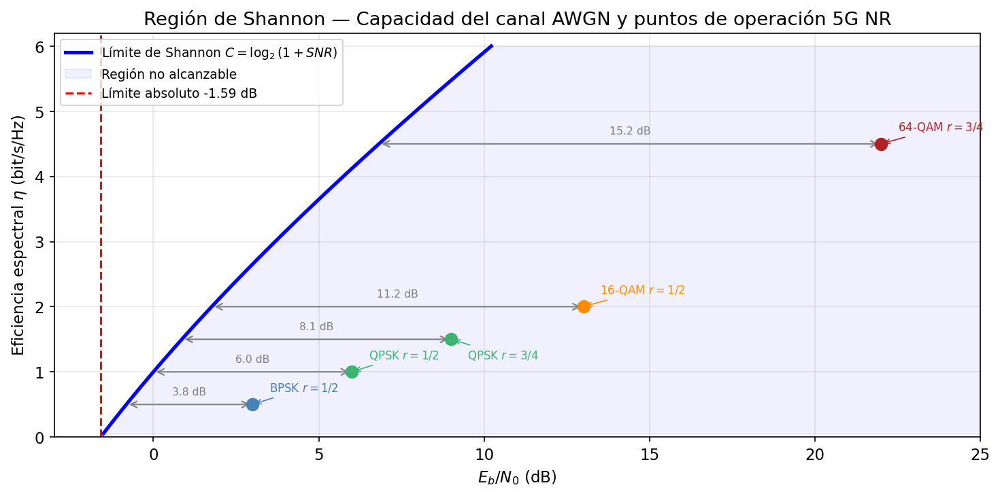
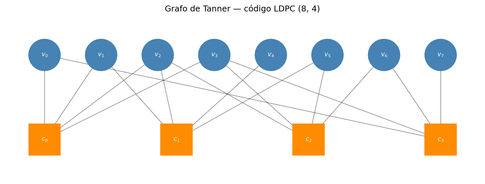
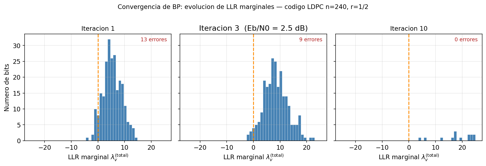
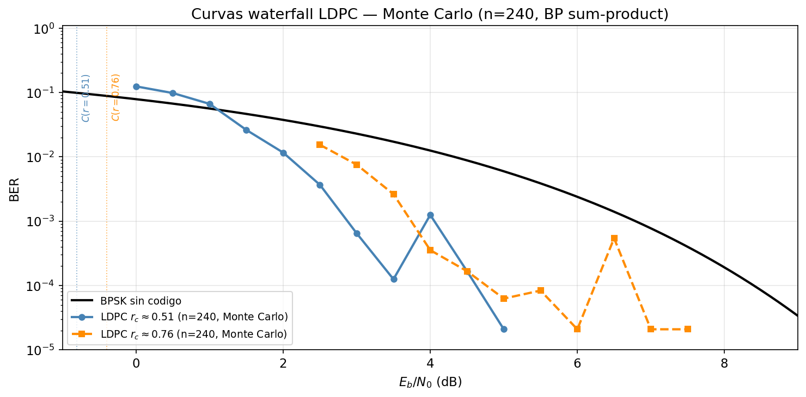
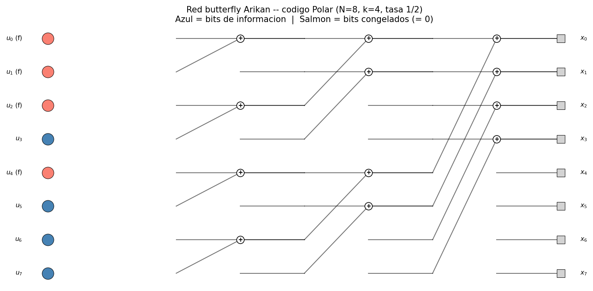
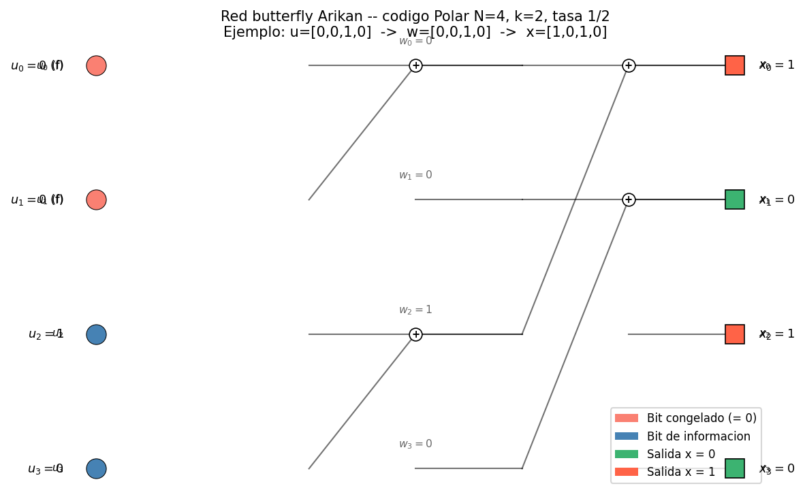
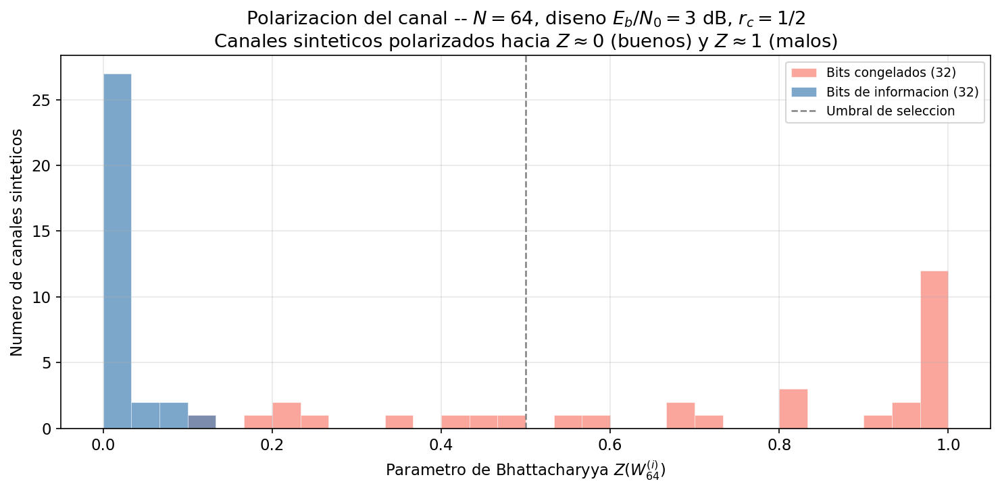
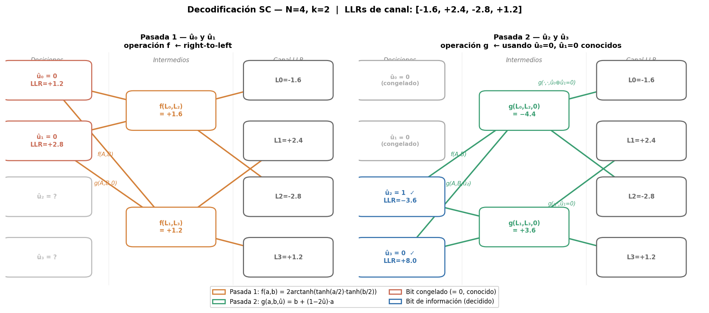
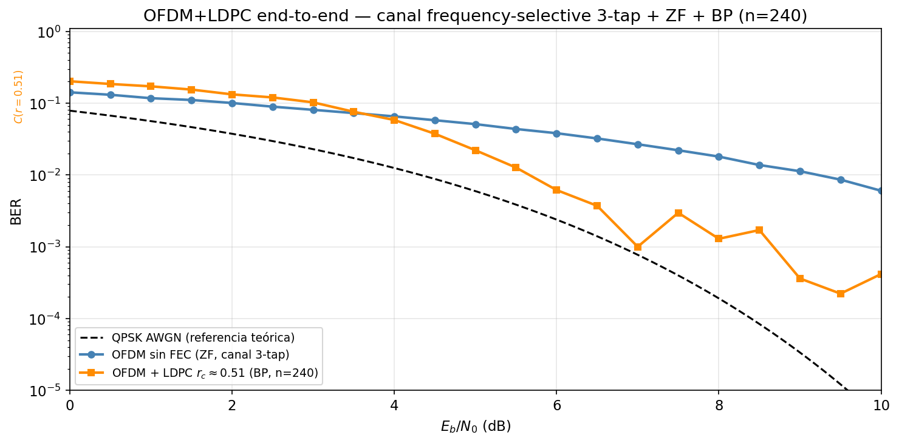

# Sesión 05 — Codificación de Canal: LDPC y Códigos Polar

## Objetivos de Aprendizaje

Al finalizar esta sesión, el estudiante será capaz de:

1. Calcular la capacidad de Shannon de un canal AWGN y determinar el Eb/N0 mínimo teórico para comunicación fiable
2. Explicar el concepto de ganancia de codificación y calcularla a partir de curvas de BER
3. Describir la estructura del grafo de Tanner de un código LDPC y el principio del algoritmo de belief propagation
4. Derivar las transformaciones de polarización del canal que dan lugar a los códigos Polar
5. Identificar qué código (LDPC o Polar) usa 5G NR en cada canal físico y por qué

---

## Introducción

En la Sesión 03, el Ejercicio 6 calculó que un sistema OFDM operaba al 86% de la capacidad de Shannon en condiciones realistas. En la Sesión 02, el selector de MCS usó un umbral de BER pre-FEC de $10^{-1}$ — una BER que un detector sin código nunca aceptaría — dando por sentado que el código LDPC de 5G NR la transformaba en $<10^{-5}$. Ambas sesiones usaron la codificación de canal como una "caja negra" con propiedades mágicas. Esta sesión abre esa caja.

La pregunta central es: si un canal introduce errores inevitablemente, ¿cómo es posible comunicar sin errores? La respuesta, contra toda intuición, es: añadiendo más bits. Específicamente, añadiendo bits de redundancia cuidadosamente diseñados para que el receptor pueda detectar y corregir los errores del canal. Shannon (1948) demostró que esto es posible para cualquier tasa $R < C$, donde $C$ es la capacidad del canal. Durante casi 50 años nadie supo construir códigos que se acercaran al límite; los turbo codes (1993) y los LDPC codes (redescubiertos 1996) rompieron esa barrera. Los códigos Polar (Arıkan 2009) son los primeros en ser teóricamente demostrables como capacity-achieving.

---

## Teoría

### 1. El Límite de Shannon

La Sesión 03 usó la capacidad de Shannon como referencia de throughput. El resultado central es el **Teorema de Shannon-Hartley**:

$$\boxed{C = B\log_2(1+\text{SNR})\quad \text{[bit/s]}} \tag{1}$$

donde $B$ es el ancho de banda [Hz] y SNR es la relación señal a ruido lineal en el receptor. Este límite establece dos hechos complementarios: la *mitad positiva* — para cualquier tasa $R < C$ existe un código de longitud $n$ suficientemente grande tal que la probabilidad de error es arbitrariamente pequeña — y la *mitad negativa* o "converso" — para cualquier $R > C$, la probabilidad de error se acerca a 1 sin importar qué código se use.

<!-- Derivación geométrica (sphere-packing) comentada 2026-06-04.

  Capacidad como ratio de volúmenes: en n usos del canal, la señal transmitida ocupa un
  punto en R^n con energía E_s = nP_s. El ruido la desplaza dentro de una esfera de radio
  sqrt(nN_0/2); el punto recibido cae en una esfera de radio sqrt(n(P_s+N_0/2)).
  Número máximo de mensajes: M ≈ (1+SNR)^(n/2) → C = (1/2)log2(1+SNR) [bits/uso real].
  Para canales bandpass (2 dimensiones/uso): C = B·log2(1+SNR) [bit/s].

  Figura original: figures/shannon-sphere-packing.png  (generada por gsd-quick shannon-sphere-packing)
  Caption: Argumento geométrico de Shannon. Izquierda: el punto transmitido x vive en una
  esfera de radio sqrt(nPs); el ruido lo desplaza dentro de una esfera de radio sqrt(nN0/2).
  El número máximo de codewords distinguibles es el número de esferas de ruido que caben en
  la esfera total de radio sqrt(n(Ps+N0/2)). Derecha: M ≈ (1+SNR)^(n/2) crece
  exponencialmente con el bloque n.
-->

**El límite de Eb/N0.** ¿Cuál es el SNR mínimo absoluto para comunicar fiablemente? Si la tasa espectral es $\eta = R/B$ [bit/s/Hz], la condición $R < C$ exige:

$$\eta < \log_2(1 + \text{SNR}) \Rightarrow \text{SNR} > 2^\eta - 1$$

Expresando SNR en términos de Eb/N0: $\text{SNR} = (E_b/N_0)\cdot(R/B) = (E_b/N_0)\cdot\eta$. Sustituyendo:

$$(E_b/N_0)\cdot\eta > 2^\eta - 1 \Rightarrow E_b/N_0 > \frac{2^\eta - 1}{\eta}$$

A medida que $\eta \to 0$ (tasa de bits muy baja): $\lim_{\eta\to0}\frac{2^\eta-1}{\eta} = \ln 2 \approx 0{,}693$.

El **límite absoluto de Shannon** es $E_b/N_0 \geq \ln 2 = -1{,}59\ \text{dB}$. Por debajo de este valor no existe ningún código capaz de comunicar fiablemente, para ninguna tasa y ningún esquema de modulación.

La figura siguiente sitúa los MCS codificados de la Sesión 02 sobre la frontera de Shannon. Las flechas muestran la **brecha de codificación**: cuántos dB de $E_b/N_0$ separan cada sistema del límite teórico a la misma eficiencia espectral.

<figure markdown="span">
  
  <!-- generada por celda 3 de lab.ipynb -->
  <figcaption markdown="1">**Figura 1.** Eficiencia espectral $\eta = C/B$ (bit/s/Hz) en función de $E_b/N_0$ (dB) para el canal AWGN. La **curva azul** es la frontera de Shannon: para cada $\eta$, el $E_b/N_0$ mínimo necesario es $(2^\eta-1)/\eta$. La **región salmón** (izquierda de la curva) es no alcanzable — ningún código puede comunicar fiablemente por debajo de esa frontera, independientemente de su complejidad. Los puntos de colores son cinco MCS codificados de la Sesión 02: BPSK $r=1/2$, QPSK $r=1/2$, QPSK $r=3/4$, 16-QAM $r=1/2$ y 64-QAM $r=3/4$, situados en $(\eta_{\text{eff}},\,E_b/N_0)$ con $\eta_{\text{eff}} = \log_2(M)\cdot r_c$. Las flechas horizontales muestran la **brecha de codificación**: cuántos dB podría reducirse el $E_b/N_0$ si el código operara justo en el límite de Shannon a la misma $\eta_{\text{eff}}$. La línea roja vertical marca el límite absoluto $E_b/N_0 = -1{,}59$ dB.
  </figcaption>
</figure>

La pregunta natural es: el límite $E_b/N_0 \geq \ln 2 = -1{,}59\ \text{dB}$ marca la frontera absoluta de lo posible, pero los sistemas reales operan varios dB por encima de ella. ¿Cómo se construye un código que se acerque a esa frontera sin cruzarla? La respuesta es la redundancia estructurada: añadir bits de paridad diseñados para que el receptor detecte y corrija los errores del canal, reduciendo el Eb/N0 necesario mediante ganancia de codificación.

---

### 2. Codificación de Canal: Redundancia Estructurada

La intuición es que la redundancia permite corrección de errores: si se envían 3 copias de cada bit y el receptor vota por mayoría, puede corregir hasta 1 error de 3. Pero esta repetición simple es ineficiente en espectro — la tasa cae a 1/3. Los códigos modernos logran la misma corrección con mucho menos overhead.

**Códigos de bloque lineales.** Un código $(n, k)$ mapea $k$ bits de información en $n$ bits de codeword. La tasa del código es $r_c = k/n$. El conjunto de codewords válidos forman un subespacio lineal de $\mathbb{F}_2^n$ — el espacio vectorial binario de dimensión $n$.

La estructura se define mediante la **matriz de verificación de paridad** $\mathbf{H}$ de dimensiones $(n-k)\times n$: un vector $\mathbf{c}$ es una codeword válida si y sólo si:

$$\mathbf{H}\,\mathbf{c} = \mathbf{0} \pmod{2}$$

La **distancia mínima** $d_{\min}$ del código es el número mínimo de bits en que difieren dos codewords distintas. Un código de distancia mínima $d_{\min}$ puede corregir hasta $t = \lfloor(d_{\min}-1)/2\rfloor$ errores.

**El trade-off de la codificación.** Con un código de tasa $r_c < 1$, para transmitir $k$ bits de información el codificador produce $n = k/r_c$ bits de canal. La energía total del bloque es $k \cdot E_b$ — la comprometida por los $k$ bits de información. Los $n - k$ bits de paridad no aportan energía adicional: son redundancia, no nueva información transmitida. Al repartir esa energía fija entre los $n$ bits de canal:

$$E_c = \frac{k \cdot E_b}{n} = \frac{k \cdot E_b}{k/r_c} = r_c \cdot E_b \quad \Longrightarrow \quad \frac{E_c}{N_0} = r_c \cdot \frac{E_b}{N_0}$$

Cada bit de canal recibe solo una fracción $r_c$ de la energía por bit de información. Esto introduce una **penalización por tasa** de $10\log_{10}(1/r_c)$ dB. Para que el código sea beneficioso, la ganancia en distancia mínima debe superar esa penalización — esta es la condición necesaria para que exista ganancia de codificación neta.

La **ganancia de codificación** es la reducción neta de Eb/N0 (en dB) necesaria para alcanzar una BER objetivo:

$$G_c = \left.\frac{E_b}{N_0}\right\vert_{\text{sin código}} - \left.\frac{E_b}{N_0}\right\vert_{\text{con código}} \quad \text{[dB, a misma BER]} \tag{2}$$

Para LDPC con $r_c = 1/2$ operando a BER $= 10^{-5}$ sobre AWGN: $G_c \approx 8\ \text{dB}$ — se necesita 8 dB menos de SNR que con BPSK sin código para la misma fiabilidad.

La pregunta natural es: $G_c \approx 8\ \text{dB}$ es una mejora sustancial, pero ¿qué estructura interna tiene el código que lo hace posible? Añadir bits de redundancia arbitrarios no es suficiente — la ganancia de codificación depende de cómo se diseñan las relaciones de paridad entre bits. ¿Qué arquitectura matemática permite al decodificador explotar esas relaciones de forma eficiente? La respuesta es el grafo de Tanner disperso de los códigos LDPC, donde cada ecuación de paridad conecta solo un subconjunto pequeño de bits y el decodificador puede propagar correcciones de forma iterativa.

---

### 3. Códigos LDPC: Grafos Dispersos e Iteración

Los códigos LDPC (*Low-Density Parity-Check*) fueron propuestos por Gallager (1962) y redescubiertos por MacKay (1996). Su nombre describe la propiedad clave: la matriz de verificación de paridad $\mathbf{H}$ es **dispersa** — tiene muy pocos unos respecto al total de entradas.

#### 3.1 El Grafo de Tanner

La representación más intuitiva de un LDPC es su **grafo de Tanner**: un grafo bipartito con dos tipos de nodos:

- **Nodos de variable** ($n$ nodos, uno por cada bit del codeword): representan los $n$ bits transmitidos.
- **Nodos de verificación** ($n-k$ nodos, uno por cada ecuación de paridad): representan las $n-k$ ecuaciones $\mathbf{H}\,\mathbf{c} = \mathbf{0}$.

Para el código LDPC $(8,4)$ del laboratorio, la matriz $\mathbf{H}$ de dimensiones $4\times 8$ es:

$$\mathbf{H} = \begin{pmatrix}
1&1&1&1&0&0&0&0\\
0&1&1&0&1&1&0&0\\
0&0&1&1&0&1&1&0\\
1&0&0&1&0&0&1&1
\end{pmatrix}$$

Cada fila es una ecuación de paridad: la suma XOR de los bits en las columnas donde hay un 1 debe ser cero. Las cuatro restricciones que todo codeword válido debe satisfacer son:

| Check node | Ecuación de paridad |
|------------|---------------------|
| $c_0$ | $v_0 \oplus v_1 \oplus v_2 \oplus v_3 = 0$ |
| $c_1$ | $v_1 \oplus v_2 \oplus v_4 \oplus v_5 = 0$ |
| $c_2$ | $v_2 \oplus v_3 \oplus v_5 \oplus v_6 = 0$ |
| $c_3$ | $v_0 \oplus v_3 \oplus v_6 \oplus v_7 = 0$ |

Hay una arista entre $v_j$ y $c_i$ si y sólo si $H_{ij} = 1$ — cuando el bit $j$ participa en la ecuación de paridad $i$. La Figura 2 muestra ese grafo para este código.

<figure markdown="span">
  
  <!-- generada por celda 7 de lab.ipynb -->
  <figcaption markdown="1">**Figura 2.** Grafo bipartito de Tanner para un código LDPC representativo. Los nodos de variable $v_j$ (círculos) representan los bits del codeword; los nodos de verificación $c_i$ (cuadrados) representan las ecuaciones de paridad $H_{ij}=1$ de la matriz $\mathbf{H}$.
  La dispersidad del grafo — pocos unos en $\mathbf{H}$, aristas escasas — garantiza ciclos largos y convergencia rápida del decodificador belief propagation.
  </figcaption>
</figure>

La dispersidad del grafo es la razón por la que el decodificador iterativo converge eficientemente. En grafos dispersos, los ciclos son largos — esto minimiza las correlaciones entre mensajes en iteraciones sucesivas.

**La entrada al decodificador: valores LLR.** Tras la demodulación, el receptor no entrega bits duros (0 o 1) al decodificador — entrega una **medida de confianza** por cada bit del codeword, el *log-likelihood ratio*:

$$\lambda_v = \log\frac{P(\text{bit}=0 \mid y)}{P(\text{bit}=1 \mid y)} \tag{3}$$

Un LLR grande y positivo indica que el bit es casi seguramente 0; grande y negativo, casi seguramente 1; cercano a cero, alta incertidumbre. El canal AWGN puede invertir el signo del LLR de algún bit — ese es el "error" que el decodificador debe corregir.

**El objetivo de la decodificación.** El decodificador BP parte de esos LLRs de canal y los ajusta iterativamente usando las ecuaciones de paridad como restricciones: los check nodes detectan qué bits violan sus ecuaciones y retroalimentan esa información a sus variable nodes vecinos para corregir sus LLRs. El proceso termina cuando los bits decodificados satisfacen simultáneamente las $n-k$ ecuaciones:

$$\mathbf{H}\,\hat{\mathbf{c}} = \mathbf{0} \pmod{2}$$

El cómo se calculan esos mensajes entre nodos es el algoritmo de belief propagation, que se detalla a continuación.

La pregunta natural es: el grafo de Tanner disperso con ciclos largos es la estructura que hace posible la decodificación iterativa, pero ¿cómo explota concretamente esa estructura un decodificador para propagar correcciones de bit en bit? ¿Qué mensajes se intercambian entre nodos de variable y nodos de verificación, y cómo convergen hacia la codeword correcta? La respuesta es el algoritmo de belief propagation, que circula log-likelihood ratios por las aristas del grafo en iteraciones sucesivas hasta que todas las ecuaciones de paridad se satisfacen.

#### 3.2 Belief Propagation (Propagación de Creencias)

El algoritmo de decodificación de LDPC es **belief propagation** (BP), también llamado *sum-product algorithm* o *message passing*. La idea es que cada nodo transmite a sus vecinos un mensaje que representa su "creencia" sobre los bits desconocidos, basándose en toda la información que ha recibido de sus otros vecinos.

Los mensajes se representan como **log-likelihood ratios** (LLRs): $\lambda = \log(P(\text{bit}=0)/P(\text{bit}=1))$. Un LLR positivo indica que el bit es probablemente 0; negativo, que probablemente 1.

**Inicialización.** El canal proporciona el LLR de observación para cada bit: $\lambda_v^{(0)} = \log\frac{P(y|c_v=0)}{P(y|c_v=1)}$. Para AWGN con varianza $\sigma^2$: $\lambda_v^{(0)} = 2y/\sigma^2$.

**Iteración.** En cada iteración:

**Paso 1 (variable → verificación).** Cada nodo de variable $v$ envía a cada nodo de verificación $c$ la suma de todos los mensajes entrantes *excepto* el de $c$:

$$\mu_{v\to c} = \lambda_v^{(0)} + \sum_{c' \neq c} \mu_{c' \to v} \tag{4}$$

**Paso 2 (verificación → variable).** Cada nodo de verificación $c$ envía a cada nodo de variable $v$ la "verificación de consistencia" de todos los demás mensajes entrantes:

$$\mu_{c\to v} = 2\,\text{arctanh}\!\left(\prod_{v' \neq v} \tanh\!\left(\frac{\mu_{v'\to c}}{2}\right)\right) \tag{5}$$

Este mensaje puede interpretarse como: "dado todo lo que sé de mis otros vecinos, ¿qué debería ser el bit $v$ para que la paridad se cumpla?"

**Paso 3 (decisión).** La creencia actualizada de cada nodo de variable es:

$$\lambda_v^{(\text{total})} = \lambda_v^{(0)} + \sum_c \mu_{c\to v}$$

La decisión es $\hat{c}_v = 0$ si $\lambda_v^{(\text{total})} > 0$, y $1$ en caso contrario.

??? example "Ejemplo numérico: una iteración completa con LDPC (8,4)"

    **Escenario.** Se transmite el codeword de todos ceros sobre BPSK (bit 0 → señal +1, bit 1 → señal −1) a través de un canal AWGN con $\sigma^2 = 1$. El receptor observa señales con ruido y calcula los LLRs de canal con $\lambda_v^{(0)} = 2y$:

    | Bit | Señal recibida $y$ | $\lambda^{(0)} = 2y$ | Canal dice |
    |-----|-------------------|----------------------|------------|
    | $v_0$ | +0.7 | **+1.4** | probablemente 0 ✓ |
    | $v_1$ | +1.2 | **+2.4** | probablemente 0 ✓ |
    | $v_2$ | −0.3 | **−0.6** | probablemente 1 ✗ ← error |
    | $v_3$ | +0.8 | **+1.6** | probablemente 0 ✓ |
    | $v_4$ | +1.5 | **+3.0** | probablemente 0 ✓ |
    | $v_5$ | +0.4 | **+0.8** | probablemente 0 ✓ |
    | $v_6$ | +1.1 | **+2.2** | probablemente 0 ✓ |
    | $v_7$ | +0.9 | **+1.8** | probablemente 0 ✓ |

    $v_2$ llegó negativo por ruido: sin FEC sería un bit erróneo. BP debe corregirlo.

    **Vecinos de $v_2$ en el grafo de Tanner.**
    La columna 2 de $\mathbf{H}$ indica qué check nodes verifican $v_2$ (filas con $H_{i,2}=1$):

    $$\mathbf{H} = \begin{pmatrix} 1&1&\mathbf{1}&1&0&0&0&0 \\ 0&1&\mathbf{1}&0&1&1&0&0 \\ 0&0&\mathbf{1}&1&0&1&1&0 \\ 1&0&\mathbf{0}&1&0&0&1&1 \end{pmatrix}$$

    Las filas 0, 1 y 2 tienen un 1 en la columna de $v_2$, por eso $v_2$ tiene aristas con $c_0$, $c_1$ y $c_2$ — y no con $c_3$.

    ---

    **Paso 1 (v→c)** — fórmula: $\mu_{v \to c} = \lambda_v^{(0)} + \sum_{c' \neq c} \mu_{c' \to v}$

    En la primera iteración no hay mensajes previos de los check nodes ($\mu_{c' \to v} = 0$), así que la fórmula se reduce a $\mu_{v \to c} = \lambda_v^{(0)}$. Cada variable reenvía simplemente su LLR de canal:

    | Variable | Envía a | Mensaje $\mu_{v \to c}$ |
    |----------|---------|------------------------|
    | $v_2$ | $c_0$ | $-0.6$ |
    | $v_2$ | $c_1$ | $-0.6$ |
    | $v_2$ | $c_2$ | $-0.6$ |

    (Todos los demás bits envían igualmente sus LLRs iniciales a sus respectivos vecinos check.)

    ---

    **Paso 2 (c→v)** — fórmula: $\mu_{c \to v} = 2\,\text{arctanh}\!\left(\prod_{v' \neq v} \tanh\!\left(\frac{\mu_{v' \to c}}{2}\right)\right)$

    $c_0$ verifica $\{v_0, v_1, v_2, v_3\}$ (fila 0 de $\mathbf{H}$). Recibió $\mu_{v_0\to c_0}{=}{+1.4}$, $\mu_{v_1\to c_0}{=}{+2.4}$, $\mu_{v_2\to c_0}{=}{-0.6}$, $\mu_{v_3\to c_0}{=}{+1.6}$. Para enviar a $v_2$, excluye $v_2$ y multiplica los tanh de los demás:

    $$\tanh(+1.4/2)\cdot\tanh(+2.4/2)\cdot\tanh(+1.6/2) = 0.604\times0.834\times0.664 = +0.334$$

    $$\mu_{c_0 \to v_2} = 2\,\text{arctanh}(+0.334) = +0.696$$

    El signo positivo significa: *"$v_0$, $v_1$ y $v_3$ creen que son 0; para que $v_0 \oplus v_1 \oplus v_2 \oplus v_3 = 0$, tú también debes ser 0."*

    De forma análoga $c_1$ (fila 1, verifica $\{v_1,v_2,v_4,v_5\}$) y $c_2$ (fila 2, verifica $\{v_2,v_3,v_5,v_6\}$) envían:

    $$\mu_{c_1 \to v_2} = +0.876 \qquad \mu_{c_2 \to v_2} = +0.523$$

    ---

    **Paso 3 (decisión)** — fórmula: $\lambda_v^{(\text{total})} = \lambda_v^{(0)} + \sum_c \mu_{c \to v}$

    $$\lambda_{v_2}^{(\text{total})} = \underbrace{-0.6}_{\text{canal}} + \underbrace{+0.696}_{c_0} + \underbrace{+0.876}_{c_1} + \underbrace{+0.523}_{c_2} = +1.095$$

    El LLR pasó de $-0.6$ (canal: "probablemente 1") a $+1.095$ (BP: "probablemente 0") — **error corregido en una sola iteración**.

    ---

    **Resultado final tras 1 iteración** (todos los bits):

    | Bit | $\lambda$ canal | $\lambda$ final | Decisión | |
    |-----|----------------|-----------------|----------|-|
    | $v_0$ | +1.4 | +1.877 | 0 | ✓ |
    | $v_1$ | +2.4 | +1.964 | 0 | ✓ |
    | $v_2$ | **−0.6** | **+1.095** | **0** | **✓ corregido** |
    | $v_3$ | +1.6 | +1.850 | 0 | ✓ |
    | $v_4$ | +3.0 | +2.815 | 0 | ✓ |
    | $v_5$ | +0.8 | +0.041 | 0 | ✓ |
    | $v_6$ | +2.2 | +2.644 | 0 | ✓ |
    | $v_7$ | +1.8 | +2.466 | 0 | ✓ |

    $v_5$ quedó con $\lambda = +0.041$ — casi en el umbral. Con más ruido o más bits erróneos simultáneos, haría falta una segunda iteración para consolidarlo.

El algoritmo itera hasta que $\mathbf{H}\,\hat{\mathbf{c}} = \mathbf{0}$ (codeword válida) o hasta un número máximo de iteraciones (típicamente 50–100). El comportamiento en la práctica muestra una **curva en cascada** (*waterfall*): por encima del umbral de SNR, el BP converge en pocas iteraciones; por debajo, no converge y la BER cae precipitosamente.

<figure markdown="span">
  
  <!-- generada por celda 7c de lab.ipynb -->
  <figcaption markdown="1">**Figura 3.** Histograma de los LLR marginales $\lambda_v^{(\text{total})}$ de los $n=240$ bits durante el algoritmo de belief propagation. Cada barra indica cuántos bits tienen un LLR en ese rango. Código LDPC $r_c\approx1/2$, codeword todo-ceros transmitida (todos los bits deben ser 0), $E_b/N_0=2{,}5\ \text{dB}$ (zona de transición del waterfall). Por convención, un LLR correcto es positivo ($\lambda > 0$ → decisión 0 ✓); un bit a la izquierda de la línea naranja ($\lambda < 0$) es un error. El número en rojo de cada panel cuenta exactamente esos bits.
  **Iteración 1:** los LLR son esencialmente los del canal ($\lambda_v^{(0)} = 2y/\sigma^2$); la distribución gaussiana refleja el ruido AWGN y se centra en un valor pequeño y positivo — la mayoría de bits apunta correctamente a 0 pero con poca confianza.
  **Iteración 3:** la distribución se desplaza hacia la derecha (+x): los mensajes de los check nodes refuerzan las creencias correctas y alejan los LLRs del cero, reduciendo la incertidumbre. No hay desplazamiento hacia el extremo negativo porque el codeword es todo-ceros.
  **Iteración 10:** el histograma muestra pocas barras dentro del rango $[-25, +25]$ — las barras visibles corresponden a bits con LLR de magnitud moderada en esa iteración, entre ellos los errores residuales (LLR $< 0$). El algoritmo termina cuando $\mathbf{H}\hat{\mathbf{c}} = \mathbf{0}$ (todos los bits positivos implican decisión 0, que es la codeword correcta), no cuando los LLRs alcanzan algún umbral de magnitud.
  </figcaption>
</figure>

<figure markdown="span">
  
  <!-- generada por celda 7d de lab.ipynb -->
  <figcaption markdown="1">**Figura 4.** Curvas BER Monte Carlo para el código LDPC de $n=240$ bits con tasas $r_c\approx1/2$ (azul) y $r_c\approx3/4$ (naranja), comparadas con BPSK sin código (negro). Simulación BP sum-product con 200 bloques por punto de SNR; las líneas verticales punteadas marcan el límite teórico de Shannon para cada tasa.
  Las líneas verticales punteadas son los **límites de Shannon** por tasa ($E_b/N_0\vert_{\text{Shannon}} \approx -0{,}8$ dB para $r_c\approx0{,}51$), no umbrales de BP. El **umbral práctico de decodificación** — donde la cascada empieza a caer — está alrededor de $\approx 2$ dB para este código corto ($n=240$): la "brecha al límite de Shannon" de este código es $\approx 2{,}8$ dB. A partir de ese umbral práctico, la BER cae más de 3 décadas en $\approx 1{,}5$ dB (de $10^{-1}$ a $\lesssim 10^{-4}$ entre 2 y 3,5 dB) — esa pendiente abrupta es la cascada característica del LDPC. La irregularidad visible a BER $\lesssim 10^{-4}$ es ruido estadístico de Monte Carlo ($\sim$5 errores por punto a esa BER), no un *error floor* real.
  </figcaption>
</figure>

La pregunta natural es: la decisión $\hat{c}_v$ y la curva waterfall describen el comportamiento ideal sobre un grafo pequeño, pero 5G NR transmite bloques de datos de miles de bits — los grafos correspondientes tendrían millones de aristas y serían inviables de almacenar y procesar directamente. ¿Cómo escala el algoritmo BP a esas dimensiones manteniendo el mismo hardware de decodificador? La respuesta es la estructura de grafo base con lifting: un grafo compacto que se expande mediante permutaciones cíclicas para generar matrices $\mathbf{H}$ de cualquier longitud con un único diseño de hardware.

#### 3.3 LDPC en 5G NR

5G NR usa dos familias de grafos base LDPC (*base graphs*, BG):

- **BG1**: grafo base de 46×68, bloque máximo de información de $k = 8448$ bits. Optimizado para bloques de datos grandes ($k > 3840$ bits) y tasas altas ($r_c \geq 1/3$). Se usa en PDSCH y PUSCH para la mayoría de las transmisiones de datos.
- **BG2**: grafo base de 42×52, bloque máximo de $k = 3840$ bits. Optimizado para bloques pequeños y tasas bajas ($r_c \geq 1/5$). Para control de datos y retransmisiones HARQ.

??? note "Canales físicos de 5G NR mencionados"

    - **PDSCH** (*Physical Downlink Shared Channel*): canal de datos en downlink — lleva tráfico IP desde la red hacia el UE. Usa BG1 para la mayoría de las transmisiones.
    - **PUSCH** (*Physical Uplink Shared Channel*): canal de datos en uplink — lleva tráfico desde el UE hacia la red. También usa BG1 en condiciones normales.
    - **HARQ** (*Hybrid Automatic Repeat reQuest*): mecanismo de retransmisión que combina FEC con solicitud de reenvío. Si el decodificador falla, el UE pide una retransmisión; el receptor combina ambas recepciones para mejorar la probabilidad de éxito. Los bloques HARQ son típicamente más cortos, de ahí el uso de BG2.

**Lifting: un grafo base, cientos de longitudes.** El grafo base (por ejemplo BG1 de 46×68) es un diseño compacto de referencia. El *lifting* con factor $Z$ lo expande: cada nodo del grafo base se convierte en $Z$ nodos, y cada arista en una permutación cíclica entre grupos de $Z$ nodos. La matriz $\mathbf{H}$ resultante tiene dimensiones $(46 \times Z) \times (68 \times Z)$, produciendo codewords de longitud $n = 68Z$. En 5G NR, $Z$ puede tomar valores de 2 a 384, cubriendo codewords de hasta $68 \times 384 = 26\,112$ bits — todos decodificables con el mismo hardware diseñado para el grafo base.

La pregunta natural es: los grafos base BG1 y BG2 se encontraron mediante búsqueda empírica — se simularon miles de grafos candidatos y se eligieron los que producían el mejor umbral waterfall. Funcionan muy bien en práctica, pero no existe demostración matemática de que alcancen la capacidad de Shannon. ¿Existe una familia de códigos que alcance la capacidad del canal con una prueba formal, sin búsqueda aleatoria de grafos? La respuesta es la familia de códigos Polar: Arıkan (2009) demostró matemáticamente que alcanzan exactamente la capacidad de Shannon en el límite $N \to \infty$, mediante transformaciones deterministas — los primeros códigos en la historia con esa garantía teórica.

---

### 4. Códigos Polar: Polarización del Canal

Los códigos Polar fueron propuestos por Arıkan (2009) y son los primeros códigos demostrablemente *capacity-achieving* para canales binarios simétricos — no se aproximan al límite, sino que lo alcanzan asintóticamente con decodificación de cancelación sucesiva.

#### 4.1 Polarización del Canal

La idea central es combinar dos copias independientes de un canal $W$ para crear dos canales sintéticos: uno "mejor" que $W$ y otro "peor". Repetir este proceso $\log_2 N$ veces con $N = 2^n$ copias produce $N$ canales sintéticos que se polarizan: una fracción tiende a ser perfecta (capacidad 1) y la complementaria tiende a ser inútil (capacidad 0).

**La transformación $W_2$.** Dadas dos copias del canal $W$ y dos bits de entrada $(u_1, u_2)$:

- Se transmiten $(x_1, x_2) = (u_1 \oplus u_2,\, u_2)$ — la transformación butterfly $G_2 = \begin{pmatrix}1&0\\1&1\end{pmatrix}$.
- El canal sintético $W_2^{(-)}$ ve $u_1$ con menos información (peor canal).
- El canal sintético $W_2^{(+)}$ ve $u_2$ con más información, dado $u_1$ ya decodificado (mejor canal).

La Figura 5 muestra cómo esta transformación N=2 se aplica recursivamente $n = \log_2 N$ veces. Cada columna de nodos XOR es una etapa butterfly: la etapa 1 combina pares adyacentes, la etapa 2 combina bloques de 4, y así sucesivamente. Con $N=8$ hay 3 etapas; los 8 canales sintéticos que emergen a la derecha del grafo son el resultado de aplicar la polarización $\log_2 8 = 3$ veces consecutivas.

<figure markdown="span">
  
  <!-- generada por celda 15 de lab.ipynb -->
  <figcaption markdown="1">**Figura 5.** Red butterfly de Arikan para un código Polar de $N=8$, $k=4$ (tasa $r_c=1/2$). Los nodos de entrada (izquierda) corresponden al vector $\mathbf{u}$: los azules son bits de información, los salmón son bits congelados (fijados a 0 por el codificador). Cada nodo interior (marcado con "+") representa una operación XOR que implementa recursivamente la transformación $G_N = G_2^{\otimes n}$ de Arıkan; la composición de $n = \log_2 N$ etapas butterfly produce la codeword $\mathbf{x}$ (cuadrados, derecha).
  </figcaption>
</figure>

**El encoder como transformación N→N.** La red butterfly es una transformación cuadrada: recibe exactamente $N$ bits de entrada y produce exactamente $N$ bits de codeword. De esos $N$ bits de entrada, $k$ son **bits de información** (los que el transmisor quiere comunicar) y $N-k$ son **bits congelados**, fijados a 0 por diseño. El transmisor construye el vector completo $\mathbf{u}$ colocando sus $k$ bits en las posiciones "buenas" y un cero en cada posición "mala"; ese $\mathbf{u}$ — completamente conocido — entra al butterfly. La tasa del código es $r_c = k/N$.

**Selección de posiciones: parámetro de Bhattacharyya.** La elección de qué posiciones son "buenas" y cuáles son "malas" se hace fuera de línea, como parte del diseño del código. Para cada canal sintético $i$, el parámetro de Bhattacharyya $Z(W_N^{(i)}) \in [0,1]$ mide su calidad: $Z\approx 0$ indica canal casi perfecto; $Z\approx 1$ indica canal casi inútil. Se ordenan los $N$ canales sintéticos por $Z$ ascendente y se asignan:

- Las $k$ posiciones con $Z$ **más bajo** → bits de información (canales buenos)
- Las $N-k$ posiciones con $Z$ **más alto** → bits congelados = 0 (canales malos)

Tanto el encoder como el decoder conocen de antemano cuáles posiciones son información y cuáles están congeladas — es información pública del código, no se transmite por el canal.

??? example "Ejemplo: encoding butterfly N=4 paso a paso"

    <figure markdown="span">
      
      <!-- generada por celda 16 de lab.ipynb -->
      <figcaption markdown="1">**Red butterfly para el ejemplo.** Código Polar $N=4$, $k=2$, tasa $r_c=1/2$. Los nodos de entrada (izquierda) muestran los valores del vector $\mathbf{u}=[0,0,1,0]$: los salmón son bits congelados (fijados a 0), los azules son bits de información. Los valores intermedios $w_i$ entre etapas y la codeword de salida $\mathbf{x}=[1,0,1,0]$ (cuadrados, derecha) corresponden paso a paso al cálculo detallado a continuación.</figcaption>
    </figure>

    **Escenario.** Código Polar $N=4$, tasa $r_c=1/2$. Los bits congelados son $\{u_0, u_1\}$ (fijados a 0) y los bits de información son $\{u_2, u_3\}$. Tomamos el vector de entrada:

    ```
    u = [u0, u1, u2, u3] = [0, 0, 1, 0]
         frozen frozen info  info
    ```

    **Etapa 1 — combinar pares adyacentes (índices 0,1) y (2,3):**

    $w_0 = u_0 \oplus u_1 = 0 \oplus 0 = 0$  
    $w_1 = u_1 = 0$  
    $w_2 = u_2 \oplus u_3 = 1 \oplus 0 = 1$  
    $w_3 = u_3 = 0$  

    Valores intermedios: $\mathbf{w} = [0, 0, 1, 0]$

    **Etapa 2 — combinar pares intercalados (índices 0,2) y (1,3):**

    $x_0 = w_0 \oplus w_2 = 0 \oplus 1 = 1$  
    $x_1 = w_1 \oplus w_3 = 0 \oplus 0 = 0$  
    $x_2 = w_2 = 1$  
    $x_3 = w_3 = 0$  

    Codeword resultante: **x = [1, 0, 1, 0]**

    **¿Por qué $u_0$ es el canal sintético más débil?**

    | Bit | Aparece en | Señales que lo transportan |
    |-----|-----------|---------------------------|
    | $u_0$ | $x_0$ | **1** |
    | $u_1$ | $x_0, x_1$ | **2** |
    | $u_2$ | $x_0, x_2$ | **2** |
    | $u_3$ | $x_0, x_1, x_2, x_3$ | **4** |

    $u_3$ se distribuye por las 4 posiciones del codeword: el receptor dispone de cuatro observaciones ruidosas independientes para recuperarlo, más la información de cancelación de $\hat{u}_0$, $\hat{u}_1$, $\hat{u}_2$ ya decodificados. $u_0$, en cambio, solo llega a $x_0$ y el decodificador SC lo decodifica primero, sin ninguna información de cancelación. Eso es exactamente lo que mide el parámetro de Bhattacharyya $Z(W)$: la dificultad de recuperar un bit sin contexto adicional.

**¿Cómo medir si un canal sintético es "bueno" o "malo"?** El **parámetro de Bhattacharyya** $Z(W) \in [0,1]$ cumple esa función: es una cota superior de la probabilidad de error del detector de máxima verosimilitud sobre ese canal en solitario, sin ningún código adicional. $Z=0$ significa canal ideal — el detector nunca se equivoca. $Z=1$ significa canal completamente inútil — equivalente a adivinar al azar. Las transformaciones butterfly satisfacen:

$$Z(W_2^{(-)}) = 2Z(W) - Z(W)^2 \geq Z(W) \tag{6}$$

$$Z(W_2^{(+)}) = Z(W)^2 \leq Z(W) \tag{7}$$

El canal malo empeora; el canal bueno mejora. Cada etapa amplifica la separación: comenzando desde un $Z_0$ moderado, pocas iteraciones bastan para producir canales casi perfectos ($Z \approx 0$) y casi inútiles ($Z \approx 1$).

??? example "Mini-ejemplo: polarización con $N=4$, $Z_0=0{,}5$"

    Partimos de un canal original con $Z_0 = 0{,}5$ (dificultad media). Primera etapa butterfly:

    $$Z^{(-)} = 2Z_0 - Z_0^2 = 2(0{,}5) - (0{,}5)^2 = \mathbf{0{,}75} \quad \text{(canal peor)}$$

    $$Z^{(+)} = Z_0^2 = (0{,}5)^2 = \mathbf{0{,}25} \quad \text{(canal mejor)}$$

    Segunda etapa — aplicar la misma transformación a cada uno de los dos canales sintéticos:

    | Canal sintético | Fórmula aplicada | $Z$ |
    |----------------|-----------------|-----|
    | $W^{(--)}$ (el más malo) | $2(0{,}75)-(0{,}75)^2$ | $\mathbf{0{,}94}$ |
    | $W^{(-+)}$ | $(0{,}75)^2$ | $0{,}56$ |
    | $W^{(+-)}$ | $2(0{,}25)-(0{,}25)^2$ | $0{,}44$ |
    | $W^{(++)}$ (el mejor) | $(0{,}25)^2$ | $\mathbf{0{,}06}$ |

    Con solo $N=4$ canales ya aparece la polarización: el peor tiene $Z=0{,}94$ (casi inútil) y el mejor tiene $Z=0{,}06$ (casi perfecto). Con $N=64$ (Figura 6) la distribución colapsa en dos picos extremos — exactamente lo que predice el teorema de Arıkan.

**De Z₀ al diseño del código: la receta en tres pasos.** El parámetro inicial $Z_0$ no es arbitrario — proviene directamente del canal físico y el SNR al que se quiere operar. Para AWGN con BPSK:

$$Z_0 = e^{-\frac{1}{2\sigma^2}}$$

donde $\sigma^2$ es la varianza del ruido (fijada por el SNR de diseño). Canal ruidoso → $Z_0$ grande, polarización más lenta. Canal limpio → $Z_0$ pequeño, polarización más rápida. Con $Z_0$ en mano, el diseño de un código Polar $(N, k)$ sigue tres pasos, todos fuera de línea:

1. **Calcular**: Aplicar las ecuaciones (6) y (7) recursivamente $\log_2 N$ veces, partiendo de $Z_0$. Resultado: $N$ valores $Z(W_N^{(i)})$, uno por canal sintético.
2. **Ordenar**: Ranking de los $N$ canales de mejor a peor — $Z \approx 0$ es confiable, $Z \approx 1$ es inútil.
3. **Asignar**: Las $k$ posiciones con $Z$ más bajo → bits de información. Las $N-k$ restantes → bits congelados (valor fijo 0).

El resultado es una lista de posiciones — el "mapa del código" — que encoder y decoder conocen antes de cualquier transmisión. El encoder coloca los $k$ bits del usuario en las posiciones buenas, rellena las malas con ceros, y pasa todo el vector por el butterfly.

Aplicando esta transformación $n$ veces, los $N = 2^n$ canales sintéticos se polarizan hacia los extremos. El teorema de Arıkan cuantifica exactamente cuántos canales buenos emergen — y por tanto cuántos bits de información puede cargar el código:

$$\lim_{N\to\infty} \frac{\overbrace{|\{i : Z(W_N^{(i)}) < \delta\}|}^{\text{nº de canales con } Z \approx 0}}{N} = C(W) \quad \text{para todo } \delta > 0 \tag{8}$$

El teorema dice: a medida que $N$ crece, la fracción de canales sintéticos con $Z \approx 0$ (casi perfectos) converge exactamente a $C(W)$ — la capacidad de Shannon del canal físico original. La fracción restante, $1 - C(W)$, colapsa hacia $Z \approx 1$ (casi inútiles). No hay término medio: la polarización empuja todos los canales hacia uno de los dos extremos.

**¿Qué significa esto en la práctica?** Supón un canal AWGN con $C(W) = 0{,}7$ bits/uso. Con $N = 1024$ canales sintéticos, aproximadamente $0{,}7 \times 1024 \approx 717$ de ellos tendrán $Z \approx 0$ — son los buenos. Si colocas un bit de información en cada uno de esos 717 canales y congelas los 307 restantes, tu código transmite 717 bits útiles en un bloque de 1024 bits de codeword. Tasa resultante: $r_c = 717/1024 \approx 0{,}7 = C(W)$.

La polarización no crea capacidad de la nada — la **concentra**. El canal físico siempre tuvo $C(W) = 0{,}7$; la red butterfly redistribuye esa capacidad en unos pocos canales casi perfectos y descarta los demás. El resultado es que puedes usar esos canales buenos como si fueran ideales, alcanzando la tasa máxima teórica. Los códigos Polar no se *aproximan* al límite de Shannon — lo **alcanzan**.

<figure markdown="span">
  
  <!-- generada por celda 17 de lab.ipynb -->
  <figcaption markdown="1">**Figura 6.** Histograma del parámetro de Bhattacharyya $Z(W_{64}^{(i)})$ para los $N=64$ canales sintéticos de un código Polar con $r_c=1/2$, diseñado a $E_b/N_0=3\ \text{dB}$. La distribución es bimodal: los 32 canales de información (azul) se concentran en $Z\approx 0$ (canales casi perfectos), mientras los 32 canales congelados (salmón) se acumulan en $Z\approx 1$ (canales casi inútiles). Esta polarización extrema — demostrada asintóticamente para $N\to\infty$ — es la propiedad que garantiza que el código alcance la capacidad del canal.
  </figcaption>
</figure>

La pregunta natural es: el parámetro de Bhattacharyya $Z(W_N^{(i)})$ identifica cuáles canales sintéticos son fiables, pero el decodificador debe extraer los bits de información de esos canales sin conocer aún los bits que siguen — cada decisión afecta a todas las posteriores. ¿Cómo resuelve el decodificador esa dependencia causal de forma eficiente? La respuesta es la cancelación sucesiva: decodificar los bits en orden estricto $u_1, u_2, \ldots, u_N$, usando cada decisión anterior como condición conocida para calcular el LLR del siguiente.

#### 4.2 Decodificación por Cancelación Sucesiva

El decodificador SC (*Successive Cancellation*) decodifica los bits de entrada $u_0, u_1, \ldots, u_{N-1}$ en orden estricto:

- Si $u_i$ es un **bit congelado**: $\hat{u}_i = 0$ — no hay nada que calcular, el receptor ya conoce su valor.
- Si $u_i$ es un **bit de información**: se calcula el LLR de $u_i$ condicionado en los bits ya decodificados $\hat{u}_0, \ldots, \hat{u}_{i-1}$, y se decide $\hat{u}_i = 0$ si LLR $> 0$, y $1$ en caso contrario.

El cálculo de LLRs propaga mensajes hacia atrás por el grafo butterfly mediante dos operaciones elementales:

$$f(a,\,b) = 2\,\text{arctanh}\!\left(\tanh\!\tfrac{a}{2}\cdot\tanh\!\tfrac{b}{2}\right) \qquad \text{[primer bit del par — igual que el mensaje check→variable de BP]} \tag{9}$$

$$g(a,\,b,\,\hat{u}) = b + (1-2\hat{u})\,a \qquad \text{[segundo bit — cancela el XOR del codificador usando el bit ya conocido]} \tag{10}$$

La operación $g$ es la "cancelación sucesiva": una vez que $\hat{u}$ es conocido, deshace el XOR que el codificador aplicó y libera el LLR del siguiente bit con la información completa. La complejidad total es $\mathcal{O}(N\log N)$ — la misma que la FFT.

<figure markdown="span">
  
  <!-- generada por celda 15 de lab.ipynb -->
  <figcaption markdown="1">**Figura 7.** Decodificación SC para el ejemplo N=4, k=2. **Pasada 1** (naranja): los cuatro LLRs de canal se combinan con $f$ para producir dos valores intermedios; luego $f$ y $g$ deciden $\hat{u}_0=0$ y $\hat{u}_1=0$ (bits congelados, siempre correctos). **Pasada 2** (verde): con $\hat{u}_0, \hat{u}_1$ conocidos, la operación $g$ actualiza los intermedios; $f$ y $g$ deciden $\hat{u}_2=1$ y $\hat{u}_3=0$ (bits de información, ambos correctos ✓).
  </figcaption>
</figure>

??? example "Ejemplo numérico: SC sobre Polar N=4, tasa 1/2"

    **Código.** Polar $N=4$ con bits congelados en $\{u_0, u_1\}$ (los dos canales sintéticos más débiles) y bits de información en $\{u_2, u_3\}$.

    **Transmisión.** Se envían bits de información $[u_2, u_3] = [1, 0]$. Con $[u_0, u_1] = [0, 0]$ fijos, el codificador aplica el butterfly de 2 etapas y produce la codeword $\mathbf{x} = [1, 0, 1, 0]$. En BPSK (bit 0 → $+1$, bit 1 → $-1$), la señal transmitida es $[-1, +1, -1, +1]$.

    **Recepción.** El canal AWGN añade ruido; el receptor observa $y = [-0{,}8,\; +1{,}2,\; -1{,}4,\; +0{,}6]$ y calcula los LLRs de canal:

    | Posición | Señal $y$ | LLR $= 2y$ |
    |----------|-----------|-----------|
    | 0 | $-0{,}8$ | $-1{,}6$ |
    | 1 | $+1{,}2$ | $+2{,}4$ |
    | 2 | $-1{,}4$ | $-2{,}8$ |
    | 3 | $+0{,}6$ | $+1{,}2$ |

    El decoder SC recorre el grafo butterfly de **derecha a izquierda** — al revés que el codificador. Para $N=4$ con 2 etapas, el recorrido se organiza en cuatro pasos.

    ---

    **Etapa 1 — LLRs intermedios (deshacer Stage 2 hacia atrás)**

    El codificador combinó en Stage 2 los pares $(x_0, x_2)$ y $(x_1, x_3)$ mediante XOR. El decoder deshace esa mezcla aplicando $f$ a esos mismos pares de LLRs de canal — con la aproximación min-sum $f(a,b) \approx \text{signo}(a)\cdot\text{signo}(b)\cdot\min(|a|,|b|)$. El resultado son dos **LLRs intermedios** que capturan la información conjunta de cada par sin conocer aún qué bit ocupa cada posición:

    $$\ell_{02} = f(L_0,\, L_2) = f(-1{,}6,\;-2{,}8) \approx \mathbf{+1{,}6}$$
    
    $$\ell_{13} = f(L_1,\, L_3) = f(+2{,}4,\;+1{,}2) \approx \mathbf{+1{,}2}$$

    ---

    **Etapa 2 — Decodificar $u_0$ y $u_1$ (deshacer Stage 1 hacia atrás)**

    Con $\ell_{02}$ y $\ell_{13}$ disponibles, el decoder aplica Stage 1 al revés sobre el par $(u_0, u_1)$. La regla es siempre la misma: $f$ para el primer bit del par (sin contexto previo), $g$ para el segundo (usando el bit ya decidido):

    *Decisión $u_0$* — ningún bit decidido aún; se aplica $f$:
    $$\text{LLR}(u_0) = f(\ell_{02},\,\ell_{13}) = f(+1{,}6,\;+1{,}2) \approx +1{,}2 \quad\longrightarrow\quad \hat{u}_0 = \mathbf{0} \text{ (congelado)}$$

    *Decisión $u_1$* — $\hat{u}_0 = 0$ ya conocido; se aplica $g$, que cancela la contribución de $\hat{u}_0$:
    $$\text{LLR}(u_1) = g(\ell_{02},\,\ell_{13},\,\hat{u}_0 = 0) = +1{,}2 + 1\cdot(+1{,}6) = +2{,}8 \quad\longrightarrow\quad \hat{u}_1 = \mathbf{0} \text{ (congelado)}$$

    ---

    **Etapa 3 — Cancelar $(\hat{u}_0, \hat{u}_1)$ y calcular nuevos LLRs intermedios para $(u_2, u_3)$**

    Con $\hat{u}_0$ y $\hat{u}_1$ decididos, el decoder vuelve un nivel y aplica $g$ directamente sobre los LLRs de canal — usando los bits que Stage 1 produce para las posiciones $(0,2)$ y $(1,3)$ — para eliminar la contribución de la primera mitad:

    $$g_{02} = g(L_0,\,L_2,\,\hat{u}_0 \oplus \hat{u}_1 = 0) = -2{,}8 + 1\cdot(-1{,}6) = \mathbf{-4{,}4}$$
    $$g_{13} = g(L_1,\,L_3,\,\hat{u}_1 = 0) = +1{,}2 + 1\cdot(+2{,}4) = \mathbf{+3{,}6}$$

    Estos nuevos LLRs son más informativos que los originales: la incertidumbre sobre $u_0$ y $u_1$ queda eliminada y la información de cuatro posiciones de canal se concentra en dos valores.

    ---

    **Etapa 4 — Decodificar $u_2$ y $u_3$**

    Con $g_{02}$ y $g_{13}$, se repite exactamente la misma lógica que en la Etapa 2 — $f$ para el primero del par, $g$ para el segundo:

    *Decisión $u_2$* — ningún bit adicional conocido; se aplica $f$:
    $$\text{LLR}(u_2) = f(g_{02},\,g_{13}) = f(-4{,}4,\;+3{,}6) \approx -3{,}6 \quad\longrightarrow\quad \hat{u}_2 = \mathbf{1} \checkmark \text{ correcto}$$

    *Decisión $u_3$* — $\hat{u}_2 = 1$ ya conocido; se aplica $g$:
    $$\text{LLR}(u_3) = g(g_{02},\,g_{13},\,\hat{u}_2 = 1) = +3{,}6 + (1-2)\cdot(-4{,}4) = +3{,}6 + 4{,}4 = +8{,}0 \quad\longrightarrow\quad \hat{u}_3 = \mathbf{0} \checkmark \text{ correcto}$$

    La cancelación sucesiva es visible en los LLRs finales: $|\text{LLR}(u_2)| = 3{,}6$ y $|\text{LLR}(u_3)| = 8{,}0$ son mucho más nítidos que los LLRs de canal originales ($|\text{LLR}| \in \{1{,}2, 2{,}4, 1{,}6, 2{,}8\}$). Cada decisión previa "ayuda" a las siguientes aportando información adicional mediante la operación $g$.

La limitación del SC básico es la **propagación de errores**: si $\hat{u}_i$ es incorrecto, todos los bits posteriores reciben información errónea de la operación $g$, y el bloque completo puede fallar.

**Decodificador de lista (SCL).** Cada decisión binaria bifurca el árbol de posibilidades: el SC básico siempre toma el camino de mayor LLR (*greedy*), descartando la alternativa. El SCL mantiene $L$ caminos activos en paralelo — conserva ambas ramas en cada bifurcación hasta que la lista supere $L$ hipótesis, y elimina entonces la de menor métrica acumulada. Es exactamente un *beam search* sobre un árbol de decisión binario: con $L=8$ se exploran hasta 256 trayectorias candidatas en lugar de 1, recuperando casi todo el rendimiento del decodificador ML sin necesidad de buscar exhaustivamente entre las $2^K$ codewords posibles. El SCL con $L=8$ y CRC exterior (*CA-Polar*, el esquema de 5G NR) da prestaciones cercanas a la decodificación ML.

La pregunta natural es: el CA-Polar con SCL $L=8$ ofrece prestaciones próximas al óptimo, pero ¿en qué canales físicos concretos de 5G NR se despliega este esquema, y qué característica de esos canales hace que Polar sea preferible a LDPC — que ya existe en el estándar y funciona bien para datos? La respuesta es el conjunto de canales de control de bloques cortos (PBCH, PDCCH, PUCCH), donde la longitud limitada del bloque favorece la estructura sistemática de Polar frente a la búsqueda iterativa de BP.

#### 4.3 Polar en 5G NR

5G NR usa códigos Polar en los canales de control:

| Canal | Descripción | Bloques | Tasa |
|-------|-------------|---------|------|
| PBCH | Broadcast Channel | 32 bits | fija |
| PDCCH | Downlink Control | 12–140 bits | 1/4–1 |
| PUCCH | Uplink Control | 1–11 bits | 1/3–1 |

La longitud máxima del bloque de información es 1706 bits. En todos los casos se usa el esquema CA-Polar con CRC de 6 o 24 bits para detectar errores de decodificación y guiar el SCL. La ventaja de Polar sobre LDPC en bloques cortos es su estructura sistemática y su desempeño garantizado por teoría.

La pregunta natural es: 1706 bits de bloque máximo para Polar frente a 8448 bits para LDPC BG1 marca una diferencia clara de escala, pero ¿cuáles son los criterios cuantitativos completos que determinan cuándo elegir uno u otro en un sistema real? ¿Hay un cruce de rendimiento medible entre ambas familias, o la elección depende solo del tipo de canal físico? La respuesta es la comparación directa de la §5, que tabula los criterios de complejidad, longitud de bloque, y capacidad-achieving para guiar la selección en un sistema como 5G NR.

---

### 5. Comparación LDPC vs Polar y Selección en 5G NR

La figura siguiente muestra las curvas de BER (*waterfall*) de los dos códigos frente a BPSK sin código.

<figure markdown="span">
  
  <!-- generada por celda 18 de lab.ipynb -->
  <figcaption markdown="1">**Figura 7.** Curvas de BER (*waterfall*) en función de $E_b/N_0$ para BPSK sin código (negro), LDPC $r_c\approx1/2$ (azul, Monte Carlo, n=240) y cota de unión Bhattacharyya para Polar $r_c=1/2$ ($N=64$, naranja), todas sobre canal AWGN.
  </figcaption>
</figure>

La elección entre LDPC y Polar en 5G NR sigue criterios de complejidad de implementación y longitud de bloque:

| Criterio | LDPC | Polar |
|----------|:----:|:-----:|
| Bloques grandes (>1000 bits) | ✓ mejor | — |
| Bloques pequeños (<1000 bits) | — | ✓ mejor |
| Tasa variable | ✓ puncturing/shortening | ✓ rate-matching |
| Complejidad decodificador | $O(N_{\text{iter}}\cdot N)$ | $O(L\cdot N\log N)$ |
| Capacidad-achieving | Asintóticamente | Demostrado |
| Uso en NR | PDSCH, PUSCH (datos) | PDCCH, PBCH (control) |

#### Ejemplo Numérico End-to-End

Un terminal 5G NR debe transmitir un bloque de transporte de $k = 4000$ bits en el enlace descendente PDSCH usando LDPC BG1, $r_c = 2/3$. El SNR recibido (Sesión 01) es 18 dB.

**Paso 1 — Longitud del bloque codificado:** $n = k/r_c = 4000\times3/2 = 6000$ bits.

**Paso 2 — Umbral LDPC BG1:** para $r_c = 2/3$ y longitud 6000, el umbral típico es Eb/N0 $\approx 5$ dB (a BER pre-FEC $\approx 10^{-1}$). El SNR de 18 dB da un Eb/N0 efectivo por bit de canal:

$$\frac{E_b}{N_0}\bigg\vert_{\text{canal}} = \text{SNR} - 10\log_{10}(k_{\text{bits/sym}}\cdot r_c) = 18 - 10\log_{10}(6 \times 2/3) = 18 - 6 = 12\ \text{dB}$$

**Paso 3 — Ganancia de codificación:** el umbral LDPC BG1 para $r_c = 2/3$ es $E_b/N_0 \approx 5{,}5\ \text{dB}$ a BER $= 10^{-5}$; BPSK sin código necesita $12{,}6\ \text{dB}$ a la misma BER. Ganancia de codificación neta: $G_c = 12{,}6 - 5{,}5 \approx \mathbf{7{,}1\ \text{dB}}$. A $E_b/N_0 = 12\ \text{dB}$ el sistema opera muy por encima del umbral de $5{,}5\ \text{dB}$, por lo que la BER post-FEC $\ll 10^{-10}$.

**Paso 4 — Throughput:** con $r_c = 2/3$ y 64-QAM (6 bits/símbolo), la eficiencia espectral efectiva es $6\times2/3 = 4$ bit/s/Hz (ver Sesión 02 tabla MCS). Para $B = 40$ MHz: $R \approx 160$ Mbit/s — coherente con el resultado de la Sesión 03 Sección 5.

La pregunta natural es: el ejemplo end-to-end muestra $R \approx 160$ Mbit/s con una ganancia de codificación de $\approx 7\ \text{dB}$ — un resultado analítico convincente, pero ¿cómo se verifica empíricamente que estos códigos realmente alcanzan esa ganancia sobre un canal simulado? ¿Cómo se construye y mide esa cadena en el laboratorio, y cuántas realizaciones de ruido son necesarias para trazar una curva waterfall confiable? La respuesta es la sección de laboratorio, que implementa exactamente esta cadena con simulación Monte Carlo y mide la BER bit a bit.

<figure markdown="span">
  
  <!-- generada por celda 20 de lab.ipynb -->
  <figcaption markdown="1">**Figura 8.** BER en función de $E_b/N_0$ para un sistema OFDM ($N=128$ subportadoras, CP=16, QPSK) sobre un canal frequency-selective de 3 taps con ecualizador ZF, comparada con la referencia AWGN (negro punteado) y con OFDM+LDPC $r_c\approx0{,}51$ (naranja). Simulación Monte Carlo con 300 realizaciones por punto de SNR.
  El canal frequency-selective degrada la BER respecto al canal AWGN ideal (curva azul vs línea negra): el ZF amplifica el ruido en los nulos espectrales del canal. La codificación LDPC (naranja) compensa parcialmente esta degradación, recuperando $\approx 3\ \text{dB}$ de ganancia a BER $= 10^{-3}$ gracias al entrelazado implícito sobre las subportadoras del bloque OFDM.
  </figcaption>
</figure>

---

## Síntesis

**Dimensión 1: El límite de Shannon como frontera absoluta.** La capacidad $C = B\log_2(1+\text{SNR})$ define qué tasas son alcanzables. El límite de Eb/N0 = -1.59 dB es inalcanzable para ningún código. *Implicación de diseño*: la "brecha de Shannon" (*gap to capacity*) de un sistema mide cuánto más eficiente podría ser con mejor codificación.

**Dimensión 2: Ganancia de codificación y penalización de tasa.** Un código de tasa $r_c$ introduce una penalización de $10\log_{10}(1/r_c)$ dB pero ofrece una ganancia de distancia mínima mayor. La ganancia neta es positiva para buenos códigos, y crece logarítmicamente con la longitud del bloque $n$. *Implicación de diseño*: bloques más largos → mayor ganancia de codificación → mejor acercamiento al límite de Shannon.

**Dimensión 3: LDPC — esparsidad y propagación de creencias.** La clave del éxito de LDPC es el grafo disperso: permite BP con complejidad $\mathcal{O}(N)$ por iteración y convergencia garantizada para grafos sin ciclos cortos. *Implicación de diseño*: el diseño del grafo (grado de distribución de nodos) determina el umbral de SNR y el posible *error floor*.

**Dimensión 4: Polar — polarización estructurada.** La construcción Polar es determinista y sistemática: no requiere búsqueda aleatoria de buenos códigos. La polarización garantiza asintóticamente la capacidad. *Implicación de diseño*: para bloques cortos, el CA-Polar con SCL supera a LDPC; para bloques largos, LDPC es preferido por menor complejidad de decodificación a igual rendimiento.

**Dimensión 5: Curva waterfall como firma del código.** El umbral de decodificación define el punto de operación: por encima, la BER cae verticalmente; por debajo, es inútil. La pendiente de la cascada depende de la longitud del bloque: bloques más largos dan cascadas más abruptas. *Implicación de diseño*: en 5G NR, el HARQ (*Hybrid ARQ*) permite retransmitir si el bloque no se decodifica, convirtiendo el fallo ocasional bajo el umbral en latencia adicional en lugar de en error permanente.

**Dependencias hacia adelante:**

- *Sesión 07 — Acceso múltiple*: HARQ opera sobre bloques LDPC completos. La gestión de retransmisiones HARQ es parte del radio resource management.
- *Sesión 06 — MIMO*: los flujos MIMO independientes se codifican de forma independiente con LDPC/Polar antes de ser precodificados.
- *Sesión 09 — 5G NR*: el mapeo de bloques de transporte a resource blocks, la selección de BG y el rate-matching se definen en 3GPP TS 38.212.
- *Sesión 14 — IA/ML*: los decodificadores neuronales (neural BP, turbo decoders) son una aplicación directa de ML a los algoritmos de esta sesión.

---

## Ejercicios

### Ejercicio 1

Un canal de comunicaciones tiene SNR = 10 dB y ancho de banda $B = 1\ \text{MHz}$.

**(a)** Calcula la capacidad de Shannon $C$ en Mbit/s.

**(b)** Un sistema opera con QPSK y tasa de código $r_c = 1/2$. ¿Cuál es su eficiencia espectral efectiva? ¿Qué fracción de la capacidad de Shannon alcanza?

**(c)** ¿Cuál es el SNR mínimo teórico (límite de Eb/N0) para comunicar a $R = 500\ \text{kbit/s}$ sobre este canal? Verifica que el sistema del apartado (b) lo supera.

??? example "Solución"

    **(a)** $C = B\log_2(1+\text{SNR}) = 10^6\times\log_2(1+10) = 10^6\times\log_2(11) \approx 10^6\times3{,}459 = \mathbf{3{,}46\ \text{Mbit/s}}$.

    **(b)** Con QPSK y $r_c=1/2$: $\eta = \log_2(4)\times r_c = 2\times0{,}5 = 1{,}0$ bit/s/Hz. Tasa efectiva $R = 1{,}0\times10^6 = 1\ \text{Mbit/s}$.

    Fracción de Shannon: $R/C = 1{,}0/3{,}46 = \mathbf{28{,}9\%}$.

    **(c)** Para $R = 500\ \text{kbit/s}$ en $B = 1\ \text{MHz}$: $\eta = 0{,}5$ bit/s/Hz. La condición $\eta < \log_2(1+\text{SNR})$:

    $\text{SNR}_{\min} = 2^{0{,}5} - 1 = \sqrt{2} - 1 \approx 0{,}414 \Rightarrow -3{,}8\ \text{dB}$.

    El límite de Eb/N0 para esta tasa: $\text{SNR}_{\min}/\eta = 0{,}414/0{,}5 = 0{,}828 \Rightarrow -0{,}8\ \text{dB}$.

    El sistema QPSK $r_c=1/2$ a SNR=10 dB tiene Eb/N0 efectivo $= \text{SNR}/\eta = 10\ \text{dB} - 10\log_{10}(1) = 10\ \text{dB} \gg -0{,}8\ \text{dB}$ ✓ — opera con amplio margen sobre el límite teórico para esa tasa, pero sólo al 29% de la capacidad máxima disponible con SNR=10 dB.

---

### Ejercicio 2

Un sistema BPSK sin código necesita Eb/N0 = 12.6 dB para BER = $10^{-5}$.

**(a)** Calcula el Eb/N0 del canal necesario para que un código LDPC de $r_c = 1/2$ y umbral de decodificación Eb/N0$_{\text{umbral}} = 3{,}5\ \text{dB}$ (para BER post-FEC $= 10^{-5}$) opere correctamente.

**(b)** ¿Cuál es la ganancia de codificación neta?

**(c)** Si se aumenta la tasa a $r_c = 3/4$ (umbral $= 5{,}5\ \text{dB}$), ¿cuál es la nueva ganancia de codificación?

**(d)** ¿Qué tasa ofrece mayor ganancia neta? ¿Por qué puede ser preferible la tasa más alta en un sistema real con SNR elevado?

??? example "Solución"

    El umbral de decodificación $E_b/N_0\vert_{\text{umbral}}$ se expresa en $E_b/N_0$ *por bit de información* — la misma normalización del eje horizontal de la curva waterfall, que ya incorpora el factor de tasa. La ganancia de codificación neta es la diferencia directa a la misma BER:

    $$G_c = \left.\frac{E_b}{N_0}\right\vert_{\text{sin código}} - \left.\frac{E_b}{N_0}\right\vert_{\text{umbral}} \quad \text{[dB, a la misma BER]}$$

    **(a)** $r_c = 1/2$, umbral $= 3{,}5\ \text{dB}$.

    $E_b/N_0$ del canal necesario $= \mathbf{3{,}5\ \text{dB}}$.

    **(b)** Ganancia neta: $G_c = 12{,}6 - 3{,}5 = \mathbf{9{,}1\ \text{dB}}$.

    **(c)** $r_c = 3/4$, umbral $= 5{,}5\ \text{dB}$.

    $E_b/N_0$ del canal necesario $= \mathbf{5{,}5\ \text{dB}}$. Ganancia: $12{,}6 - 5{,}5 = \mathbf{7{,}1\ \text{dB}}$.

    **(d)** La tasa $r_c = 1/2$ tiene mayor ganancia de codificación (9.1 dB vs 7.1 dB). Sin embargo, $r_c = 3/4$ transmite 50% más bits por uso del canal — en un sistema con SNR suficiente para ambas tasas, la tasa más alta maximiza el caudal. El trade-off entre ganancia de codificación y eficiencia espectral es la motivación de la adaptación de enlace: a SNR bajo se prefiere $r_c$ bajo (mayor protección), a SNR alto se prefiere $r_c$ alto (mayor caudal).

---

### Ejercicio 3

Considera el código de bloque (7,4) de Hamming con la siguiente matriz de verificación de paridad:

$$\mathbf{H} = \begin{pmatrix} 0&1&1&0&1&0&1 \\ 0&0&0&1&1&1&1 \\ 1&1&0&1&1&0&0 \end{pmatrix} \pmod{2}$$

**(a)** Verifica que $\mathbf{c}_1 = [1, 1, 0, 1, 1, 0, 0]^T$ es un codeword válido.

**(b)** Si el canal introduce un error en el bit 3 (índice 2): $\mathbf{r} = [1, 1, 1, 1, 1, 0, 0]^T$, calcula el **síndrome** $\mathbf{s} = \mathbf{H}\,\mathbf{r} \pmod{2}$. ¿Cuál es la columna de $\mathbf{H}$ que coincide con $\mathbf{s}$? ¿Qué indica eso?

**(c)** ¿Cuántos errores puede corregir garantizadamente este código? Calcula su distancia mínima contando las columnas que definen la tasa de corrección de errores $t$.

---

### Ejercicio 4

Calcula los parámetros de Bhattacharyya para un código Polar con $N = 8$ sobre un canal de borramiento binario (BEC) con probabilidad de borrado $\varepsilon = 0{,}5$.

**(a)** Aplica las fórmulas de polarización recursivamente:

$$Z(W^{(-)}) = 2Z - Z^2, \qquad Z(W^{(+)}) = Z^2$$

partiendo de $Z_0 = \varepsilon = 0{,}5$ para obtener los 8 canales sintéticos $Z(W_8^{(i)})$, $i=0,\ldots,7$.

**(b)** Para un código Polar de tasa $r_c = 1/2$ ($K = 4$ bits de información), ¿cuáles 4 canales sintéticos se deben elegir para los bits de información? ¿Cuáles son los bits congelados?

**(c)** La capacidad de cada canal sintético es $I(W) = 1 - Z(W)$ para el BEC. Calcula la capacidad total de los 8 canales y verifica que coincide con $N\times I(W) = 8\times(1-0{,}5) = 4$ (conservación de la información).

---

### Ejercicio 5

A partir de las curvas de BER waterfall de LDPC con $r_c = 1/2$ y $r_c = 3/4$ (disponibles en el laboratorio):

**(a)** Lee los umbrales de Eb/N0 para BER $= 10^{-5}$ en ambas tasas. Calcula la ganancia de codificación neta respecto a BPSK sin código (Eb/N0 $= 12{,}6\ \text{dB}$ para BER $= 10^{-5}$).

**(b)** Para un sistema OFDM con $B = 20\ \text{MHz}$ y 64-QAM, calcula el throughput neto con cada tasa de código. ¿Qué tasa es preferible si el SNR recibido es 15 dB? ¿Y si es 8 dB?

**(c)** Justifica cualitativamente por qué la pendiente de la cascada es mayor para $r_c = 1/2$ que para $r_c = 3/4$.

??? example "Solución"

    **(a)** Valores típicos de LDPC de longitud $n \approx 4000$ bits:

    - $r_c = 1/2$: umbral $\approx 2{,}5\ \text{dB}$ → ganancia neta $= 12{,}6 - 2{,}5 = \mathbf{10{,}1\ \text{dB}}$.
    - $r_c = 3/4$: umbral $\approx 5{,}5\ \text{dB}$ → ganancia neta $= 12{,}6 - 5{,}5 = \mathbf{7{,}1\ \text{dB}}$.

    **(b)** Throughput: $R = B \times \log_2(M) \times r_c = 20\times10^6 \times 6 \times r_c$.

    - $r_c = 1/2$: $R = 60\ \text{Mbit/s}$; umbral $\approx 2{,}5 + 10\log_{10}(6\times0{,}5) = 2{,}5+4{,}8 = 7{,}3\ \text{dB}$ (Eb/N0 del canal).
    - $r_c = 3/4$: $R = 90\ \text{Mbit/s}$; umbral $\approx 5{,}5 + 10\log_{10}(6\times0{,}75) = 5{,}5+6{,}5 = 12{,}0\ \text{dB}$.

    A SNR = 15 dB: ambas tasas superan su umbral → preferir $r_c = 3/4$ (mayor caudal, 90 vs 60 Mbit/s).

    A SNR = 8 dB: $r_c = 3/4$ no supera su umbral de 12 dB → usar $r_c = 1/2$ ($7{,}3\ \text{dB} < 8\ \text{dB}$ ✓).

    **(c)** La pendiente de la cascada está relacionada con la longitud del bloque y el grado mínimo de los nodos del grafo: a mayor longitud de bloque y mayor distancia mínima del código, la transición entre "decodificación fiable" y "fallo total" es más abrupta. El código $r_c = 1/2$ tiene más bits de paridad por bit de información — mayor redundancia — lo que aumenta la distancia mínima efectiva del código y produce cascadas más abruptas. También a $r_c$ más bajo, el BP tiene más ecuaciones de verificación que le ayudan a resolver ambigüedades, convergiendo más agresivamente.

---

### Ejercicio 6 — Diseño Completo: Canal + Modulación + Codificación

Un sistema 5G NR transmite datos en el PDSCH sobre un canal UMi LOS. Usando los parámetros de la Sesión 01 ($\sigma_\tau = 100\ \text{ns}$, $f_c = 2{,}6\ \text{GHz}$, $v = 50\ \text{km/h}$, factor Rician $K = 9\ \text{dB}$) y asumiendo un SNR recibido de 20 dB en la subportadora de referencia:

**(a)** Selecciona el MCS de la tabla de la Sesión 02. Usando la ganancia de codificación LDPC BG1 apropiada para ese MCS, calcula el Eb/N0 efectivo con código.

**(b)** ¿El sistema opera por encima del umbral de decodificación LDPC ($\approx 5\ \text{dB}$ para $r_c = 2/3$)?

**(c)** Calcula la brecha al límite de Shannon: ¿cuántos dB separan la tasa efectiva del sistema de la capacidad de Shannon al SNR recibido?

**(d)** Con $K = 9\ \text{dB}$ (canal Rician), ¿esperarías una BER pre-FEC mayor o menor que en un canal Rayleigh con el mismo SNR medio? ¿Cómo afecta esto a la elección del umbral de BER pre-FEC?

---

## Laboratorio Python

[](https://colab.research.google.com/github/ollerenac/wireless-communication-systems/blob/main/docs/sessions/05-channel-coding/lab.ipynb)

En este laboratorio (~140 minutos) implementarás los conceptos fundamentales de codificación de canal, desde el límite teórico hasta un sistema OFDM+LDPC end-to-end:

1. **Ej. 1 — Capacidad de Shannon y puntos de operación (~15 min)**: Grafica la curva de Shannon $C/B$ vs SNR y marca los puntos de operación de las modulaciones de la Sesión 02. Visualiza el límite absoluto de Eb/N0 = -1.59 dB y la brecha de cada modulación respecto al límite teórico.

2. **Ej. 2 — Código LDPC: verificación de paridad (~15 min)**: Construye la matriz $\mathbf{H}$ en GF(2), verifica si un vector es codeword válido calculando $\mathbf{H}\,\mathbf{c} \pmod{2}$, y detecta la posición de un error a partir del síndrome.

3. **Ej. 3 — LDPC BP realista sobre código de n=240 bits (~30 min)**: Implementa el algoritmo sum-product (belief propagation) completo — inicialización de LLRs del canal AWGN, mensajes variable→nodo-de-verificación y verificación→nodo-de-variable, y decisión iterativa. Simula la curva BER Monte Carlo para al menos dos tasas de código y observa el *waterfall* con al menos 3 décadas de caída en BER.

4. **Ej. 4 — Polar N=64: encoder + bits congelados (~20 min)**: Construye el encoder Polar con la matriz $G_{64}$ y selección de bits congelados por parámetro de Bhattacharyya. Visualiza la polarización del canal mediante el histograma de $Z(W_{64}^{(i)})$. *(El decodificador SC/SCL queda diferido — ver extensión futura.)*

5. **Ej. 5 — Curvas waterfall comparativas (~15 min)**: Genera las curvas BER de LDPC ($r_c=1/2$, $2/3$, $3/4$), Polar equivalente y BPSK sin código en el mismo eje. Cuantifica la ganancia de codificación de cada esquema a BER = $10^{-5}$.

6. **Ej. 6 — Integrador OFDM+LDPC (~30 min)**: Reutiliza sin modificación las funciones `ofdm_tx`, `apply_channel`, `ofdm_rx_no_channel` y `zf_equalizer` de la Sesión 03. Añade una capa de codificación LDPC (encode antes de transmitir, decode tras el ecualizador) y compara la BER coded vs uncoded sobre un canal frequency-selective de 3 taps.

---

## Lecturas Recomendadas

1. **Richardson, T. & Urbanke, R.** — *Modern Coding Theory*, Cambridge University Press, 2008. Capítulos 4 (LDPC) y 5 (análisis de umbral).
2. **Arıkan, E.** — "Channel Polarization: A Method for Constructing Capacity-Achieving Codes for Symmetric Binary-Input Memoryless Channels", *IEEE Trans. Inf. Theory*, vol. 55, no. 7, 2009.
3. **Goldsmith, A.** — *Wireless Communications*, Cambridge University Press, 2005. Capítulo 8 (fundamentos de teoría de la información y codificación).
4. **3GPP TS 38.212** — *Multiplexing and channel coding*, Release 17. §5 (LDPC), §7 (Polar).
5. **Dahlman, E., Parkvall, S. & Sköld, J.** — *5G NR: The Next Generation Wireless Access Technology*, Academic Press, 2018. Capítulo 10 (codificación de canal en NR).
