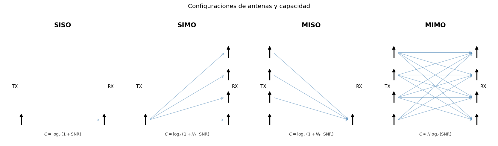
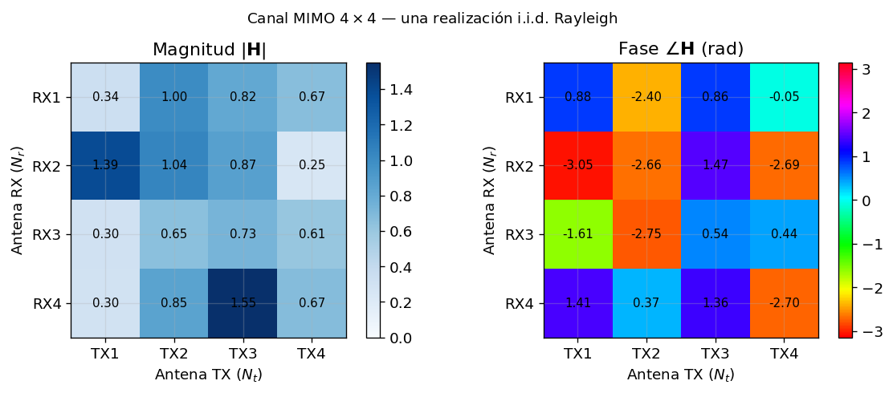
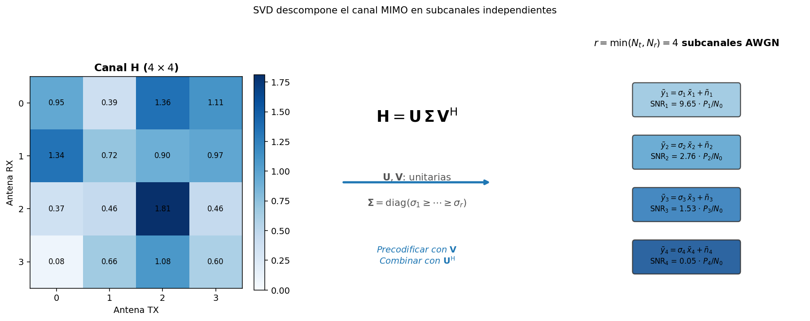
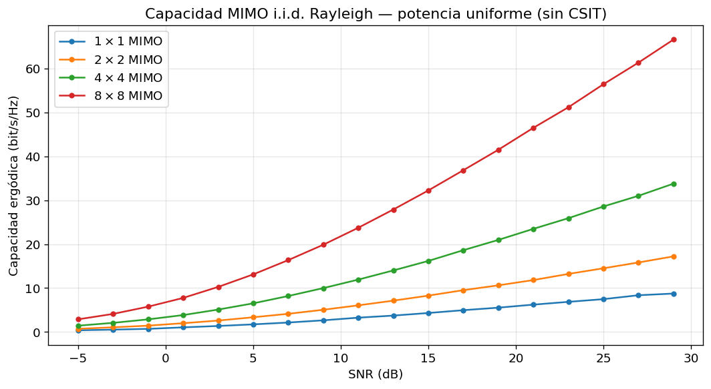
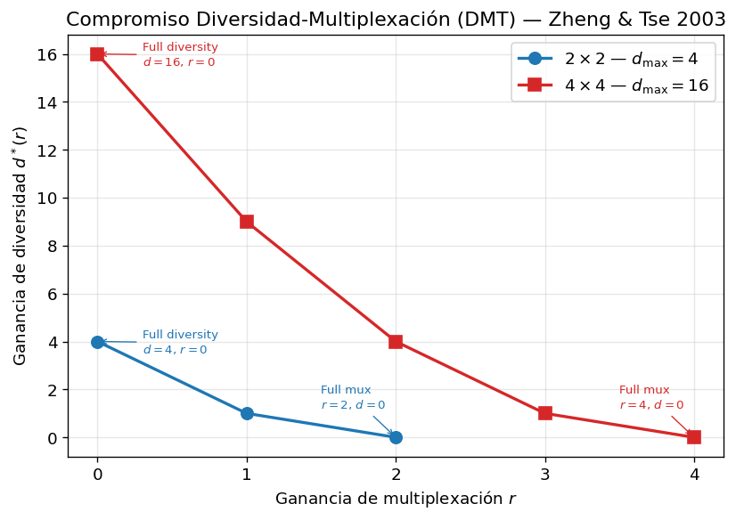
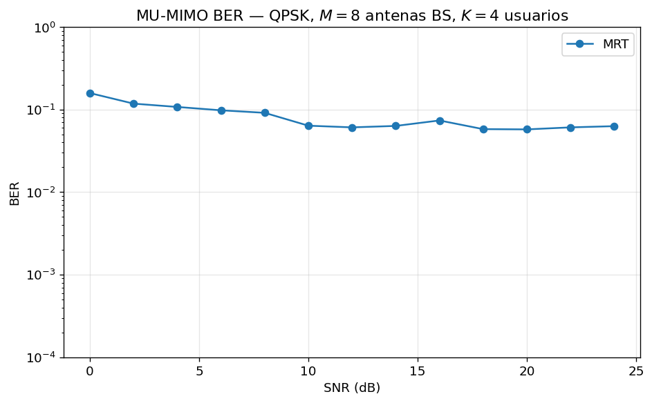
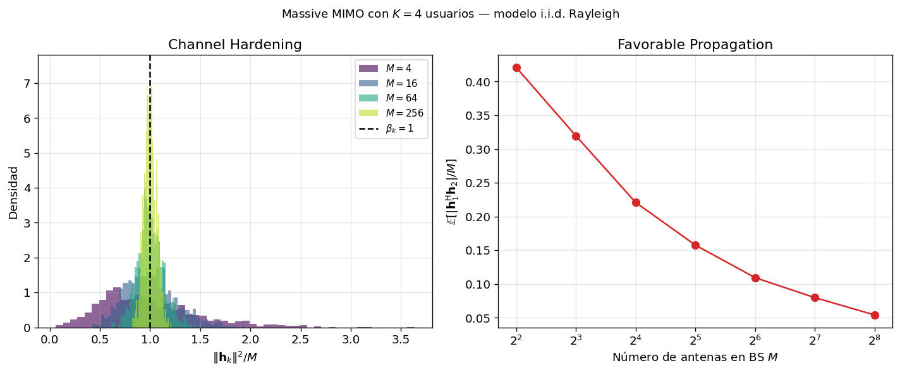
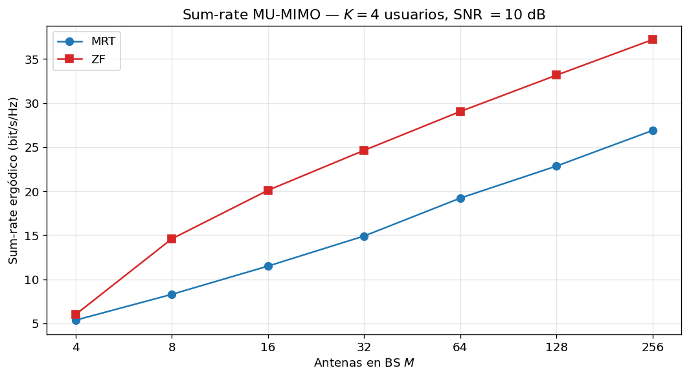

# Sesión 06 — MIMO: Múltiples Antenas, Múltiples Posibilidades

## Objetivos de Aprendizaje

Al finalizar esta sesión, el estudiante será capaz de:

1. Explicar cómo el canal MIMO se modela como una matriz **H** y por qué añadir antenas aumenta la capacidad linealmente (no logarítmicamente)
2. Aplicar la descomposición SVD de **H** para obtener canales paralelos independientes y calcular la capacidad MIMO con y sin información de canal en el transmisor
3. Describir el compromiso diversidad-multiplexación (DMT) y elegir el régimen adecuado según las condiciones del enlace
4. Calcular los precodificadores MRT y ZF para un sistema multiusuario y comparar su SINR resultante
5. Explicar los fenómenos de *channel hardening* y *favorable propagation* que hacen que Massive MIMO con MRT sea prácticamente óptimo

---

## Introducción

En las sesiones anteriores el canal fue siempre un escalar: una sola señal entra, una sola señal sale. La Sesión 01 caracterizó estadísticamente ese escalar (Rayleigh, Rician). La Sesión 02 diseñó modulaciones para transmitir bits a través de él. La Sesión 03 demostró que OFDM transforma un canal selectivo en frecuencia en cientos de canales planos — pero cada subportadora seguía siendo un escalar. La Sesión 05 añadió redundancia para corregir los errores que ese escalar introduce.

La pregunta que abre esta sesión es diferente: ¿qué ocurre si añadimos más antenas en el transmisor, en el receptor, o en ambos? La respuesta es contraintuitiva y poderosa. Con $N_t$ antenas transmisoras y $N_r$ receptoras, el canal deja de ser un escalar y pasa a ser una **matriz** $\mathbf{H} \in \mathbb{C}^{N_r \times N_t}$. Esta matriz tiene estructura — concretamente, una descomposición SVD — que permite transformarla en hasta $\min(N_t, N_r)$ canales AWGN paralelos e independientes.

Un ejemplo mínimo para fijar la idea: con 2 antenas en cada extremo ($N_t = N_r = 2$), las señales de ambas antenas se mezclan en el aire — cada antena receptora escucha una combinación de las dos transmisiones. Parece un problema. Pero la SVD *desenreda* esa mezcla matemáticamente: el enlace se comporta como **dos cables virtuales separados**, uno de buena calidad y otro más modesto, cada uno llevando su propio símbolo sin interferir con el otro. Es decir: dos canales SISO ordinarios donde antes parecía haber solo interferencia. En el §3.1 se resuelve exactamente este caso $2 \times 2$ con números a mano.

La consecuencia es fundamental: mientras que la capacidad SISO crece como $\log_2(1 + \text{SNR})$ — logarítmicamente, con rendimientos decrecientes — la capacidad MIMO puede crecer **linealmente** con $\min(N_t, N_r)$ a cualquier SNR fijo. Un sistema $4 \times 4$ con 10 dB de SNR puede cuadruplicar la tasa de un sistema $1 \times 1$ con la misma potencia y ancho de banda.

Es por eso que **todos** los sistemas inalámbricos modernos son MIMO: el estándar 5G NR define antenas de hasta 256 elementos en la estación base. La sesión pasa de la intuición al álgebra lineal que subyace a esas antenas, y de ahí a los algoritmos de precodificación que las hacen funcionar.

---

## Teoría

### 1. De SISO a MIMO — la Intuición Espacial

Piense en una autopista. Un canal SISO es una carretera de un solo carril: por muy potente que sea el camión (la potencia) o por muy bien empaquetada que vaya la carga (la modulación), solo pasa un vehículo a la vez. Añadir antenas equivale a **abrir carriles nuevos** en la misma carretera, sin comprar más terreno (ancho de banda) ni camiones más grandes (potencia). Y una vez abiertos los carriles, hay dos formas opuestas de usarlos: enviar **carga distinta por cada carril** — más mercancía por hora — o enviar **la misma carga por todos los carriles** como un seguro: si un carril se bloquea (un desvanecimiento profundo), la mercancía llega igual por los demás.

Esa es exactamente la disyuntiva del MIMO. El canal SISO tiene una sola "vía" entre el transmisor y el receptor. Con múltiples antenas, existen **múltiples vías simultáneas** que pueden usarse de dos maneras opuestas:

- **Diversidad espacial**: enviar la misma información por todas las vías. Si una vía experimenta *fading* profundo, las otras siguen activas. La confiabilidad aumenta.
- **Multiplexación espacial**: enviar información *diferente* por cada vía. La tasa total aumenta.

Estas dos estrategias son las extremas del **compromiso diversidad-multiplexación** (§4). Entre ellas existe un continuo de soluciones óptimas según la SNR y los requisitos del enlace.

<figure markdown="span">
  
  <!-- generada por celda 2 de lab.ipynb -->
  <figcaption markdown="1">**Figura 1.** Las cuatro configuraciones de antenas. **SISO** ($N_t=1, N_r=1$): canal escalar, capacidad $\log_2(1+\text{SNR})$. **SIMO** ($N_t=1, N_r>1$): el receptor combina $N_r$ copias de la señal (diversidad de recepción, ganancia de array de hasta $N_r$). **MISO** ($N_t>1, N_r=1$): el transmisor forma el haz (beamforming) hacia el receptor. **MIMO** ($N_t>1, N_r>1$): capacidad para multiplexación espacial y/o diversidad simultánea.
  </figcaption>
</figure>

??? question "Comprueba tu comprensión"

    **P1.** ¿Qué estrategia elegirías para un enlace de emergencia con SNR baja: diversidad o multiplexación? ¿Por qué?

    **P2.** En la analogía de la autopista, ¿a qué corresponde "enviar la misma carga por todos los carriles"?

    ---

    **R1.** Diversidad — en un enlace crítico la fiabilidad importa más que la tasa; las copias redundantes protegen contra el *fading* profundo de cualquier vía individual.

    **R2.** A la diversidad espacial: la misma información por todas las antenas, como seguro contra el bloqueo de un carril.

La pregunta natural es: si ya no hay una sola vía sino muchas que se cruzan, ¿cómo se describe matemáticamente ese haz de vías? → con una matriz.

### 2. El Canal MIMO — Modelo Matricial

Antes del álgebra, la idea física: en el aire no hay cables que separen las señales. Cada antena receptora oye una **mezcla ponderada** de lo que enviaron *todas* las antenas transmisoras a la vez, y la matriz $\mathbf{H}$ no es más que la **tabla de esas ponderaciones**: el elemento $h_{ji}$ responde a la pregunta "¿cuánto de lo que emitió la antena transmisora $i$ llega a la antena receptora $j$, y con qué fase?". Todo el formalismo que sigue es contabilidad ordenada de esa mezcla.

Sea $\mathbf{x} \in \mathbb{C}^{N_t}$ el vector transmitido con restricción de potencia $\mathbb{E}[\|\mathbf{x}\|^2] \leq P$, y $\mathbf{y} \in \mathbb{C}^{N_r}$ el vector recibido. El modelo de canal MIMO de banda estrecha (flat fading) es:

$$\boxed{\mathbf{y} = \mathbf{H}\mathbf{x} + \mathbf{n}} \tag{1}$$

donde $\mathbf{H} \in \mathbb{C}^{N_r \times N_t}$ es la **matriz de canal** y $\mathbf{n} \sim \mathcal{CN}(\mathbf{0}, N_0\mathbf{I}_{N_r})$ es ruido gaussiano complejo circular i.i.d. El elemento $h_{ji} = [\mathbf{H}]_{j,i}$ es la ganancia compleja entre la antena transmisora $i$ y la antena receptora $j$, incluyendo pérdida de propagación, desvanecimiento y desfase.

**Modelo i.i.d. Rayleigh.** El caso analíticamente más tractable y pedagógicamente fundamental asume que todos los $h_{ji}$ son i.i.d.:

$$h_{ji} \sim \mathcal{CN}(0, 1) \tag{2}$$

**¿Qué significa i.i.d.?** Son dos condiciones separadas, y conviene leerlas por separado. **Independientes**: conocer el valor de un coeficiente no dice nada sobre los demás — que el enlace entre la antena transmisora 1 y la receptora 3 esté en desvanecimiento profundo no hace más ni menos probable que el enlace vecino también lo esté. **Idénticamente distribuidas**: todas las entradas siguen la misma estadística — ninguna pareja de antenas es "especial", todas juegan con las mismas reglas. La imagen mental: rellenar la matriz $\mathbf{H}$ lanzando un dado una vez por cada casilla. Cada lanzamiento ignora los anteriores (independencia) y siempre se usa el mismo dado (idéntica distribución). Aquí el "dado" es la gaussiana compleja $\mathcal{CN}(0,1)$, y el módulo $|h_{ji}|$ de cada resultado sigue una distribución Rayleigh — de ahí el nombre del modelo, que conecta directamente con la Sesión 01.

Este modelo corresponde a un entorno con *scattering* denso e isótropo donde no hay línea de visión directa (NLOS) y las antenas están suficientemente separadas ($\geq \lambda/2$) para que los coeficientes sean estadísticamente independientes. En 5G NR los canales espacialmente correlacionados (antenas en ULA compacto) requieren modelos más sofisticados como el CDL-C/D del TR 38.901, pero el modelo i.i.d. captura la física esencial y produce todos los resultados analíticos clave.

<figure markdown="span">
  
  <!-- generada por celda 3 de lab.ipynb -->
  <figcaption markdown="1">**Figura 2.** Visualización de la matriz $\mathbf{H}$ para un sistema $4 \times 4$. Cada elemento $h_{ji}$ es una variable compleja con módulo $|h_{ji}|$ (intensidad del enlace) y fase $\angle h_{ji}$ (retardo de propagación). El panel izquierdo muestra la magnitud $|\mathbf{H}|$; el panel derecho muestra la fase. En el modelo i.i.d. Rayleigh, todos los elementos son estadísticamente equivalentes — la estructura explotable proviene de la *geometría* de la matriz, no de correlación entre entradas.
  </figcaption>
</figure>

??? question "Comprueba tu comprensión"

    **P1.** En un sistema $4 \times 4$, ¿cuántos números complejos tiene $\mathbf{H}$?

    **P2.** ¿Qué representa físicamente el elemento $h_{32}$?

    ---

    **R1.** $N_r \times N_t = 16$ números complejos.

    **R2.** La ganancia compleja (atenuación y desfase) del trayecto entre la antena transmisora 2 y la antena receptora 3: cuánto de lo que emite la TX 2 llega a la RX 3.

Ya tenemos la tabla de ponderaciones $\mathbf{H}$; la pregunta natural es: ¿cómo desenredamos la mezcla para poder transmitir varios flujos sin que se pisen? → la SVD.

### 3. Capacidad MIMO vía SVD

La intuición primero. El canal MIMO es como una **mesa de mezclas mal cableada**: cada micrófono (antena TX) suena por todos los altavoces (antenas RX) a la vez, y lo que llega es un revoltijo. La SVD es el técnico de sonido que encuentra los **ejes naturales del canal**: una rotación a la entrada ($\mathbf{V}$) y otra a la salida ($\mathbf{U}$) que convierten ese canal enredado — donde las antenas se interfieren entre sí — en un banco de *faders* independientes: subcanales que **no se mezclan**, cada uno con su propia ganancia $\sigma_k$. Las rotaciones no crean ni destruyen señal (son unitarias); solo eligen el punto de vista correcto para mirar el canal.

#### 3.1 Un ejemplo concreto 2×2

Antes de la maquinaria general, un canal que se resuelve completo con lápiz y papel. Conviene tenerlo a mano durante toda la sección: cada objeto abstracto que aparezca después ($\mathbf{U}$, $\mathbf{\Sigma}$, $\mathbf{V}$, capacidad) tiene aquí un número concreto.

??? example "Ejemplo numérico: SVD y capacidad de un canal 2×2"

    **El canal.** Dos antenas por lado, con acoplamiento cruzado moderado:

    $$\mathbf{H} = \begin{pmatrix} 1 & 0{,}5 \\ 0{,}5 & 1 \end{pmatrix}$$

    La diagonal (1) es el enlace "directo" de cada antena TX a su antena RX enfrentada; el 0,5 es la fuga hacia la otra antena. Como $\mathbf{H}$ es real y simétrica, su SVD coincide con la descomposición espectral: los valores singulares son sus autovalores y $\mathbf{U} = \mathbf{V}$.

    **Paso 1 — Valores singulares.** Los autovalores de $\mathbf{H}$ son $1 \pm 0{,}5$:

    $$\sigma_1 = 1{,}5, \qquad \sigma_2 = 0{,}5$$

    Las ganancias de subcanal son sus cuadrados: $\sigma_1^2 = 2{,}25$ y $\sigma_2^2 = 0{,}25$. El canal tiene un subcanal *fuerte* (9 veces más ganancia) y uno *débil*.

    **Paso 2 — Vectores singulares.** Las columnas de $\mathbf{V} = \mathbf{U}$ son:

    $$\mathbf{v}_1 = \frac{1}{\sqrt{2}}\begin{pmatrix} 1 \\ 1 \end{pmatrix}, \qquad \mathbf{v}_2 = \frac{1}{\sqrt{2}}\begin{pmatrix} 1 \\ -1 \end{pmatrix}$$

    Interpretación física: el canal **favorece la señal enviada en fase por ambas antenas** ($\mathbf{v}_1$, dirección $+45°$, las fugas se suman constructivamente) y **penaliza la señal en contrafase** ($\mathbf{v}_2$, dirección $-45°$, las fugas se restan). Los "ejes naturales" del canal no son las antenas físicas, sino estas combinaciones.

    **Paso 3 — Verificación de energía.** La norma de Frobenius debe repartirse entre los subcanales:

    $$\|\mathbf{H}\|_F^2 = 1^2 + 0{,}5^2 + 0{,}5^2 + 1^2 = 2{,}5 = \sigma_1^2 + \sigma_2^2 = 2{,}25 + 0{,}25 \checkmark$$

    (Esta identidad es exactamente la que verifica el Ejercicio 1 del laboratorio, allí por Monte Carlo.)

    **Paso 4 — Capacidad.** A SNR $= 10$ dB ($P/N_0 = 10$ en lineal), con potencia uniforme $P/N_t$ y $N_t = 2$, la ec. (7) da:

    $$C = \log_2\!\left(1 + \tfrac{10}{2}\cdot 2{,}25\right) + \log_2\!\left(1 + \tfrac{10}{2}\cdot 0{,}25\right) = \log_2(12{,}25) + \log_2(2{,}25) \approx 3{,}61 + 1{,}17 = 4{,}78 \text{ bit/s/Hz}$$

    **Paso 5 — Comparación con SISO.** Un enlace de una sola antena a la misma SNR alcanza $\log_2(1+10) \approx 3{,}46$ bit/s/Hz. Dos antenas por lado dan **4,78 vs 3,46** — la ganancia MIMO en números que puedes verificar a mano. La Figura 3 muestra este mismo esquema en abstracto: aquí los dos subcanales paralelos tienen ganancias 2,25 y 0,25.

#### 3.2 El caso general: diagonalización por SVD

La herramienta central de esta sesión es la **Descomposición en Valores Singulares** (SVD) de la matriz de canal:

$$\mathbf{H} = \mathbf{U} \mathbf{\Sigma} \mathbf{V}^{\mathsf{H}} \tag{3}$$

donde $\mathbf{U} \in \mathbb{C}^{N_r \times N_r}$ y $\mathbf{V} \in \mathbb{C}^{N_t \times N_t}$ son matrices unitarias ($\mathbf{U}\mathbf{U}^{\mathsf{H}} = \mathbf{I}$, $\mathbf{V}\mathbf{V}^{\mathsf{H}} = \mathbf{I}$), y $\mathbf{\Sigma} \in \mathbb{R}^{N_r \times N_t}$ es diagonal con los **valores singulares** $\sigma_1 \geq \sigma_2 \geq \cdots \geq \sigma_r \geq 0$, $r = \mathrm{rank}(\mathbf{H}) \leq \min(N_t, N_r)$.

**Diagonalización del canal.** Si el transmisor conoce $\mathbf{H}$ (CSIT completo), puede **precodificar** con $\mathbf{V}$: en lugar de transmitir $\mathbf{x}$ directamente, transmite $\mathbf{x} = \mathbf{V}\tilde{\mathbf{x}}$, donde $\tilde{\mathbf{x}} \in \mathbb{C}^r$ es el vector de datos. Simultáneamente, el receptor aplica $\mathbf{U}^{\mathsf{H}}$ sobre la señal recibida:

$$\tilde{\mathbf{y}} = \mathbf{U}^{\mathsf{H}}\mathbf{y} = \mathbf{U}^{\mathsf{H}}\mathbf{H}\mathbf{V}\tilde{\mathbf{x}} + \mathbf{U}^{\mathsf{H}}\mathbf{n} = \mathbf{U}^{\mathsf{H}}(\mathbf{U}\mathbf{\Sigma}\mathbf{V}^{\mathsf{H}})\mathbf{V}\tilde{\mathbf{x}} + \tilde{\mathbf{n}} = \mathbf{\Sigma}\tilde{\mathbf{x}} + \tilde{\mathbf{n}} \tag{4}$$

donde en el último paso se usó $\mathbf{V}^{\mathsf{H}}\mathbf{V} = \mathbf{I}$ y $\mathbf{U}^{\mathsf{H}}\mathbf{U} = \mathbf{I}$ (matrices unitarias). Como $\mathbf{U}$ es unitaria, $\tilde{\mathbf{n}} = \mathbf{U}^{\mathsf{H}}\mathbf{n}$ conserva la distribución $\mathcal{CN}(\mathbf{0}, N_0\mathbf{I})$. El resultado es $r$ **canales AWGN paralelos e independientes**:

$$\tilde{y}_k = \sigma_k \tilde{x}_k + \tilde{n}_k, \quad k = 1, \ldots, r \tag{5}$$

El canal MIMO se ha convertido en $r$ canales escalares independientes con ganancias $\sigma_k^2$. Vale la pena detenerse en lo que acaba de pasar: hemos convertido un problema matricial en $r$ problemas escalares **que ya sabemos resolver desde la Sesión 02** — cada subcanal es un canal AWGN ordinario al que se le asigna una modulación y una potencia.

<figure markdown="span">
  
  <!-- generada por celda 5 de lab.ipynb -->
  <figcaption markdown="1">**Figura 3.** La SVD transforma el canal MIMO $\mathbf{H}$ (izquierda) en $r = \min(N_t, N_r)$ canales AWGN escalares independientes con SNR$_k = \sigma_k^2 P_k / N_0$ (derecha). La precodificación con $\mathbf{V}$ en el transmisor y la combinación con $\mathbf{U}^{\mathsf{H}}$ en el receptor realizan esta transformación sin pérdida de información. El SNR de cada subcanal es proporcional al cuadrado del $k$-ésimo valor singular de $\mathbf{H}$.
  </figcaption>
</figure>

**Capacidad con CSIT (water-filling).** Dado que los $r$ subcanales son independientes, la capacidad total se maximiza distribuyendo la potencia $P$ con *water-filling* (WF):

$$\boxed{C_{\text{WF}} = \sum_{k=1}^{r} \log_2\!\left(1 + \frac{P_k^* \sigma_k^2}{N_0}\right)} \quad \text{[bit/s/Hz]} \tag{6}$$

con $P_k^* = \left(\mu - \frac{N_0}{\sigma_k^2}\right)^+$ donde $(x)^+ \triangleq \max(0, x)$, y $\mu$ es el "nivel de agua" que satisface $\sum_k P_k^* = P$.

El nombre *water-filling* es literal: imagine verter una cantidad fija de agua (la potencia $P$) en un recipiente de fondo irregular, donde la altura del fondo bajo el subcanal $k$ es $N_0/\sigma_k^2$. Los pozos profundos — los subcanales fuertes, con $N_0/\sigma_k^2$ pequeño — reciben más agua (más potencia); los pozos poco profundos reciben poca, y los que sobresalen del nivel del agua $\mu$ quedan directamente **secos** ($P_k^* = 0$): un subcanal suficientemente malo no merece ni un vatio. En el ejemplo 2×2 del §3.1, el subcanal débil ($\sigma_2^2 = 0{,}25$) es el candidato a secarse si la SNR baja.

**Capacidad sin CSIT (potencia uniforme).** En la práctica, el transmisor a menudo no conoce $\mathbf{H}$. Con potencia uniforme $P_k = P/N_t$, la capacidad es:

$$C_{\text{uni}} = \log_2\det\!\left(\mathbf{I}_{N_r} + \frac{P}{N_t N_0}\mathbf{H}\mathbf{H}^{\mathsf{H}}\right) = \sum_{k=1}^{r} \log_2\!\left(1 + \frac{P \sigma_k^2}{N_t N_0}\right) \tag{7}$$

**La clave**: con $N_t = N_r = N$ antenas y en alta SNR, $C \approx N \log_2(\text{SNR}/N) + \text{const}$. La capacidad escala **linealmente** con $N = \min(N_t, N_r)$. Cada factor de 2 en el número de antenas *duplica* la capacidad — sin ancho de banda adicional y sin potencia adicional.

<figure markdown="span">
  
  <!-- generada por celda 6 de lab.ipynb -->
  <figcaption markdown="1">**Figura 4.** Capacidad ergódica (media sobre realizaciones del canal) en función de la SNR [dB] para sistemas $1\times1$, $2\times2$, $4\times4$ y $8\times8$ con modelo i.i.d. Rayleigh. A SNR alta las curvas son paralelas y separadas verticalmente por un factor $N$ — evidencia directa del crecimiento lineal de la capacidad con el número de antenas. La principal razón por la que todos los sistemas inalámbricos modernos son MIMO.
  </figcaption>
</figure>

??? question "Comprueba tu comprensión"

    **P1.** Si un valor singular $\sigma_k$ es casi cero, ¿qué le pasa a ese subcanal?

    **P2.** En el ejemplo 2×2 del §3.1, ¿por qué conviene enviar la señal en fase por ambas antenas?

    ---

    **R1.** Su ganancia $\sigma_k^2 \approx 0$: es un subcanal casi inútil. El *water-filling* no le asigna potencia ($P_k^* = 0$) — queda seco.

    **R2.** Porque la dirección en fase es $\mathbf{v}_1$, el eje natural fuerte del canal ($\sigma_1 = 1{,}5$): las fugas cruzadas se suman constructivamente. En contrafase ($\mathbf{v}_2$) se restan y la ganancia cae a $\sigma_2 = 0{,}5$.

#### 3.3 El problema dual: detección en el receptor

El §3.2 supuso que **ambos extremos** conocen $\mathbf{H}$: el transmisor precodifica con $\mathbf{V}$ y el receptor combina con $\mathbf{U}^{\mathsf{H}}$, una coreografía coordinada. Pero en muchos sistemas el transmisor **no** conoce el canal (sin CSIT): envía flujos independientes a ciegas, $\mathbf{x}$ directamente, y todo el trabajo de separar la mezcla recae en el receptor, que sí estima $\mathbf{H}$ (mediante pilotos). La pregunta es la imagen especular de la precodificación: dado $\mathbf{y} = \mathbf{H}\mathbf{x} + \mathbf{n}$ y conocido $\mathbf{H}$, ¿cómo recupero $\mathbf{x}$ **solo desde la recepción**?

La analogía: en el §3.2 el técnico de sonido controlaba la mesa de mezclas por los dos lados. Ahora está atrapado solo en el lado de los altavoces, con el revoltijo ya hecho, y debe deshacerlo a mano. Hay cuatro herramientas, de la más simple a la más cara:

**Detectores lineales** (una multiplicación matricial):

- **Zero-Forcing (ZF).** Invierte el canal: $\hat{\mathbf{x}} = \mathbf{H}^+\mathbf{y} = (\mathbf{H}^{\mathsf{H}}\mathbf{H})^{-1}\mathbf{H}^{\mathsf{H}}\mathbf{y}$. Cancela **exactamente** la interferencia entre flujos, pero cuando $\mathbf{H}$ está mal condicionada (subcanales débiles) la inversión **amplifica el ruido** — es el gemelo receptor del precoder ZF del §5, con el mismo defecto.
- **MMSE.** Regulariza la inversión: $\hat{\mathbf{x}} = (\mathbf{H}^{\mathsf{H}}\mathbf{H} + \tfrac{N_t}{\text{SNR}}\mathbf{I})^{-1}\mathbf{H}^{\mathsf{H}}\mathbf{y}$. Equilibra interferencia residual contra ruido: a SNR alta tiende a ZF, a SNR baja al filtro adaptado. Casi siempre mejor que ZF puro.

**Detectores no lineales** (más cómputo, mejor rendimiento):

- **Máxima verosimilitud (ML).** $\hat{\mathbf{x}} = \arg\min_{\mathbf{x}} \|\mathbf{y} - \mathbf{H}\mathbf{x}\|^2$ sobre la constelación. Óptimo, pero su costo crece **exponencialmente** con $N_t$ (probar todas las combinaciones de símbolos).
- **Cancelación sucesiva (SIC / V-BLAST).** Detecta el flujo más fuerte, lo resta de $\mathbf{y}$, y repite con el residuo. Es el esquema **V-BLAST** que nombra el pie de la Figura 5, ahora con mecanismo: pela la mezcla capa por capa.

??? example "Ejemplo: amplificación de ruido del ZF en el canal 2×2"

    Reusamos el canal del §3.1, $\mathbf{H} = \begin{pmatrix} 1 & 0{,}5 \\ 0{,}5 & 1 \end{pmatrix}$. El ruido de cada flujo tras el detector ZF se multiplica por el elemento diagonal de $(\mathbf{H}^{\mathsf{H}}\mathbf{H})^{-1}$. Como $\mathbf{H}$ es real y simétrica:

    $$\mathbf{H}^{\mathsf{H}}\mathbf{H} = \mathbf{H}^2 = \begin{pmatrix} 1{,}25 & 1 \\ 1 & 1{,}25 \end{pmatrix}, \qquad \det = 1{,}25^2 - 1 = 0{,}5625$$

    $$(\mathbf{H}^{\mathsf{H}}\mathbf{H})^{-1} = \frac{1}{0{,}5625}\begin{pmatrix} 1{,}25 & -1 \\ -1 & 1{,}25 \end{pmatrix} \Rightarrow \text{diagonal} = \frac{1{,}25}{0{,}5625} \approx 2{,}22$$

    El ruido de cada flujo se amplifica **×2,22**. Ese es el precio de forzar interferencia nula: cuanto peor condicionado el canal (mayor razón $\sigma_1/\sigma_2 = 3$ aquí), más se dispara el factor. MMSE evitaría esta amplificación a costa de dejar algo de interferencia residual.

| Detector | Interferencia | Ruido | Costo |
|---|---|---|---|
| ZF | Nula | Amplificado | Bajo (una inversión) |
| MMSE | Residual pequeña | Balanceado | Bajo (una inversión) |
| ML | Nula | Mínimo (óptimo) | Exponencial en $N_t$ |
| SIC / V-BLAST | Cancelada por capas | Intermedio | Medio |

Nótese la **dualidad TX↔RX**: ZF, MMSE y la variante regularizada aparecen tanto como *precodificadores* (§5, el transmisor da forma a los haces) como *detectores* (aquí, el receptor deshace la mezcla). Es el mismo álgebra vista desde los dos extremos del enlace.

??? question "Comprueba tu comprensión"

    **P1.** ¿Por qué el detector ZF amplifica el ruido, igual que el precoder ZF del §5?

    **P2.** En el canal 2×2 del ejemplo, ¿por cuánto se multiplica el ruido de cada flujo con ZF?

    ---

    **R1.** Ambos invierten $\mathbf{H}$ (o $\mathbf{H}\mathbf{H}^{\mathsf{H}}$). Cuando el canal tiene subcanales débiles (mal condicionamiento), la inversión los amplifica mucho, y con ellos el ruido proyectado sobre esas direcciones. Forzar interferencia exactamente nula cuesta energía de señal útil.

    **R2.** ×2,22 — el elemento diagonal de $(\mathbf{H}^{\mathsf{H}}\mathbf{H})^{-1}$.

Ya sabemos transmitir (precodificación) y recibir (detección) cuando el objetivo es la tasa; la pregunta natural es: ¿y si en vez de maximizar la tasa queremos fiabilidad? → el compromiso diversidad-multiplexación.

### 4. El Compromiso Diversidad-Multiplexación (DMT)

Con múltiples antenas se puede elegir entre dos tipos de ganancia, pero no maximizar ambas simultáneamente. La analogía es **seguro vs velocidad**: cada antena extra es un presupuesto que puede gastarse en correr más (un *stream* de datos adicional) o en asegurarse (una copia redundante más de la misma información). Quien lo gasta todo en velocidad viaja rápido pero sin red; quien lo gasta todo en seguro nunca pierde el paquete pero avanza al ritmo de siempre. Esta tensión fue formalizada por Zheng y Tse (2003) en el **Diversity-Multiplexing Tradeoff** (DMT).

Antes de las definiciones formales, lo que cada ganancia significa sin el $\lim$: la **ganancia de multiplexación** $r$ cuenta cuántos *streams* paralelos efectivos transporta el sistema (cuántos "carriles" del §1 se dedican a carga distinta); la **ganancia de diversidad** $d$ mide con qué pendiente cae la probabilidad de error al subir la SNR (cuántas copias independientes protegen cada bit). Formalmente, se definen en el límite de SNR alta:
- **Ganancia de multiplexación**: $r = \lim_{\text{SNR}\to\infty} R/\log_2\text{SNR}$ (cuántas "dimensiones" de tasa)
- **Ganancia de diversidad**: $d = -\lim_{\text{SNR}\to\infty} \log P_e / \log\text{SNR}$ (qué tan rápido cae la BER)

La **curva DMT óptima** para un sistema $N_t \times N_r$ con i.i.d. Rayleigh es:

$$d^*(r) = (N_t - r)(N_r - r), \quad r \in \{0, 1, \ldots, \min(N_t, N_r)\} \tag{8}$$

Los puntos extremos son:
- $r = 0$: diversidad máxima $d = N_t N_r$ (se transmite un solo stream por todas las antenas, típicamente con codificación espacio-temporal como STBC/Alamouti; la tasa no crece con la SNR pero la fiabilidad sí)
- $r = \min(N_t, N_r)$: multiplexación máxima $d = 0$ (máximos streams independientes; la tasa crece logarítmicamente con la SNR pero la BER no mejora con ella)

**Regla práctica de diseño:**

| Condición del enlace | Estrategia recomendada | Razón |
|---|---|---|
| SNR baja, cobertura crítica | Diversidad ($r$ pequeño) | La BER cae más rápido con SNR |
| SNR alta, throughput máximo | Multiplexación ($r = \min(N_t,N_r)$) | La tasa crece linealmente |
| SNR media | Punto intermedio DMT | Equilibrio tasa/confiabilidad |

En 5G NR, el selector de rango (rank adaptation) elige $r$ dinámicamente basándose en el CQI reportado por el UE — exactamente esta lógica.

<figure markdown="span">
  
  <!-- generada por celda 8 de lab.ipynb -->
  <figcaption markdown="1">**Figura 5.** Curva DMT $d^*(r)$ para sistemas $2\times2$ (triángulo) y $4\times4$ (polígono). Los vértices corresponden a esquemas concretos: en $r=0$ opera el **OSTBC/Alamouti** (diversidad máxima $N_tN_r$, sin ganancia de multiplexación); en $r=\min(N_t,N_r)$ opera **V-BLAST** (multiplexación máxima, $d=N_r-N_t+1$ para $N_t \leq N_r$). Los puntos intermedios representan el rango continuo de equilibrios posibles. Un sistema que opera en el vértice inferior-derecho explota toda la multiplexación — cada dB adicional de SNR se traduce en tasa, no en reducción de errores.
  </figcaption>
</figure>

??? question "Comprueba tu comprensión"

    **P1.** En la curva DMT de un sistema $2\times2$, ¿qué diversidad $d$ obtienes si exiges $r = 2$ streams?

    ---

    **R1.** $d^*(2) = (2-2)(2-2) = 0$. Multiplexación máxima significa diversidad nula: toda la SNR extra se convierte en tasa y la BER no mejora con ella.

Hasta aquí todo era un solo enlace punto a punto; la pregunta natural es: ¿y si la estación base sirve a varios usuarios *a la vez*? → precodificación multiusuario.

### 5. Precodificación Lineal: MRT y ZF

El cambio de escenario trae un problema nuevo: cada usuario tiene una sola antena y no puede "des-mezclar" nada por su cuenta — la SVD del §3 requería cooperación en ambos extremos. Ahora todo el trabajo de separar a los usuarios recae en el transmisor, que debe **dar forma a los haces antes de emitir**: eso es la precodificación.

En el escenario multiusuario (MU-MIMO), la estación base tiene $M$ antenas y sirve simultáneamente a $K$ usuarios, cada uno con una sola antena. La notación cambia ligeramente respecto al §2: aquí $M$ es el número de antenas en la BS (rol de $N_t$) y $K$ el número de usuarios (rol de $N_r$). El canal de bajada es:

$$\mathbf{y} = \mathbf{H}\mathbf{W}\mathbf{s} + \mathbf{n} \tag{9}$$

donde $\mathbf{H} \in \mathbb{C}^{K \times M}$ es la matriz de canal agregada, $\mathbf{W} \in \mathbb{C}^{M \times K}$ es la **matriz de precodificación** y $\mathbf{s} \in \mathbb{C}^K$ son los símbolos de los $K$ usuarios. Denotamos $\mathbf{h}_k \in \mathbb{C}^M$ el vector de canal del usuario $k$ (la $k$-ésima fila de $\mathbf{H}$ transpuesta conjugada), y $\mathbf{w}_k \in \mathbb{C}^M$ la $k$-ésima columna de $\mathbf{W}$. La señal recibida por el usuario $k$ es:

$$y_k = \mathbf{h}_k^{\mathsf{H}} \mathbf{w}_k s_k + \underbrace{\sum_{j \neq k} \mathbf{h}_k^{\mathsf{H}} \mathbf{w}_j s_j}_{\text{interferencia entre usuarios}} + n_k \tag{10}$$

El diseño del precoder $\mathbf{W}$ es el problema central del MU-MIMO. Antes de las fórmulas, las dos filosofías opuestas. **MRT es el precoder egoísta y simple**: apunta el haz directamente a cada usuario ignorando a los demás — máxima potencia útil, pero los haces se pisan entre sí. **ZF es el precoder cooperativo**: elige haces que caen exactamente en los *ceros* de los demás usuarios — nadie interfiere a nadie, pero torcer los haces para esquivar a los vecinos cuesta energía útil y **amplifica el ruido**. Toda la comparación que sigue es la cuantificación de este dilema.

**Maximum Ratio Transmission (MRT).** El precoder más simple: apuntar el haz hacia cada usuario con el vector conjugado de su canal:

$$\mathbf{W}_{\text{MRT}} = \frac{1}{\sqrt{\rho}}\mathbf{H}^{\mathsf{H}}, \quad \rho = \|\mathbf{H}^{\mathsf{H}}\|_F^2 = \|\mathbf{H}\|_F^2 \tag{11}$$

donde el factor $1/\sqrt{\rho}$ normaliza la potencia transmitida a $P$ (la restricción de potencia se aplica siempre al precoder). MRT maximiza la potencia recibida por el usuario objetivo, pero **no cancela la interferencia** entre usuarios. Asumiendo potencia unitaria por usuario ($P = 1$, SNR absorbida en $N_0$), el SINR del usuario $k$ es:

$$\text{SINR}_k^{\text{MRT}} = \frac{\|\mathbf{h}_k\|^4}{\sum_{j \neq k} |\mathbf{h}_k^{\mathsf{H}} \mathbf{h}_j|^2 + \rho N_0} \tag{12}$$

**Zero-Forcing (ZF).** El precoder que **elimina completamente** la interferencia entre usuarios mediante la pseudoinversa:

$$\mathbf{W}_{\text{ZF}} = \mathbf{H}^{\mathsf{H}}(\mathbf{H}\mathbf{H}^{\mathsf{H}})^{-1} \tag{13}$$

Con ZF, $\mathbf{h}_k^{\mathsf{H}} \mathbf{w}_j^{\text{ZF}} = 0$ para $k \neq j$ (interferencia nula), pero la inversión de $\mathbf{H}\mathbf{H}^{\mathsf{H}}$ amplifica el ruido cuando los canales son casi paralelos (mal condicionamiento).

| Precoder | Interferencia | Ruido | Óptimo cuando |
|---|---|---|---|
| MRT | Alta (no cancelada) | Bajo | $M \gg K$ (canales casi ortogonales) |
| ZF | Cero | Amplificado | SNR alta, $M \geq K$ |
| Óptimo (MMSE/RZF) | Cancelada parcialmente | Balance óptimo | Siempre (mayor coste computacional) |

<figure markdown="span">
  
  <!-- generada por celda 10 de lab.ipynb -->
  <figcaption markdown="1">**Figura 6.** Curva BER (QPSK) para MRT con $M=8$ antenas en la BS y $K=4$ usuarios, generada automáticamente. El precodificador ZF se obtiene completando el **Ejercicio 3** del laboratorio (`precoder_zf` en `lab.ipynb`): una vez implementado, la curva ZF se superpone y muestra cómo a SNR baja MRT domina (ZF amplifica el ruido) pero a SNR alta ZF supera a MRT (la interferencia inter-usuario se convierte en el término limitante), con un cruce típico alrededor de 10–12 dB.
  </figcaption>
</figure>

??? question "Comprueba tu comprensión"

    **P1.** ¿Por qué ZF puede rendir peor que MRT cuando la SNR es baja?

    ---

    **R1.** ZF amplifica el ruido al invertir $\mathbf{H}\mathbf{H}^{\mathsf{H}}$ (torcer los haces para esquivar a los demás usuarios cuesta ganancia útil). A SNR baja el ruido — no la interferencia — es el término dominante del denominador del SINR, así que pagar ese precio no compensa.

MRT era simple pero interferente y ZF cancelaba a costa de amplificar ruido; la pregunta natural es: ¿cuándo deja de importar la interferencia y basta el precoder simple? → cuando $M \gg K$.

### 6. Massive MIMO — Escalar a $M \gg K$ Antenas

Massive MIMO lleva el MU-MIMO al extremo: $M \gg K$ (típicamente $M/K \geq 10$). La intuición detrás de todo lo que sigue es la **ley de los grandes números**. Lance un dado y el resultado es impredecible; lance mil y el promedio se clava en 3,5. Con $M$ antenas ocurre lo mismo en el espacio: la ganancia del canal de un usuario es la suma de $M$ contribuciones aleatorias, y al promediar, **deja de fluctuar** — el *fading* rápido se disuelve en la agregación. Y hay un segundo regalo geométrico: en un espacio de dimensión $M$ alta, dos vectores aleatorios son **casi ortogonales** con probabilidad abrumadora — los canales de dos usuarios apenas se solapan, así que los usuarios *dejan de estorbarse solos*, sin que nadie tenga que cancelar nada. Estos dos fenómenos emergentes hacen que el sistema sea analíticamente tratable y, sobre todo, **extremadamente eficiente**:

**6.1 Channel Hardening.** Con $M$ antenas y canal i.i.d., la norma del canal del usuario $k$ concentra:

$$\frac{\|\mathbf{h}_k\|^2}{M} \xrightarrow[M \to \infty]{\text{a.s.}} \beta_k \tag{14}$$

donde $\beta_k$ es la ganancia de gran escala (path loss + shadowing). La potencia recibida con MRT deja de ser aleatoria — se **endurece** (hardening). El canal efectivo actúa como un canal AWGN determinístico. Las fluctuaciones por *fading* rápido desaparecen en la agregación de $M$ antenas.

**6.2 Favorable Propagation.** Con $M \gg K$, los canales de distintos usuarios se vuelven asintóticamente ortogonales:

$$\frac{\mathbf{h}_k^{\mathsf{H}} \mathbf{h}_j}{M} \xrightarrow[M \to \infty]{\text{a.s.}} 0, \quad k \neq j \tag{15}$$

Esto significa que la interferencia entre usuarios con MRT (el término $|\mathbf{h}_k^{\mathsf{H}}\mathbf{h}_j|^2$ en el denominador de la ec. (12)) tiende a cero conforme $M$ crece — MRT se vuelve **asintóticamente óptimo** y la interferencia entre usuarios desaparece sin necesidad de inversión matricial.

**Consecuencia práctica**: con $M \gg K$, MRT es suficiente. El SINR del usuario $k$ converge a:

$$\text{SINR}_k^{\text{MRT}} \xrightarrow{M \to \infty} \frac{M \beta_k P / K}{N_0} \tag{16}$$

La potencia útil crece **linealmente con $M$** (array gain) mientras la interferencia desaparece. Esto es la esencia del "free lunch" del Massive MIMO: más antenas en la BS aumentan la SNR de todos los usuarios sin coste de potencia en el terminal.

<figure markdown="span">
  
  <!-- generada por celdas 12–13 de lab.ipynb -->
  <figcaption markdown="1">**Figura 7.** Izquierda: *Channel hardening* — la distribución de $\|\mathbf{h}_k\|^2/M$ se estrecha entorno a $\beta_k=1$ conforme aumenta $M$ (de $M=4$ a $M=256$). Derecha: *Favorable propagation* — el módulo del producto interno normalizado $|\mathbf{h}_k^{\mathsf{H}}\mathbf{h}_j|/M$ (interferencia entre dos usuarios) tiende a 0 con $M$ creciente. Ambas curvas ilustran la ley de los grandes números aplicada al espacio: las fluctuaciones de fading se promedian en las $M$ antenas.
  </figcaption>
</figure>

**MIMO Masivo en 5G NR.** La estación base 5G NR utiliza arrays de antenas activas (AAS) con configuraciones típicas de 32T32R, 64T64R o 128T128R en FR1 (sub-6 GHz). El estándar soporta hasta $r = 8$ capas (streams) simultáneos por UE en DL (Tabla 7.3.1.3-1 del TS 38.214). El bloque de precodificación en el gNB implementa en la práctica una variante del ZF regularizado (RZF / MMSE precoder) que equilibra los costes computacionales de la inversión matricial con las ganancias de cancelación de interferencia.

<figure markdown="span">
  
  <!-- generada por celda 14 de lab.ipynb -->
  <figcaption markdown="1">**Figura 8.** Suma de tasas (sum-rate) en función del número de antenas en la BS $M$ para $K=4$ usuarios, SNR $= 10$ dB. MRT se acerca al óptimo conforme $M$ crece (favorable propagation) y supera a ZF para $M$ grandes porque evita la amplificación de ruido del inverso. La brecha entre MRT y ZF se cierra cuando $M/K \geq 10$ — la región de Massive MIMO en la que trabajan las BS 5G.
  </figcaption>
</figure>

??? question "Comprueba tu comprensión"

    **P1.** ¿Por qué con $M \gg K$ basta MRT, sin invertir matrices?

    **P2.** ¿Cuál de los dos fenómenos — *channel hardening* o *favorable propagation* — explica que el enlace deje de fluctuar por *fading* rápido?

    ---

    **R1.** Por *favorable propagation*: los canales de usuarios distintos se vuelven asintóticamente ortogonales, así que la interferencia inter-usuario de MRT tiende a 0 por sí sola — no queda nada que cancelar con ZF.

    **R2.** *Channel hardening*: la norma $\|\mathbf{h}_k\|^2/M$ concentra en $\beta_k$ (ley de los grandes números), y la potencia recibida se vuelve determinística.

---

## Laboratorio

El laboratorio de esta sesión implementa los cuatro pilares analíticos de la teoría:

1. **Ejercicio 1 — Canal MIMO y SVD**: construir realizaciones de $\mathbf{H}$ i.i.d. Rayleigh, calcular la SVD y visualizar la distribución de valores singulares (comparar con la distribución Marchenko-Pastur).
2. **Ejercicio 2 — Capacidad MIMO**: trazar la capacidad ergódica (media sobre realizaciones) para $1\times1$, $2\times2$, $4\times4$ y $8\times8$ en función del SNR; verificar el escalado lineal en $N$.
3. **Ejercicio 3 — Precodificadores MRT y ZF**: simular curvas BER (QPSK) para un sistema $8\times4$ (8 antenas BS, 4 usuarios), comparar MRT y ZF a distintas SNR, identificar el cruce.
4. **Ejercicio 4 — Massive MIMO**: demostrar *channel hardening* y *favorable propagation* variando $M$ de 4 a 512; graficar la suma de tasas MRT vs ZF vs óptimo.

Accede al laboratorio en:
[`lab.ipynb`](lab.ipynb)

---

## Ejercicios de Asimilación

Estos ejercicios se resuelven con lápiz y papel en pocos minutos; su objetivo es afianzar la intuición antes de abrir el laboratorio computacional.

**Ejercicio A1 (SVD a mano).** Dado el canal

$$\mathbf{H} = \begin{pmatrix} 2 & 0 \\ 0 & 1 \end{pmatrix}$$

escribe los valores singulares $\sigma_1, \sigma_2$ y las ganancias de subcanal. ¿Quiénes son $\mathbf{U}$ y $\mathbf{V}$?

??? example "Solución"

    La matriz ya es diagonal: no hay mezcla que desenredar. Los valores singulares se leen directamente de la diagonal: $\sigma_1 = 2$, $\sigma_2 = 1$. Las ganancias de subcanal son $\sigma_1^2 = 4$ y $\sigma_2^2 = 1$. Como no hace falta rotar nada, $\mathbf{U} = \mathbf{V} = \mathbf{I}$ — los ejes naturales del canal coinciden con las antenas físicas.

**Ejercicio A2 (capacidad).** Para el canal del Ejercicio A1 a SNR $= 10$ dB con potencia uniforme ($N_t = 2$), calcula la capacidad con la ec. (7).

??? example "Solución"

    SNR $= 10$ dB $= 10$ en lineal, y cada subcanal recibe $P/N_t \Rightarrow P/(N_t N_0) = 5$:

    $$C = \log_2(1 + 5 \cdot 4) + \log_2(1 + 5 \cdot 1) = \log_2 21 + \log_2 6 \approx 4{,}39 + 2{,}58 = 6{,}97 \text{ bit/s/Hz}$$

    Compara con el ejemplo del §3.1 ($4{,}78$ bit/s/Hz): este canal rinde más porque su energía total es mayor ($\|\mathbf{H}\|_F^2 = 5$ frente a $2{,}5$).

**Ejercicio A3 (MRT).** Dado el canal de un solo usuario $\mathbf{h} = [1,\ j]^{\mathsf{T}}$ ($M = 2$), calcula el vector MRT normalizado $\mathbf{w} = \mathbf{h}^* / \|\mathbf{h}\|$ y verifica su potencia.

??? example "Solución"

    La norma: $\|\mathbf{h}\| = \sqrt{|1|^2 + |j|^2} = \sqrt{2}$. El conjugado: $\mathbf{h}^* = [1,\ -j]^{\mathsf{T}}$. Por tanto:

    $$\mathbf{w} = \frac{1}{\sqrt{2}}\begin{pmatrix} 1 \\ -j \end{pmatrix}$$

    Verificación de potencia: $\|\mathbf{w}\|^2 = \frac{1}{2}(|1|^2 + |-j|^2) = \frac{1}{2}(1+1) = 1$ ✓. El conjugado $-j$ "deshace" el desfase de $+90°$ del segundo trayecto para que ambas contribuciones lleguen en fase al usuario.

**Ejercicio A4 (ortogonalidad / favorable propagation).** Dados $\mathbf{h}_1 = [1,\ 0]^{\mathsf{T}}$ y $\mathbf{h}_2 = [0,\ 1]^{\mathsf{T}}$, calcula $|\mathbf{h}_1^{\mathsf{H}} \mathbf{h}_2|$. Repite con $\mathbf{h}_1 = [1,\ 1]^{\mathsf{T}}/\sqrt{2}$ y $\mathbf{h}_2 = [1,\ -1]^{\mathsf{T}}/\sqrt{2}$. ¿Qué significa el resultado para MRT?

??? example "Solución"

    Primer par: $\mathbf{h}_1^{\mathsf{H}} \mathbf{h}_2 = 1 \cdot 0 + 0 \cdot 1 = 0$.

    Segundo par: $\mathbf{h}_1^{\mathsf{H}} \mathbf{h}_2 = \frac{1}{2}(1 \cdot 1 + 1 \cdot (-1)) = 0$.

    En ambos casos $|\mathbf{h}_1^{\mathsf{H}} \mathbf{h}_2| = 0$: los canales son ortogonales, así que con MRT la interferencia entre usuarios es **nula** (el término $|\mathbf{h}_k^{\mathsf{H}}\mathbf{h}_j|^2$ de la ec. (12) desaparece) sin necesidad de ZF. Esto es exactamente lo que la *favorable propagation* garantiza de forma asintótica cuando $M \gg K$.

Para los ejercicios computacionales "pesados" — la SVD por Monte Carlo, la implementación de `precoder_zf` y los experimentos de Massive MIMO — continúa en [`lab.ipynb`](lab.ipynb).

---

## Resumen

| Concepto | Expresión clave | Implicación práctica |
|---|---|---|
| Modelo MIMO | $\mathbf{y} = \mathbf{H}\mathbf{x} + \mathbf{n}$ | Canal matricial — álgebra lineal como herramienta principal |
| SVD | $\mathbf{H} = \mathbf{U}\mathbf{\Sigma}\mathbf{V}^{\mathsf{H}}$ | Descompone H en $r$ canales AWGN independientes |
| Capacidad | $C = \sum_k \log_2(1 + P_k^* \sigma_k^2 / N_0)$ | Escala linealmente con $\min(N_t, N_r)$ |
| DMT | $d^*(r) = (N_t - r)(N_r - r)$ | Elige $r$ según SNR y requisitos de enlace |
| MRT | $\mathbf{W} = \mathbf{H}^{\mathsf{H}}$ | Simple, óptimo cuando $M \gg K$ |
| ZF | $\mathbf{W} = \mathbf{H}^{\mathsf{H}}(\mathbf{H}\mathbf{H}^{\mathsf{H}})^{-1}$ | Cancela interferencia, amplifica ruido |
| Massive MIMO | $M \gg K \Rightarrow$ MRT $\approx$ óptimo | *Channel hardening* + *favorable propagation* |
