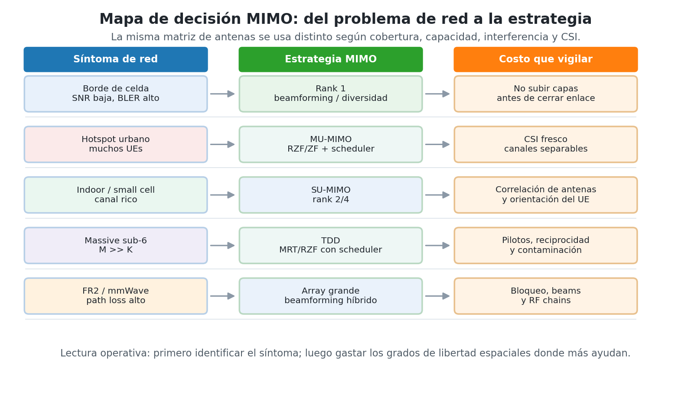
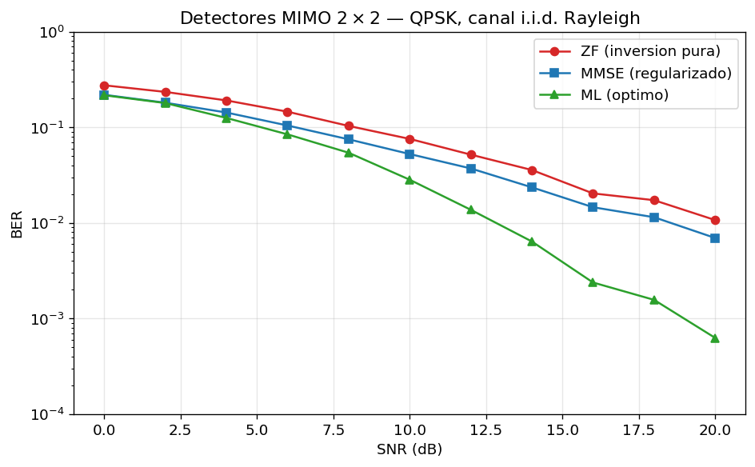
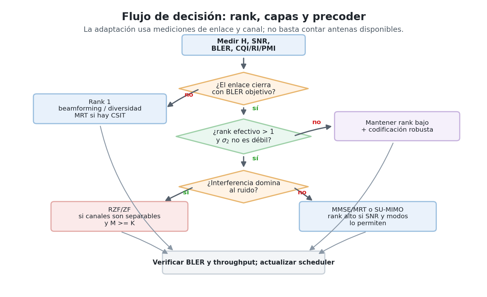
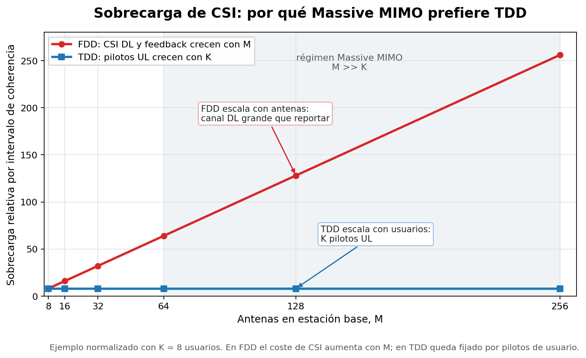

# Sesión 06 — MIMO en redes reales: cobertura, capacidad y usuarios

- [Vídeo - Parte 1](https://youtu.be/GaMZSzmyoIs)

## Objetivos de Aprendizaje

Al finalizar esta sesión, el estudiante será capaz de:

1. Diagnosticar qué problema de red intenta resolver un sistema multiantena: cobertura, throughput, interferencia, densidad de usuarios o pérdida de propagación en bandas altas.
2. Elegir entre SIMO, MISO, SU-MIMO, MU-MIMO, Massive MIMO y beamforming híbrido según el escenario de despliegue.
3. Interpretar la matriz de canal $\mathbf{H}$ como herramienta de diseño: rank, valores singulares, condicionamiento, correlación espacial, normas de canal y CSI.
4. Decidir cuándo conviene diversidad, beamforming o multiplexación espacial, y cuándo subir o bajar el rank de transmisión.
5. Comparar detectores y precodificadores implementables (ZF, MMSE, SIC, ML, MRT, ZF y RZF/MMSE) en términos de interferencia, ruido, cómputo y disponibilidad de CSI.
6. Explicar por qué Massive MIMO depende de TDD, pilotos, reciprocidad, scheduler y control de contaminación de pilotos.

---

## Introducción

En las sesiones anteriores el problema parecía tener una sola dimensión: una señal entra, una señal sale, y el diseñador ajusta modulación, codificación, OFDM o potencia para que los bits sobrevivan. MIMO cambia la pregunta. La pregunta ya no es solo "cuánta capacidad tiene una matriz", sino:

> Tengo un problema de cobertura, capacidad, interferencia o densidad de usuarios. ¿Qué hago con las antenas?

Esa es la lectura implementativa de MIMO. Las antenas no son decoración ni una fórmula de capacidad: son grados de libertad espaciales que se pueden gastar de formas distintas. A veces se usan para que un usuario en borde de celda reciba suficiente energía. A veces para enviar dos o cuatro capas al mismo terminal. A veces para servir varios usuarios al mismo tiempo. A veces para formar un haz estrecho en mmWave, donde sin ganancia de array el enlace ni siquiera cierra.

La decisión correcta depende del canal, no de una regla fija. Si el canal tiene buen rank y SNR alta, subir capas aumenta throughput. Si el canal está mal condicionado, forzar muchas capas hace que el receptor o el precoder amplifique ruido. Si los usuarios tienen canales casi ortogonales, MU-MIMO funciona bien. Si los canales son paralelos, el scheduler debe separarlos en tiempo/frecuencia o el precoder pagará mucha potencia para cancelar interferencia.

El objetivo de esta sesión es construir esa brújula. La matemática sigue estando: $\mathbf{H}$, la SVD, el compromiso diversidad-multiplexación (DMT), y los precodificadores y detectores clásicos (MRT, ZF, MMSE). Pero aquí aparecen como herramientas para tomar decisiones de red; cada sigla se define en la sección donde se usa por primera vez.

!!! warning "Antes de empezar: qué repasar"

    Esta sesión usa álgebra lineal que **no se enseña aquí**:

    - multiplicación matriz-vector;
    - **eigenvalores y eigenvectores** — la ecuación $\mathbf{A}\mathbf{v} = \lambda\mathbf{v}$: las direcciones que una matriz no rota, solo escala. En los textos en español el tema aparece como **valores y vectores propios** (o autovalores/autovectores) — buscar con esos nombres;
    - la conjugada transpuesta $\mathbf{A}^{\mathsf{H}}$ (transponer y conjugar cada entrada compleja);
    - la norma $\|\mathbf{v}\|$ de un vector y su cuadrado $\|\mathbf{v}\|^2$ como energía.

    Si "eigenvector" no le dice nada, repáselo antes de llegar a §3 con alguna de estas referencias:

    - **3Blue1Brown**, *Essence of Linear Algebra*, capítulos 13–14 (intuición visual de valores y vectores propios; subtítulos en español) — la mejor inversión de 30 minutos para esta sesión;
    - **Khan Academy** (en español), unidad *Valores y vectores propios*: ahí se practica exactamente el procedimiento $(\mathbf{A} - \lambda\mathbf{I})\mathbf{v} = \mathbf{0}$ que usa la receta de §3.1;
    - cualquier texto de álgebra lineal, capítulo de valores propios (Grossman, Lay o Strang).

    La caja "Cálculo de la SVD de un canal 2×2" en §3.1 muestra el procedimiento completo paso a paso, incluida la relación $\sigma = \sqrt{\lambda}$ — pero enseña a *aplicar* el concepto, no lo sustituye.

---

## Teoría

!!! note "Vocabulario de la sesión"

    - **Capa = stream = flujo**: son la misma cosa y este documento los usa como sinónimos. Es una secuencia de datos independiente que se transmite al mismo tiempo que las demás. Los estándares dicen *layers*; la literatura dice *streams*.
    - **Modo espacial = subcanal**: cada canal paralelo e independiente contenido dentro de $\mathbf{H}$; la SVD los revela. No es sinónimo de capa: la **capa** es *lo que se transmite*, el **subcanal** es *por dónde pasa*. Idealmente cada capa viaja por su propio subcanal.
    - **Grados de libertad espaciales**: cuántas señales independientes puede manejar simultáneamente el arreglo de antenas. Se gastan en robustez, en throughput o en servir más usuarios — no alcanzan para todo a la vez.
    - **Cerrar el enlace**: lograr que la potencia que llega al receptor alcance el SNR mínimo que exige la tasa de error objetivo. Si el enlace "no cierra", ninguna otra optimización importa.
    - **CSI / CSIT / CSIR**: *channel state information* — el conocimiento de $\mathbf{H}$. La T o R final indica quién lo tiene: el Transmisor o el Receptor.
    - **BS / UE**: estación base / terminal del usuario.
    - **TDD / FDD**: duplexación por tiempo (subida y bajada alternan sobre la **misma** frecuencia → el canal de ida y el de vuelta son el mismo: *reciprocidad*) / por frecuencia (subida y bajada en bandas **distintas** → canales distintos, la reciprocidad no aplica).
    - **FR1 / FR2**: los dos rangos de frecuencia de 5G. FR1: sub-6 GHz. FR2: ondas milimétricas (24 GHz en adelante), donde la pérdida de propagación es tan alta que sin ganancia de haz el enlace no cierra.
    - Los términos propios de Massive MIMO (*channel hardening*, *favorable propagation*, contaminación de pilotos) se definen en §7.

### 1. Primero el problema de red

Antes de hablar de SVD conviene mirar el síntoma del sistema. El mismo array de antenas puede resolver problemas diferentes según cómo se use.

Esta tabla es un mapa de la sesión completa: nombra estrategias y precodificadores que se definen en §5 y §7. Conviene leerla primero como panorama, sin necesidad de entender cada sigla todavía, y volver a ella al final de la sesión.

| Escenario | Síntoma de red | Estrategia MIMO natural | Costo o riesgo principal |
|---|---|---|---|
| Borde de celda rural | SNR baja, enlace frágil | Beamforming o diversidad (→ §4) | Subir rank demasiado rompe la robustez |
| Hotspot urbano | Muchos usuarios, interferencia alta | MU-MIMO con ZF/RZF (→ §5.2) y scheduler | CSI fresco y canales separables |
| Indoor / small cell | Canal rico, distancias cortas | SU-MIMO rank 2/4 | Antenas muy juntas reducen rank efectivo |
| Massive MIMO sub-6 GHz | Muchos UEs por celda | $M \gg K$, TDD, RZF/MRT (→ §7) | Pilotos, reciprocidad y contaminación (→ §7.1) |
| FR2 / mmWave | Path loss alto, haces estrechos | Arrays grandes y beamforming híbrido (→ §7.2) | Bloqueo, alineamiento de beams y RF chains (→ §7.2) |

<figure markdown="span">
  
  <!-- generada por generate_design_figures.py -->
  <figcaption markdown="1">**Figura 1.** Mapa de decisión para traducir un síntoma de red en una estrategia MIMO y en el costo operativo que debe vigilarse. Sirve como brújula antes de elegir rank, detector o precoder.
  </figcaption>
</figure>

Una regla práctica aparece desde el primer minuto:

!!! note "Regla de diseño"

    Primero se **cierra el enlace**; después se sube el rank. Si el UE apenas recibe señal, la prioridad es beamforming/diversidad. Si el enlace ya es robusto y el canal tiene modos espaciales independientes, entonces se explota multiplexación.

MIMO ofrece tres usos básicos:

- **Diversidad**: repetir o codificar la misma información sobre caminos independientes para reducir probabilidad de error.
- **Beamforming**: sumar señales con fases controladas para concentrar energía hacia un usuario o dirección.
- **Multiplexación espacial**: enviar capas distintas al mismo tiempo y en la misma banda para aumentar throughput.

La dificultad real es que esas tres metas compiten por los mismos grados de libertad espaciales. Un array no puede gastar todos sus recursos en robustez, máxima tasa y cancelación perfecta de interferencia a la vez.

??? question "Comprueba tu comprensión"

    **P1.** Un UE en borde de celda reporta bajo SNR y alto BLER. ¿Subirías rank o reforzarías beamforming/diversidad?

    **P2.** Dos usuarios tienen canales casi paralelos. ¿Es buen momento para servirlos simultáneamente con MU-MIMO?

    ---

    **R1.** Reforzaría beamforming/diversidad. Subir rank significa repartir la misma potencia entre más capas — cada una llega más débil — justo cuando el enlace todavía no cierra. Primero energía suficiente; después capas.

    **R2.** No es ideal. Si los canales son casi paralelos, los dos usuarios "se ven iguales" desde la estación base: cualquier señal dirigida a uno llega casi idéntica al otro, y no hay geometría espacial que explotar. Separarlos espacialmente es posible pero caro (en §5 se verá cuánto cuesta); lo razonable es que el scheduler los sirva en tiempos o frecuencias distintas.

### 2. Qué arreglo de antenas usar

La Figura 2 muestra las configuraciones básicas. La lectura práctica no es "más antenas siempre es mejor", sino "qué extremo tiene antenas, quién conoce el canal y qué se quiere optimizar".

<figure markdown="span">
  
  <!-- generada por celda 2 de lab.ipynb -->
  <figcaption markdown="1">**Figura 2.** Configuraciones de antenas. **SISO**: referencia escalar. **SIMO**: varias ramas de recepción para diversidad/combining. **MISO**: varias antenas transmisoras para formar haz hacia un receptor simple. **MIMO**: antenas en ambos extremos para diversidad, beamforming y/o multiplexación espacial.
  </figcaption>
</figure>

| Configuración | Dónde aparece | Cuándo usarla | Qué gana | Qué no resuelve |
|---|---|---|---|---|
| SIMO | Receptor con varias ramas | Mejorar recepción sin cambiar TX | Diversidad RX y combining | No crea múltiples capas si TX=1 |
| MISO | BS con varias antenas, UE simple | Cobertura downlink | Array gain y beamforming | No multiplexa varios streams a un UE de una antena |
| SU-MIMO | BS y UE multiantena | Throughput por usuario | Rank espacial y capas simultáneas | Exige canal bien condicionado |
| MU-MIMO | BS multiantena, varios UEs | Capacidad de celda | Reutilización espacial | Exige CSI y scheduler |
| Massive MIMO | $M$ mucho mayor que $K$ | Densidad y eficiencia energética | Hardening (→ §7) y canales casi ortogonales | Pilotos, TDD, correlación y contaminación (→ §7.1) |
| Híbrido mmWave | Arrays grandes con pocas cadenas RF (→ §7.2) | FR2/sub-THz | Ganancia de haz viable en hardware | Bloqueo y entrenamiento de beams |

Un punto de implementación que se olvida fácilmente: **antenas físicas no equivalen automáticamente a grados de libertad independientes**. Para que MIMO entregue multiplexación, las firmas espaciales deben ser distinguibles. Importan:

- separación de antenas, típicamente alrededor de $\lambda/2$;
- geometría del array: ULA, UPA, paneles activos;
- polarización;
- entorno de scattering;
- línea de vista y correlación espacial;
- orientación del UE.

En un teléfono pequeño, dos antenas pueden estar tan correlacionadas que el segundo modo espacial sea débil. En una estación base con muchos elementos, el problema opuesto aparece: hay muchas antenas, pero el sistema necesita CSI y calibración para usarlas bien.

!!! note "¿Y el espectro? Las capas no se reparten la banda"

    Los streams espaciales transmiten **al mismo tiempo y en la misma banda**. No se separan por subportadoras, slots ni códigos distintos. Se separan porque cada stream deja una firma espacial diferente en el receptor, codificada en las columnas de $\mathbf{H}$. Por eso MIMO puede aumentar throughput sin comprar más espectro, siempre que el canal tenga rank suficiente.

### 3. El canal como diagnóstico operativo

"Diagnóstico operativo" significa que $\mathbf{H}$ cumple el mismo papel que un análisis clínico: se estima porque cada decisión de operación se **lee** de ahí — quién transmite, cuántas capas, hacia dónde apuntar, cómo separar. Sin $\mathbf{H}$ medida, todas las decisiones de esta sesión se tomarían a ciegas.

La matriz de canal no es solo notación. En un sistema real, $\mathbf{H}$ es el objeto que se estima con pilotos y del que salen decisiones de scheduler, rank, beamforming, precoding y detección.

Para un canal de banda estrecha:

$$\boxed{\mathbf{y} = \mathbf{H}\mathbf{x} + \mathbf{n}} \tag{1}$$

donde $\mathbf{x} \in \mathbb{C}^{N_t}$ es el vector transmitido, $\mathbf{y} \in \mathbb{C}^{N_r}$ el vector recibido, $\mathbf{H} \in \mathbb{C}^{N_r \times N_t}$ la matriz de canal y $\mathbf{n} \sim \mathcal{CN}(\mathbf{0}, N_0\mathbf{I})$ el ruido. La notación $\mathcal{CN}$ se lee "gaussiana compleja": cada antena receptora sufre un ruido con parte real e imaginaria gaussianas, de potencia total $N_0$, independiente del ruido de las demás antenas (eso dice la $\mathbf{I}$). Cada entrada $h_{ji}$ responde: cuánto de la antena TX $i$ llega a la antena RX $j$, con qué amplitud y fase.

<figure markdown="span">
  
  <!-- generada por celda 3 de lab.ipynb -->
  <figcaption markdown="1">**Figura 3.** Matriz $\mathbf{H}$ para un sistema $4 \times 4$. Cada casilla contiene magnitud y fase del acoplamiento entre una antena transmisora y una receptora. Para implementación, esta matriz no es abstracta: es el insumo que estima el receptor o la estación base para decidir rank, precoder y detector.
  </figcaption>
</figure>

??? example "Cómo se estima H con pilotos"

    $\mathbf{H}$ no se conoce a priori: se estima. El mecanismo tiene tres partes.

    **1. Un piloto es una pregunta cuya respuesta ya se conoce.** El transmisor envía un símbolo $x_p$ pactado de antemano — el receptor sabe exactamente qué se transmitió. Recibe $y_p = h\,x_p + n$ y despeja:

    $$\hat{h} = \frac{y_p}{x_p} = h + \frac{n}{x_p}$$

    Es una estimación, no una medición perfecta: el ruido viene incluido. Por eso los pilotos se transmiten con potencia generosa y se promedian varios.

    **2. Para llenar una matriz: una antena habla, las demás callan.** Una división llena **una casilla**, y $\mathbf{H} \in \mathbb{C}^{N_r \times N_t}$ tiene $N_r N_t$ casillas. El protocolo:

    - *Instante 1*: TX$_1$ transmite su piloto; TX$_2, \ldots,$ TX$_{N_t}$ guardan silencio. Cada antena receptora $j$ escucha su propia versión, $y_j = h_{j1}x_p + n_j$, y divide: $\hat{h}_{j1} = y_j/x_p$. Las $N_r$ divisiones simultáneas llenan la **columna 1**.
    - *Instante 2*: habla TX$_2$ → columna 2. Y así hasta TX$_{N_t}$.

    Un 2×2: 2 pilotos × 2 antenas receptoras = 4 divisiones = las 4 casillas. En el grid tiempo-frecuencia de OFDM, cada antena TX tiene reservados sus *resource elements* de piloto — separados en tiempo, en frecuencia o por códigos ortogonales — y en los REs de piloto de una antena, las demás transmiten cero.

    **3. Contraste entre REs de piloto y REs de datos:**

    | REs de piloto | REs de datos |
    |---|---|
    | una TX habla, el resto calla | todas hablan a la vez |
    | sin mezcla → división directa | mezcla total → hace falta $\mathbf{H}$ |
    | aquí se **mide** $\mathbf{H}$ | aquí se **usa** $\mathbf{H}$ |

    Cada RE gastado en piloto no lleva datos, y la medida caduca — vale durante el tiempo de coherencia y en las subportadoras vecinas dentro del ancho de banda de coherencia; entre pilotos se interpola. Quién ejecuta la división y cómo llega el resultado al otro extremo (feedback en FDD vía RI/PMI/CQI, o reciprocidad en TDD) es exactamente el cuello de botella que decide la arquitectura de Massive MIMO en §7.1.

El modelo pedagógico más limpio es Rayleigh i.i.d.:

$$h_{ji} \sim \mathcal{CN}(0,1) \tag{2}$$

Significa dos cosas. **Independientes**: saber un coeficiente no predice los demás. **Idénticamente distribuidos**: todos los pares TX-RX siguen la misma estadística. Es un buen laboratorio mental para entender MIMO, aunque una red real usa modelos correlacionados como CDL (*Cluster Delay Line*) del TR 38.901 — el modelo de canal estándar de 3GPP, que en vez de coeficientes independientes describe grupos de trayectos físicos con sus retardos, ángulos de salida y llegada, y la geometría real del array.

En sistemas OFDM, esta ecuación vive por subportadora. MIMO-OFDM no tiene una sola matriz $\mathbf{H}$, sino una matriz $\mathbf{H}[k]$ por subportadora $k$. La Sesión 03 ya explicó cómo OFDM convierte un canal selectivo en frecuencia en muchos canales planos; aquí se decide qué hacer espacialmente en cada uno.

#### 3.1 Indicadores de diagnóstico del canal

| Indicador | Cómo se lee | Decisión de diseño |
|---|---|---|
| $\mathrm{rank}(\mathbf{H})$ | Número de modos espaciales útiles | Límite superior de capas simultáneas |
| Valores singulares $\sigma_k$ | Ganancia de cada modo espacial | Qué capas merecen potencia |
| Condicionamiento $\kappa = \sigma_1/\sigma_r$ | Desbalance entre modo fuerte y débil | Si ZF va a amplificar mucho ruido |
| Producto interno $\mathbf{h}_i^{\mathsf{H}}\mathbf{h}_j$ | Separabilidad entre usuarios | Si MU-MIMO simultáneo es razonable |
| Norma $\|\mathbf{h}_k\|^2$ | Fuerza del canal de un usuario | Scheduling, beamforming y power control |
| Tiempo de coherencia | Cuánto dura el CSI | Coste de pilotos y velocidad de adaptación |

El nombre "condicionamiento" viene del análisis numérico: un problema está *bien condicionado* cuando errores pequeños en los datos producen errores pequeños en el resultado, y *mal condicionado* cuando los amplifican. $\kappa$ mide exactamente esa sensibilidad para el canal: al invertir $\mathbf{H}$ (lo que hará el detector ZF en §5.1), los errores relativos — ruido, CSI imperfecta — pueden amplificarse hasta $\kappa$ veces.

Regla rápida para leer el condicionamiento: $\kappa \approx 1$ significa modos parejos, canal dócil para multiplexar; $\kappa \gtrsim 10$ significa que el modo débil es frágil y separarlo costará ruido o potencia; $\kappa \to \infty$ significa rank deficiente — hay menos modos útiles que antenas (el caso extremo es el canal *keyhole*, donde todos los trayectos pasan por un mismo "agujero" y $\kappa$ diverge).

La SVD aparece como herramienta de diagnóstico:

$$\mathbf{H} = \mathbf{U}\mathbf{\Sigma}\mathbf{V}^{\mathsf{H}} \tag{3}$$

La lectura implementativa es directa. Las columnas de $\mathbf{V}$ son direcciones de transmisión; las columnas de $\mathbf{U}$ son combinaciones de recepción; los valores singulares $\sigma_k$ dicen cuán bueno es cada modo. Si el segundo valor singular es pequeño, el segundo stream existe en álgebra, pero será caro en BER.

Esta interpretación organiza el resto de la sesión. La SVD muestra que dentro de cualquier $\mathbf{H}$ — por mezclado que se vea el canal antena a antena — existen canales paralelos que **no se mezclan entre sí**: los subcanales (los modos espaciales del vocabulario inicial). Los subcanales no se construyen: ya estaban en el canal físico; la SVD solo los encuentra. Con esa interpretación, las cinco decisiones que abrieron esta sección son cinco preguntas sobre los mismos subcanales:

| Decisión | Pregunta sobre los subcanales | Dónde se desarrolla |
|---|---|---|
| Rank | ¿cuántos subcanales vale la pena activar? | §3.1 y §6 |
| Beamforming | si abro uno solo, ¿toda la potencia por el más fuerte? | §4 |
| Precoding | ¿cómo alineo cada capa con la entrada de su subcanal? | §5.2 |
| Scheduler | ¿los subcanales de **quién** están mejor en este instante? | §5.2 y §7 |
| Detección | si el TX no pudo alinear (sin CSIT), ¿cómo deshace el RX la mezcla y a qué precio? | §5.1 |

Precoding y detección son simétricos: el primero arregla la mezcla **antes** de transmitir (lado $\mathbf{V}$, exige CSIT); la segunda la arregla **después** de recibir (lado $\mathbf{U}$, basta CSIR). Mismo problema, dos extremos del cable.

<figure markdown="span">
  
  <!-- generada por celda 5 de lab.ipynb -->
  <figcaption markdown="1">**Figura 4.** La SVD interpreta el canal MIMO como modos espaciales paralelos. En una lección implementativa, esto se usa como diagnóstico de rank y calidad de capas: no basta contar antenas; hay que mirar cuántos modos espaciales son fuertes.
  </figcaption>
</figure>

??? example "Cálculo de la SVD de un canal 2×2"

    Procedimiento para obtener los valores singulares ($\sigma_1$, $\sigma_2$) y las direcciones ($\mathbf{v}_1$, $\mathbf{v}_2$) de un canal — los mismos que el ejemplo posterior usa como datos. Son cuatro pasos válidos para cualquier matriz, aplicados aquí a $\mathbf{H} = \begin{pmatrix} 1 & 0{,}5 \\ 0{,}5 & 1 \end{pmatrix}$.

    **Paso 1.** Formar $\mathbf{H}^{\mathsf{H}}\mathbf{H}$ (siempre sale simétrica). Esta $\mathbf{H}$ es real y simétrica, así que $\mathbf{H}^{\mathsf{H}} = \mathbf{H}$:

    $$\mathbf{H}^{\mathsf{H}}\mathbf{H} = \begin{pmatrix} 1 & 0{,}5 \\ 0{,}5 & 1 \end{pmatrix}\begin{pmatrix} 1 & 0{,}5 \\ 0{,}5 & 1 \end{pmatrix} = \begin{pmatrix} 1 + 0{,}25 & 0{,}5 + 0{,}5 \\ 0{,}5 + 0{,}5 & 0{,}25 + 1 \end{pmatrix} = \begin{pmatrix} 1{,}25 & 1 \\ 1 & 1{,}25 \end{pmatrix}$$

    **Paso 2.** Sus eigenvalores son los $\sigma^2$:

    $$\det(\mathbf{H}^{\mathsf{H}}\mathbf{H} - \lambda\mathbf{I}) = (1{,}25-\lambda)^2 - 1 = 0 \;\Rightarrow\; \lambda_1 = 2{,}25, \; \lambda_2 = 0{,}25$$

    $$\sigma_1 = \sqrt{2{,}25} = 1{,}5, \qquad \sigma_2 = \sqrt{0{,}25} = 0{,}5$$

    ¿Por qué la raíz cuadrada? Porque los eigenvalores de $\mathbf{H}^{\mathsf{H}}\mathbf{H}$ son **energías** de salida: si $\mathbf{v}$ es un eigenvector unitario con eigenvalor $\lambda$, la energía que sale del canal al transmitir $\mathbf{v}$ es

    $$\|\mathbf{H}\mathbf{v}\|^2 = \mathbf{v}^{\mathsf{H}}(\mathbf{H}^{\mathsf{H}}\mathbf{H})\mathbf{v} = \mathbf{v}^{\mathsf{H}}(\lambda\mathbf{v}) = \lambda$$

    Es decir: $\lambda$ vive en el mundo de la potencia y $\sigma$ en el de la amplitud, y la conversión entre ambos es el cuadrado — la misma relación que entre voltaje y potencia. La amplitud de salida es $\|\mathbf{H}\mathbf{v}\| = \sqrt{\lambda} \equiv \sigma$. De paso, esto garantiza que la raíz siempre existe: $\lambda = \|\mathbf{H}\mathbf{v}\|^2 \geq 0$ por ser una norma al cuadrado.

    **Paso 3.** Sus eigenvectores son las columnas de $\mathbf{V}$:

    $$(\mathbf{H}^{\mathsf{H}}\mathbf{H} - 2{,}25\,\mathbf{I})\,\mathbf{v} = \begin{pmatrix} -1 & 1 \\ 1 & -1 \end{pmatrix}\mathbf{v} = \mathbf{0} \;\Rightarrow\; \mathbf{v}_1 = \frac{1}{\sqrt{2}}\begin{pmatrix} 1 \\ 1 \end{pmatrix}$$

    y con $\lambda_2 = 0{,}25$ sale $\mathbf{v}_2 = \frac{1}{\sqrt{2}}\begin{pmatrix} 1 \\ -1 \end{pmatrix}$.

    **Paso 4.** Las columnas de $\mathbf{U}$: $\mathbf{u}_k = \mathbf{H}\mathbf{v}_k / \sigma_k$. Con los números:

    $$\mathbf{u}_1 = \frac{\mathbf{H}\mathbf{v}_1}{\sigma_1} = \frac{1}{1{,}5} \cdot \frac{1}{\sqrt{2}}\begin{pmatrix} 1 \cdot 1 + 0{,}5 \cdot 1 \\ 0{,}5 \cdot 1 + 1 \cdot 1 \end{pmatrix} = \frac{1}{1{,}5} \cdot \frac{1}{\sqrt{2}}\begin{pmatrix} 1{,}5 \\ 1{,}5 \end{pmatrix} = \frac{1}{\sqrt{2}}\begin{pmatrix} 1 \\ 1 \end{pmatrix} = \mathbf{v}_1$$

    y análogamente $\mathbf{u}_2 = \mathbf{H}\mathbf{v}_2/0{,}5 = \mathbf{v}_2$. Coinciden **solo porque esta $\mathbf{H}$ es simétrica**; en un canal general $\mathbf{U} \neq \mathbf{V}$: las direcciones buenas de entrada y de salida son distintas (el segundo ejemplo de esta caja lo muestra).

    **Paso 5.** Ensamblar las tres matrices de la ecuación (3). Cada $\mathbf{v}_k$ es una columna de $\mathbf{V}$ y cada $\mathbf{u}_k$ una columna de $\mathbf{U}$. La matriz $\mathbf{\Sigma}$ se construye así: es una matriz con los valores singulares en la diagonal, **ordenados de mayor a menor** ($\sigma_1 \geq \sigma_2$, la convención universal), y ceros en todo lo demás:

    $$\mathbf{\Sigma} = \begin{pmatrix} \sigma_1 & 0 \\ 0 & \sigma_2 \end{pmatrix}$$

    Los ceros fuera de la diagonal no son relleno — son el mensaje central de la SVD: en las coordenadas de los subcanales **nada se mezcla con nada**; cada entrada $\sigma_k$ solo multiplica a su propio subcanal. El orden importa porque la posición define la pareja: $\sigma_1$ trabaja con la columna 1 de $\mathbf{U}$ y la columna 1 de $\mathbf{V}$ (el subcanal fuerte), $\sigma_2$ con las columnas 2 (el débil). Con los números:

    $$\mathbf{V} = \begin{pmatrix} | & | \\ \mathbf{v}_1 & \mathbf{v}_2 \\ | & | \end{pmatrix} = \frac{1}{\sqrt{2}}\begin{pmatrix} 1 & 1 \\ 1 & -1 \end{pmatrix}, \qquad \mathbf{U} = \frac{1}{\sqrt{2}}\begin{pmatrix} 1 & 1 \\ 1 & -1 \end{pmatrix}, \qquad \mathbf{\Sigma} = \begin{pmatrix} 1{,}5 & 0 \\ 0 & 0{,}5 \end{pmatrix}$$

    El producto reconstruye el canal original:

    $$\mathbf{U}\mathbf{\Sigma}\mathbf{V}^{\mathsf{H}} = \frac{1}{2}\begin{pmatrix} 1 & 1 \\ 1 & -1 \end{pmatrix}\begin{pmatrix} 1{,}5 & 0 \\ 0 & 0{,}5 \end{pmatrix}\begin{pmatrix} 1 & 1 \\ 1 & -1 \end{pmatrix} = \begin{pmatrix} 1 & 0{,}5 \\ 0{,}5 & 1 \end{pmatrix} = \mathbf{H} \;\checkmark$$

    **Verificación rápida sin ensamblar:** $\mathbf{H}\mathbf{v}_1 = 1{,}5\,\mathbf{v}_1$ y $\mathbf{H}\mathbf{v}_2 = 0{,}5\,\mathbf{v}_2$; basta comprobar los cuatro productos. En la práctica este cálculo lo realiza `numpy.linalg.svd(H)`.

    ---

    **El mismo procedimiento con un canal no simétrico.** En el ejemplo anterior $\mathbf{U} = \mathbf{V}$ por la simetría de $\mathbf{H}$; ese es el caso excepcional. Un canal típico tiene los cuatro acoplamientos no nulos y los cruzados desiguales:

    $$\mathbf{H} = \begin{pmatrix} 1{,}2 & 0{,}4 \\ 1{,}1 & 1{,}2 \end{pmatrix}$$

    Caminos directos comparables ($h_{11} = h_{22} = 1{,}2$) y acoplamientos cruzados distintos ($h_{12} = 0{,}4 \neq h_{21} = 1{,}1$): sin simetría.

    *Paso 1:*

    $$\mathbf{H}^{\mathsf{H}}\mathbf{H} = \begin{pmatrix} 1{,}2^2 + 1{,}1^2 & 1{,}2 \cdot 0{,}4 + 1{,}1 \cdot 1{,}2 \\ 1{,}8 & 0{,}4^2 + 1{,}2^2 \end{pmatrix} = \begin{pmatrix} 2{,}65 & 1{,}8 \\ 1{,}8 & 1{,}6 \end{pmatrix}$$

    *Paso 2:* el polinomio característico es $\lambda^2 - 4{,}25\,\lambda + 1 = 0$ (traza $= 2{,}65 + 1{,}6 = 4{,}25$; determinante $= 2{,}65 \cdot 1{,}6 - 1{,}8^2 = 1$). El discriminante es $4{,}25^2 - 4 = 14{,}0625 = 3{,}75^2$:

    $$\lambda_1 = \frac{4{,}25 + 3{,}75}{2} = 4, \qquad \lambda_2 = \frac{4{,}25 - 3{,}75}{2} = 0{,}25 \;\Rightarrow\; \sigma_1 = 2, \; \sigma_2 = 0{,}5$$

    *Paso 3:* se plantea $(\mathbf{H}^{\mathsf{H}}\mathbf{H} - \lambda\mathbf{I})\mathbf{v} = \mathbf{0}$ para cada eigenvalor. Con $\lambda_1 = 4$:

    $$\mathbf{H}^{\mathsf{H}}\mathbf{H} - 4\mathbf{I} = \begin{pmatrix} 2{,}65 - 4 & 1{,}8 \\ 1{,}8 & 1{,}6 - 4 \end{pmatrix} = \begin{pmatrix} -1{,}35 & 1{,}8 \\ 1{,}8 & -2{,}4 \end{pmatrix}$$

    El vector buscado es la incógnita: se escribe $\mathbf{v} = \binom{x}{y}$ y se ejecuta la multiplicación matriz-vector del sistema $(\mathbf{H}^{\mathsf{H}}\mathbf{H} - 4\mathbf{I})\mathbf{v} = \mathbf{0}$, fila por fila:

    $$\begin{pmatrix} -1{,}35 & 1{,}8 \\ 1{,}8 & -2{,}4 \end{pmatrix}\begin{pmatrix} x \\ y \end{pmatrix} = \begin{pmatrix} 0 \\ 0 \end{pmatrix} \;\Rightarrow\; \begin{cases} -1{,}35\,x + 1{,}8\,y = 0 & \text{(fila 1)} \\ \;\;\,1{,}8\,x - 2{,}4\,y = 0 & \text{(fila 2)} \end{cases}$$

    La fila 1 da $-1{,}35\,x + 1{,}8\,y = 0 \Rightarrow y = 0{,}75\,x$: dirección $(4, 3)$, normalizada $\mathbf{v}_1 = \binom{0{,}8}{0{,}6}$. (La fila 2, $1{,}8\,x - 2{,}4\,y = 0$, da la misma recta — con $\lambda$ correcto las filas son proporcionales, así que basta una; si dieran rectas distintas, el eigenvalor está mal calculado.) Con $\lambda_2 = 0{,}25$, la fila 1 da $2{,}4\,x + 1{,}8\,y = 0 \Rightarrow$ $\mathbf{v}_2 = \binom{-0{,}6}{0{,}8}$.

    *Paso 4:* primero la multiplicación $\mathbf{H}\mathbf{v}_1$, fila por columna:

    $$\mathbf{H}\mathbf{v}_1 = \begin{pmatrix} 1{,}2 & 0{,}4 \\ 1{,}1 & 1{,}2 \end{pmatrix}\begin{pmatrix} 0{,}8 \\ 0{,}6 \end{pmatrix} = \begin{pmatrix} 1{,}2 \cdot 0{,}8 + 0{,}4 \cdot 0{,}6 \\ 1{,}1 \cdot 0{,}8 + 1{,}2 \cdot 0{,}6 \end{pmatrix} = \begin{pmatrix} 0{,}96 + 0{,}24 \\ 0{,}88 + 0{,}72 \end{pmatrix} = \begin{pmatrix} 1{,}2 \\ 1{,}6 \end{pmatrix}$$

    Dividir entre $\sigma_1 = 2$ es dividir cada componente:

    $$\mathbf{u}_1 = \frac{\mathbf{H}\mathbf{v}_1}{\sigma_1} = \begin{pmatrix} 1{,}2/2 \\ 1{,}6/2 \end{pmatrix} = \begin{pmatrix} 0{,}6 \\ 0{,}8 \end{pmatrix}$$

    Lo mismo con $\mathbf{v}_2$:

    $$\mathbf{H}\mathbf{v}_2 = \begin{pmatrix} 1{,}2 & 0{,}4 \\ 1{,}1 & 1{,}2 \end{pmatrix}\begin{pmatrix} -0{,}6 \\ 0{,}8 \end{pmatrix} = \begin{pmatrix} -0{,}72 + 0{,}32 \\ -0{,}66 + 0{,}96 \end{pmatrix} = \begin{pmatrix} -0{,}4 \\ 0{,}3 \end{pmatrix}, \qquad \mathbf{u}_2 = \begin{pmatrix} -0{,}4/0{,}5 \\ 0{,}3/0{,}5 \end{pmatrix} = \begin{pmatrix} -0{,}8 \\ 0{,}6 \end{pmatrix}$$

    $$\mathbf{U} = \begin{pmatrix} 0{,}6 & -0{,}8 \\ 0{,}8 & 0{,}6 \end{pmatrix} \neq \mathbf{V} = \begin{pmatrix} 0{,}8 & -0{,}6 \\ 0{,}6 & 0{,}8 \end{pmatrix}$$

    *Paso 5:* reconstruir $\mathbf{H} = \mathbf{U}\mathbf{\Sigma}\mathbf{V}^{\mathsf{H}}$ multiplicando de izquierda a derecha. Primer producto, $\mathbf{U}\mathbf{\Sigma}$ — multiplicar por una matriz diagonal escala cada **columna**: la columna 1 de $\mathbf{U}$ por $\sigma_1 = 2$ y la columna 2 por $\sigma_2 = 0{,}5$:

    $$\mathbf{U}\mathbf{\Sigma} = \begin{pmatrix} 0{,}6 & -0{,}8 \\ 0{,}8 & 0{,}6 \end{pmatrix}\begin{pmatrix} 2 & 0 \\ 0 & 0{,}5 \end{pmatrix} = \begin{pmatrix} 0{,}6 \cdot 2 & -0{,}8 \cdot 0{,}5 \\ 0{,}8 \cdot 2 & 0{,}6 \cdot 0{,}5 \end{pmatrix} = \begin{pmatrix} 1{,}2 & -0{,}4 \\ 1{,}6 & 0{,}3 \end{pmatrix}$$

    Segundo ingrediente, $\mathbf{V}^{\mathsf{H}}$: como esta $\mathbf{V}$ es real, conjugar no hace nada y solo se transpone (filas ↔ columnas):

    $$\mathbf{V}^{\mathsf{H}} = \begin{pmatrix} 0{,}8 & -0{,}6 \\ 0{,}6 & 0{,}8 \end{pmatrix}^{\mathsf{T}} = \begin{pmatrix} 0{,}8 & 0{,}6 \\ -0{,}6 & 0{,}8 \end{pmatrix}$$

    Producto final, fila por columna con las sumas a la vista:

    $$(\mathbf{U}\mathbf{\Sigma})\mathbf{V}^{\mathsf{H}} = \begin{pmatrix} 1{,}2 & -0{,}4 \\ 1{,}6 & 0{,}3 \end{pmatrix}\begin{pmatrix} 0{,}8 & 0{,}6 \\ -0{,}6 & 0{,}8 \end{pmatrix} = \begin{pmatrix} 0{,}96 + 0{,}24 & 0{,}72 - 0{,}32 \\ 1{,}28 - 0{,}18 & 0{,}96 + 0{,}24 \end{pmatrix} = \begin{pmatrix} 1{,}2 & 0{,}4 \\ 1{,}1 & 1{,}2 \end{pmatrix} = \mathbf{H} \;\checkmark$$

    (También cuadra $\det \mathbf{H} = 1{,}44 - 0{,}44 = 1 = \sigma_1\sigma_2$.)

    La lectura: el mejor patrón de entrada es $\mathbf{v}_1 = (0{,}8;\, 0{,}6)$ — más peso en TX$_1$ — pero la señal llega al receptor como $\mathbf{u}_1 = (0{,}6;\, 0{,}8)$ — más peso en RX$_2$. El canal rotó la dirección al atravesarlo; por eso la SVD lleva dos juegos de direcciones: el transmisor alinea con $\mathbf{v}_k$ y el receptor proyecta sobre $\mathbf{u}_k$. Nota práctica: los eigenvectores están definidos salvo signo — `numpy` puede devolver $\mathbf{v}_2$ y $\mathbf{u}_2$ con ambos signos invertidos; el producto $\mathbf{U}\mathbf{\Sigma}\mathbf{V}^{\mathsf{H}}$ no cambia.

??? example "Ejemplo mínimo: canal 2×2 bien y mal condicionado"

    **Canal A — acoplamiento cruzado moderado:**

    $$\mathbf{H}_A = \begin{pmatrix} 1 & 0{,}5 \\ 0{,}5 & 1 \end{pmatrix}$$

    Sus direcciones naturales son la señal en fase y en contrafase:

    $$\mathbf{v}_1 = \frac{1}{\sqrt{2}}\begin{pmatrix} 1 \\ 1 \end{pmatrix}, \qquad \mathbf{v}_2 = \frac{1}{\sqrt{2}}\begin{pmatrix} 1 \\ -1 \end{pmatrix}$$

    En fase, el camino cruzado suma al directo: $\sigma_1 = 1 + 0{,}5 = 1{,}5$. En contrafase, resta: $\sigma_2 = 1 - 0{,}5 = 0{,}5$. Las ganancias por modo son $\sigma_1^2 = 2{,}25$ y $\sigma_2^2 = 0{,}25$, y el condicionamiento:

    $$\kappa_A = \frac{\sigma_1}{\sigma_2} = \frac{1{,}5}{0{,}5} = 3$$

    Según la regla rápida de arriba: canal dócil. Rank 2 utilizable si el SNR acompaña.

    **Canal B — acoplamiento cruzado fuerte (las antenas casi se copian):**

    $$\mathbf{H}_B = \begin{pmatrix} 1 & 0{,}9 \\ 0{,}9 & 1 \end{pmatrix}$$

    Mismas direcciones naturales (la matriz sigue siendo simétrica), pero ahora:

    $$\sigma_1 = 1 + 0{,}9 = 1{,}9, \qquad \sigma_2 = 1 - 0{,}9 = 0{,}1, \qquad \kappa_B = \frac{1{,}9}{0{,}1} = 19$$

    Ganancias por modo: $\sigma_1^2 = 3{,}61$ contra $\sigma_2^2 = 0{,}01$ — el segundo modo transporta **361 veces menos** energía que el primero.

    La razón física del deterioro: con acoplamiento 0,9, las dos antenas receptoras escuchan **casi la misma mezcla** — la información que las distingue vive en la pequeña diferencia entre sus señales. Separar dos capas ahí obliga a restar cantidades casi iguales ($\sigma_2 = 1 - 0{,}9$ es literalmente esa resta), y una diferencia tan pequeña queda al nivel del ruido. Ese es el sentido operativo de "mal condicionado": la información de la segunda capa existe, pero llega escondida en una diferencia diminuta que cualquier error entierra.

    La misma situación, vista geométricamente: las columnas de $\mathbf{H}_B$ son las firmas espaciales de cada antena transmisora, $\binom{1}{0{,}9}$ y $\binom{0{,}9}{1}$ — dos vectores **casi paralelos**. Casi paralelos significa casi linealmente dependientes: la matriz está a un paso de ser rank 1. En el canal A las columnas $\binom{1}{0{,}5}$ y $\binom{0{,}5}{1}$ se separan con un ángulo mucho mayor. Un canal bien condicionado es uno cuyas antenas transmisoras dejan huellas claramente distinguibles en el receptor; en $\mathbf{H}_B$ las dos huellas casi coinciden.

    **Lectura conjunta:** ambos canales tienen rank algebraico 2 (ningún determinante es cero), pero sus destinos son opuestos. El canal A multiplexa 2 capas con SNR razonable; el canal B tiene un segundo modo tan hundido que forzar 2 capas es pagar BER — en la práctica se opera con rank 1. **El rank cuenta los modos; κ dice si valen algo.**

    El precio exacto de ignorar κ lo calcula el ejemplo de ZF en §5.1: separar las capas del canal A multiplica el ruido por 2,22; hacerlo con el canal B lo multiplica por 50.

    Chequeo de energía para ambos (la norma de Frobenius siempre reparte entre modos):

    $$\|\mathbf{H}_A\|_F^2 = 1 + 0{,}25 + 0{,}25 + 1 = 2{,}5 = 2{,}25 + 0{,}25 \;\checkmark$$

    $$\|\mathbf{H}_B\|_F^2 = 1 + 0{,}81 + 0{,}81 + 1 = 3{,}62 = 3{,}61 + 0{,}01 \;\checkmark$$

    Nótese que el canal B tiene **más** energía total que el A — y aun así es peor para multiplexar. Energía no es lo mismo que grados de libertad: en B casi toda la energía cae en un solo modo.

### 4. Diversidad, beamforming y multiplexación

Ahora podemos formular la decisión central. Con grados de libertad espaciales, ¿qué se optimiza?

| Modo de uso | Qué transmite | Cuándo conviene | Riesgo |
|---|---|---|---|
| Diversidad | Misma información por caminos independientes | Cobertura, baja SNR, enlace crítico | No aumenta throughput por capas |
| Beamforming | Señal alineada en fase hacia un usuario/dirección | Cobertura DL, FR2, UEs simples | Requiere CSI o búsqueda de haz |
| Multiplexación espacial | Capas distintas simultáneas | Alto SNR y buen rank | BER alta si el canal está mal condicionado |

Las tres filas de la tabla compiten por las mismas antenas: cada grado de libertad gastado en enviar una capa extra es un grado de libertad que ya no protege a las capas restantes. La teoría clásica del *Diversity-Multiplexing Tradeoff* (DMT, compromiso diversidad-multiplexación) cuantifica este conflicto con dos números:

- $r$ = **ganancia de multiplexación**: cuántas capas simultáneas efectivas transporta el sistema — cómo escala el throughput cuando sube el SNR;
- $d$ = **ganancia de diversidad**: cuántos caminos independientes protegen cada capa — qué tan rápido cae la probabilidad de error al subir el SNR (BER $\propto \text{SNR}^{-d}$: a mayor $d$, la curva de error cae más en picada).

Para un canal $N_t \times N_r$ i.i.d. Rayleigh, el mejor par $(r, d)$ alcanzable es:

$$d^{\text{opt}}(r) = (N_t-r)(N_r-r), \quad r \in \{0,1,\ldots,\min(N_t,N_r)\} \tag{4}$$

Notación: $d^{\text{opt}}(r)$ es una función, como $f(x)$ — se elige $r$ (cuántas capas) y la fórmula devuelve la mejor diversidad alcanzable con esa elección. En la literatura esta misma función se escribe $d^*(r)$, con el asterisco denotando "óptimo"; conviene reconocer ambas formas.

La lectura práctica no es memorizar el límite, sino la pendiente del compromiso: cada capa adicional (sube $r$) resta caminos de protección (baja $d$). No se puede tener el máximo de ambos a la vez.

??? example "DMT evaluada para un canal 2×2"

    Con $N_t = N_r = 2$, la fórmula (4) da exactamente tres opciones. Se elige $r$ y se sustituye:

    | Evaluación de la función | Interpretación |
    |---|---|
    | $d^{\text{opt}}(0) = (2-0)(2-0) = 4$ | Se eligen 0 capas extra → protección máxima: las 4 combinaciones TX–RX protegen el mismo símbolo. BER cae como $\text{SNR}^{-4}$ (el régimen de Alamouti, §4) |
    | $d^{\text{opt}}(1) = (2-1)(2-1) = 1$ | Una capa → protección modesta: BER cae como $\text{SNR}^{-1}$, igual que un SISO |
    | $d^{\text{opt}}(2) = (2-2)(2-2) = 0$ | Dos capas → protección agotada: throughput máximo, cada capa queda expuesta a su propio fading |

    Las opciones son discretas y no hay punto intermedio gratuito: pasar de $r=0$ a $r=2$ cuesta toda la diversidad. La fila intermedia describe una decisión real de red: transmitir 1 capa con beamforming no desperdicia la segunda antena — la convierte en protección o ganancia en lugar de throughput.

| Si el sistema ve... | Acción razonable | Por qué |
|---|---|---|
| SNR baja o borde de celda | Rank bajo + beamforming/diversidad | Primero cerrar enlace |
| SNR alta y valores singulares equilibrados | Subir rank | El canal soporta capas |
| Segundo valor singular muy débil | Bajar rank o usar más codificación | La capa extra cuesta demasiada BER |
| Usuarios casi ortogonales | MU-MIMO simultáneo | La interferencia espacial es baja |
| Usuarios casi paralelos | Scheduler o ZF/RZF con cuidado | Separarlos cuesta potencia y ruido |

??? example "Alamouti: diversidad plena sin CSIT"

    El ejemplo clásico de diversidad es el código de Alamouti 2×1. Dos antenas TX, una RX, dos ranuras temporales:

    | | Antena 1 | Antena 2 |
    |---|---|---|
    | Ranura 1 | $s_1$ | $s_2$ |
    | Ranura 2 | $-s_2^*$ | $s_1^*$ |

    Con canales $h_1, h_2$ constantes durante las dos ranuras:

    $$r_1 = h_1s_1 + h_2s_2 + n_1, \qquad r_2 = -h_1s_2^* + h_2s_1^* + n_2$$

    El receptor combina:

    $$\hat{s}_1 = h_1^*r_1 + h_2r_2^*, \qquad \hat{s}_2 = h_2^*r_1 - h_1r_2^*$$

    Desarrollo término a término para $\hat{s}_1$. Primero se conjuga $r_2$:

    $$r_2^* = -h_1^*s_2 + h_2^*s_1 + n_2^*$$

    Luego sustituir ambos ingredientes:

    $$h_1^*r_1 = |h_1|^2s_1 + \underline{h_1^*h_2\,s_2} + h_1^*n_1$$

    $$h_2r_2^* = \underline{-h_1^*h_2\,s_2} + |h_2|^2s_1 + h_2n_2^*$$

    Los términos subrayados son idénticos con signo opuesto — al sumar, $s_2$ desaparece **exactamente**, sin aproximación:

    $$\hat{s}_1 = (|h_1|^2 + |h_2|^2)s_1 + \tilde{n}_1$$

    (y lo simétrico ocurre para $\hat{s}_2$). El patrón de la tabla no es arbitrario: el $-s_2^*$ y el $s_1^*$ de la ranura 2 se eligen precisamente desde esta cancelación — son la única combinación de conjugados y signos que hace que los términos cruzados salgan iguales y opuestos sin que el transmisor conozca $h_1$ ni $h_2$.

    Cada símbolo aprovecha ambos trayectos: la ganancia $|h_1|^2 + |h_2|^2$ es diversidad 2 — el enlace solo cae si **ambos** caminos caen a la vez. Para un enlace crítico, esta robustez puede valer más que una capa adicional.

<figure markdown="span">
  
  <!-- generada por celda 8 de lab.ipynb -->
  <figcaption markdown="1">**Figura 5.** Curva DMT para sistemas $2\times2$ y $4\times4$. En operación real se traduce como rank adaptation: el sistema sube capas cuando el canal y el SNR lo permiten, y baja capas cuando necesita robustez.
  </figcaption>
</figure>

### 5. Detección y precodificación que se implementan

Una vez elegido el uso del espacio, aparece el bloque de procesamiento: ¿quién separa la mezcla? ¿El receptor, el transmisor o ambos?

#### 5.1 Detección en el receptor

Si el transmisor no conoce $\mathbf{H}$, envía flujos y el receptor separa:

$$\mathbf{y} = \mathbf{H}\mathbf{x} + \mathbf{n}$$

| Detector | Idea | Ventaja | Costo |
|---|---|---|---|
| ZF | Invertir el canal con $\mathbf{H}^+$ | Cancela interferencia entre capas | Amplifica ruido si $\mathbf{H}$ está mal condicionada |
| MMSE | Invertir con regularización | Balancea ruido e interferencia | Requiere estimar SNR/ruido |
| SIC / V-BLAST | Detectar una capa, restarla y repetir | Mejor que lineal puro | Propagación de errores y ordenamiento |
| ML | Probar combinaciones de símbolos | Óptimo | Costo exponencial con $N_t$ |

??? example "Por qué ZF amplifica ruido"

    En el canal A del ejemplo de §3.1 ($\kappa = 3$):

    $$\mathbf{H}^{\mathsf{H}}\mathbf{H} = \begin{pmatrix} 1{,}25 & 1 \\ 1 & 1{,}25 \end{pmatrix}$$

    Para invertirla se usa la regla de la inversa 2×2 — intercambiar la diagonal, cambiar el signo de la antidiagonal y dividir todo entre el determinante:

    $$\begin{pmatrix} a & b \\ c & d \end{pmatrix}^{-1} = \frac{1}{ad - bc}\begin{pmatrix} d & -b \\ -c & a \end{pmatrix}$$

    Con $\det = 1{,}25^2 - 1^2 = 0{,}5625$:

    $$(\mathbf{H}^{\mathsf{H}}\mathbf{H})^{-1} = \frac{1}{0{,}5625}\begin{pmatrix} 1{,}25 & -1 \\ -1 & 1{,}25 \end{pmatrix}$$

    La diagonal vale $1{,}25/0{,}5625 \approx 2{,}22$. ZF elimina interferencia, pero multiplica el ruido de cada flujo por 2,22.

    Ahora el canal B del mismo ejemplo ($\kappa = 19$): la misma cuenta da

    $$\mathbf{H}^{\mathsf{H}}\mathbf{H} = \begin{pmatrix} 1{,}81 & 1{,}8 \\ 1{,}8 & 1{,}81 \end{pmatrix}, \qquad \det = 1{,}81^2 - 1{,}8^2 = 0{,}0361$$

    y la diagonal de la inversa vale $1{,}81/0{,}0361 \approx 50$. **El ruido de cada flujo se multiplica por 50.** Ahí está el condicionamiento convertido en número: κ pasó de 3 a 19 y el precio de invertir pasó de ×2,22 a ×50 — crece como $1/\sigma_2^2$, el modo débil manda. Esa es la razón operativa para preferir MMSE cuando el SNR no es alto o el canal está mal condicionado.

<figure markdown="span">
  
  <!-- generada por celda "Figura 4b" de lab.ipynb -->
  <figcaption markdown="1">**Figura 6.** BER de detectores ZF, MMSE y ML en un canal $2\times2$ con QPSK. La curva ilustra una decisión implementativa: ZF es barato pero paga ruido; MMSE suele ser el detector lineal práctico; ML sirve como referencia óptima pero no escala bien.
  </figcaption>
</figure>

#### 5.2 Precodificación en la estación base

En MU-MIMO downlink, la BS tiene $M$ antenas y sirve a $K$ usuarios:

$$\mathbf{y} = \mathbf{H}\mathbf{W}\mathbf{s} + \mathbf{n} \tag{5}$$

El usuario $k$ recibe:

$$y_k = \mathbf{h}_k^{\mathsf{H}}\mathbf{w}_ks_k + \sum_{j\neq k}\mathbf{h}_k^{\mathsf{H}}\mathbf{w}_js_j + n_k \tag{6}$$

La matriz $\mathbf{W}$ decide cuánta energía va al usuario deseado y cuánta interferencia cae sobre los demás.

| Precoder | Fórmula base | Cuándo usarlo | Costo |
|---|---|---|---|
| MRT | $\mathbf{W}\propto \mathbf{H}^{\mathsf{H}}$ | SNR baja, $M/K$ grande, canales casi ortogonales | No cancela interferencia |
| ZF | $\mathbf{W}=\mathbf{H}^{\mathsf{H}}(\mathbf{H}\mathbf{H}^{\mathsf{H}})^{-1}$ | Interferencia dominante, SNR alta, $M\geq K$ | Amplifica ruido y pierde potencia si canales son paralelos |
| RZF/MMSE | ZF regularizado | Caso práctico general | Necesita regularización y estimación de ruido |

<figure markdown="span">
  
  <!-- generada por celda 10 de lab.ipynb -->
  <figcaption markdown="1">**Figura 7.** BER de MRT y ZF para $M=8$, $K=4$. A baja SNR, torcer haces con ZF no siempre compensa. A mayor SNR, MRT satura por interferencia y ZF cae sin piso. Esta es una decisión de diseño, no una preferencia estética.
  </figcaption>
</figure>

La dualidad es importante: ZF/MMSE aparecen tanto en receptor como en transmisor. Es la misma álgebra vista desde lados distintos. La decisión depende de dónde está el CSI, quién tiene capacidad de cómputo y qué extremo puede coordinarse.

### 6. Rank adaptation y capacidad útil

La capacidad MIMO sigue siendo el marco teórico que explica por qué subir capas puede aumentar throughput:

$$C = \sum_{k=1}^{r}\log_2\left(1 + \frac{P_k\sigma_k^2}{N_0}\right) \tag{7}$$

donde $P_k$ es la potencia asignada al modo espacial $k$ (sujeta a $\sum_k P_k = P_{\text{total}}$) y $r$ es el rank usado. La estructura de la expresión refleja la descomposición en subcanales: la capacidad total es la **suma de capacidades de canales SISO independientes**, uno por modo — cada término es la fórmula de Shannon de un subcanal con ganancia $\sigma_k^2$.

En implementación esta expresión no se evalúa como fin en sí mismo: se usa como criterio para rank adaptation:

1. medir o estimar calidad del canal;
2. mirar SNR, valores singulares, correlación e interferencia;
3. elegir cuántas capas enviar;
4. reportar o usar indicadores como CQI, RI y PMI;
5. verificar BLER objetivo después de la adaptación.

??? example "Rank 1 o rank 2 según la fórmula (7), con los números de §3.1"

    Canal A: $\sigma_1^2 = 2{,}25$, $\sigma_2^2 = 0{,}25$. Potencia total $P = 2$.

    **SNR alta** ($N_0 = 0{,}1$):

    $$C_{\text{rank 2}} = \log_2\!\left(1 + \frac{1 \cdot 2{,}25}{0{,}1}\right) + \log_2\!\left(1 + \frac{1 \cdot 0{,}25}{0{,}1}\right) = 4{,}55 + 1{,}81 \approx 6{,}4 \text{ bits/s/Hz}$$

    $$C_{\text{rank 1}} = \log_2\!\left(1 + \frac{2 \cdot 2{,}25}{0{,}1}\right) = \log_2(46) \approx 5{,}5 \text{ bits/s/Hz}$$

    Gana rank 2: hasta el modo débil aporta casi 2 bits.

    **SNR baja** ($N_0 = 1$):

    $$C_{\text{rank 2}} = \log_2(1 + 2{,}25) + \log_2(1 + 0{,}25) = 1{,}70 + 0{,}32 \approx 2{,}0 \text{ bits/s/Hz}$$

    $$C_{\text{rank 1}} = \log_2(1 + 4{,}5) \approx 2{,}5 \text{ bits/s/Hz}$$

    Gana rank 1: los 0,32 bits que aporta el modo débil no compensan frente a concentrar la potencia en el modo fuerte.

    **Misma matriz, decisión opuesta según el SNR.** Eso es rank adaptation: el logaritmo premia repartir potencia cuando el SNR sobra y lo castiga cuando escasea.

<figure markdown="span">
  
  <!-- generada por generate_design_figures.py -->
  <figcaption markdown="1">**Figura 8.** Flujo de decisión para rank adaptation y selección de precoder. La ruta baja el rank si el enlace no cierra o si el segundo modo espacial es débil, y solo usa ZF/RZF cuando la interferencia domina y los canales son separables.
  </figcaption>
</figure>

<figure markdown="span">
  
  <!-- generada por celda 6 de lab.ipynb -->
  <figcaption markdown="1">**Figura 9.** Capacidad ergódica para $1\times1$, $2\times2$, $4\times4$ y $8\times8$. La lectura práctica: más antenas solo se convierten en throughput si el canal ofrece modos espaciales utilizables y el sistema puede estimarlos y explotarlos.
  </figcaption>
</figure>

??? example "Water-filling como criterio de apagado de capas"

    Si el transmisor conoce los valores singulares, puede repartir potencia con water-filling:

    $$P_k^* = \left(\mu - \frac{N_0}{\sigma_k^2}\right)^+$$

    donde $\mu$ es el "nivel del agua" — una constante que se ajusta hasta que las potencias asignadas suman la potencia total disponible — y $(x)^+ = \max(x, 0)$: un modo que queda "bajo el agua" recibe potencia cero, no potencia negativa.

    La idea implementativa es simple: un modo espacial muy débil no merece potencia. El cálculo se muestra en dos casos:

    **Caso 1 — todos los modos fuertes.** Canal 3×3 con $\sigma_1^2=52$, $\sigma_2^2=13$, $\sigma_3^2=4$; $N_0 = 1$, $P_{\text{total}} = 1$. Los "pisos" $N_0/\sigma_k^2$ valen $0{,}019$, $0{,}077$ y $0{,}25$. Con los tres modos activos, $\mu$ sale de exigir que las potencias sumen 1:

    $$\mu = \frac{1 + 0{,}019 + 0{,}077 + 0{,}25}{3} = 0{,}449$$

    $$P_1^* = 0{,}43, \qquad P_2^* = 0{,}37, \qquad P_3^* = 0{,}20$$

    Compárese con el reparto uniforme $(0{,}33,\, 0{,}33,\, 0{,}33)$: la diferencia es pequeña. Cuando todos los modos son fuertes, water-filling gana poco frente a potencia uniforme.

    **Caso 2 — un modo hundido.** Mismo canal pero $\sigma_3^2 = 0{,}04$: su piso es $N_0/\sigma_3^2 = 25$, muchísimo más alto que cualquier nivel de agua alcanzable con $P_{\text{total}} = 1$. El $(\cdot)^+$ lo apaga: $P_3^* = 0$, y el agua se reparte entre los dos que quedan:

    $$\mu = \frac{1 + 0{,}019 + 0{,}077}{2} = 0{,}548, \qquad P_1^* = 0{,}53, \qquad P_2^* = 0{,}47, \qquad P_3^* = 0$$

    Water-filling ejecuta **rank adaptation por sí solo**: bajó de 3 capas a 2. Apagar un modo y bajar el rank son la misma decisión vista desde dos fórmulas.

### 7. Massive MIMO como problema de red

Massive MIMO no es solo "muchas antenas". Es un régimen operativo: una estación base con $M$ antenas sirve a $K$ usuarios con $M \gg K$. Ese exceso de dimensiones espaciales cambia la ingeniería del sistema.

**Channel hardening.** La norma del canal de cada usuario se estabiliza:

$$\frac{\|\mathbf{h}_k\|^2}{M} \xrightarrow[M\to\infty]{\text{a.s.}} \beta_k \tag{8}$$

El fading rápido se promedia en muchas antenas. Para scheduling y control de enlace, el canal efectivo fluctúa menos.

**Favorable propagation.** Los canales de usuarios distintos tienden a ser ortogonales:

$$\frac{\mathbf{h}_k^{\mathsf{H}}\mathbf{h}_j}{M} \xrightarrow[M\to\infty]{\text{a.s.}} 0, \quad k\neq j \tag{9}$$

La interferencia de MRT disminuye sin invertir matrices. Por eso MRT se vuelve competitivo cuando $M/K$ es grande, aunque en sistemas reales RZF/MMSE suele ser más robusto.

<figure markdown="span">
  
  <!-- generada por celdas 12–13 de lab.ipynb -->
  <figcaption markdown="1">**Figura 10.** Channel hardening y favorable propagation al aumentar $M$. Para el ingeniero, estas curvas dicen cuándo el exceso de antenas empieza a simplificar el precoding y estabilizar el enlace.
  </figcaption>
</figure>

#### 7.1 CSI: el cuello de botella

Todo lo anterior supone que la BS conoce el canal. Con $M$ grande, ese supuesto decide la arquitectura:

- En **FDD**, el UE tendría que estimar muchos canales de bajada y reportarlos. El overhead crece con el número de antenas y se vuelve caro.
- En **TDD**, los usuarios envían pilotos en subida; por reciprocidad, la BS estima el canal y lo reutiliza para precodificar en bajada. El coste escala con $K$, no con $M$.
- En una red multicelda, los pilotos se reutilizan. Si un usuario vecino usa el mismo piloto, contamina la estimación. Esa interferencia no desaparece simplemente añadiendo más antenas.

<figure markdown="span">
  
  <!-- generada por generate_design_figures.py -->
  <figcaption markdown="1">**Figura 11.** Sobrecarga de CSI para $K=8$ usuarios al crecer $M$. En FDD el coste de estimación y realimentación de canal de bajada crece con las antenas de la BS; en TDD el coste de pilotos queda ligado al número de usuarios.
  </figcaption>
</figure>

Por eso Massive MIMO práctico está profundamente ligado a TDD, calibración de reciprocidad, diseño de pilotos y scheduler.

<figure markdown="span">
  
  <!-- generada por celda 14 de lab.ipynb -->
  <figcaption markdown="1">**Figura 12.** Sum-rate frente a número de antenas BS para $K=4$. La curva muestra una decisión de arquitectura: con pocas antenas ZF/RZF controla interferencia; con muchas antenas, MRT se aproxima al óptimo porque los canales se separan solos.
  </figcaption>
</figure>

#### 7.2 FR1, FR2 y beamforming híbrido

En FR1 sub-6 GHz, las configuraciones 32T32R, 64T64R o 128T128R permiten precoding digital amplio en estaciones base activas. En FR2/mmWave, una cadena RF por elemento es cara y consume demasiado. Por eso se usa **beamforming híbrido**: una etapa analógica forma haces gruesos con desfasadores, y una etapa digital de menor dimensión ajusta capas y usuarios.

La consecuencia para diseño es concreta: en FR2 no basta "usar Massive MIMO"; también hay que entrenar beams, seguir bloqueo, gestionar movilidad angular y decidir cuántas cadenas RF justifican el throughput esperado.

---

## Laboratorio

El laboratorio de esta sesión se puede leer como una serie de decisiones implementativas. El notebook sigue en:
[`lab.ipynb`](lab.ipynb)

1. **Diagnóstico de canal y rank**: generar matrices $\mathbf{H}$ Rayleigh, calcular SVD y observar distribución de valores singulares. Pregunta de diseño: ¿cuántas capas son razonables?
2. **Capacidad y rank adaptation**: comparar $1\times1$, $2\times2$, $4\times4$ y $8\times8$. Pregunta de diseño: ¿cuándo las antenas se convierten realmente en throughput?
3. **Detección ZF/MMSE/ML**: simular BER en un canal $2\times2$. Pregunta de diseño: ¿cuándo vale la pena pagar cómputo o regularización?
4. **Precodificadores MRT y ZF**: comparar BER para $M=8$, $K=4$. Pregunta de diseño: ¿cuándo domina ruido y cuándo domina interferencia?
5. **Massive MIMO**: barrer $M$ para observar hardening, favorable propagation y sum-rate. Pregunta de diseño: ¿a partir de qué $M/K$ el precoder simple empieza a funcionar?

Extensión natural para una versión futura del laboratorio: añadir un mini selector de rank que use SNR, valores singulares y BLER objetivo para decidir si transmitir 1, 2 o más capas.

---

## Ejercicios de Asimilación

Estos ejercicios están planteados como mini-casos de diseño. La meta es justificar decisiones, no solo sustituir números.

**Ejercicio A1 (borde de celda).** Un UE reporta bajo SNR y alto BLER. La BS puede usar 2 capas SU-MIMO o un haz de mayor ganancia con rank 1. ¿Qué eliges primero y por qué?

??? example "Solución"

    Elegiría rank 1 con beamforming/diversidad. Si el enlace no cierra, dos capas solo reparten potencia y hacen más frágil la detección. Primero se estabiliza el enlace; luego se intenta subir rank si el SNR y el canal lo permiten.

**Ejercicio A2 (rank y valores singulares).** Un canal 2×2 tiene $\sigma_1^2=2{,}25$ y $\sigma_2^2=0{,}25$. ¿El rank algebraico permite 2 capas? ¿El diseño debería usar siempre 2 capas?

??? example "Solución"

    El rank algebraico puede ser 2, pero la segunda capa es mucho más débil. A SNR alta quizá se use; a SNR baja o BLER alto conviene rank 1. La decisión no es contar antenas, sino mirar calidad de modos espaciales.

**Ejercicio A3 (usuarios paralelos).** Dos usuarios tienen canales con producto interno normalizado cercano a 1. ¿Los servirías juntos con MU-MIMO? ¿Qué alternativa tiene el scheduler?

??? example "Solución"

    No son buenos candidatos simultáneos: sus canales se pisan espacialmente. ZF puede separarlos, pero pagará potencia y ruido. El scheduler puede separarlos en tiempo/frecuencia y emparejar cada uno con otro usuario más ortogonal.

**Ejercicio A4 (MRT o ZF).** En un sistema $M=8$, $K=4$, a SNR muy baja, ZF no mejora la BER frente a MRT. ¿Por qué?

??? example "Solución"

    A SNR baja domina el ruido térmico. ZF elimina interferencia, pero al invertir un canal finito pierde ganancia útil y amplifica ruido. Si la interferencia aún no domina, ese pago no compensa. MMSE/RZF es el compromiso práctico.

**Ejercicio A5 (TDD frente a FDD).** Una BS tiene 128 antenas y sirve 8 usuarios. ¿Por qué TDD es más natural para Massive MIMO que FDD?

??? example "Solución"

    En FDD, estimar y reportar CSI de bajada escala con el número de antenas de la BS. En TDD, los 8 usuarios envían pilotos en subida y la BS usa reciprocidad para precodificar en bajada. El overhead escala con usuarios, no con antenas.

**Ejercicio A6 (FR2).** En mmWave, ¿por qué no basta decir "usemos 256 antenas digitales"?

??? example "Solución"

    Porque una cadena RF por antena es costosa y consume mucha potencia. FR2 usa arrays grandes para ganar link budget, pero suele implementar beamforming híbrido: fase analógica para formar haces y pocas cadenas digitales para multiplexación/precoding fino.

---

## Resumen

| Decisión | Indicador que miras | Acción típica |
|---|---|---|
| Cerrar cobertura | SNR, BLER, norma de canal | Beamforming, diversidad, rank bajo |
| Subir throughput por UE | Valores singulares, rank, SNR | SU-MIMO con más capas |
| Servir varios usuarios | Ortogonalidad entre canales, $M/K$ | MU-MIMO, scheduler, RZF/ZF |
| Elegir detector | Condicionamiento y SNR | MMSE si ZF amplifica ruido; ML solo como referencia o baja dimensión |
| Elegir precoder | Interferencia vs ruido | MRT para $M/K$ grande o SNR baja; ZF/RZF si interferencia domina |
| Escalar a Massive MIMO | Pilotos, TDD, reciprocidad | Estimar CSI por UL, controlar contaminación de pilotos |
| Usar FR2/mmWave | Path loss, bloqueo, RF chains | Beamforming híbrido y entrenamiento de haces |

La frase clave de la sesión: **MIMO no se diseña contando antenas; se diseña leyendo el canal y el problema de red**. Las fórmulas de SVD, capacidad y DMT explican por qué funcionan las decisiones, pero la tarea del ingeniero es escoger la estrategia correcta para el escenario correcto.
