# Patrón de CRS con dos celdas — puertos de antena, `v_shift` y la regla PCI mod 3

> Nota complementaria a la de RSRP/RSRQ/SINR. Ejemplo concreto con dos celdas vecinas
> y 2 puertos de antena.

---

## 1. Corrección previa: los puertos de antena no son antenas físicas

Un **puerto de antena** en 3GPP es una entidad **lógica**, definida por su señal de
referencia:

> Dos señales están en el mismo puerto de antena si el canal por el que viaja una puede
> inferirse del canal por el que viaja la otra.

Tres consecuencias que conviene decir explícitamente en clase:

| Idea equivocada | Realidad |
|---|---|
| "El puerto 0 es una antena física del arreglo" | El puerto lógico se mapea al arreglo físico mediante una matriz de virtualización. En NR con massive MIMO es rutinario que 64 elementos físicos se mapeen a 2, 4 u 8 puertos lógicos |
| "Esas 2 antenas están asignadas a un UE" | Las CRS son ***cell-specific***: se transmiten omnidireccionalmente a **toda la celda**, todo el tiempo, las use alguien o no. Todos los UEs de la celda miden exactamente las mismas CRS |
| "El beamforming se hace con las CRS" | Lo que es por UE son las **DM-RS** (puertos 7–14 en LTE, modos de transmisión 7–10; mecanismo principal en NR). Esas sí van precodificadas hacia un usuario. Y aun así lo correcto es hablar de **capas**, no de antenas |

**Frase para la pizarra:** *las CRS son el faro del puerto, encendido para todos; las
DM-RS son la linterna que apunta a un barco concreto.*

---

## 2. La fórmula de posición

$$k = 6m + (v + v_{\text{shift}}) \bmod 6, \qquad v_{\text{shift}} = \text{PCI} \bmod 6$$

donde `m = 0, 1` recorre las dos repeticiones dentro de un RB, y `v` depende del puerto
y del símbolo:

| Puerto | Símbolos 0 y 7 | Símbolos 4 y 11 |
|---|---|---|
| 0 | v = 0 | v = 3 |
| 1 | v = 3 | v = 0 |

Ese intercambio de `v` entre símbolos es lo que produce el **escalonamiento** del
patrón, y lo que lleva la densidad efectiva en frecuencia de 6 a 3 subportadoras.

**Posición estática, contenido variable:** las posiciones quedan fijadas por el PCI. Lo
que cambia de slot a slot es el **valor** (secuencia pseudoaleatoria QPSK generada a
partir de PCI, número de slot y número de símbolo).

---

## 3. Ejemplo: dos celdas vecinas, 2 puertos de antena

<figure markdown="span">
  
  <figcaption markdown="1">**Figura.** Celda A (PCI 12, `v_shift = 0`) ocupa las subportadoras {0, 3, 6, 9}; celda B (PCI 13, `v_shift = 1`) ocupa {1, 4, 7, 10}. Ni un RE compartido: los pilotos de cada una caen sobre REs de datos de la otra.
  </figcaption>
</figure>

### Celda A — PCI = 12 → `v_shift = 12 mod 6 = 0`

```
 k  | s0   s4   s7   s11
----+--------------------
 11 |  ·    ·    ·    ·
 10 |  ·    ·    ·    ·
  9 | R1   R0   R1   R0
  8 |  ·    ·    ·    ·
  7 |  ·    ·    ·    ·
  6 | R0   R1   R0   R1
  5 |  ·    ·    ·    ·
  4 |  ·    ·    ·    ·
  3 | R1   R0   R1   R0
  2 |  ·    ·    ·    ·
  1 |  ·    ·    ·    ·
  0 | R0   R1   R0   R1
```

### Celda B — PCI = 13 → `v_shift = 13 mod 6 = 1`

```
 k  | s0   s4   s7   s11
----+--------------------
 11 |  ·    ·    ·    ·
 10 | R1   R0   R1   R0
  9 |  ·    ·    ·    ·
  8 |  ·    ·    ·    ·
  7 | R0   R1   R0   R1
  6 |  ·    ·    ·    ·
  5 |  ·    ·    ·    ·
  4 | R1   R0   R1   R0
  3 |  ·    ·    ·    ·
  2 |  ·    ·    ·    ·
  1 | R0   R1   R0   R1
  0 |  ·    ·    ·    ·
```

`R0` = CRS del puerto 0 · `R1` = CRS del puerto 1 · `·` = PDSCH / control
Símbolos CRS: **0, 4, 7, 11** de la subtrama (símbolos 0 y 4 de cada slot, CP normal).

**Resultado:** la Celda A ocupa las subportadoras **{0, 3, 6, 9}** y la Celda B ocupa
**{1, 4, 7, 10}**. Ni un solo RE compartido. Los pilotos de A caen sobre REs de datos
de B y viceversa.

**Silenciamiento:** donde el puerto 0 transmite CRS, el puerto 1 está en DTX en ese
mismo RE, y viceversa. Si no, el UE no podría separar los dos canales.

---

## 4. La trampa: con 2 puertos solo existen 3 patrones, no 6

Con dos puertos de antena, el conjunto de REs ocupados en un símbolo es

$$\{v_{\text{shift}},\ v_{\text{shift}}+3,\ v_{\text{shift}}+6,\ v_{\text{shift}}+9\}$$

es decir, un patrón con **período 3**, no 6:

| `v_shift` | PCI ejemplo | REs ocupados (2 puertos) | Grupo |
|---|---|---|---|
| 0 | 12 | {0, 3, 6, 9} | **0** |
| 1 | 13 | {1, 4, 7, 10} | **1** |
| 2 | 14 | {2, 5, 8, 11} | **2** |
| 3 | 15 | {0, 3, 6, 9} | **0** ← colisiona con PCI 12 |
| 4 | 16 | {1, 4, 7, 10} | **1** |
| 5 | 17 | {2, 5, 8, 11} | **2** |

### Contraejemplo para la clase

Si como vecina de la celda **PCI 12** se hubiera puesto **PCI 15**, los `v_shift` serían
distintos (0 vs 3) y **aun así los pilotos colisionarían por completo**. Peor todavía:
el **puerto 0** de la celda 12 chocaría exactamente contra el **puerto 1** de la
celda 15.

### Regla de planificación

> **Con 1 puerto de antena importa PCI mod 6.
> Con 2 o 4 puertos, lo que importa es PCI mod 3.**

### El detalle elegante

El PCI se construye como

$$N_{ID}^{cell} = 3 \cdot N_{ID}^{(1)} + N_{ID}^{(2)}$$

con $N_{ID}^{(1)} \in \{0..167\}$ obtenido del **SSS** y $N_{ID}^{(2)} \in \{0,1,2\}$
obtenido del **PSS**. Por lo tanto:

$$\text{PCI} \bmod 3 = N_{ID}^{(2)} = \text{índice de la secuencia PSS}$$

El grupo de CRS **es literalmente el índice del PSS**. No es coincidencia: el diseño
está pensado para que el UE, apenas detecta el PSS y antes incluso de decodificar el
SSS, ya sepa en qué subportadoras buscar los pilotos.

---

## 5. Por qué importa la colisión

**Si los CRS de dos celdas caen en los mismos REs:**

- La medición de **RSRP se contamina**: se promedia potencia en REs donde también
  transmite la vecina. Las secuencias son distintas (dependen del PCI), así que no se
  suman coherentemente, pero la potencia sí se suma.
- La **estimación de H se degrada**, y con ella la demodulación de todo lo demás.
- El efecto es **permanente**, porque las CRS están siempre encendidas — no depende de
  la carga de la red.

**Si no colisionan:** los pilotos reciben interferencia del **PDSCH** de la vecina, que
solo existe si la vecina está programando datos en ese PRB. Interferencia dependiente
de carga, y por lo tanto prácticamente nula en horas valle.

Esa es la razón práctica de fondo para la planificación mod 3.

---

## 6. Resumen de la cadena causal

```
PSS  →  N_ID(2) = PCI mod 3  →  grupo de patrón CRS
SSS  →  N_ID(1)
       ↓
      PCI  →  v_shift = PCI mod 6  →  posiciones exactas de CRS por puerto
                                      ↓
                             estimación de H  →  demodulación de PBCH / PDCCH
                                      ↓
                             medición de RSRP  →  reporte RRC
```

El UE **deduce** las posiciones de las CRS del PCI; no se las informa ningún canal de
control. Tiene que ser así: necesita las CRS para poder demodular el control en primer
lugar.
