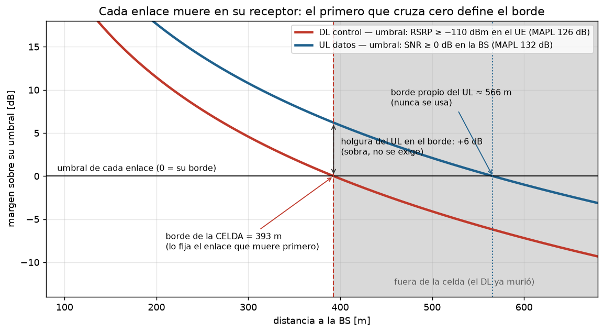
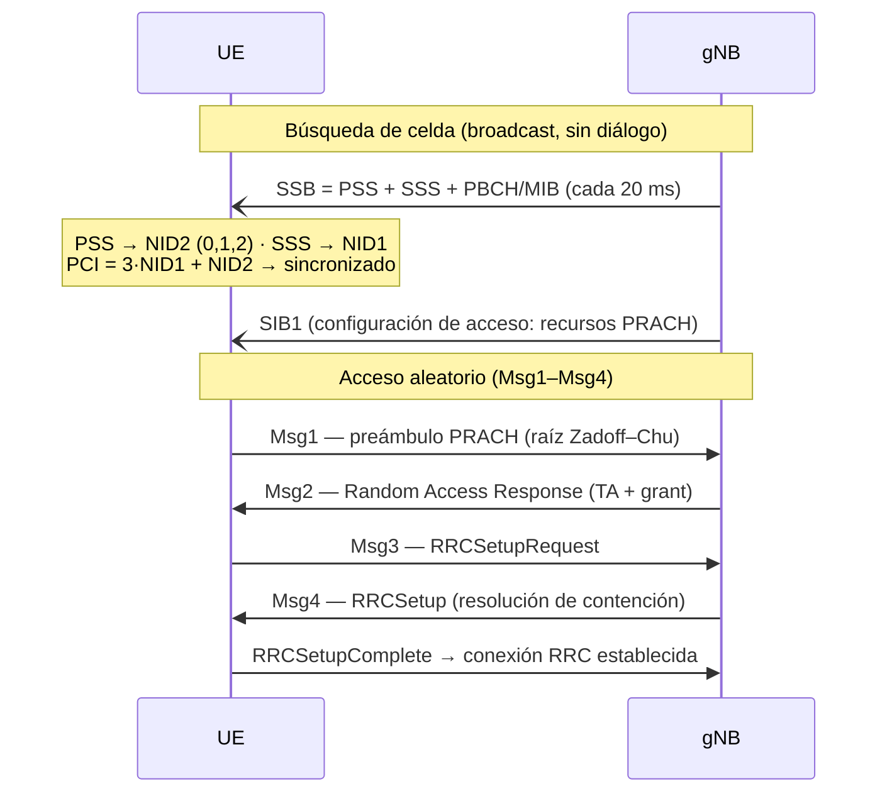
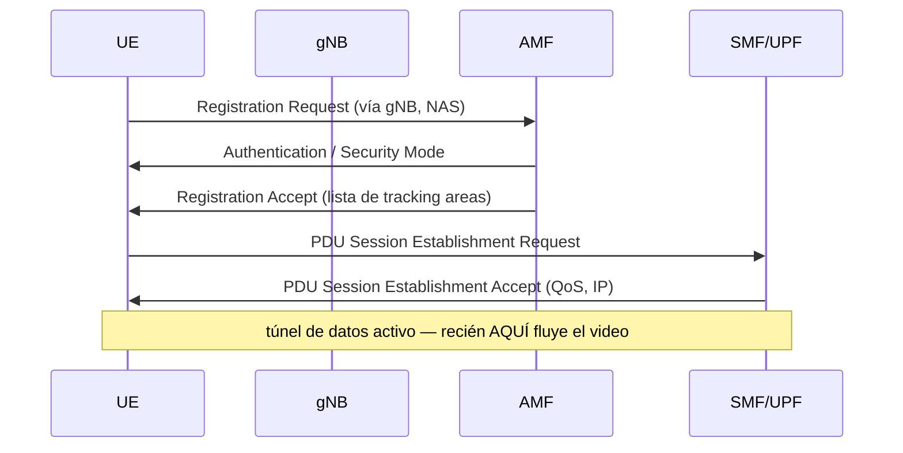

# Sesión 07 — Diseño de red de acceso 4G/5G sobre una ciudad real

> **Página en construcción** — se escribe fase por fase junto con el
> notebook `design.ipynb` (Fases 0–6 listas; falta el cierre).

!!! tip "Cómo correr el notebook del ejercicio"

    1. [Abrir design.ipynb en Colab](https://colab.research.google.com/github/ollerenac/wireless-communication-systems/blob/main/docs/sessions/07-network-design/design.ipynb).
    2. Activar GPU: *Entorno de ejecución → Cambiar tipo de entorno → T4 GPU*.
    3. *Ejecutar todo*. La primera celda instala Sionna RT y descarga el
       mapa del curso sola.

    **Si te asignaron otro mapa** (p. ej. `miraflores`): en la primera
    celda cambia la única variable — `ESCENA = "miraflores"` — y ejecuta
    todo; el mapa se descarga automáticamente del sitio del curso.

## Objetivos de Aprendizaje

Al finalizar esta sesión, el estudiante será capaz de:

1. Traducir metas de negocio en requisitos técnicos medibles de una red de acceso (cobertura, calidad, capacidad, servicios).
2. Ejecutar el flujo profesional de diseño de RAN: espectro → dimensionamiento por cobertura → dimensionamiento por capacidad → plan nominal → planificación detallada → validación.
3. Justificar la elección de bandas 4G/5G según penetración, radio de celda y capacidad, sobre geometría urbana real.
4. Configurar y defender los parámetros que consumen los procedimientos de red: PCI, RACH, tracking areas, vecindades y umbrales de handover.
5. Validar un diseño con ray tracing (Sionna RT) sobre un escenario real y cerrar el lazo de optimización.

??? note "Siglas y símbolos de la sesión (referencia rápida)"

    Cada término se explica en su primer uso; esta tabla es el respaldo
    para lectura no lineal.

    | Sigla / símbolo | Significado |
    |---|---|
    | UE / BS, gNB | *User Equipment* (el teléfono) / estación base (en 5G: gNB) |
    | DL / UL | *downlink* (bajada, BS→UE) / *uplink* (subida, UE→BS) |
    | TDD / FDD | duplexación por división de tiempo / de frecuencia |
    | SCS | *subcarrier spacing* — separación entre subportadoras OFDM (aquí 30 kHz) |
    | CP | prefijo cíclico del símbolo OFDM (Sesión 03) |
    | RE / PRB | *resource element* (1 subportadora × 1 símbolo) / *physical resource block* (12 subportadoras) |
    | EPRE | *energy per resource element* — potencia por RE |
    | RSRP / RSRQ / RSSI | potencia de la señal de referencia / su versión relativa / potencia total recibida |
    | SNR / SINR | señal-a-ruido / señal-a-(interferencia+ruido) |
    | NF | *noise figure* — figura de ruido: cuánto ruido agrega el propio receptor |
    | MAPL | *maximum allowable path loss* — pérdida máxima admisible del trayecto |
    | PL / UMa / NLOS | *path loss* / modelo urbano-macro del 3GPP / sin línea de vista |
    | σ, n | desviación del shadowing (dB) / exponente de propagación |
    | SE | eficiencia espectral (bit/s/Hz) |
    | OH | *overhead* — fracción de espectro gastada en señalización |
    | MCS | *modulation and coding scheme* — la pareja modulación+código que el scheduler elige según el SINR |
    | SISO / MIMO | una antena por extremo / múltiples (Sesión 06) |
    | dBi | ganancia de antena en dB respecto a la isotrópica |
    | SSB, PSS/SSS, PBCH/MIB, SIB | bloque de sincronización y sus partes: señales de sincronía primaria/secundaria, canal broadcast con la información mínima/del sistema |
    | PCI | *physical cell identity* (0–1007) |
    | RACH / PRACH / ZC / N_CS | acceso aleatorio / su canal físico / secuencias Zadoff–Chu / separación mínima entre preámbulos |
    | RRC / NAS | señalización de radio (UE↔gNB) / de red (UE↔núcleo) |
    | AMF / SMF / UPF | nodos del núcleo 5G: movilidad y acceso / gestión de sesiones / plano de datos de usuario |
    | TA | según contexto: *timing advance* (avance temporal, Msg2) o *tracking area* (§5.4) |
    | A3 / TTT | evento de handover "la vecina supera a la serving" / *time-to-trigger*, su temporizador |
    | ANR | *automatic neighbour relations* — llenado automático de listas de vecinas |
    | ICIC | coordinación de interferencia entre celdas (§Fase 0, R1) |
    | eMBB / VoNR | banda ancha móvil mejorada / voz sobre NR |
    | SON | *self-organizing networks* — el lazo de optimización en operación continua |
    | p5, p50 | percentiles 5 y 50 (mediana) de una distribución |

---

## El encargo

Un operador móvil te contrata para diseñar su red de acceso 5G en un
polígono de **San Isidro, Lima** — 1.32 × 0.83 km del distrito financiero.
Tienes licencia de 100 MHz en la banda n78 (3.5 GHz), azoteas disponibles
y un presupuesto limitado de sitios. La empresa quiere promesas que pueda
publicitar y cumplir.

Todo lo que sigue en esta sesión es resolver ese encargo con método.

!!! note "Los mapas los proporciona el curso"

    El laboratorio corre sobre mapas 3D reales construidos desde
    OpenStreetMap (el del encargo: San Isidro). El curso los publica
    listos — no necesitas fabricar nada para el ejercicio. Si te interesa
    cómo se fabrican (o quieres crear el de *tu* distrito como extensión):
    **[Guía: crear tu escena OSM con Blender](escena-osm-blender.md)**
    ([video del proceso](https://youtu.be/PIdn1R7FSrg?si=V8-HVuCvWGZG6v39)).

---

## Fase 0 — Requisitos: el diseño empieza en números, no en antenas

Un requisito de red vale solo si es **medible**. "Buena cobertura" no es un
requisito; "RSRP ≥ −110 dBm en el 95% del área" sí, porque se puede verificar
con un mapa o un drive test y se puede firmar en un contrato.

### 0.1 Las tres métricas que gobiernan los requisitos de radio

- **RSRP** (*Reference Signal Received Power*): potencia recibida de la señal
  de referencia de la celda — en 5G, del **SSB**, el bloque de
  sincronización que la celda difunde periódicamente haya o no datos. Mide
  **cobertura de control**:
  ¿el UE encuentra la red y puede engancharse a ella? No dice nada de
  interferencia.
- **SINR**: señal sobre interferencia más ruido. Mide **calidad de datos**:
  ¿la señal sirve para transportar bits? Se puede tener RSRP excelente con
  SINR pésimo — típico en frontera de dos celdas sin coordinación.
- **RSRQ** (*Reference Signal Received Quality*): híbrido que relaciona RSRP
  con la potencia total recibida; útil para decidir handovers cuando RSRP
  solo no discrimina.

La pareja RSRP/SINR separa dos preguntas de diseño distintas: **cobertura**
(Fase 2) y **calidad/capacidad** (Fase 3). Confundirlas es el error clásico.

¿Y cuánto RSRP es "suficiente"? La convención de la industria (la misma que
usa un *drive test*) clasifica así:

**Tabla 0.1 — Rangos de RSRP y calidad de servicio esperada (convención de drive test)**

| RSRP (SSB) | Calidad | Qué esperas en ese punto |
|---|---|---|
| ≥ −80 dBm | Excelente | modulación máxima, throughput pico |
| −80 a −90 dBm | Buena | servicio pleno sin restricciones |
| −90 a −100 dBm | Regular | el servicio funciona, el throughput empieza a caer |
| −100 a −110 dBm | Débil | borde de servicio: handovers frecuentes, datos lentos |
| < −110 dBm | Sin servicio confiable | el UE pierde sincronización y el acceso falla |

El umbral de **−110 dBm** que usan los requisitos no es arbitrario: por
debajo, los canales de control (los que el UE necesita para engancharse y
mantenerse en la red) dejan de decodificarse con fiabilidad — está unos dB
sobre la sensibilidad del receptor, como margen. Por eso R2 se llama
*cobertura de control*: garantiza que la red **existe** para el UE, no que
sea rápida. La rapidez la gobiernan SINR y throughput (R3, R4).

!!! info "Nota de profundización"

    La mecánica completa de las tres métricas — dónde viven en la grilla
    tiempo-frecuencia, el patrón de señales de referencia, EPRE, el techo
    estructural del RSRQ y las trampas de medición — está en
    [RSRP, RSRQ y SINR — nota de referencia](rsrp-rsrq-sinr.md). Aquí basta
    el nivel conceptual; la Fase 2 recurre a esa nota para calcular.

### 0.2 Por qué las metas son probabilísticas

La Sesión 01 mostró que la señal urbana es una variable aleatoria: el
shadowing log-normal hace que dos esquinas a la misma distancia de la BS
difieran 10–20 dB. Garantizar cobertura en el 100% del área exigiría
potencia/sitios infinitos — cada punto porcentual final cuesta más que todos
los anteriores. Por eso la industria diseña a probabilidad: **95% del área**
(o del borde de celda) con la métrica sobre el umbral, y un **margen de
shadowing** en el link budget que compra esa probabilidad.

### 0.3 De GB por mes a Mbps de hora cargada

La capacidad no se dimensiona para el promedio del día sino para la **hora
cargada** (*busy hour*). La conversión estándar:

$$R_{\text{usuario}} = \frac{V_{\text{mes}} \cdot f_{BH}}{30 \cdot 3600}$$

donde $V_{\text{mes}}$ es el volumen mensual por abonado (bits) y $f_{BH}$
la fracción del tráfico diario que cae en la hora cargada (típico 8–12%).

Ejemplo con números de Perú urbano: 10 GB/mes ≈ $2.7$ Gbit/día; con
$f_{BH} = 10\%$ → **~75 kbps sostenidos por abonado**. Parece poco — esa es
la magia de la multiplexión estadística: miles de usuarios que navegan a
ráfagas comparten la celda, y el diseñador dimensiona la suma, no los picos
individuales.

### 0.4 De promesas a números: qué exige cada servicio

Las promesas comerciales hablan de servicios ("video sin cortes", "llamadas
nítidas"); los requisitos hablan de bits. La tabla que traduce — valores
típicos de planificación:

**Tabla 0.2 — Servicios y aplicaciones: bitrate y latencia mínimos (valores de planificación)**

| Servicio / aplicación | DL por usuario | UL por usuario | Latencia | Lo que manda |
|---|---|---|---|---|
| VoNR (voz sobre NR) | ~0.1 Mbps | ~0.1 Mbps | < 100 ms | latencia y pérdida, no bitrate |
| Video streaming SD (480p) | 1–2 Mbps | — | tolerante (buffer) | bitrate DL |
| Video streaming HD (1080p) | 5–8 Mbps | — | tolerante (buffer) | bitrate DL |
| Video streaming 4K | 15–25 Mbps | — | tolerante (buffer) | bitrate DL |
| Videollamada HD | 2–4 Mbps | 2–4 Mbps | < 150 ms | **UL simétrico** + latencia |
| Web / redes sociales | 1–5 Mbps (ráfagas) | < 1 Mbps | < 300 ms | percepción de carga |
| Gaming en línea | 1–5 Mbps | 0.5–1 Mbps | < 50 ms | latencia, no bitrate |
| FWA (internet fijo por 5G) | 50–100 Mbps | 10–20 Mbps | tolerante | bitrate sostenido |

Dos lecturas de diseño:

- **El throughput de borde (R4) no es el bitrate de un stream.** "Video HD
  sin cortes" pide 5–8 Mbps *por usuario*; el requisito de borde se fija
  varias veces más arriba (50 Mbps en este encargo) porque el borde de una
  celda cargada se **comparte** entre los usuarios que caen ahí y porque el
  percentil 5 debe aguantar la hora cargada, no la madrugada.
- **La columna de latencia es la que el trazador no mide.** Bitrates y
  SINR se cobran en la Fase 6 con mapas; la latencia y la prioridad de VoNR
  se garantizan por arquitectura y QoS (colas 5QI en el gNB y el core). Por
  eso R6 existe como requisito pero no aparece en el `REQ` del notebook —
  no hay mapa que lo verifique.

### 0.5 Requisitos del encargo

**Tabla 0.3 — Requisitos del encargo (R1–R8): meta y método de verificación**

| # | Requisito | Meta | Se verifica con |
|---|---|---|---|
| R1 | Área de servicio | polígono de 1.1 km² (San Isidro) | — |
| R2 | Cobertura de control | RSRP ≥ −110 dBm en 95% del área | mapa RSS / drive test |
| R3 | Calidad de datos | SINR ≥ 0 dB en 90% del área | mapa SINR |
| R4 | Throughput de borde | p5 ≥ 50 Mbps DL, ≥ 5 Mbps UL | mapa de throughput |
| R5 | Capacidad agregada | ≥ 600 Mbps/km² en hora cargada | Fase 3 |
| R6 | Servicios | eMBB + VoNR, latencia de usuario < 20 ms | arquitectura/QoS |
| R7 | Espectro | 100 MHz TDD en n78 (3.5 GHz) | licencia (MTC) |
| R8 | Despliegue | solo azoteas existentes, máximo 6 sitios | plan nominal |

Notación de R4: **p5 = percentil 5** de la distribución de throughput
sobre el área — el valor que el 95% de los puntos supera. Es la forma
estadística de decir "throughput de borde garantizado": el borde de celda
*es* la cola baja de la distribución. Mismo espíritu probabilístico que
el 95% de R2 y el 90% de R3.

El cálculo detrás de R5: 25 000 personas/km² presentes en hora cargada
(distrito financiero) × 30% de participación de mercado × 75 kbps por
abonado ≈ 560 Mbps/km², redondeado a 600. Cada factor es una hipótesis de
negocio — cámbialos y cambia la red que hay que construir.

!!! question "Comprueba tu comprensión"

    **P1.** ¿Puede un punto del mapa cumplir R2 e incumplir R3 a la vez?
    ¿Qué lo causaría?

    **P2.** Si el market share sube al 45%, ¿qué requisitos cambian y qué
    fases del diseño hay que rehacer?

    ---

    **R1.** Sí: RSRP alto con SINR bajo — señal fuerte pero interferida,
    típico en fronteras de celda. Se cura con coordinación/tilts, no con
    más potencia.

    Ojo con la palabra *coordinación*: la intuición sugiere "que las celdas
    se turnen" — desalinear los patrones TDD para que el DL de una no
    coincida con el DL de la vecina. La figura muestra por qué eso es
    exactamente lo prohibido:

    

    Si B se desplaza dos slots, aparecen slots donde A transmite DL
    (~46 dBm, en azotea, casi línea de vista hacia la otra azotea)
    mientras B intenta recibir UL de UEs que le llegan a ~−120 dBm: la
    *cross-link interference* entre gNBs deja ciego al receptor en **toda**
    la celda, no solo en el borde. Por eso todas las celdas co-canal usan
    el **mismo patrón DDDSU sincronizado** — es requisito regulatorio en la
    banda, no una opción de diseño.

    La coordinación que sí cura el borde opera con la trama ya sincronizada,
    en los ejes de frecuencia y scheduling (ICIC): las vecinas acuerdan
    sub-bandas de borde disjuntas — A sirve a sus UEs de frontera en unos
    PRBs, B en otros, y el centro reusa todo. El UE de borde recibe su señal
    donde la vecina no transmite a plena potencia → baja I sin tocar la
    potencia total. El tilt (Fase 4) ataca lo mismo por el eje espacial.

    **R2.** Cambia R5 (∝ abonados). La cobertura (Fase 2) no se toca; el
    dimensionamiento por capacidad (Fase 3) y quizá el plan nominal (más
    sectores/sitios) sí.

---

## Fase 1 — Estrategia de espectro: la decisión que fija todas las demás

Antes de colocar un solo sitio hay que decidir **en qué frecuencia vive la
red**. Es la decisión más estructural del diseño: fija el radio de celda (y
por tanto cuántos sitios costará la cobertura), la penetración en interiores
y cuánta capacidad hay para vender. En nuestro encargo la licencia ya está
dada (R7: 100 MHz en n78) — pero hay que entender qué compramos y qué no.

### 1.1 La física: frecuencia contra alcance

La pérdida de espacio libre crece con $20\log_{10}(f)$: subir de banda cuesta
dB, y esos dB se pagan en radio de celda. Además, a mayor frecuencia peor
difracción (las esquinas "doblan" menos la señal) y peor penetración de
muros. Regla mental honesta: en espacio libre ($n=2$) bajar una octava
dobla el radio; en urbano denso ($n \approx 3.8$) la misma octava rinde
solo **×1.4** — el exponente alto "amortigua" la ventaja de bajar de banda
(la tabla siguiente usa el $n$ urbano: por eso 700↔3500, que son 2.3
octavas, da ×2.3 y no ×5).

Con el exponente de propagación urbano ($n \approx 3.8$), el delta de
pérdida se convierte en factor de área — y el factor de área, en sitios:

| Banda | $\Delta$ pérdida vs n78 | Radio relativo | Sitios para la misma área |
|---|---|---|---|
| 700 MHz (n28) | −14 dB | ×2.3 | ÷5.4 |
| 2.1 GHz (B4/n1) | −4.4 dB | ×1.3 | ÷1.7 |
| **3.5 GHz (n78)** | 0 (referencia) | ×1.0 | ×1.0 |
| 26 GHz (n258) | +17.4 dB | ×0.35 | ×8 |

Ya lo medimos sobre Lima real: mismos 3 sitios a 2.1 GHz cubren 74.6% del
área; a 3.5 GHz, 71.2% (`test_scene.ipynb`, Parte 5) — y eso que 2.1→3.5 es
el salto *chico* de la tabla.

### 1.2 Por qué entonces no todo es 700 MHz: capas de espectro

Porque el alcance se paga en capacidad: en low-band hay poco espectro (10–20
MHz por operador, y repartido); en mid-band hay bloques de 80–100 MHz. De ahí
la arquitectura de **capas** que usa todo operador real:

- **Capa de cobertura** (700/850/900 MHz): llega lejos y adentro, pero la
  banda entera de 700 MHz es 2×45 MHz (FDD) repartidos entre operadores —
  en la subasta peruana de 2016 tocó **2×15 MHz por operador**, o sea
  15 MHz de bajada → sostiene voz, IoT y el "siempre conectado", no el
  tráfico masivo.
- **Capa de capacidad** (2.6/3.5 GHz): bloques de **80–100 MHz** por
  operador (nuestro encargo: 100 MHz en n78, R7) — unas **6–7×** la bajada
  de la capa baja → sostiene el tráfico eMBB; celdas chicas → más sitios.
- **Capa de hotspot** (mmWave): n258 (26 GHz) tiene 3.25 GHz de banda
  total; se asigna en portadoras de **400 MHz** y un operador típicamente
  agrega **800–1000 MHz** — otras **8–10×** lo de mid-band, pero con
  alcance de cuadra; solo donde la densidad lo justifica.

Nuestro encargo es deliberadamente **mono-capa** (solo n78): más simple para
aprender, y realista para un despliegue 5G inicial. La comparación con una
capa de 700 MHz queda como extensión (requiere escena de 3×3 km — una celda
low-band tapa nuestra escena entera).

### 1.3 TDD: los 100 MHz no son todos tuyos todo el tiempo

n78 es TDD (Sesión 06: subida y bajada alternan sobre la misma frecuencia).
El tiempo se reparte con un patrón de slots; el típico en n78 es **DDDSU**:
de cada 5 slots, 3 son de bajada, 1 "especial" (mayormente bajada + guarda) y
1 de subida. Consecuencia aritmética que golpea el diseño:

- DL dispone de ≈ 71% del tiempo → **≈ 71 MHz "efectivos"** de los 100.
- UL dispone de ≈ 20% → **≈ 20 MHz efectivos** — y el UE ya era el extremo
  débil (23 dBm). El uplink pierde dos veces: en potencia y en tiempo.

El patrón TDD además debe estar **sincronizado entre operadores vecinos** de
la banda (lo coordina el regulador): si mi celda transmite DL mientras la
tuya escucha UL, mi potencia entierra a tus usuarios.

En FDD (las bandas bajas clásicas) esto no existe: DL y UL tienen cada uno su
frecuencia dedicada, tiempo completo.

### 1.4 Numerología: el detalle que conecta con OFDM

En n78 se usa subportadora de 30 kHz (Sesión 03: numerología µ=1): slots de
0.5 ms, CP de 2.3 µs — y ya verificamos sobre Lima que el delay spread urbano
(mediana 60 ns) cabe holgado en ese CP (`test_scene.ipynb`, Parte 8). La
numerología queda decidida por la banda y el estándar; no es un parámetro que
el diseñador pueda ajustar.

### Decisión de la Fase 1 (lo que hereda el resto del diseño)

> Banda **n78 (3.5 GHz)**, **100 MHz** TDD con patrón **DDDSU** (≈71/20% 
> DL/UL), SCS 30 kHz. La Fase 2 dimensionará cobertura con la física de 3.5
> GHz; la Fase 3 repartirá 71/20 MHz efectivos contra la demanda de R5.

!!! question "Comprueba tu comprensión"

    **P1.** Un colega propone pedir al regulador cambiar la licencia a 20 MHz
    en 700 MHz "porque cubre 5 veces más área con los mismos sitios". ¿Qué
    requisito del encargo mata la propuesta?

    **P2.** ¿Por qué el patrón TDD de tu red no es 100% decisión tuya?

    ---

    **R1.** R5/R4: con 20 MHz no hay capacidad ni throughput de borde — la
    cobertura barata de low-band se paga en Mbps. (Cálculo rápido: 20 MHz ×
    ~74% DL deja ~15 MHz efectivos; ni la mediana de 50 Mbps se sostiene con
    carga.)

    **R2.** Debe sincronizarse con los demás operadores de la banda en la
    zona: patrones cruzados = interferencia DL→UL entre redes. Lo fija el
    regulador o el acuerdo inter-operador.

## Fase 2 — Dimensionamiento por cobertura: del presupuesto de dB al número de sitios

La pregunta de esta fase: **¿cuántos sitios necesita R2** (RSRP ≥ −110 dBm en
95% del área)**?** La herramienta es el *link budget*: una contabilidad en dB
donde cada ganancia suma, cada pérdida resta, y lo que queda es cuánto camino
puede recorrer la señal.

### 2.1 El punto de partida no es la potencia del amplificador

Error clásico: arrancar el presupuesto con "la BS transmite 44 dBm". Esos
44 dBm se reparten entre **todas** las subportadoras del canal. Con 100 MHz
a separación de subportadora (SCS) de 30 kHz caben 273 *resource blocks*
(PRB, bloques de 12 subportadoras) — es decir 273 × 12 = 3 276
subportadoras:

$$\text{EPRE} = 44 - 10\log_{10}(3276) \approx 44 - 35.2 = 8.8 \text{ dBm por RE}$$

??? note "¿De dónde salen los 273 PRB? — y por qué SCS 30 kHz"

    El cálculo ingenuo da otra cosa: 1 PRB = 12 × 30 kHz = 360 kHz, y
    100 MHz / 360 kHz ≈ 277.7 PRB. El dato que falta: **los 100 MHz son el
    ancho del canal, no el ancho transmisible**. El estándar (3GPP TS
    38.101-1) reserva una **banda de guarda** en cada borde:

    $$\text{BW}_{tx} = 100 - 2 \times 0.845 = 98.31 \text{ MHz}
    \quad\Rightarrow\quad \left\lfloor \frac{98.31}{0.36} \right\rfloor = 273 \text{ PRB}$$

    (273 × 360 kHz = 98.28 MHz ocupados → guarda real de 860 kHz por
    lado.) La guarda existe porque el espectro OFDM no termina en seco: los
    lóbulos laterales decaen lento y el transmisor debe cumplir la máscara
    de emisión en el borde del canal. Con 277 PRB quedarían ~140 kHz de
    margen — ningún filtro real cae decenas de dB en eso. Mejora silenciosa
    de NR: utilización del 98.3%, contra el 90% fijo de LTE (20 MHz → 100
    PRB = 18 MHz útiles).

    ¿Y el SCS de 30 kHz es elección libre? No — dado n78 + 100 MHz es el
    forzado práctico de la familia de numerologías de NR (SCS = 15·2^µ kHz):

    | SCS | Máx PRB en 100 MHz | Veredicto |
    |---|---|---|
    | 15 kHz (µ=0) | tope de 270 PRB = 48.6 MHz | **no llena el canal** |
    | **30 kHz (µ=1)** | **273 PRB = 98.28 MHz** | el estándar de mid-band |
    | 60 kHz (µ=2) | 135 PRB = 97.2 MHz | CP a la mitad (~1.2 µs), sin ganancia a cambio |

    Con 15 kHz necesitarías dos portadoras agregadas; 60 kHz recorta el
    prefijo cíclico sin dar nada útil en FR1. 30 kHz llena el canal con CP
    de 2.3 µs — factor ~40 sobre los 60 ns de delay spread que medimos en
    San Isidro. Por eso la §1.4 lo despacha: la numerología la fijan banda
    y estándar, no el diseñador.

    Y para fijar el vocabulario de franjas que usa toda la sesión (las
    "capas" de la §1.2) junto al corte técnico del 3GPP:

    | Franja | Rango | Ejemplos | En 3GPP |
    |---|---|---|---|
    | **Low-band** | < 1 GHz | 700 MHz (n28), 850, 900 | FR1 |
    | **Mid-band** | 1–7 GHz | 1.9 GHz, AWS, 2.6, **3.5 GHz (n78)** | FR1 |
    | **High-band** (mmWave) | 24–52 GHz | **26 GHz (n258)**, 28 | FR2 |

    **FR1** agrupa low + mid (hasta 7.125 GHz); **FR2** es el mundo
    milimétrico. "C-band" que verás en la prensa técnica es el nombre
    histórico satelital de 3.3–4.2 GHz — el pedazo de mid-band donde vive
    n78. Nuestro encargo es mid-band puro: la capa de capacidad.

Como el RSRP se mide **por resource element** (ver la
[nota de referencia](rsrp-rsrq-sinr.md)), el link budget de cobertura de
control empieza en 8.8 dBm, no en 44. La red incluso difunde este número
(`referenceSignalPower` en el SIB) para que el UE pueda despejar el path
loss.

### 2.2 El presupuesto término a término

$$\text{RSRP}_{\text{borde}} = \underbrace{\text{EPRE}}_{8.8} + \underbrace{G_{tx}}_{+16} - \underbrace{\text{PL}}_{?} - \underbrace{M_{\text{shadow}}}_{9} \geq -110 \text{ dBm}$$

| Término | Valor | De dónde sale |
|---|---|---|
| EPRE | 8.8 dBm | 44 dBm ÷ 3 276 subportadoras |
| $G_{tx}$ | +16 dBi | antena sectorial macro típica |
| $M_{\text{shadow}}$ | −9 dB | compra el 95% de área con shadowing log-normal $\sigma = 8$ dB |
| $G_{rx}$, pérdidas de cuerpo/cable | 0 dB neto | UE: antena ~0 dBi; simplificación explícita |

Despejando: la señal puede perder hasta

$$\text{MAPL} = 8.8 + 16 + 110 - 9 \approx 126 \text{ dB}$$

**MAPL** (*Maximum Allowable Path Loss*) es el número que resume toda la
fase: el presupuesto de pérdida que el trayecto no debe superar.

El margen de shadowing es donde la meta probabilística de la Fase 0 se
vuelve un número: con $\sigma = 8$ dB, reservar ~9 dB garantiza que el ~95%
del área (no solo el punto medio) quede sobre el umbral. Más probabilidad =
más margen = menos radio: la certeza se paga en dB.

??? note "¿De dónde salen los 9 dB de $M_{\text{shadow}}$? (el cálculo ingenuo da 13.2)"

    **Qué es el shadowing.** El modelo de propagación (UMa) predice la
    pérdida *mediana* a cada distancia. Pero dos esquinas a la misma
    distancia difieren según qué edificios estorben el trayecto: esa
    variación alrededor de la mediana es el *shadowing*, y medido en dB se
    comporta como una gaussiana de media 0 y desviación $\sigma$
    (log-normal en potencia). En urbano denso, $\sigma \approx 6\text{–}10$
    dB; usamos 8, el valor de libro. (No confundir con el *fast fading*
    multitrayecto, que varía en centímetros y lo absorben HARQ y el
    scheduler — el shadowing varía en decenas de metros y se paga en link
    budget.)

    **El cálculo ingenuo.** Si quiero que un punto del **borde** de celda
    esté sobre el umbral el 95% de las veces, necesito cubrir el percentil
    95 de la gaussiana:

    $$M = z_{0.95} \cdot \sigma = 1.645 \times 8 \approx 13.2 \text{ dB}$$

    ¿Por qué la industria usa ~9? Porque 13.2 dB responde la pregunta
    equivocada.

    **La pregunta correcta es de área.** R2 pide 95% del **área**, y el
    borde es el peor lugar de la celda: todo el interior tiene pérdida
    menor que la del borde, o sea margen de sobra. Al integrar la
    probabilidad de cobertura sobre toda la celda (la integral clásica de
    Jakes, 1974), con $\sigma = 8$ y exponente de propagación $n \approx
    3.8$, basta que el **borde** quede cubierto ~86% del tiempo para que
    el **área** quede cubierta 95%:

    $$M = z_{0.86} \cdot \sigma \approx 1.06 \times 8 \approx 8.5 \approx 9 \text{ dB}$$

    Los ~4.7 dB de diferencia entre 13.2 y 8.5 no son un tecnicismo: en el
    modelo UMa equivalen a ~27% más de radio, que al cuadrado es ~60% menos
    sitios por km². Leer bien la letra chica del requisito (¿95% *de qué*?)
    es dinero.

    **La receta para tus propios diseños.** Dos tablas y dos pasos:

    1. Toma la σ del **escenario** (misma tabla del 38.901 que el path
       loss, 7.4.1-1) — o mídela con drive test:

        | Escenario | σ_SF |
        |---|---|
        | UMa LOS | 4 dB |
        | UMa NLOS | 6 dB |
        | UMi NLOS | 7.8 dB |
        | RMa NLOS | 8 dB |
        | urbano denso (tradición Okumura/COST-231, nuestro caso) | 8–10 dB |

    2. Convierte la meta **de área** a probabilidad **de borde** (integral
       de Jakes — el notebook la resuelve numéricamente en 6 líneas) y
       multiplica: $M = z_{\text{borde}} \cdot \sigma$. Para σ = 8,
       n ≈ 3.8, ya resuelto:

        | Meta de área | Borde equivalente | z | M |
        |---|---|---|---|
        | 90% | 74% | 0.65 | **5.2 dB** |
        | 95% | 86% | 1.06 | **8.5 ≈ 9 dB** |
        | 99% | 96.5% | 1.81 | **14.5 dB** |

    El error a evitar: entrar a la tabla de z directamente con la meta de
    área ($z_{0.95} = 1.645 \to 13.2$ dB) — ese margen responde "95% *del
    borde*", una promesa más cara que la que firma el contrato.

    **El precio sube empinado.** 99% de área ya cuesta ~14.5 dB (y 18.6 si
    alguien lo exige en el propio borde) — la razón por la que ningún
    operador firma 100%. Y $\sigma = 8$ es una hipótesis declarada más: el
    drive test (Fase 6) la mide de verdad para *esta* ciudad; si San
    Isidro resulta ser $\sigma = 10$, el 9 ya no compra el 95%.

### 2.3 De MAPL a radio: el modelo de propagación

El MAPL se convierte en distancia invirtiendo un modelo. El estándar de la
industria cuando aún no se tiene el modelo 3D de la ciudad (o no hace
falta) es el **UMa NLOS de 3GPP TR 38.901** — un modelo *estadístico*:
resume miles de mediciones de urbanos reales en una fórmula que solo pide
frecuencia y distancia. No sabe nada de San Isidro; responde por el
"urbano macro promedio". El modelo 3D (nuestra escena OSM) es el insumo de
la otra familia — el ray tracing determinístico de las Fases 4 y 6:

$$\text{PL} = 13.54 + 39.08\log_{10}(d) + 20\log_{10}(f_c) \quad [\text{d en m, } f_c \text{ en GHz}]$$

Con 126 dB y $f_c = 3.5$: $d \approx 390$ m — coherente con la tabla de la
Fase 1 (n78: 200–500 m urbano).

Cada sitio trisectorial cubre un hexágono de área $\approx 2.6\,r^2$:

$$N_{\text{sitios}} = \frac{1.1 \text{ km}^2}{2.6 \times 0.39^2 \text{ km}^2} \approx 3 \text{ sitios por cobertura}$$

**Tres sitios** — coherente con el esbozo (`test_scene.ipynb`) que con 3 BS
logró ~71% de SINR > 0: la cobertura de control alcanza, la calidad todavía
no. La fórmula da el *orden de magnitud*; el ray tracing sobre la escena
real (Fase 6) da la verdad calle por calle. Ambos se necesitan: la fórmula
para dimensionar sin escena, el trazador para validar con ella.

### 2.4 El enlace de vuelta: uplink

El mismo ejercicio con el UE como transmisor: 23 dBm sobre sus PRBs
asignados (no per-RE de 100 MHz — el UE concentra su potencia en pocos PRB,
su gran defensa), antena de 0 dBi, y la BS escuchando con figura de ruido
(NF) de 5 dB. El
enlace que soporte **menos** pérdida define el radio real de la celda: de
nada sirve que el UE oiga a la BS si la BS no lo oye de vuelta.

El término nuevo del cálculo es la **sensibilidad del receptor** — el mínimo
que la BS necesita recibir para demodular:

$$S_{BS} = \underbrace{-174}_{kT\ [\text{dBm/Hz}]} + 10\log_{10}(BW) + NF + SNR_{min}$$

Término a término: −174 dBm/Hz es el piso térmico universal ($kT$ a 290 K
— nadie escucha por debajo de eso); $10\log_{10}(BW)$ es cuánto ruido
entra por la ventana que se escucha; $NF$ la suciedad que el propio
receptor agrega; $SNR_{min}$ lo que el demodulador exige sobre el ruido.
Con la asignación de 5 MHz y una meta modesta ($SNR_{min} = 0$ dB):

$$S_{BS} = -174 + 10\log_{10}(5\times10^6) + 5 + 0 = -102 \text{ dBm}$$

$$\text{MAPL}_{UL} = \underbrace{23}_{P_{UE}} + \underbrace{16}_{G_{BS}} - (-102) - \underbrace{9}_{M_{shadow}} = 132 \text{ dB}$$

Aquí está la física de la "gran defensa": la sensibilidad mejora con
$10\log_{10}$ del ancho escuchado. Transmitir en 5 MHz en vez de 100 baja
el piso de ruido de la BS en $10\log_{10}(20) = 13$ dB — la concentración
de PRBs no es un truco de potencia, es un truco de **ruido**. Resultado
con nuestros números: 132 dB de UL contra 126 del DL de control — el
enlace limitante aquí es el DL, al revés del folclor "el uplink siempre
limita" (que sí aplica cuando se piden muchos Mbps de subida: más PRBs →
más BW → sensibilidad peor → MAPL cae). El cálculo ejecutable está en
`design.ipynb`.

??? note "¿Por qué justo 5 MHz asignados al UE? (y por qué no darle más)"

    El 5 MHz no es un valor arbitrario: **sale del requisito R4-UL**. La
    promesa de borde es 5 Mbps de subida, y a $SNR_{min} = 0$ dB la
    eficiencia espectral es $SE = \log_2(1+1) \approx 1$ bit/s/Hz:

    $$BW_{UL} = \frac{R_{\text{borde}}}{SE(SNR_{min})} = \frac{5 \text{ Mbps}}{1 \text{ bit/s/Hz}} = 5 \text{ MHz} \approx 14 \text{ PRB}$$

    ¿Y por qué no darle más PRBs al pobre UE de borde? Porque su potencia
    es **fija** (23 dBm): cada PRB extra diluye la densidad espectral
    transmitida, mientras el ruido que la BS escucha crece con
    $10\log_{10}(BW)$. Duplicar el ancho regala +3 dB de capacidad
    potencial y cobra −3 dB de SNR — que en el borde, pegado al mínimo, no
    tienes. Es un óptimo con joroba:

    - **Menos de 5 MHz** → SNR sobrado, pero el techo $BW \times SE$ no
      llega a los 5 Mbps prometidos.
    - **Más de 5 MHz** → el SNR de borde cae bajo 0 dB, la SE se desploma,
      y pierdes por el otro lado.

    El par (5 MHz, 0 dB) es el punto **autoconsistente**: el ancho mínimo
    que cumple la meta, evaluado al SNR que ese mismo ancho sostiene a
    132 dB de pérdida. En la red real esto no se congela: el *scheduler* y
    el *power control* lo negocian por milisegundo (UE de borde → pocos
    PRBs a potencia máxima; UE cercano → muchos PRBs). El dimensionamiento
    congela el caso de borde porque es el que firma R4.

    **¿Y por qué SNR_min = 0 dB y no otro punto?** Ningún requisito fija
    los 5 MHz: R4 solo fija el producto $BW \times SE(SNR_{min}) = 5$
    Mbps. Un grado de libertad — y estos son los otros repartos del mismo
    requisito, con los mismos 23 dBm del UE (fijos en los tres casos: el
    UE de borde ya está a máxima potencia; la moneda del trade-off no es
    potencia, es **alcance**):

    | Elección | BW necesario | Sensibilidad BS | MAPL_UL |
    |---|---|---|---|
    | SNR_min = +10 dB | 1.45 MHz | −97.4 dBm | 127.4 dB (**−4.6**) |
    | **SNR_min = 0 dB** | **5 MHz** | **−102 dBm** | **132 dB** |
    | SNR_min = −10 dB | 36.4 MHz | −103.4 dBm | 133.4 dB (+1.4) |

    La explicación en versión subibaja: en el presupuesto **restan dos
    términos atados** — el ruido que entra por la ventana
    ($10\log_{10} BW$) y lo que exiges sobre el ruido ($SNR_{min}$); la
    promesa de 5 Mbps hace que bajar uno suba el otro. Por **debajo** de
    0 dB, cada dB de SNR que perdonas se devuelve casi exacto en ruido
    extra (el BW crece rápido): empate — por eso −10 dB solo gana 1.4 dB,
    y a cambio secuestra 36 MHz de PRBs para *un* usuario y exige MCS que
    apenas existen. Por **encima** de 0 dB, cada dB que exiges no se
    compensa con el poco BW que ahorras (la SE crece solo
    logarítmicamente): pérdida neta — +10 dB cuesta 4.6 dB de alcance.
    **0 dB es el codo de la curva**: capturas el plateau sin pagar los
    extremos. Ese es el "por experiencia de diseño" de la industria,
    puesto en números.

    Letra chica declarada: $SE = 1$ a 0 dB es Shannon puro; con MCS reales
    es ~0.8–0.9, así que 5 MHz queda un pelo optimista — tolerable porque
    el UE de borde rara vez sostiene los 5 Mbps continuos.

    **¿Mínimo, promedio o peor caso?** Ninguna de las dos primeras: el
    mínimo asignable es 1 PRB (360 kHz — y con él el enlace cierra aún más
    lejos, pero no salen 5 Mbps), y no hay promedio de nada. Es el **peor
    caso del servicio prometido**: peor ubicación (el borde, a MAPL) × el
    contrato (R4-UL). El presupuesto responde "¿hasta dónde cumplo la
    promesa completa?", no "¿hasta dónde hay señal?".

    ¿Y el canal de control, no habría que garantizarlo con el peor caso?
    Ya está garantizado dos veces: el control de **subida** (PUCCH) ocupa
    ~1 PRB — concentración máxima, MAPL mejor que los 132 dB de datos; si
    los datos cierran, el control UL cierra con margen. Y el control de
    **bajada** (SSB/RSRP, R2) es el presupuesto de 126 dB — que resultó el
    limitante de toda la red. Jerarquía completa:
    $\text{MAPL}_{ctrl,UL} > \text{MAPL}_{datos,UL} (132) >
    \text{MAPL}_{ctrl,DL} (126)$. La cobertura es una cebolla: el anillo
    exterior donde apenas "hay red" (1 PRB, kbps), y anillos interiores
    donde cada servicio prometido se cumple — el radio de diseño es el del
    anillo del contrato.

La imagen que resume los dos enlaces y sus umbrales:

Lectura en una regla: **cada enlace muere donde su curva cruza su propio
umbral, medido en su receptor** (DL: RSRP en el UE; UL: SNR en la BS). El
primero que cruza define el borde de la celda; el otro llega con holgura
— aquí el DL muere primero (393 m) y al UL le sobran 6 dB que nadie
exigió.

### 2.5 RSS → RSRP: cerrar el círculo con Sionna

Los radio maps de Sionna entregan potencia de banda ancha (RSS). Para
verificar R2 hay que convertir: restar $10\log_{10}(N_{\text{RE}})$ del
despliegue. Es el mismo cálculo del EPRE visto del lado del receptor — y el
motivo por el que la meta R2 no puede compararse directo contra el mapa
crudo. La verificación numérica se ejecuta en la Fase 6, sobre el mapa
consolidado.

!!! question "Comprueba tu comprensión"

    **P1.** El operador propone duplicar el ancho de banda a 200 MHz "para
    duplicar capacidad" manteniendo los 44 dBm. ¿Qué pasa con la cobertura?

    **P2.** ¿Por qué el margen de shadowing no se puede eliminar "midiendo
    mejor el canal"?

    ---

    **R1.** El EPRE cae 3 dB (misma potencia entre el doble de
    subportadoras) → el RSRP cae 3 dB en todo punto → el MAPL pierde 3 dB →
    el radio se encoge ~16% y hacen falta ~40% más sitios. La capacidad
    también se paga en cobertura.

    **R2.** Porque no es error de medición: es la variabilidad *física* del
    entorno (qué edificios estorban en cada punto). Se puede mapear con ray
    tracing punto a punto, pero al diseñar con un modelo estadístico, la
    incertidumbre espacial es irreducible y hay que presupuestarla.

## Fase 3 — Dimensionamiento por capacidad: el cálculo gemelo

La Fase 2 preguntó "¿cuántos sitios para que la señal *llegue*?". Esta
pregunta es distinta: **¿cuántos sitios para que la red *aguante* la demanda
de R5** (600 Mbps/km² en hora cargada)**?** Son dos cálculos independientes y
el diseño final obedece a la peor:

$$N_{\text{sitios}} = \max(N_{\text{cobertura}},\ N_{\text{capacidad}})$$

### 3.1 La capacidad de una celda no es su pico

La publicidad promete "hasta 1 Gbps"; la celda real sirve usuarios repartidos
por toda su área compartiendo los mismos PRBs. Su capacidad es un **promedio
sobre la distribución espacial de SINR** — y qué promedio usar depende del
scheduler: reparto equitativo de *tiempo* rinde la media aritmética de las
eficiencias; reparto igualitario de *datos* colapsa hacia la media armónica
(el usuario de borde consume el tiempo de todos). Este es el concepto
difícil de la fase y tiene nota propia:
[De la distribución de SINR a la capacidad de celda](de-sinr-a-capacidad.md).

### 3.2 El cálculo de la capacidad de celda

$R_{\text{celda,DL}}$ es la **capacidad de bajada de la celda**: la tasa
de datos agregada (bit/s) que la celda entrega en DL, repartida entre
todos sus usuarios — el número que se puede vender. (Su gemela de subida,
$R_{\text{celda,UL}}$, se verifica en §3.4.) Se arma en tres factores:

$$R_{\text{celda,DL}} = \underbrace{\text{SE}_{\text{celda}}}_{2.0 \text{ bit/s/Hz}} \times \underbrace{B_{\text{DL,ef}}}_{71 \text{ MHz}} \times \underbrace{(1 - OH)}_{0.78} \approx 111 \text{ Mbps}$$

La forma fácil de leer el producto — una planilla de trabajadores: **B**
es cuántos trabajadores tienes (cada Hz de espectro es un trabajador que
produce bits), **SE** es la productividad de cada uno (cuántos bit/s
exprime cada Hz — la fija el SINR: con buen SINR producen a 256-QAM, con
malo a QPSK), y **(1−OH)** es la fracción del turno que producen de
verdad — el resto se va en papeleo (señalización) necesario pero que no
es producto. Capacidad = trabajadores × productividad × fracción
productiva. Cada fase movió su propio parámetro: la Fase 1 entregó los trabajadores
(espectro y reparto TDD), el SINR del área fija la productividad (la
Fase 6 la medirá), y el overhead lo fija el estándar.

- $\text{SE}_{\text{celda}}$ — **eficiencia espectral** media de la celda
  (bits por segundo por cada Hz de espectro): usamos 2.0 bit/s/Hz,
  hipótesis conservadora de industria para SISO (una antena por extremo,
  sin MIMO) — **declarada** para ser reemplazada en la Fase 6 por la
  integral del mapa SINR ray-traced de San Isidro.
- $B_{\text{DL,ef}} = 71$ MHz — el ancho de banda **efectivo** de bajada:
  herencia directa de la Fase 1 (patrón TDD DDDSU).
- $OH$ — el ***overhead*** (sobrecarga): la fracción del espectro que se
  gasta en señalización — SSB, canales de control (PDCCH), pilotos de
  demodulación (DMRS) — y por tanto no transporta datos de usuario.
  Típico en NR: ~22%, de ahí el factor $(1-OH) = 0.78$.

Un sitio trisectorial: $3 \times 111 \approx 334$ Mbps.

### 3.3 El veredicto

Demanda total: $600 \text{ Mbps/km}^2 \times 1.1 \text{ km}^2 = 660$ Mbps.

$$N_{\text{capacidad}} = \lceil 660 / 334 \rceil = 2 \text{ sitios} \qquad
N_{\text{sitios}} = \max(3, 2) = \mathbf{3}$$

Hoy la red está **limitada por cobertura**: los 3 sitios de la Fase 2 traen
capacidad de sobra (~1 000 Mbps instalados vs 660 demandados — margen 1.5×).
Pero el tráfico móvil crece ~25% anual: en ~2 años la desigualdad se
invierte y la capacidad pasa a mandar. Ahí las salidas son (en orden de
costo): exprimir SE con MU-MIMO/sectorización, agregar portadora, y solo al
final agregar sitios — la curva de densificación del laboratorio mostró por
qué es el último recurso.

### 3.4 La misma verificación, ahora en subida

El veredicto de §3.3 se calculó solo con el DL. Falta verificar que la
capacidad de **subida** de esos mismos 3 sitios aguanta la demanda de
subida — si no aguantara, el uplink mandaría sobre el número de sitios y
habría que rehacer el veredicto. El mismo cálculo de §3.2, con los
insumos de subida:

$$R_{\text{celda,UL}} = \underbrace{\text{SE}_{\text{UL}}}_{1.2 \text{ bit/s/Hz}} \times \underbrace{B_{\text{UL,ef}}}_{20 \text{ MHz}} \times \underbrace{(1-OH)}_{0.78} = 18.7 \text{ Mbps por celda}$$

→ 3 sectores ≈ **56 Mbps por sitio** → 3 sitios ≈ **168 Mbps instalados**
en subida.

- $\text{SE}_{\text{UL}} = 1.2$ bit/s/Hz es el **promedio de celda en
  subida** — el análogo del 2.0 que usamos en DL (§3.2), y como aquel, una
  hipótesis declarada de industria. **No confundirlo con el 1.0 de §2.4**:
  aquel era la SE del *punto de borde* (el peor lugar de la celda, un solo
  UE a máxima pérdida); este es el promedio de *todos* los usuarios
  repartidos. Es menor que el 2.0 del DL porque los UEs transmiten con
  menos potencia (peor distribución de SINR) y los equipos comunes no
  soportan 256-QAM en subida.
- La demanda de subida típica es ~15% de la de bajada (se sube poco, se
  baja mucho): 0.15 × 660 ≈ **100 Mbps** — contra 168 instalados: sobra.

Conclusión de la fase completa: el uplink no limita ni en cobertura
(Fase 2: 132 > 126 dB) ni en volumen agregado (100 < 168 Mbps). Cuando el
UL limita una red real, suele ser en la *cobertura de servicios de subida
exigentes* (video en vivo, cámaras) — otro servicio, otro cálculo.

!!! question "Comprueba tu comprensión"

    **P1.** Marketing pide "duplicar la velocidad de borde garantizada"
    (R4: 50 → 100 Mbps). ¿Eso es un problema de capacidad o de cobertura?
    ¿Qué fase se rehace?

    **P2.** Un ingeniero propone dimensionar con la SE del mapa medido un
    domingo a las 7 am. ¿Cuál es el error?

    ---

    **R1.** De cobertura/calidad (R4 es percentil 5 = borde), no de volumen
    agregado. Se rehace la Fase 2 con un umbral de SINR de borde más alto →
    MAPL menor → celdas más chicas → probablemente más sitios; la Fase 3
    apenas cambia.

    **R2.** Carga↔interferencia acopladas: en hora valle las vecinas callan
    y el SINR es optimista. Se dimensiona full-buffer (todas las celdas
    transmitiendo), que es el escenario de la hora cargada — la única que
    importa para capacidad.

## Fase 4 — Plan nominal: el diseño aterriza en el mapa

Las fases 2–3 dijeron **cuántos** sitios (3). Esta fase decide **dónde y
cómo**: posiciones sobre azoteas reales, sectorización, azimuts y downtilt.
Es la fase gráfica del diseño — aquí la aritmética se encuentra con la
ciudad.

### 4.1 Sectorización: tres celdas por el precio de un sitio

Un sitio omnidireccional es una celda. El mismo sitio con **3 antenas
sectoriales de 120°** son **tres celdas independientes**: cada una con su
espectro completo, su scheduler y su PCI. La capacidad del sitio se
triplica sin comprar terreno ni torre — por eso la sectorización 3×120° es
el estándar universal de macro urbana.

El truco está en el patrón de la antena: el elemento sectorial 3GPP tiene
**65° de ancho de haz** (−3 dB), no 120°. Los tres pétalos no llenan el
círculo: entre sectores quedan valles de ~10 dB donde el UE ve dos sectores
parejos — ahí vive el handover intra-sitio.

<!-- FIGURA PENDIENTE: figures/sectorizacion_3x120.svg -->

### 4.2 Azimut: hacia dónde mira cada sector

El azimut de cada sector es un parámetro de diseño por sitio. Regla
práctica: apuntar los sectores hacia la **demanda** (avenidas, edificios de
oficinas) y **no** de frente contra el sector de un sitio vecino (dos
sectores frente a frente = interferencia máxima en la franja intermedia).
En el plan nominal usamos 0°/120°/240° uniformes como punto de partida; la
optimización fina de azimuts es trabajo de la Fase 6.

### 4.3 Downtilt: el parámetro que controla la interferencia

La antena no se apunta al horizonte: se inclina hacia abajo. Geometría
simple — con altura $h$ y tilt $\theta$, el haz principal toca el suelo a:

$$d = \frac{h}{\tan\theta}$$

Con azotea de 30 m ($h = 28.5$ m efectivos sobre la antena del UE, a
1.5 m) y $\theta = 6°$: $d \approx 270$ m — justo el borde de
nuestra celda de ~390 m considerando el ancho vertical del haz. La lección
contraintuitiva: **inclinar la antena hacia abajo MEJORA la red**, porque
la energía que iba al horizonte no servía a nadie propio — solo
interfería a las celdas vecinas (*overshooting*). El tilt es además la
herramienta de optimización más barata que existe: el tilt eléctrico se ajusta
por software, sin subir a la torre.

- **Tilt 0°**: celda "infinita" — cobertura propia igual, interferencia
  regada a todo el mapa.
- **Tilt excesivo**: la celda se encoge más que su área asignada — huecos
  entre sitios.
- El óptimo es un compromiso, y depende de la geometría real → barrido en
  `design.ipynb`.

<!-- FIGURA PENDIENTE: figures/downtilt_geometria.svg -->

### 4.4 El plan nominal de San Isidro — y lo que midió el trazador

| Sitio | Posición (x, y) [m] | Altura | Azimuts | Tilt inicial |
|---|---|---|---|---|
| s1 | (−380, 200) | 30 m | 0°/120°/240° | 6° |
| s2 | (350, 230) | 30 m | 0°/120°/240° | 6° |
| s3 | (0, −260) | 30 m | 0°/120°/240° | 6° |

Dos resultados del ray tracing que contradicen la intuición de libro — y
por eso enseñan:

**1. Sectorizar bajó el % de SINR** (49% con 9 celdas vs 71% del esbozo
con 3 omnis). No es un error: pasar de 3 a 9 celdas co-canal multiplica
los interferentes, y el mapa lo cobra. Lo que se compró con la
sectorización no es SINR — es **capacidad** (×3 celdas, cada una con el
espectro completo). La métrica correcta para juzgar la sectorización es
Mbps agregados de la Fase 3, no el % del mapa. Cada decisión de diseño
optimiza una métrica y factura en otra.

**2. El barrido uniforme de tilt (0°/6°/12°) casi no movió el SINR**
(±0.3 puntos). Verificamos que el tilt sí redistribuye potencia (+14 dB
de RSS al suelo entre ±30°); lo que pasa es que al tiltear **todas** las
celdas por igual, señal e interferencia suben juntas y el cociente no
cambia. La regla de libro "tilt = control de interferencia" aplica al
*overshooting* hacia sitios lejanos — macro abierta, haces verticales de
~7°. En 1 km² denso, el tilt se usa **por celda** (asimétrico, para
corregir una invasión concreta), no como ajuste global. La Fase 6 lo
usará así.

!!! question "Comprueba tu comprensión"

    **P1.** Si sectorizar triplica la capacidad, ¿por qué no usar 6
    sectores de 60° y sextuplicarla?

    **P2.** Un sector tiene excelente SINR cerca del sitio pero su celda
    "invade" el área del sitio vecino. ¿Primer parámetro a tocar y por qué?

    ---

    **R1.** Rendimientos decrecientes con castigo: antenas de 60° reales
    solapan más (el haz no es rectangular), el handover intra-sitio se
    multiplica, y la interferencia entre sectores propios crece. 3×120°
    con elementos de 65° es el equilibrio que la industria convergió.

    **R2.** Downtilt (eléctrico si existe): reduce el alcance del sector
    invasor sin tocar su cobertura cercana, es remoto y reversible.
    Bajar potencia también encoge la celda pero degrada a TODOS sus
    usuarios, incluidos los cercanos; el tilt redistribuye, la potencia
    amputa.

## Fase 5 — Planificación detallada: los números que hacen funcionar la red

Las Fases 0–4 decidieron *dónde* y *cuánto*: 3 sitios, 9 celdas, azimuts y
tilts. Pero una red con antenas perfectas y parámetros vacíos no da servicio:
cada procedimiento que el UE ejecuta — encontrar la celda, pedir acceso,
registrarse, moverse — **consume un parámetro que el diseñador tuvo que
fijar antes**. La Fase 5 es esa lista de números. La regla mnemotécnica:
*por cada flecha de un diagrama de secuencia, hay una fila en la hoja de
parámetros*.

### 5.1 El arco del UE: del encendido a los datos

Lo que pasa entre "enciendo el teléfono" y "veo video" son cuatro
procedimientos encadenados. Los nombres de los mensajes son los reales del
estándar (3GPP TS 38.331 para RRC, TS 24.501 para NAS) — conviene
reconocerlos porque son los que aparecen en cualquier traza de campo.

**Acto 1 — Búsqueda de celda y acceso aleatorio (UE ↔ gNB):**

**Acto 2 — Registro y sesión de datos (UE ↔ núcleo).** Los actores del
núcleo 5G: **AMF** (gestión de acceso y movilidad — el que te registra),
**SMF** (gestión de sesiones — el que autoriza tu sesión de datos) y
**UPF** (plano de usuario — por donde fluyen los datos de verdad):

Cada flecha consume un parámetro nuestro:

| Flecha | Parámetro que consume | Quién lo fijó |
|---|---|---|
| PSS/SSS | **PCI** de la celda | Fase 5 (§5.2) |
| Msg1 | **raíces ZC del PRACH** y su zona de contención | Fase 5 (§5.3) |
| Msg2 (Timing Advance) | radio máximo de celda | Fase 2 (390 m) |
| Registration Accept | **tracking areas** | Fase 5 (§5.4) |
| (movilidad posterior) | **vecinas, A3, histéresis, TTT** | Fase 5 (§5.5) |

### 5.2 PCI planning: la identidad se planifica, no se sortea

El PCI (0–1007) es lo primero que el UE aprende de una celda, y se
descompone en PCI = 3·N₁ + N₂: el **mod 3 viene de la PSS**. Tres reglas,
en orden de gravedad:

1. **Sin colisión**: dos celdas vecinas con el mismo PCI → el UE no puede
   distinguirlas. Fatal.
2. **Sin confusión**: dos vecinas *de una misma celda* con igual PCI → el
   handover "hacia PCI 301" es ambiguo para la celda origen. Fatal para
   movilidad.
3. **Cuidar el mod 3**: vecinas con el mismo PCI mod 3 superponen sus
   señales de referencia en las mismas subportadoras — interferencia
   pilot-a-pilot justo donde se mide el canal. La nota
   [CRS de dos celdas y PCI mod 3](crs-dos-celdas-pci-mod3.md) muestra el
   mecanismo resource element por resource element.

Con 9 celdas y solo 3 grupos mod-3, esto es un problema de **coloreo de
grafos con 3 colores**: el grafo de vecindad sale del mapa best-server
(dos celdas son vecinas si sus áreas se tocan), y no siempre es
3-coloreable — en cuyo caso se sacrifican las fronteras más cortas. El
notebook lo resuelve para San Isidro y verifica cuántos metros de frontera
quedan en conflicto.

Resultado medido: de los ~53 km de fronteras del best-server, **~3.3 km
(6%) quedan entre vecinas del mismo grupo** — y el coloreo ponderado *no
mejoró* al plan ingenuo de PCIs consecutivos por sitio. En una geometría
compacta de 9 celdas, la numeración consecutiva ya cumple la regla
co-sitio, y el residuo lo imponen los **vecindarios densos** del mapa: en
cuanto una celda tiene cuatro o más vecinas mutuamente en contacto (nada
raro con fronteras ray-traced que serpentean entre edificios), tres grupos
no alcanzan para separar a todas de todas. El PCI planning gana valor con
la escala: cientos de celdas, vecindarios irregulares, y celdas nuevas que
heredan un plan viejo.

### 5.3 RACH: la zona de contención debe cubrir la celda

El preámbulo Msg1 es una secuencia Zadoff–Chu; celdas distintas usan
raíces o desplazamientos cíclicos distintos. El desplazamiento mínimo
N_CS debe absorber el retardo de ida y vuelta del UE más lejano — si la
zona de contención es menor que el radio de celda, un UE legítimo del borde
aparece como *otro preámbulo*: colisión fantasma.

El cálculo (en el notebook): radio 390 m → ida y vuelta 2.6 µs → con la
secuencia larga (839 chips, 800 µs) basta N_CS ≈ 13, que deja ~64
preámbulos por raíz → **una sola raíz por celda**. La lección invertida:
en celdas urbanas chicas el RACH es barato; una celda rural de 15 km
devora raíces (y por eso el plan de raíces se hace junto al plan de PCI).

### 5.4 Tracking areas: cuánto sabe la red de dónde estás

Cuando el UE está en reposo (idle), la red no sabe en qué celda está —
solo en qué **tracking area** (TA). El tamaño de la TA es un compromiso:

- TA grande → el UE casi nunca reporta que se movió (poco *TAU*), pero
  cada llamada entrante obliga a hacer **paging en todas las celdas** de
  la TA.
- TA chica → paging barato, pero el UE gasta batería y señalización
  actualizando su posición a cada rato.

Nuestra red es trivial — 9 celdas, 1.1 km² → **una sola TA** — pero la
criterio de diseño escala: un operador de Lima con 5 000 celdas y TAs de 50
celdas paga 50 pagings por llamada entrante a cambio de TAUs solo al
cruzar fronteras de TA (que se trazan donde la gente *no* cruza a diario:
nunca partir una avenida llena de commuters por la mitad).

### 5.5 Vecinas y A3: la movilidad ya la medimos

El handover lo dispara el **evento A3**: "la vecina supera a la serving
por `offset` dB durante `TTT` ms (*time-to-trigger*, el temporizador que
filtra fluctuaciones)". Sin histéresis, el UE en la frontera
rebota entre celdas a cada fluctuación de shadowing — el esbozo lo midió
sobre San Isidro (Parte 4 de `test_scene.ipynb`): un recorrido con A3
crudo dio **8 handovers; con offset + TTT razonables, 1**. Cada handover
es señalización (y riesgo de caída): el ping-pong no es cosmético.

Las **listas de vecinas** cierran el círculo: la celda solo puede mandar
"mide a la vecina X" si X está en su lista. Completas pero sin basura —
una vecina falsa (que ya no existe o no es alcanzable) produce handovers
a ciegas. En redes modernas las llena ANR (*Automatic Neighbour
Relations*), pero el diseñador las audita: es el primer lugar donde se ve
un PCI confundido.

!!! question "Comprueba tu comprensión"

    **P1.** Un drive test reporta que en una esquina el UE ve dos celdas
    distintas con el mismo PCI. ¿Cuál de las tres reglas de §5.2 se violó,
    y qué procedimiento del arco del UE falla primero?

    **P2.** ¿Por qué la zona de contención RACH se dimensiona con el radio
    de celda de la Fase 2 y no con el radio "real" que midió el ray tracer?

    ---

    **R1.** Colisión (regla 1). Falla primero la búsqueda de celda /
    medición: el UE suma la energía de ambas como si fueran una sola
    "celda" y reporta mediciones sin sentido; el handover hacia ese PCI es
    ambiguo aun antes del Msg1.

    **R2.** Porque el preámbulo debe funcionar para el UE *legal* más
    lejano que la celda declara servir — el radio de diseño (MAPL) es el
    contrato. Si el ray tracer muestra que la celda "llega" más lejos por
    un cañón urbano, ese UE lejano igual debe poder acceder: overshooting
    también estresa el RACH, otra razón para controlarlo con tilt por
    celda.

## Fase 6 — Validación y optimización: cobrar las promesas

Cada fase dejó hipótesis declaradas esperando esta hora: la SE de 2.0, la
σ de 8, el "3 sitios alcanzan" de la fórmula, el "tilt como bisturí". La
Fase 6 las cobra todas contra el **mapa consolidado**: 10⁶ rayos con
reflexión difusa — el mapa "de reporte", 10× más caro que los
exploratorios ("se explora barato, se reporta caro").

### 6.1 Primera lección: la calidad del muestreo ES parte del resultado

El mismo plan nominal que a 10⁵ rayos daba SINR > 0 en el **49%** del
área, a 10⁶ da **~79%**. Treinta puntos de diferencia sin tocar la red:
con pocos rayos, las zonas que solo se alcanzan por rebotes difusos
quedan mudas y el mapa las declara muertas. De ahí la regla que este
curso repite: los mapas solo se comparan **entre la misma calidad** — el
barrido exploratorio contra su línea base exploratoria, el veredicto
contra el consolidado. Mezclarlas produce conclusiones espectacularmente
falsas.

### 6.2 R2 bajo el trazador: la fórmula era optimista

El cálculo prometido en §2.5: RSRP = RSS del mapa + 8 dB (corrección del
array que el solver no modela, declarada en Fase 4) − 10log₁₀(3276).
Resultado sobre el consolidado: **RSRP ≥ −110 dBm en ~74% del área — R2
reprueba** (meta: 95%). La mediana es cómoda (−78 dBm); la cola no: p5 ≈
−116 dBm. Las calles en sombra profunda de edificios que la fórmula UMa
"promedia" existen de verdad en San Isidro.

El **drive test virtual** explica el porqué: ajustando pérdida vs
log₁₀(distancia) sobre el propio mapa salen **n ≈ 2.9** (declaramos 3.8 —
los cañones urbanos guían más de lo que el modelo castiga) y **σ ≈ 14 dB**
(declaramos 8 — con el caveat de que el patrón de antena contamina el
residuo). La moraleja conecta con el desplegable de §2.2: con σ real de
dos dígitos, los 9 dB de margen compran mucho menos del 95% — **el margen
de shadowing es tan bueno como la σ que lo alimenta**, y la σ se mide, no
se recita.

### 6.3 La SE medida: la hipótesis era un colchón enorme

La integral del mapa SINR (media aritmética espacial por celda, techo
256-QAM) da **SE ≈ 4.7 bit/s/Hz** contra la hipótesis 2.0 de la Fase 3:
la capacidad por sitio salta de 334 a ~790 Mbps y la red queda limitada
por capacidad con **1 solo sitio**. ¿Estaba "mal" la hipótesis? Está
*sesgada en la dirección opuesta al mapa*: el full-buffer Shannon del
trazador ignora fast fading, MCS reales, retransmisiones y carga
desigual; el 2.0 de industria los incluye. La verdad operativa vive entre
ambos — y el diseño con 2.0 era la opción *conservadora correcta* para
dimensionar. **R4-DL de paso cumple**: throughput p5 ≈ 64 Mbps ≥ 50.

### 6.4 El bisturí que no cortó: tercer resultado anti-libro

El plan era corregir al "invasor" (la celda cuyo best-server llega más
lejos: s3c1, p90 = 356 m) con tilt individual 6°→12°. Resultado, a la
misma calidad que su línea base: **delta global −0.0 pp, delta local
0.0 dB** — y la pista estaba en el diagnóstico: la "zona invadida" tenía
SINR medio de **+26 dB**. No era una zona con problema: era una celda
sirviendo lejos *y bien*. En esta escena chica y densa la interferencia
no es *overshooting* geométrico que un tilt recorte — es scattering
urbano entre vecinas inmediatas. El tilt (uniforme en Fase 4, quirúrgico
aquí) queda **medido dos veces como inefectivo para este layout**: los
parámetros que siguen son azimuts, ICIC en las fronteras del best-server, o
sitios.

### 6.5 El veredicto R1–R8

| Req | Meta | Medido | Veredicto |
|---|---|---|---|
| R1 | área de servicio | escena cubre el polígono | ✅ |
| R2 | RSRP ≥ −110 en 95% | **~74%** | ❌ |
| R3 | SINR ≥ 0 en 90% | **~79%** | ❌ |
| R4 | p5 ≥ 50/5 Mbps | DL p5 ≈ 64 ✓; UL por cálculo (132>126 dB) | ✅ |
| R5 | ≥ 600 Mbps/km² | SE 4.7 → ~790 Mbps/sitio | ✅ |
| R6 | eMBB+VoNR, <20 ms | por arquitectura/QoS | — |
| R7 | 100 MHz n78 | licencia | ✅ |
| R8 | ≤ 6 sitios, azoteas | 3 sitios | ✅ |

La red dimensionada por fórmula entrega capacidad y throughput de sobra,
y **reprueba las dos metas de radio** (R2, R3). Ese no es un final
fallido: es el estado normal de un diseño al salir de la validación — el
plan nominal nunca es el plan final. Las salidas, en orden de costo:

1. **Re-posicionar/azimutar** los 3 sitios mirando el mapa de sombras
   (gratis en papel, el trazador re-evalúa en minutos).
2. **ICIC** entre los pares de fronteras que el best-server ya
   identificó (Fase 5 dejó el grafo listo).
3. **El 4º sitio** en la zona de sombra dominante — R8 autoriza hasta 6;
   la curva de densificación del esbozo (3→6 sitios: 71→92% a calidad
   exploratoria) sugiere que con 4–5 se alcanza R3.
4. **Renegociar**: si el cliente acepta 90% de R2 en vez de 95, el diseño
   actual casi cierra — leer §0.2: el último 5% es el caro.

El cierre conceptual de la sesión: **predicción → medición → ajuste →
repetir**. En operación continua ese lazo tiene nombre propio — *SON,
Self-Organizing Networks* — y nunca termina. El diseño no es una fórmula
que se resuelve: es un proceso que se converge.

!!! question "Comprueba tu comprensión"

    **P1.** R2 reprueba (74%) pero R4-DL cumple (p5 = 64 Mbps). ¿Cómo
    puede el throughput de borde estar bien si la cobertura de control
    está mal?

    **P2.** La σ medida (14 dB) casi duplica la declarada (8 dB). Si se
    rehiciera la Fase 2 con σ = 14, ¿qué pasaría con el radio, los sitios
    y el presupuesto R8 — y qué dice eso del orden fórmula→trazador?

    ---

    **R1.** Miden poblaciones distintas: R4 se evalúa sobre los píxeles
    *cubiertos* (donde llegó algún rayo), R2 sobre el área *total* —
    incluidas las sombras donde no llega nada. Una red puede servir
    excelente donde llega y a la vez no llegar a suficiente área. Por eso
    R2 y R4 son requisitos separados, igual que R2 y R3 en la Fase 0.

    **R2.** Margen para 95% de área con σ=14 (por Jakes) ≈ 15 dB → MAPL
    cae ~6 dB → el radio se encoge ~30% → los sitios por cobertura casi se
    duplican (5–6, rozando R8). Lección: la fórmula con σ de libro
    dimensiona el *arranque*; el número final de sitios siempre lo dicta
    la validación sobre el terreno (o su gemelo ray-traced) — exactamente
    el orden que siguió esta sesión.
