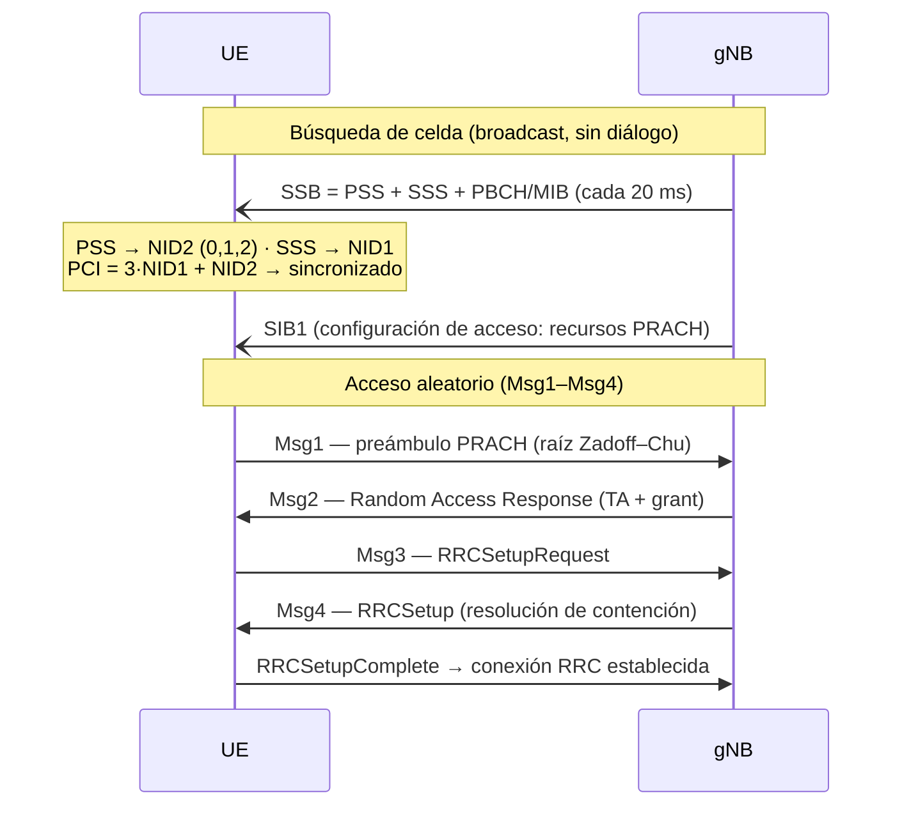
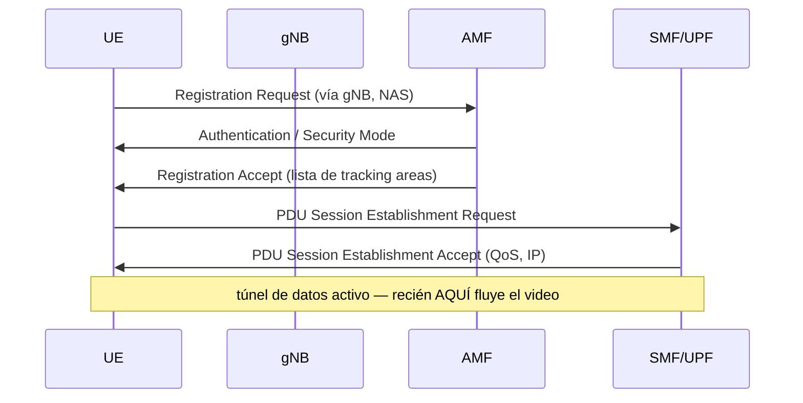

# Sesión 07 — Diseño de red de acceso 4G/5G sobre una ciudad real

> **Página en construcción** — se escribe fase por fase junto con el
> notebook `design.ipynb`. Documento de trabajo: `brainstorming-diseno-red.md`.

## Objetivos de Aprendizaje

Al finalizar esta sesión, el estudiante será capaz de:

1. Traducir metas de negocio en requisitos técnicos medibles de una red de acceso (cobertura, calidad, capacidad, servicios).
2. Ejecutar el flujo profesional de diseño de RAN: espectro → dimensionamiento por cobertura → dimensionamiento por capacidad → plan nominal → planificación detallada → validación.
3. Justificar la elección de bandas 4G/5G según penetración, radio de celda y capacidad, sobre geometría urbana real.
4. Configurar y defender los parámetros que consumen los procedimientos de red: PCI, RACH, tracking areas, vecindades y umbrales de handover.
5. Validar un diseño con ray tracing (Sionna RT) sobre un escenario real y cerrar el lazo de optimización.

---

## El encargo

Un operador móvil te contrata para diseñar su red de acceso 5G en un
polígono de **San Isidro, Lima** — 1.32 × 0.83 km del distrito financiero.
Tienes licencia de 100 MHz en la banda n78 (3.5 GHz), azoteas disponibles
y un presupuesto limitado de sitios. La empresa quiere promesas que pueda
publicitar y cumplir.

Todo lo que sigue en esta sesión es resolver ese encargo con método.

!!! note "La escena es tuya de fabricar"

    El laboratorio corre sobre una escena 3D real de San Isidro construida
    desde OpenStreetMap. Para el diseño final (o para trabajar sobre *tu*
    distrito) vas a fabricar tu propia escena:
    **[Guía: crear tu escena OSM con Blender](escena-osm-blender.md)** —
    instalación en la VM, descarga del mapa, materiales ITU y export a
    Mitsuba ([video del proceso](https://youtu.be/PIdn1R7FSrg?si=V8-HVuCvWGZG6v39)).

---

## Fase 0 — Requisitos: el diseño empieza en números, no en antenas

Un requisito de red vale solo si es **medible**. "Buena cobertura" no es un
requisito; "RSRP ≥ −110 dBm en el 95% del área" sí, porque se puede verificar
con un mapa o un drive test y se puede firmar en un contrato.

### 0.1 Las tres métricas que gobiernan los requisitos de radio

- **RSRP** (*Reference Signal Received Power*): potencia recibida de la señal
  de referencia de la celda (en 5G, del SSB). Mide **cobertura de control**:
  ¿el UE encuentra la red y puede engancharse a ella? No dice nada de
  interferencia.
- **SINR**: señal sobre interferencia más ruido. Mide **calidad de datos**:
  ¿la señal sirve para transportar bits? Se puede tener RSRP excelente con
  SINR pésimo — típico en frontera de dos celdas sin coordinación.
- **RSRQ** (*Reference Signal Received Quality*): híbrido que relaciona RSRP
  con la potencia total recibida; útil para decidir handovers cuando RSRP
  solo no discrimina.

La pareja RSRP/SINR separa dos preguntas de diseño distintas: **cobertura**
(Fase 2) y **calidad/capacidad** (Fase 3). Confundirlas es el error clásico.

!!! info "Nota de profundización"

    La mecánica completa de las tres métricas — dónde viven en la grilla
    tiempo-frecuencia, el patrón de señales de referencia, EPRE, el techo
    estructural del RSRQ y las trampas de medición — está en
    [RSRP, RSRQ y SINR — nota de referencia](rsrp-rsrq-sinr.md). Aquí basta
    el nivel conceptual; la Fase 2 recurre a esa nota para calcular.

### 0.2 Por qué las metas son probabilísticas

La Sesión 01 mostró que la señal urbana es una variable aleatoria: el
shadowing log-normal hace que dos esquinas a la misma distancia de la BS
difieran 10–20 dB. Garantizar cobertura en el 100% del área exigiría
potencia/sitios infinitos — cada punto porcentual final cuesta más que todos
los anteriores. Por eso la industria diseña a probabilidad: **95% del área**
(o del borde de celda) con la métrica sobre el umbral, y un **margen de
shadowing** en el link budget que compra esa probabilidad.

### 0.3 De GB por mes a Mbps de hora cargada

La capacidad no se dimensiona para el promedio del día sino para la **hora
cargada** (*busy hour*). La conversión estándar:

$$R_{\text{usuario}} = \frac{V_{\text{mes}} \cdot f_{BH}}{30 \cdot 3600}$$

donde $V_{\text{mes}}$ es el volumen mensual por abonado (bits) y $f_{BH}$
la fracción del tráfico diario que cae en la hora cargada (típico 8–12%).

Ejemplo con números de Perú urbano: 10 GB/mes ≈ $2.7$ Gbit/día; con
$f_{BH} = 10\%$ → **~75 kbps sostenidos por abonado**. Parece poco — esa es
la magia de la multiplexión estadística: miles de usuarios que navegan a
ráfagas comparten la celda, y el diseñador dimensiona la suma, no los picos
individuales.

### 0.4 Requisitos del encargo

| # | Requisito | Meta | Se verifica con |
|---|---|---|---|
| R1 | Área de servicio | polígono de 1.1 km² (San Isidro) | — |
| R2 | Cobertura de control | RSRP ≥ −110 dBm en 95% del área | mapa RSS / drive test |
| R3 | Calidad de datos | SINR ≥ 0 dB en 90% del área | mapa SINR |
| R4 | Throughput de borde | p5 ≥ 50 Mbps DL, ≥ 5 Mbps UL | mapa de throughput |
| R5 | Capacidad agregada | ≥ 600 Mbps/km² en hora cargada | Fase 3 |
| R6 | Servicios | eMBB + VoNR, latencia de usuario < 20 ms | arquitectura/QoS |
| R7 | Espectro | 100 MHz TDD en n78 (3.5 GHz) | licencia (MTC) |
| R8 | Despliegue | solo azoteas existentes, máximo 6 sitios | plan nominal |

La cuenta detrás de R5: 25 000 personas/km² presentes en hora cargada
(distrito financiero) × 30% de participación de mercado × 75 kbps por
abonado ≈ 560 Mbps/km², redondeado a 600. Cada factor es una hipótesis de
negocio — cámbialos y cambia la red que hay que construir.

!!! question "Comprueba tu comprensión"

    **P1.** ¿Puede un punto del mapa cumplir R2 e incumplir R3 a la vez?
    ¿Qué lo causaría?

    **P2.** Si el market share sube al 45%, ¿qué requisitos cambian y qué
    fases del diseño hay que rehacer?

    ---

    **R1.** Sí: RSRP alto con SINR bajo — señal fuerte pero interferida,
    típico en fronteras de celda. Se cura con coordinación/tilts, no con
    más potencia.

    Ojo con la palabra *coordinación*: la intuición sugiere "que las celdas
    se turnen" — desalinear los patrones TDD para que el DL de una no
    coincida con el DL de la vecina. La figura muestra por qué eso es
    exactamente lo prohibido:

    

    Si B se desplaza dos slots, aparecen slots donde A transmite DL
    (~46 dBm, en azotea, casi línea de vista hacia la otra azotea)
    mientras B intenta recibir UL de UEs que le llegan a ~−120 dBm: la
    *cross-link interference* entre gNBs deja ciego al receptor en **toda**
    la celda, no solo en el borde. Por eso todas las celdas co-canal usan
    el **mismo patrón DDDSU sincronizado** — es requisito regulatorio en la
    banda, no una opción de diseño.

    La coordinación que sí cura el borde opera con la trama ya sincronizada,
    en los ejes de frecuencia y scheduling (ICIC): las vecinas acuerdan
    sub-bandas de borde disjuntas — A sirve a sus UEs de frontera en unos
    PRBs, B en otros, y el centro reusa todo. El UE de borde recibe su señal
    donde la vecina no transmite a plena potencia → baja I sin tocar la
    potencia total. El tilt (Fase 4) ataca lo mismo por el eje espacial.

    **R2.** Cambia R5 (∝ abonados). La cobertura (Fase 2) no se toca; el
    dimensionamiento por capacidad (Fase 3) y quizá el plan nominal (más
    sectores/sitios) sí.

---

## Fase 1 — Estrategia de espectro: la decisión que fija todas las demás

Antes de colocar un solo sitio hay que decidir **en qué frecuencia vive la
red**. Es la decisión más estructural del diseño: fija el radio de celda (y
por tanto cuántos sitios costará la cobertura), la penetración en interiores
y cuánta capacidad hay para vender. En nuestro encargo la licencia ya está
dada (R7: 100 MHz en n78) — pero hay que entender qué compramos y qué no.

### 1.1 La física: frecuencia contra alcance

La pérdida de espacio libre crece con $20\log_{10}(f)$: subir de banda cuesta
dB, y esos dB se pagan en radio de celda. Además, a mayor frecuencia peor
difracción (las esquinas "doblan" menos la señal) y peor penetración de
muros. Regla mental: **bajar una octava de frecuencia ≈ doblar el radio de
celda**.

Con el exponente de propagación urbano ($n \approx 3.8$), el delta de
pérdida se convierte en factor de área — y el factor de área, en sitios:

| Banda | $\Delta$ pérdida vs n78 | Radio relativo | Sitios para la misma área |
|---|---|---|---|
| 700 MHz (n28) | −14 dB | ×2.3 | ÷5.4 |
| 2.1 GHz (B4/n1) | −4.4 dB | ×1.3 | ÷1.7 |
| **3.5 GHz (n78)** | 0 (referencia) | ×1.0 | ×1.0 |
| 26 GHz (n258) | +17.4 dB | ×0.35 | ×8 |

Ya lo medimos sobre Lima real: mismos 3 sitios a 2.1 GHz cubren 74.6% del
área; a 3.5 GHz, 71.2% (`test_scene.ipynb`, Parte 5) — y eso que 2.1→3.5 es
el salto *chico* de la tabla.

### 1.2 Por qué entonces no todo es 700 MHz: capas de espectro

Porque el alcance se paga en capacidad: en low-band hay poco espectro (10–20
MHz por operador, y repartido); en mid-band hay bloques de 80–100 MHz. De ahí
la arquitectura de **capas** que usa todo operador real:

- **Capa de cobertura** (700/850/900 MHz): llega lejos y adentro, pero la
  banda entera de 700 MHz es 2×45 MHz (FDD) repartidos entre operadores —
  en la subasta peruana de 2016 tocó **2×15 MHz por operador**, o sea
  15 MHz de bajada → sostiene voz, IoT y el "siempre conectado", no el
  tráfico masivo.
- **Capa de capacidad** (2.6/3.5 GHz): bloques de **80–100 MHz** por
  operador (nuestro encargo: 100 MHz en n78, R7) — unas **6–7×** la bajada
  de la capa baja → sostiene el tráfico eMBB; celdas chicas → más sitios.
- **Capa de hotspot** (mmWave): n258 (26 GHz) tiene 3.25 GHz de banda
  total; se asigna en portadoras de **400 MHz** y un operador típicamente
  agrega **800–1000 MHz** — otras **8–10×** lo de mid-band, pero con
  alcance de cuadra; solo donde la densidad lo justifica.

Nuestro encargo es deliberadamente **mono-capa** (solo n78): más simple para
aprender, y realista para un despliegue 5G inicial. La comparación con una
capa de 700 MHz queda como extensión (requiere escena de 3×3 km — una celda
low-band tapa nuestra escena entera).

### 1.3 TDD: los 100 MHz no son todos tuyos todo el tiempo

n78 es TDD (Sesión 06: subida y bajada alternan sobre la misma frecuencia).
El tiempo se reparte con un patrón de slots; el típico en n78 es **DDDSU**:
de cada 5 slots, 3 son de bajada, 1 "especial" (mayormente bajada + guarda) y
1 de subida. Consecuencia aritmética que golpea el diseño:

- DL dispone de ≈ 71% del tiempo → **≈ 71 MHz "efectivos"** de los 100.
- UL dispone de ≈ 20% → **≈ 20 MHz efectivos** — y el UE ya era el extremo
  débil (23 dBm). El uplink pierde dos veces: en potencia y en tiempo.

El patrón TDD además debe estar **sincronizado entre operadores vecinos** de
la banda (lo coordina el regulador): si mi celda transmite DL mientras la
tuya escucha UL, mi potencia entierra a tus usuarios.

En FDD (las bandas bajas clásicas) esto no existe: DL y UL tienen cada uno su
frecuencia dedicada, tiempo completo.

### 1.4 Numerología: el detalle que conecta con OFDM

En n78 se usa subportadora de 30 kHz (Sesión 03: numerología µ=1): slots de
0.5 ms, CP de 2.3 µs — y ya verificamos sobre Lima que el delay spread urbano
(mediana 60 ns) cabe holgado en ese CP (`test_scene.ipynb`, Parte 8). La
numerología queda decidida por la banda y el estándar; no es una perilla de
esta clase.

### Decisión de la Fase 1 (lo que hereda el resto del diseño)

> Banda **n78 (3.5 GHz)**, **100 MHz** TDD con patrón **DDDSU** (≈71/20% 
> DL/UL), SCS 30 kHz. La Fase 2 dimensionará cobertura con la física de 3.5
> GHz; la Fase 3 repartirá 71/20 MHz efectivos contra la demanda de R5.

!!! question "Comprueba tu comprensión"

    **P1.** Un colega propone pedir al regulador cambiar la licencia a 20 MHz
    en 700 MHz "porque cubre 5 veces más área con los mismos sitios". ¿Qué
    requisito del encargo mata la propuesta?

    **P2.** ¿Por qué el patrón TDD de tu red no es 100% decisión tuya?

    ---

    **R1.** R5/R4: con 20 MHz no hay capacidad ni throughput de borde — la
    cobertura barata de low-band se paga en Mbps. (Cuenta rápida: 20 MHz ×
    ~74% DL deja ~15 MHz efectivos; ni la mediana de 50 Mbps se sostiene con
    carga.)

    **R2.** Debe sincronizarse con los demás operadores de la banda en la
    zona: patrones cruzados = interferencia DL→UL entre redes. Lo fija el
    regulador o el acuerdo inter-operador.

## Fase 2 — Dimensionamiento por cobertura: del presupuesto de dB al número de sitios

La pregunta de esta fase: **¿cuántos sitios necesita R2** (RSRP ≥ −110 dBm en
95% del área)**?** La herramienta es el *link budget*: una contabilidad en dB
donde cada ganancia suma, cada pérdida resta, y lo que queda es cuánto camino
puede recorrer la señal.

### 2.1 El punto de partida no es la potencia del amplificador

Error clásico: arrancar el presupuesto con "la BS transmite 44 dBm". Esos
44 dBm se reparten entre **todas** las subportadoras del canal. Con 100 MHz a
SCS 30 kHz hay 273 PRB × 12 = 3 276 subportadoras:

$$\text{EPRE} = 44 - 10\log_{10}(3276) \approx 44 - 35.2 = 8.8 \text{ dBm por RE}$$

Como el RSRP se mide **por resource element** (ver la
[nota de referencia](rsrp-rsrq-sinr.md)), el link budget de cobertura de
control empieza en 8.8 dBm, no en 44. La red incluso difunde este número
(`referenceSignalPower` en el SIB) para que el UE pueda despejar el path
loss.

### 2.2 El presupuesto término a término

$$\text{RSRP}_{\text{borde}} = \underbrace{\text{EPRE}}_{8.8} + \underbrace{G_{tx}}_{+16} - \underbrace{\text{PL}}_{?} - \underbrace{M_{\text{shadow}}}_{9} \geq -110 \text{ dBm}$$

| Término | Valor | De dónde sale |
|---|---|---|
| EPRE | 8.8 dBm | 44 dBm ÷ 3 276 subportadoras |
| $G_{tx}$ | +16 dBi | antena sectorial macro típica |
| $M_{\text{shadow}}$ | −9 dB | compra el 95% de área con shadowing log-normal $\sigma = 8$ dB |
| $G_{rx}$, pérdidas de cuerpo/cable | 0 dB neto | UE: antena ~0 dBi; simplificación explícita |

Despejando: la señal puede perder hasta

$$\text{MAPL} = 8.8 + 16 + 110 - 9 \approx 126 \text{ dB}$$

**MAPL** (*Maximum Allowable Path Loss*) es el número que resume toda la
fase: el presupuesto de pérdida que el trayecto no debe superar.

El margen de shadowing es donde la meta probabilística de la Fase 0 se
vuelve un número: con $\sigma = 8$ dB, reservar ~9 dB garantiza que el ~95%
del área (no solo el punto medio) quede sobre el umbral. Más probabilidad =
más margen = menos radio: la certeza se paga en dB.

### 2.3 De MAPL a radio: el modelo de propagación

El MAPL se convierte en distancia invirtiendo un modelo. El estándar de la
industria sin escena 3D es el **UMa NLOS de 3GPP TR 38.901**:

$$\text{PL} = 13.54 + 39.08\log_{10}(d) + 20\log_{10}(f_c) \quad [\text{d en m, } f_c \text{ en GHz}]$$

Con 126 dB y $f_c = 3.5$: $d \approx 390$ m — coherente con la tabla de la
Fase 1 (n78: 200–500 m urbano).

Cada sitio trisectorial cubre un hexágono de área $\approx 2.6\,r^2$:

$$N_{\text{sitios}} = \frac{1.1 \text{ km}^2}{2.6 \times 0.39^2 \text{ km}^2} \approx 3 \text{ sitios por cobertura}$$

**Tres sitios** — coherente con el esbozo (`test_scene.ipynb`) que con 3 BS
logró ~71% de SINR > 0: la cobertura de control alcanza, la calidad todavía
no. La fórmula da el *orden de magnitud*; el ray tracing sobre la escena
real (Fase 6) da la verdad calle por calle. Ambos se necesitan: la fórmula
para dimensionar sin escena, el trazador para validar con ella.

### 2.4 El enlace de vuelta: uplink

El mismo ejercicio con el UE como transmisor: 23 dBm sobre sus PRBs
asignados (no per-RE de 100 MHz — el UE concentra su potencia en pocos PRB,
su gran defensa), antena de 0 dBi, y la BS escuchando con NF de 5 dB. El
enlace que soporte **menos** pérdida define el radio real de la celda: de
nada sirve que el UE oiga a la BS si la BS no lo oye de vuelta. La cuenta
completa está en `design.ipynb`; el resultado con nuestros números: DL de
control y UL de datos quedan sorprendentemente parejos (~126 vs ~130 dB) —
precisamente porque el UE concentra y la BS reparte.

### 2.5 RSS → RSRP: cerrar el círculo con Sionna

Los radio maps de Sionna entregan potencia de banda ancha (RSS). Para
verificar R2 hay que convertir: restar $10\log_{10}(N_{\text{RE}})$ del
despliegue. Es la misma cuenta del EPRE vista del lado del receptor — y el
motivo por el que la meta R2 no puede compararse directo contra el mapa
crudo. La verificación numérica vive en `design.ipynb`.

!!! question "Comprueba tu comprensión"

    **P1.** El operador propone duplicar el ancho de banda a 200 MHz "para
    duplicar capacidad" manteniendo los 44 dBm. ¿Qué pasa con la cobertura?

    **P2.** ¿Por qué el margen de shadowing no se puede eliminar "midiendo
    mejor el canal"?

    ---

    **R1.** El EPRE cae 3 dB (misma potencia entre el doble de
    subportadoras) → el RSRP cae 3 dB en todo punto → el MAPL pierde 3 dB →
    el radio se encoge ~16% y hacen falta ~40% más sitios. La capacidad
    también se paga en cobertura.

    **R2.** Porque no es error de medición: es la variabilidad *física* del
    entorno (qué edificios estorban en cada punto). Se puede mapear con ray
    tracing punto a punto, pero al diseñar con un modelo estadístico, la
    incertidumbre espacial es irreducible y hay que presupuestarla.

## Fase 3 — Dimensionamiento por capacidad: la cuenta gemela

La Fase 2 preguntó "¿cuántos sitios para que la señal *llegue*?". Esta
pregunta es distinta: **¿cuántos sitios para que la red *aguante* la demanda
de R5** (600 Mbps/km² en hora cargada)**?** Son dos cuentas independientes y
el diseño final obedece a la peor:

$$N_{\text{sitios}} = \max(N_{\text{cobertura}},\ N_{\text{capacidad}})$$

### 3.1 La capacidad de una celda no es su pico

El folleto promete "hasta 1 Gbps"; la celda real sirve usuarios repartidos
por toda su área compartiendo los mismos PRBs. Su capacidad es un **promedio
sobre la distribución espacial de SINR** — y qué promedio usar depende del
scheduler: reparto equitativo de *tiempo* rinde la media aritmética de las
eficiencias; reparto igualitario de *datos* colapsa hacia la media armónica
(el usuario de borde consume el tiempo de todos). Este es el concepto
difícil de la fase y tiene nota propia:
[De la distribución de SINR a la capacidad de celda](de-sinr-a-capacidad.md).

### 3.2 La cadena de la cuenta

$$R_{\text{celda}} = \underbrace{\text{SE}_{\text{celda}}}_{2.0 \text{ bit/s/Hz}} \times \underbrace{B_{\text{DL,ef}}}_{71 \text{ MHz}} \times \underbrace{(1 - OH)}_{0.78} \approx 111 \text{ Mbps}$$

- $\text{SE}_{\text{celda}} = 2.0$ bit/s/Hz: hipótesis conservadora SISO de
  industria — **declarada** para ser reemplazada en la Fase 6 por la
  integral del mapa SINR ray-traced de San Isidro.
- $B_{\text{DL,ef}} = 71$ MHz: herencia directa de la Fase 1 (patrón DDDSU).
- $OH \approx 22\%$: SSB, PDCCH, DMRS — PRBs que no llevan datos de usuario.

Un sitio trisectorial: $3 \times 111 \approx 330$ Mbps.

### 3.3 El veredicto

Demanda total: $600 \text{ Mbps/km}^2 \times 1.1 \text{ km}^2 = 660$ Mbps.

$$N_{\text{capacidad}} = \lceil 660 / 330 \rceil = 2 \text{ sitios} \qquad
N_{\text{sitios}} = \max(3, 2) = \mathbf{3}$$

Hoy la red está **limitada por cobertura**: los 3 sitios de la Fase 2 traen
capacidad de sobra (990 Mbps instalados vs 660 demandados — margen 1.5×).
Pero el tráfico móvil crece ~25% anual: en ~2 años la desigualdad se
invierte y la capacidad pasa a mandar. Ahí las salidas son (en orden de
costo): exprimir SE con MU-MIMO/sectorización, agregar portadora, y solo al
final agregar sitios — la curva de densificación del laboratorio mostró por
qué es el último recurso.

### 3.4 Nota sobre el uplink

La misma cuenta con los 20 MHz efectivos de UL y SE menor (~1.2 bit/s/Hz,
sin 256-QAM en subida de UEs comunes): ~19 Mbps por celda, ~56 por sitio.
Contra una demanda de subida típica (~15% de la de bajada, ≈ 100 Mbps):
también sobra hoy. El UL limita en *cobertura de servicios exigentes*, no en
volumen — coherente con lo visto en Fase 2.

!!! question "Comprueba tu comprensión"

    **P1.** Marketing pide "duplicar la velocidad de borde garantizada"
    (R4: 50 → 100 Mbps). ¿Eso es un problema de capacidad o de cobertura?
    ¿Qué fase se rehace?

    **P2.** Un ingeniero propone dimensionar con la SE del mapa medido un
    domingo a las 7 am. ¿Cuál es el error?

    ---

    **R1.** De cobertura/calidad (R4 es percentil 5 = borde), no de volumen
    agregado. Se rehace la Fase 2 con un umbral de SINR de borde más alto →
    MAPL menor → celdas más chicas → probablemente más sitios; la Fase 3
    apenas cambia.

    **R2.** Carga↔interferencia acopladas: en hora valle las vecinas callan
    y el SINR es optimista. Se dimensiona full-buffer (todas las celdas
    transmitiendo), que es el escenario de la hora cargada — la única que
    importa para capacidad.

## Fase 4 — Plan nominal: el diseño aterriza en el mapa

Las fases 2–3 dijeron **cuántos** sitios (3). Esta fase decide **dónde y
cómo**: posiciones sobre azoteas reales, sectorización, azimuts y downtilt.
Es la fase gráfica del diseño — aquí la aritmética se encuentra con la
ciudad.

### 4.1 Sectorización: tres celdas por el precio de un sitio

Un sitio omnidireccional es una celda. El mismo sitio con **3 antenas
sectoriales de 120°** son **tres celdas independientes**: cada una con su
espectro completo, su scheduler y su PCI. La capacidad del sitio se
triplica sin comprar terreno ni torre — por eso la sectorización 3×120° es
el estándar universal de macro urbana.

El truco está en el patrón de la antena: el elemento sectorial 3GPP tiene
**65° de ancho de haz** (−3 dB), no 120°. Los tres pétalos no llenan el
círculo: entre sectores quedan valles de ~10 dB donde el UE ve dos sectores
parejos — ahí vive el handover intra-sitio.

<!-- FIGURA PENDIENTE: figures/sectorizacion_3x120.svg -->

### 4.2 Azimut: hacia dónde mira cada sector

El azimut de cada sector es una perilla de diseño por sitio. Regla
práctica: apuntar los sectores hacia la **demanda** (avenidas, edificios de
oficinas) y **no** de frente contra el sector de un sitio vecino (dos
sectores frente a frente = interferencia máxima en la franja intermedia).
En el plan nominal usamos 0°/120°/240° uniformes como punto de partida; la
optimización fina de azimuts es trabajo de la Fase 6.

### 4.3 Downtilt: la perilla de interferencia

La antena no se apunta al horizonte: se inclina hacia abajo. Geometría
simple — con altura $h$ y tilt $\theta$, el haz principal toca el suelo a:

$$d = \frac{h}{\tan\theta}$$

Con $h = 30$ m y $\theta = 6°$: $d \approx 270$ m — justo el borde de
nuestra celda de ~390 m considerando el ancho vertical del haz. La lección
contraintuitiva: **inclinar la antena hacia abajo MEJORA la red**, porque
la energía que iba al horizonte no servía a nadie propio — solo
interfería a las celdas vecinas (*overshooting*). El tilt es además la
perilla de optimización más barata que existe: el tilt eléctrico se ajusta
por software, sin subir a la torre.

- **Tilt 0°**: celda "infinita" — cobertura propia igual, interferencia
  regada a todo el mapa.
- **Tilt excesivo**: la celda se encoge más que su área asignada — huecos
  entre sitios.
- El óptimo es un compromiso, y depende de la geometría real → barrido en
  `design.ipynb`.

<!-- FIGURA PENDIENTE: figures/downtilt_geometria.svg -->

### 4.4 El plan nominal de San Isidro — y lo que midió el trazador

| Sitio | Posición (x, y) [m] | Altura | Azimuts | Tilt inicial |
|---|---|---|---|---|
| s1 | (−380, 200) | 30 m | 0°/120°/240° | 6° |
| s2 | (350, 230) | 30 m | 0°/120°/240° | 6° |
| s3 | (0, −260) | 30 m | 0°/120°/240° | 6° |

Dos resultados del ray tracing que contradicen la intuición de libro — y
por eso enseñan:

**1. Sectorizar bajó el % de SINR** (49% con 9 celdas vs 71% del esbozo
con 3 omnis). No es un error: pasar de 3 a 9 celdas co-canal multiplica
los interferentes, y el mapa lo cobra. Lo que se compró con la
sectorización no es SINR — es **capacidad** (×3 celdas, cada una con el
espectro completo). La métrica correcta para juzgar la sectorización es
Mbps agregados de la Fase 3, no el % del mapa. Cada decisión de diseño
optimiza una métrica y factura en otra.

**2. El barrido uniforme de tilt (0°/6°/12°) casi no movió el SINR**
(±0.3 puntos). Verificamos que el tilt sí redistribuye potencia (+14 dB
de RSS al suelo entre ±30°); lo que pasa es que al tiltear **todas** las
celdas por igual, señal e interferencia suben juntas y el cociente no
cambia. La regla de libro "tilt = control de interferencia" aplica al
*overshooting* hacia sitios lejanos — macro abierta, haces verticales de
~7°. En 1 km² denso, el tilt se usa **por celda** (asimétrico, para
corregir una invasión concreta), no como perilla global. La Fase 6 lo
usará así.

!!! question "Comprueba tu comprensión"

    **P1.** Si sectorizar triplica la capacidad, ¿por qué no usar 6
    sectores de 60° y sextuplicarla?

    **P2.** Un sector tiene excelente SINR cerca del sitio pero su celda
    "invade" el área del sitio vecino. ¿Primera perilla a tocar y por qué?

    ---

    **R1.** Rendimientos decrecientes con castigo: antenas de 60° reales
    solapan más (el haz no es rectangular), el handover intra-sitio se
    multiplica, y la interferencia entre sectores propios crece. 3×120°
    con elementos de 65° es el equilibrio que la industria convergió.

    **R2.** Downtilt (eléctrico si existe): reduce el alcance del sector
    invasor sin tocar su cobertura cercana, es remoto y reversible.
    Bajar potencia también encoge la celda pero degrada a TODOS sus
    usuarios, incluidos los cercanos; el tilt redistribuye, la potencia
    amputa.

## Fase 5 — Planificación detallada: los números que hacen funcionar la red

Las Fases 0–4 decidieron *dónde* y *cuánto*: 3 sitios, 9 celdas, azimuts y
tilts. Pero una red con antenas perfectas y parámetros vacíos no da servicio:
cada procedimiento que el UE ejecuta — encontrar la celda, pedir acceso,
registrarse, moverse — **consume un parámetro que el diseñador tuvo que
fijar antes**. La Fase 5 es esa lista de números. La regla mnemotécnica:
*por cada flecha de un diagrama de secuencia, hay una fila en la hoja de
parámetros*.

### 5.1 El arco del UE: del encendido a los datos

Lo que pasa entre "enciendo el teléfono" y "veo video" son cuatro
procedimientos encadenados. Los nombres de los mensajes son los reales del
estándar (3GPP TS 38.331 para RRC, TS 24.501 para NAS) — conviene
reconocerlos porque son los que aparecen en cualquier traza de campo.

**Acto 1 — Búsqueda de celda y acceso aleatorio (UE ↔ gNB):**

**Acto 2 — Registro y sesión de datos (UE ↔ núcleo):**

Cada flecha consume un parámetro nuestro:

| Flecha | Parámetro que consume | Quién lo fijó |
|---|---|---|
| PSS/SSS | **PCI** de la celda | Fase 5 (§5.2) |
| Msg1 | **raíces ZC del PRACH** y su zona de contención | Fase 5 (§5.3) |
| Msg2 (Timing Advance) | radio máximo de celda | Fase 2 (390 m) |
| Registration Accept | **tracking areas** | Fase 5 (§5.4) |
| (movilidad posterior) | **vecinas, A3, histéresis, TTT** | Fase 5 (§5.5) |

### 5.2 PCI planning: la identidad se planifica, no se sortea

El PCI (0–1007) es lo primero que el UE aprende de una celda, y se
descompone en PCI = 3·N₁ + N₂: el **mod 3 viene de la PSS**. Tres reglas,
en orden de gravedad:

1. **Sin colisión**: dos celdas vecinas con el mismo PCI → el UE no puede
   distinguirlas. Fatal.
2. **Sin confusión**: dos vecinas *de una misma celda* con igual PCI → el
   handover "hacia PCI 301" es ambiguo para la celda origen. Fatal para
   movilidad.
3. **Cuidar el mod 3**: vecinas con el mismo PCI mod 3 superponen sus
   señales de referencia en las mismas subportadoras — interferencia
   pilot-a-pilot justo donde se mide el canal. La nota
   [CRS de dos celdas y PCI mod 3](crs-dos-celdas-pci-mod3.md) muestra el
   mecanismo resource element por resource element.

Con 9 celdas y solo 3 grupos mod-3, esto es un problema de **coloreo de
grafos con 3 colores**: el grafo de vecindad sale del mapa best-server
(dos celdas son vecinas si sus áreas se tocan), y no siempre es
3-coloreable — en cuyo caso se sacrifican las fronteras más cortas. El
notebook lo resuelve para San Isidro y verifica cuántos metros de frontera
quedan en conflicto.

Resultado medido: de los ~53 km de fronteras del best-server, **~3.3 km
(6%) quedan entre vecinas del mismo grupo** — y el coloreo ponderado *no
mejoró* al plan ingenuo de PCIs consecutivos por sitio. En una geometría
compacta de 9 celdas, la numeración consecutiva ya cumple la regla
co-sitio, y el residuo lo imponen los **vecindarios densos** del mapa: en
cuanto una celda tiene cuatro o más vecinas mutuamente en contacto (nada
raro con fronteras ray-traced que serpentean entre edificios), tres grupos
no alcanzan para separar a todas de todas. El PCI planning gana valor con
la escala: cientos de celdas, vecindarios irregulares, y celdas nuevas que
heredan un plan viejo.

### 5.3 RACH: la zona de contención debe cubrir la celda

El preámbulo Msg1 es una secuencia Zadoff–Chu; celdas distintas usan
raíces o desplazamientos cíclicos distintos. El desplazamiento mínimo
N_CS debe absorber el retardo de ida y vuelta del UE más lejano — si la
zona de contención es menor que el radio de celda, un UE legítimo del borde
aparece como *otro preámbulo*: colisión fantasma.

La cuenta (en el notebook): radio 390 m → ida y vuelta 2.6 µs → con la
secuencia larga (839 chips, 800 µs) basta N_CS ≈ 13, que deja ~64
preámbulos por raíz → **una sola raíz por celda**. La lección invertida:
en celdas urbanas chicas el RACH es barato; una celda rural de 15 km
devora raíces (y por eso el plan de raíces se hace junto al plan de PCI).

### 5.4 Tracking areas: cuánto sabe la red de dónde estás

Cuando el UE está en reposo (idle), la red no sabe en qué celda está —
solo en qué **tracking area** (TA). El tamaño de la TA es un compromiso:

- TA grande → el UE casi nunca reporta que se movió (poco *TAU*), pero
  cada llamada entrante obliga a hacer **paging en todas las celdas** de
  la TA.
- TA chica → paging barato, pero el UE gasta batería y señalización
  actualizando su posición a cada rato.

Nuestra red es trivial — 9 celdas, 1.1 km² → **una sola TA** — pero la
cuenta de diseño escala: un operador de Lima con 5 000 celdas y TAs de 50
celdas paga 50 pagings por llamada entrante a cambio de TAUs solo al
cruzar fronteras de TA (que se trazan donde la gente *no* cruza a diario:
nunca partir una avenida llena de commuters por la mitad).

### 5.5 Vecinas y A3: la movilidad ya la medimos

El handover lo dispara el **evento A3**: "la vecina supera a la serving
por `offset` dB durante `TTT` ms". Sin histéresis, el UE en la frontera
rebota entre celdas a cada fluctuación de shadowing — el esbozo lo midió
sobre San Isidro (Parte 4 de `test_scene.ipynb`): un recorrido con A3
crudo dio **8 handovers; con offset + TTT razonables, 1**. Cada handover
es señalización (y riesgo de caída): el ping-pong no es cosmético.

Las **listas de vecinas** cierran el círculo: la celda solo puede mandar
"mide a la vecina X" si X está en su lista. Completas pero sin basura —
una vecina falsa (que ya no existe o no es alcanzable) produce handovers
a ciegas. En redes modernas las llena ANR (*Automatic Neighbour
Relations*), pero el diseñador las audita: es el primer lugar donde se ve
un PCI confundido.

!!! question "Comprueba tu comprensión"

    **P1.** Un drive test reporta que en una esquina el UE ve dos celdas
    distintas con el mismo PCI. ¿Cuál de las tres reglas de §5.2 se violó,
    y qué procedimiento del arco del UE falla primero?

    **P2.** ¿Por qué la zona de contención RACH se dimensiona con el radio
    de celda de la Fase 2 y no con el radio "real" que midió el ray tracer?

    ---

    **R1.** Colisión (regla 1). Falla primero la búsqueda de celda /
    medición: el UE suma la energía de ambas como si fueran una sola
    "celda" y reporta mediciones sin sentido; el handover hacia ese PCI es
    ambiguo aun antes del Msg1.

    **R2.** Porque el preámbulo debe funcionar para el UE *legal* más
    lejano que la celda declara servir — el radio de diseño (MAPL) es el
    contrato. Si el ray tracer muestra que la celda "llega" más lejos por
    un cañón urbano, ese UE lejano igual debe poder acceder: overshooting
    también estresa el RACH, otra razón para controlarlo con tilt por
    celda.

## Fase 6 — Validación y optimización *(en construcción)*
