# RSRP, RSRQ y SINR — nota de referencia

> Las tres métricas no miden lo mismo con distinta escala. Miden cosas físicamente
> distintas y responden preguntas distintas.

*Nota de profundización de la [Sesión 07](index.md): el §Fase 0 presenta las
tres métricas a nivel conceptual; aquí está la mecánica de estándar (dónde
viven en la grilla, cómo se calculan, sus trampas). El §Fase 2 usa la
sección de EPRE/link budget como punto de partida del dimensionamiento.*

| Métrica | Qué es | Pregunta que responde | Unidad |
|---|---|---|---|
| **RSRP** | Potencia absoluta de la señal de referencia, **por resource element** | ¿Cuánta señal *mía* llega? | dBm |
| **SINR** | Relación señal / (interferencia + ruido) | ¿Qué tan *limpia* llega? | dB |
| **RSRQ** | Fracción de la potencia total recibida que es señal de referencia | ¿Qué proporción de lo que oigo es *mío*, y qué tan cargada está la celda? | dB |

---

## 1. RSRP

### Definición

Promedio **lineal** (en watts, no en dB) de la potencia recibida en los resource
elements que transportan las señales de referencia, dentro del ancho de banda de
medición.

- **LTE:** REs con CRS (*Cell-specific Reference Signal*), puerto de antena 0.
- **NR:** SS-RSRP, medido sobre el SSS y el DMRS del PBCH dentro del SSB.

La palabra clave es **por RE**: es potencia por subportadora de 15 kHz, no potencia
total sobre la banda.

### El patrón de las CRS (LTE, CP normal, puertos 0 y 1)

| Dimensión | Valor |
|---|---|
| Separación en frecuencia, dentro de un símbolo | **6 subportadoras** (90 kHz) → 2 REs por RB por puerto |
| Separación efectiva combinando símbolos | **3 subportadoras** (45 kHz), por el escalonamiento |
| Símbolos ocupados en la subtrama | **0, 4, 7 y 11** (símbolos 0 y 4 de cada slot) |
| Separación en tiempo | 4 y 3 símbolos alternados (~0.25 ms) |
| Densidad | 8 REs por RB por subtrama por puerto (~4.8% de overhead) |

**Escalonamiento:** en el símbolo 0 las CRS del puerto 0 caen en k = 0, 6; en el
símbolo 4 caen en k = 3, 9. No es estético: con 45 kHz de espaciamiento efectivo el
muestreo del canal es válido hasta un delay spread de ~22 µs, muy por encima del CP
normal de 4.7 µs. La separación temporal de ~0.25 ms permite seguir Doppler de hasta
~2 kHz.

**Silenciamiento:** donde el puerto 0 transmite CRS, el puerto 1 está en DTX en ese
mismo RE, y viceversa. Si no, el UE no podría separar los dos canales.

<figure markdown="span">
  
  <figcaption markdown="1">**Figura A.** Un RB (12 subportadoras) × 1 subtrama (14 símbolos). Las CRS del puerto 0 y del puerto 1 ocupan los símbolos 0, 4, 7 y 11, escalonadas en frecuencia; donde un puerto transmite, el otro calla (DTX). El resto de la grilla es PDSCH/control.
  </figcaption>
</figure>

### ¿Las posiciones cambian dinámicamente? **No.**

Las posiciones son **fijas y deterministas**, fijadas por un corrimiento en
frecuencia que depende únicamente del identificador de celda:

```
v_shift = PCI mod 6
```

Lo que **sí** cambia de slot a slot es el **valor** que va montado en esos REs: una
secuencia pseudoaleatoria QPSK generada a partir del PCI, el número de slot y el
número de símbolo.

> **Posición estática, contenido variable.**

**Cuidado con la conclusión apresurada** "PCI distinto módulo 6 ⇒ pilotos que no
colisionan": vale solo con **1 puerto de antena**. Con 2 o 4 puertos, cada celda
ocupa `{v_shift, v_shift+3, v_shift+6, v_shift+9}` — un patrón de **período 3** —
y la regla de planificación real es **PCI mod 3**. El ejemplo completo con dos
celdas vecinas (PCI 12 vs 13, y el contraejemplo PCI 12 vs 15 que colisiona
puerto contra puerto), más el vínculo elegante con el índice del PSS, está en la
nota [Patrón de CRS con dos celdas — PCI mod 3](crs-dos-celdas-pci-mod3.md).
Cuando una colisión ocurre, el **RSRP se contamina**: la potencia de la vecina se
promedia dentro de la medición — y como las CRS están siempre encendidas, el daño
no depende de la carga.

### Cálculo: el enlace con el link budget

El punto de partida no es la potencia total del amplificador, sino la potencia
**por RE** (EPRE, *Energy Per Resource Element*):

```
EPRE [dBm] = P_total [dBm] − 10·log10(N_subportadoras)

RSRP [dBm] = EPRE + G_Tx − PL − L_otras + G_Rx
```

La red transmite el EPRE explícitamente en el **SIB2**, como `referenceSignalPower`
(dBm por RE), justamente para que el UE pueda despejar el path loss restando su RSRP
medido.

### Independencia del ancho de banda — y la trampa

**Verdadero para el ancho de banda de *medición*.** RSRP es un promedio, no una suma.
Agregar más REs al promedio solo reduce la **varianza** del estimador; no cambia su
valor esperado. Por eso el estándar permite medir sobre un mínimo de 6 RBs y aun así
comparar celdas de 1.4 MHz contra 20 MHz.

**Falso para el ancho de banda de *despliegue*, si la potencia del PA es fija.** Con
un amplificador de 40 W, pasar de 10 MHz a 20 MHz reparte la misma potencia entre el
doble de subportadoras: el EPRE cae **3 dB** y el RSRP medido en el mismo punto
geográfico cae 3 dB con él.

---

## 2. Dos correcciones que conviene hacer explícitas

### 2.1 Las CRS **no** se anuncian por el canal de control

El UE **deduce** las posiciones de las CRS a partir del PCI, que obtiene del
**PSS/SSS** durante la búsqueda de celda.

Tiene que ser así por necesidad lógica: el UE necesita las CRS para estimar el canal y
poder **demodular** el PBCH y el PDCCH. Si la ubicación de las CRS viniera anunciada
por el canal de control, habría un problema del huevo y la gallina.

```
PSS/SSS → PCI → v_shift → posiciones CRS → estimación de H → demodulación de PBCH/PDCCH
```

Lo único que se señaliza es el *número de puertos de antena* (implícito en la máscara
del CRC del PBCH) y el ancho de banda del sistema (en el MIB).

### 2.2 El UE **no** devuelve H

La estimación del canal es de **uso local** del UE: sirve para ecualizar y demodular.
Nunca viaja de vuelta en crudo — el volumen sería inviable. Lo que regresa son dos
cosas distintas, por vías y escalas de tiempo distintas:

| Qué regresa | Por dónde | Capa | Escala de tiempo |
|---|---|---|---|
| **CSI** (CQI, PMI, RI) — derivada de H, cuantizada brutalmente (CQI = 4 bits) | PUCCH / PUSCH | Física | milisegundos |
| **RSRP / RSRQ** — filtrados, cuantizados (RSRP en 97 niveles, −140 a −44 dBm) | *Measurement reports* RRC, eventos A1–A6 o periódicos | RRC (capa 3) | cientos de ms |

> **CQI es capa física y rápido → adaptación de enlace.
> RSRP es RRC y lento → handover.**

Nota adicional: el "canal de retorno" no está en la misma grilla. En FDD es una
portadora completamente distinta, con su propia grilla SC-FDMA.

---

## 3. SINR

```
SINR = S / (I + N)        I = Σ P_j  (suma LINEAL sobre todas las vecinas co-canal)
```

### La regla que más se viola

**S, I y N deben estar los tres referidos al mismo ancho de banda.** Como S proviene
del RSRP, que es potencia *por RE*, entonces I y N también deben ser por RE.

El ruido térmico no es un número, es una densidad:

```
N [dBm] = −174 dBm/Hz + 10·log10(B) + NF
```

| Referencia | Cálculo | Resultado |
|---|---|---|
| Por RE (15 kHz), NF = 7 dB | −174 + 41.8 + 7 | **≈ −125 dBm** |
| Banda completa (10 MHz ≈ 9 MHz útiles), NF = 7 dB | −174 + 69.5 + 7 | **≈ −98 dBm** |

Mezclar un RSRP por RE con un piso de ruido de banda ancha produce SINRs imposibles.
Es el error número uno.

### Ejemplo numérico

Con S = −90 dBm, I = −95 dBm, N = −125 dBm (todos por RE):

```
SINR = 10^(-9) / (10^(-9.5) + 10^(-12.5)) ≈ 3.16   →   ≈ 5.0 dB
```

<figure markdown="span">
  
  <figcaption markdown="1">**Figura B.** Los tres niveles del ejemplo, referidos al mismo ancho de banda (15 kHz = 1 RE). Con N 30 dB por debajo de I, el ruido es irrelevante: el escenario es limitado por interferencia.
  </figcaption>
</figure>

Si se elimina N por completo el resultado prácticamente no cambia: el ruido está
30 dB por debajo de la interferencia. **Es un escenario limitado por interferencia.**
Subir la potencia de la celda no ayudaría — subiría S, pero las vecinas subirían I en
la misma proporción. La solución es tilt, azimut, ICIC o coordinación de scheduling.

### La interferencia depende de la carga

BS2 solo interfiere en un PRB dado **si en ese TTI está efectivamente programando
datos en ese PRB**. Por eso el SINR fluctúa en un drive test aunque el UE no se mueva,
y por eso funcionan el ICIC y el reuso fraccional. La interferencia no es una
propiedad geométrica fija, es consecuencia de las decisiones de scheduling ajenas.

### Shannon: tres advertencias

```
C = B · log2(1 + SINR)
```

1. **SINR en lineal, no en dB.** En el ejemplo se entra con 3.16, no con 5.0.
2. **Es una cota, no una predicción.** LTE alcanza ~60–75% por overhead de CP,
   señales de referencia, control y MCS discretos. Versión práctica:
   `C ≈ α · B · log2(1 + SINR)` con α ≈ 0.7.
3. **Hay techo duro.** El CQI satura alrededor de 22 dB de SINR: con 64QAM y tasa 0.93
   el límite es ~5.55 bps/Hz. Shannon crece sin límite; LTE no. A partir de ahí la
   única salida es MIMO: multiplicar por el número de capas.

Cerrando el ejemplo: 9 MHz · log2(4.16) ≈ 18.5 Mbps de cota, ~13 Mbps con α = 0.7.
Valor realista para SISO a 5 dB de SINR en 10 MHz.

### Nota de medición

En LTE el SINR **no** es una cantidad 3GPP reportable en las medidas RRC — lo calcula
el chipset y lo exponen las herramientas de drive test. En NR sí se formalizó
(SS-SINR, Rel-15). Además, el valor mostrado suele ser **post-combinación**: con dos
antenas de recepción y MRC ya trae ~3 dB de ganancia respecto al cálculo por rama.

---

## 4. RSRQ

```
RSRQ = N · RSRP / RSSI          N = número de RBs sobre los que se mide el RSSI
```

El RSSI de banda ancha incluye **todo** lo que entra en la antena en los símbolos que
llevan CRS: señal propia + datos propios (PDSCH) + interferencia de vecinas + ruido.

### Las dos propiedades que lo hacen raro

**Depende de la carga.** En los símbolos con CRS, los REs que no son CRS llevan datos
*solo si hay tráfico*. Celda vacía → RSSI bajo → RSRQ alto. Celda al 100% → RSRQ se
degrada, aunque el RSRP y la interferencia sean idénticos.

**Tiene techo estructural.**

| Escenario | Cálculo | RSRQ |
|---|---|---|
| 1 puerto, celda vacía (solo 2 de 12 REs con energía) | 1/2 | **−3 dB** (límite superior 3GPP) |
| 2 puertos, celda 100% cargada, sin interferencia ni ruido | 1/12 | **−10.8 dB** |

Ese −10.8 dB es el "piso ideal", no un valor malo.

### Puente con el SINR

Bajo celda cargada, con interferencia y ruido repartidos en todos los REs:

```
SINR = 12 · RSRQ / (1 − 12 · RSRQ)        (ambos en lineal)
```

Verificación: RSRQ = −13.8 dB → SINR = 0 dB. Sirve para mostrar que el RSRQ es un
*proxy* del SINR, pero contaminado por el factor de carga.

---

## 5. Cuadro de diagnóstico

Cruzar RSRP contra SINR es donde los tres conceptos se separan solos:

| RSRP | SINR | Diagnóstico | Escenario típico |
|---|---|---|---|
| Alto | Alto | Ideal | Cerca del sitio, buen aislamiento |
| **Alto** | **Bajo** | **Limitado por interferencia** | Pilot pollution, overshooting; azotea urbana con vista a varios sitios |
| **Bajo** | **Alto** | **Limitado por ruido** | Rural: celda lejana pero sin vecinas |
| Bajo | Bajo | Borde de celda + interferencia | Peor caso; indoor profundo urbano |

El segundo caso es contraintuitivo y es donde falla la idea de "más barras = más
velocidad": hay señal de sobra y la sesión va lenta porque varias celdas pisan los
mismos PRBs.

**Analogía:** RSRP es *qué tan fuerte habla* la persona; SINR es *cuánto ruido de
fondo* hay en el bar; RSRQ es *qué fracción de todo lo que oyes* es esa persona — y
empeora cuando el bar se llena, aunque ella siga hablando igual de fuerte.

---

## 6. Uso y valores de referencia

| Tarea | Métrica |
|---|---|
| Diseño de cobertura, link budget | **RSRP** |
| Predicción de throughput, dimensionamiento de capacidad | **SINR** |
| Handover, reselección, detección de congestión | **RSRQ** |

| | Excelente | Bueno | Regular | Malo |
|---|---|---|---|---|
| RSRP (dBm) | ≥ −80 | −80 a −90 | −90 a −100 | ≤ −100 |
| RSRQ (dB) | ≥ −10 | −10 a −15 | −15 a −20 | < −20 |
| SINR (dB) | ≥ 20 | 13 a 20 | 0 a 13 | < 0 |

---

## 7. LTE vs NR

El marco conceptual es idéntico (SS-RSRP / SS-RSRQ / SS-SINR sobre el SSB, o las
variantes sobre CSI-RS), pero la estructura de la señal de referencia cambia por
completo:

| | LTE (CRS) | NR (SSB) |
|---|---|---|
| Cobertura en frecuencia | Todo el ancho de banda | Solo 20 RBs (240 subportadoras) |
| Presencia en tiempo | Cada subtrama, siempre encendido | Ráfagas periódicas (típ. 20 ms) |
| Direccionalidad | Omnidireccional (cell-wide) | Barrido de haces |
| Base de la medida | CRS | SSS + DMRS del PBCH |

NR eliminó a propósito la señal de referencia siempre encendida (*lean carrier*) para
reducir consumo e interferencia. Consecuencia práctica: en NR el RSRP es **por haz**,
y hay que especificar qué haz se está midiendo — algo que en LTE no existía.
